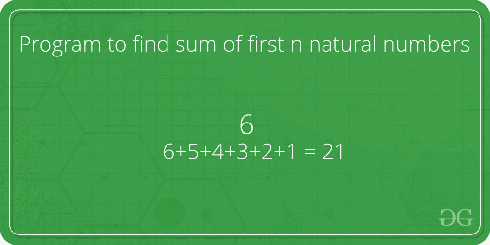

# 使用递归的自然数总和

> 原文:[https://www . geeksforgeeks . org/自然数之和-使用递归/](https://www.geeksforgeeks.org/sum-of-natural-numbers-using-recursion/)



给定一个数 n，求第一个 *n 个*自然数的和。为了计算和，我们将使用递归函数 recur _ sum()。
**例:**

```
Input : 3
Output : 6
Explanation : 1 + 2 + 3 = 6

Input : 5
Output : 15
Explanation : 1 + 2 + 3 + 4 + 5 = 15
```

下面是使用递归求 n 个自然数之和的代码:

## C++

```
// C++ program to find the
// sum of natural numbers up
// to n using recursion
#include <iostream>
using namespace std;

// Returns sum of first
// n natural numbers
int recurSum(int n)
{
    if (n <= 1)
        return n;
    return n + recurSum(n - 1);
}

// Driver code
int main()
{
    int n = 5;
    cout << recurSum(n);
    return 0;
}
```

## Java 语言(一种计算机语言，尤用于创建网站)

```
// Java program to find the
// sum of natural numbers up
// to n using recursion
import java.util.*;
import java.lang.*;

class GFG
{

    // Returns sum of first
    // n natural numbers
    public static int recurSum(int n)
    {
        if (n <= 1)
            return n;
        return n + recurSum(n - 1);
    }

    // Driver code
    public static void main(String args[])
    {
        int n = 5;
        System.out.println(recurSum(n));
    }
}

// This code is contributed by Sachin Bisht
```

## 计算机编程语言

```
# Python code to find sum
# of natural numbers upto
# n using recursion

# Returns sum of first
# n natural numbers
def recurSum(n):
    if n <= 1:
        return n
    return n + recurSum(n - 1)

# Driver code
n = 5
print(recurSum(n))
```

## C#

```
// C# program to find the
// sum of natural numbers
// up to n using recursion
using System;

class GFG
{

    // Returns sum of first
    // n natural numbers
    public static int recurSum(int n)
    {
        if (n <= 1)
            return n;
        return n + recurSum(n - 1);
    }

    // Driver code
    public static void Main()
    {
        int n = 5;
        Console.WriteLine(recurSum(n));
    }
}

// This code is contributed by vt_m
```

## 服务器端编程语言（Professional Hypertext Preprocessor 的缩写）

```
<?php
// PHP program to find the
// sum of natural numbers
// up to n using recursion

// Returns sum of first
// n natural numbers
function recurSum($n)
{
    if ($n <= 1)
        return $n;
    return $n + recurSum($n - 1);
}

// Driver code
$n = 5;
echo(recurSum($n));

// This code is contributed by Ajit.
?>
```

## java 描述语言

```
<script>

// JavaScript program to find the
// sum of natural numbers
// up to n using recursion

// Returns sum of first
// n natural numbers
function recurSum(n)
{
    if (n <= 1)
        return n;
    return n + recurSum(n - 1);
}

// Driver code
let n = 5;
document.write(recurSum(n));

// This code is contributed by mohan

</script>
```

**输出:**

```
15 
```