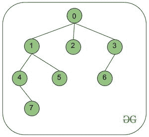
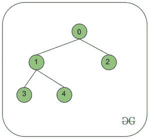

# 从根到顶点 V 的路径上的节点和各自邻居的总和

> 原文:[https://www . geesforgeks . org/从根到顶点的路径上的节点和各自邻居的总和-v/](https://www.geeksforgeeks.org/sum-of-nodes-and-respective-neighbors-on-the-path-from-root-to-a-vertex-v/)

给定具有 **N 个**顶点的根树、代表分配给每个节点的值的数组**值【】**，以及顶点 **V** ，任务是计算位于从根(总是 **0** )到 **V** 的路径中的节点和直接邻居的值的总和。

**示例:**

> **输入:** N = 8，值= {1，2，3，0，0，4，3，6}，V = 7
> 
> 
> 
> **输出:** 16
> **说明:**
> 从根(0)到 V (7)的路径= 0->1->4->7
> 0 的邻居= (2，3)，Sum = 1(节点 0) + 3(节点 2) + 0(节点 3)= 4
> 1 的邻居= (5)，Sum = 2(节点 1) + 4(节点 5) = 6
> 没有 4 的邻居，Sum = 0(节点 4
> 
> **输入:** N = 5，值= {5，6，2，9，0}，V = 2
> 
> 
> 
> **输出:** 13

**进场:**

其思想是将每个节点的**父节点**存储在一个数组中，并将每个父节点的值与其子节点相加，并将其存储在**父节点**中。现在，每个节点将保存其值和相应邻居值的总和。使用这个数组找到从根到顶点的路径的所需和 **V** 。

按照以下步骤解决问题:

*   使用 [DFS 遍历](https://www.geeksforgeeks.org/depth-first-search-or-dfs-for-a-graph/)初始化一个数组来存储每个节点及其对应邻居的值。
*   使用数组从顶点 **V** 迭代到根，并不断添加路径上所有节点的值。
*   最后打印得到的**和**。

下面是上述方法的实现:

## C++

```
// C++ Program to implement
// the above approach
#include <bits/stdc++.h>
using namespace std;

// Creating Adjacency list
vector<vector<int>> constructTree(int n,
                                  vector<vector<int>> edges)
{
  vector<vector<int>> adjl(n);

  for (auto e : edges)
  {
    int u = e[0];
    int v = e[1];
    adjl[u].push_back(v);
    adjl[v].push_back(u);
  }
  return adjl;
}

// Function to perform DFS traversal
void DFS(vector<vector<int>> adjl,
         vector<int> &parent, int u, int p)
{

  // Initializing parent of each node to p
  parent[u] = p;

  // Iterate over the children
  for (int v : adjl[u])
  {
    if (v != p)
    {
      DFS(adjl, parent, v, u);
    }
  }
}

// Function to add values of children to
// respective parent nodes
vector<int> valuesFromChildren(vector<int> parent,
                               vector<int> values)
{
  vector<int> valuesChildren(parent.size());

  for (int i = 0; i < parent.size(); i++)
  {

    // Root node
    if (parent[i] == -1)
      continue;

    else
    {
      int p = parent[i];
      valuesChildren[p] += values[i];
    }
  }
  return valuesChildren;
}

// Function to return sum of values of
// each node in path from V to the root
int findSumOfValues(int v, vector<int> parent,
                    vector<int> valuesChildren)
{
  int cur_node = v;
  int sum = 0;

  // Path from node V to root node
  while (cur_node != -1)
  {
    sum += valuesChildren[cur_node];
    cur_node = parent[cur_node];
  }

  return sum;
}

// Driver Code
int main()
{
  int n = 8;

  // Insert edges into the graph
  vector<vector<int>> edges = {{0, 1}, {0, 2}, {0, 3}, {1, 4},
                               {1, 5}, {4, 7}, {3, 6}};

  int v = 7;

  // Values assigned to each vertex
  vector<int> values = {1, 2, 3, 0, 0, 4, 3, 6};

  // Constructing the tree
  // using adjacency list
  vector<vector<int>> adjl = constructTree(n, edges);

  // Parent array
  vector<int> parent(n);

  // store values in the parent array
  DFS(adjl, parent, 0, -1);

  // Add values of children to the parent
  vector<int> valuesChildren = valuesFromChildren(parent, values);

  // Find sum of nodes lying in the path
  int sum = findSumOfValues(v, parent, valuesChildren);

  // Add root node since
  // its value is not included yet
  sum += values[0];
  cout << sum << endl;
}

// This code is contributed by
// sanjeev2552
```

## Java 语言(一种计算机语言，尤用于创建网站)

```
// Java Program to implement
// the above approach
import java.io.*;
import java.util.*;

class GFG {

    // Creating Adjacency list
    private static List<List<Integer> >
    constructTree(int n, int[][] edges)
    {

        List<List<Integer> > adjl
            = new ArrayList<List<Integer> >();

        for (int i = 0; i < n; i++) {

            adjl.add(new ArrayList<Integer>());
        }

        for (int[] e : edges) {
            int u = e[0];
            int v = e[1];
            adjl.get(u).add(v);
            adjl.get(v).add(u);
        }

        return adjl;
    }

    // Function to perform DFS traversal
    private static void DFS(
        List<List<Integer> > adjl,
        int[] parent, int u, int p)
    {

        // Initializing parent of each node to p
        parent[u] = p;

        // Iterate over the children
        for (int v : adjl.get(u)) {

            if (v != p) {

                DFS(adjl, parent, v, u);
            }
        }
    }

    // Function to add values of children to
    // respective parent nodes
    private static int[] valuesFromChildren(
        int[] parent, int[] values)
    {

        int[] valuesChildren
            = new int[parent.length];

        for (int i = 0; i < parent.length; i++) {

            // Root node
            if (parent[i] == -1)
                continue;

            else {
                int p = parent[i];

                valuesChildren[p] += values[i];
            }
        }
        return valuesChildren;
    }

    // Function to return sum of values of
    // each node in path from V to the root
    private static int findSumOfValues(
        int v, int[] parent,
        int[] valuesChildren)
    {

        int cur_node = v;
        int sum = 0;

        // Path from node V to root node
        while (cur_node != -1) {

            sum += valuesChildren[cur_node];
            cur_node = parent[cur_node];
        }

        return sum;
    }

    // Driver Code
    public static void main(String[] args)
    {

        int n = 8;

        // Insert edges into the graph
        int[][] edges = { { 0, 1 },
                          { 0, 2 },
                          { 0, 3 },
                          { 1, 4 },
                          { 1, 5 },
                          { 4, 7 },
                          { 3, 6 } };

        int v = 7;

        // Values assigned to each vertex
        int[] values = new int[] { 1, 2, 3, 0,
                                   0, 4, 3, 6 };

        // Constructing the tree
        // using adjacency list
        List<List<Integer> > adjl
            = constructTree(n, edges);

        // Parent array
        int[] parent = new int[n];

        // store values in the parent array
        DFS(adjl, parent, 0, -1);

        // Add values of children to the parent
        int[] valuesChildren
            = valuesFromChildren(parent, values);

        // Find sum of nodes lying in the path
        int sum = findSumOfValues(
            v, parent,
            valuesChildren);

        // Add root node since
        // its value is not included yet
        sum += values[0];

        System.out.println(sum);
    }
}
```

## 蟒蛇 3

```
# Python3 program to implement the above approach

# Creating Adjacency list
def constructTree(n, edges):
    adjl = []

    for i in range(n):
        adjl.append([])

    for i in range(len(edges)):
        u = edges[i][0]
        v = edges[i][1]
        adjl[u].append(v)
        adjl[v].append(u)
    return adjl

# Function to perform DFS traversal
def DFS(adjl, parent, u, p):

    # Initializing parent of each node to p
    parent[u] = p

    # Iterate over the children
    for v in adjl[u]:
        if (v != p):
            DFS(adjl, parent, v, u)

# Function to add values of children to
# respective parent nodes
def valuesFromChildren(parent, values):
    valuesChildren = [0]*(len(parent))

    for i in range(len(parent)):
        # Root node
        if (parent[i] == -1):
            continue
        else:
            p = parent[i]
            valuesChildren[p] += values[i]
    return valuesChildren

# Function to return sum of values of
# each node in path from V to the root
def findSumOfValues(v, parent, valuesChildren):
    cur_node = v
    Sum = 0

    # Path from node V to root node
    while (cur_node != -1):
        Sum += valuesChildren[cur_node]
        cur_node = parent[cur_node]
    return Sum

n = 8

# Insert edges into the graph
edges = [ [ 0, 1 ], [ 0, 2 ], [ 0, 3 ], [ 1, 4 ], [ 1, 5 ], [ 4, 7 ], [ 3, 6 ] ]

v = 7

# Values assigned to each vertex
values = [ 1, 2, 3, 0, 0, 4, 3, 6 ]

# Constructing the tree
# using adjacency list
adjl = constructTree(n, edges)

# Parent array
parent = [0]*(n)

# store values in the parent array
DFS(adjl, parent, 0, -1)

# Add values of children to the parent
valuesChildren = valuesFromChildren(parent, values)

# Find sum of nodes lying in the path
Sum = findSumOfValues(v, parent, valuesChildren)

# Add root node since
# its value is not included yet
Sum += values[0]

print(Sum)

# This code is contributed by suresh07.
```

## C#

```
// C# program to implement
// the above approach
using System;
using System.Collections.Generic;

class GFG{

// Creating Adjacency list
private static List<List<int>> constructTree(int n, int[,] edges)
{
    List<List<int> > adjl = new List<List<int> >();

    for(int i = 0; i < n; i++)
    {

        adjl.Add(new List<int>());
    }

    for(int i = 0; i < edges.GetLength(0); i++)
    {
        int u = edges[i, 0];
        int v = edges[i, 1];
        adjl[u].Add(v);
        adjl[v].Add(u);
    }

    return adjl;
}

// Function to perform DFS traversal
private static void DFS(List<List<int> > adjl,
                        int[] parent, int u, int p)
{

    // Initializing parent of each node to p
    parent[u] = p;

    // Iterate over the children
    foreach(int v in adjl[u])
    {

        if (v != p)
        {
            DFS(adjl, parent, v, u);
        }
    }
}

// Function to add values of children to
// respective parent nodes
private static int[] valuesFromChildren(int[] parent,
                                        int[] values)
{

    int[] valuesChildren = new int[parent.Length];

    for(int i = 0; i < parent.Length; i++)
    {

        // Root node
        if (parent[i] == -1)
            continue;

        else
        {
            int p = parent[i];
            valuesChildren[p] += values[i];
        }
    }
    return valuesChildren;
}

// Function to return sum of values of
// each node in path from V to the root
private static int findSumOfValues(int v, int[] parent,
                                   int[] valuesChildren)
{

    int cur_node = v;
    int sum = 0;

    // Path from node V to root node
    while (cur_node != -1)
    {

        sum += valuesChildren[cur_node];
        cur_node = parent[cur_node];
    }
    return sum;
}

// Driver Code
public static void Main(string[] args)
{
    int n = 8;

    // Insert edges into the graph
    int[, ] edges = { { 0, 1 }, { 0, 2 }, { 0, 3 },
                      { 1, 4 }, { 1, 5 }, { 4, 7 },
                      { 3, 6 } };

    int v = 7;

    // Values assigned to each vertex
    int[] values = new int[] { 1, 2, 3, 0,
                               0, 4, 3, 6 };

    // Constructing the tree
    // using adjacency list
    List<List<int>> adjl = constructTree(n, edges);

    // Parent array
    int[] parent = new int[n];

    // store values in the parent array
    DFS(adjl, parent, 0, -1);

    // Add values of children to the parent
    int[] valuesChildren = valuesFromChildren(parent,
                                              values);

    // Find sum of nodes lying in the path
    int sum = findSumOfValues(v, parent,
                              valuesChildren);

    // Add root node since
    // its value is not included yet
    sum += values[0];

    Console.WriteLine(sum);
}
}

// This code is contributed by ukasp
```

## java 描述语言

```
<script>

// Javascript program to implement
// the above approach

// Creating Adjacency list
function constructTree(n, edges)
{
    let adjl = [];
    for(let i = 0; i < n; i++)
    {
        adjl.push([]);
    }

    for(let e = 0; e < edges.length; e++)
    {
        let u = edges[e][0];
        let v = edges[e][1];

        adjl[u].push(v);
        adjl[v].push(u);
    }
    return adjl;
}

// Function to perform DFS traversal
function DFS(adjl, parent, u, p)
{

    // Initializing parent of each node to p
    parent[u] = p;

    // Iterate over the children
    for(let v = 0; v < adjl[u].length; v++)
    {
        if (adjl[u][v] != p)
        {
            DFS(adjl, parent, adjl[u][v], u);
        }
    }
}

// Function to add values of children to
// respective parent nodes
function valuesFromChildren(parent, values)
{
    let valuesChildren = new Array(parent.length);
     for(let i = 0; i < parent.length; i++)
    {
        valuesChildren[i] = 0;
    }
    for(let i = 0; i < parent.length; i++)
    {

        // Root node
        if (parent[i] == -1)
            continue;

        else
        {
            let p = parent[i];

            valuesChildren[p] += values[i];
        }
    }
    return valuesChildren;
}

// Function to return sum of values of
// each node in path from V to the root
function findSumOfValues(v, parent, valuesChildren)
{
    let cur_node = v;
    let sum = 0;

    // Path from node V to root node
    while (cur_node != -1)
    {
        sum += valuesChildren[cur_node];
        cur_node = parent[cur_node];
    }
    return sum;
}

// Driver Code
let n = 8;

// Insert edges into the graph
let edges = [ [ 0, 1 ], [ 0, 2 ],
              [ 0, 3 ], [ 1, 4 ],
              [ 1, 5 ], [ 4, 7 ],
              [ 3, 6 ] ];

let v = 7;

// Values assigned to each vertex
let values = [ 1, 2, 3, 0,
               0, 4, 3, 6 ];

// Constructing the tree
// using adjacency list
let adjl = constructTree(n, edges);

// Parent array
let parent = new Array(n);
for(let i = 0; i < n; i++)
{
    parent[i] = 0;
}

// Store values in the parent array
DFS(adjl, parent, 0, -1);

// Add values of children to the parent
let valuesChildren = valuesFromChildren(
    parent, values);

// Find sum of nodes lying in the path
let sum = findSumOfValues(
          v, parent, valuesChildren);

// Add root node since
// its value is not included yet
sum += values[0];

document.write(sum);

// This code is contributed by avanitrachhadiya2155

</script>
```

**Output:** 

```
16
```

***时间复杂度:** O(N)*
***辅助空间:** O(N)*