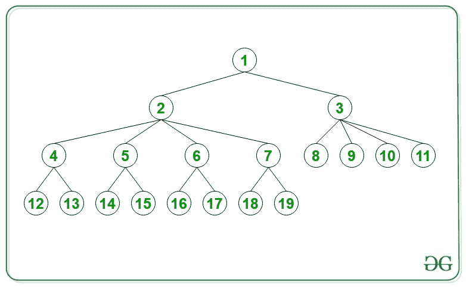

# 给定树中从根到第 N 个节点的路径中节点的总和

> 原文:[https://www . geesforgeks . org/给定树中从根到第 n 个节点的路径中的节点总数/](https://www.geeksforgeeks.org/sum-of-nodes-in-the-path-from-root-to-n-th-node-in-given-tree/)

给定一个整数 **N** ，该整数需要作为一个值出现在以 **1** 为根的[树](https://www.geeksforgeeks.org/binary-tree-data-structure/)的最后一级节点中，该树的节点从根到最后一级以 **1** 为增量进行编号。每个**奇数级**的节点包含 **2 个子节点**，每个**偶数级**的节点包含 **4 个子节点**。任务是找到从根到节点 **N** 路径中节点值的和。

**示例:**

> **输入:** N = 13
> 
> 
> 
> **输出:** 20
> **说明:**从根 1 到节点 13 的遍历是 1 - > 2 - > 4 - > 13。因此，路径中所有节点的总和= 1 + 2 + 4 + 13 = 20。
> 
> **输入:** N = 124
> **输出:** 193
> **解释:**从根 1 到节点 124 的遍历是 1->2->6->16->44->124。因此，路径中所有节点的总和= 1 + 2 + 6 + 16 + 44 + 124 = 193。

**方法:**按照以下步骤解决问题:

*   初始化一个[数组](https://www.geeksforgeeks.org/arrays-in-c-cpp/)来存储[树](https://www.geeksforgeeks.org/binary-tree-data-structure/)的每一级中存在的节点数，即 *{1，2，8，16，64，128……。}* 并储存。
*   计算数组的[前缀和](https://www.geeksforgeeks.org/prefix-sum-array-implementation-applications-competitive-programming/)，即 *{1 3 11 27 91 219 ……。}*
*   使用[下界()](https://www.geeksforgeeks.org/lower_bound-in-cpp/)在[前缀和数组](https://www.geeksforgeeks.org/prefix-sum-array-implementation-applications-competitive-programming/)中找到超过或等于 **N** 的索引 **ind** 。因此 **ind** 表示**需要穿越**到达节点 **N** 的层数。
*   初始化一个变量 **temp = N** 和两个变量 **final_ans = 0** 和 **val** 。
*   递减 **ind** 直到小于或等于 **1** ，并继续更新**val = temp–前缀【ind–1】**。
*   如果 **ind** 为**奇数**，则将**温度**更新为**前缀【ind–2】+(val+1)/2**。
*   否则，如果 **ind** 为**偶数**，则更新**前缀【ind–2】+(val+3)/4**。
*   完成上述步骤后，将 **N + 1** 添加到 **final_ans** 中，打印为所需答案。

下面是上述方法的实现:

## C++

```
// C++ program for the above approach
#include <bits/stdc++.h>
using namespace std;
typedef long long ll;

// Function to find sum of all
// nodes from root to N
ll sumOfPathNodes(ll N)
{

    // If N is equal to 1
    if (N == 1) {
        return 1;
    }

    // If N is equal to 2 or 3
    else if (N == 2 || N == 3) {
        return N + 1;
    }

    // Stores the number of
    // nodes at (i + 1)-th level
    vector<ll> arr;
    arr.push_back(1);

    // Stores the number of nodes
    ll k = 1;

    // Stores if the current
    // level is even or odd
    bool flag = true;

    while (k < N) {

        // If level is odd
        if (flag == true) {
            k *= 2;
            flag = false;
        }

        // If level is even
        else {

            k *= 4;
            flag = true;
        }

        // If level with
        // node N is reached
        if (k > N) {
            break;
        }

        // Push into vector
        arr.push_back(k);
    }

    ll len = arr.size();
    vector<ll> prefix(len);
    prefix[0] = 1;

    // Compute prefix sums of count
    // of nodes in each level
    for (ll i = 1; i < len; ++i) {
        prefix[i] = arr[i] + prefix[i - 1];
    }

    vector<ll>::iterator it
        = lower_bound(prefix.begin(),
                      prefix.end(), N);

    // Stores the level in which
    // node N s present
    ll ind = it - prefix.begin();

    // Stores the required sum
    ll final_ans = 0;
    ll temp = N;

    while (ind > 1) {
        ll val = temp - prefix[ind - 1];

        if (ind % 2 != 0) {
            temp = prefix[ind - 2]
                   + (val + 1) / 2;
        }
        else {
            temp = prefix[ind - 2]
                   + (val + 3) / 4;
        }
        --ind;

        // Add temp to the sum
        final_ans += temp;
    }

    final_ans += (N + 1);

    return final_ans;
}

// Driver Code
int main()
{

    ll N = 13;

    // Function Call
    cout << sumOfPathNodes(N) << endl;

    return 0;
}
```

## Java 语言(一种计算机语言，尤用于创建网站)

```
// Java program for the
// above approach
import java.util.*;
class GFG{

// Function to find sum of
// aint nodes from root to N
static int sumOfPathNodes(int N)
{
  // If N is equal to 1
  if (N == 1)
  {
    return 1;
  }

  // If N is equal to
  // 2 or 3
  else if (N == 2 ||
           N == 3)
  {
    return N + 1;
  }

  // Stores the number of
  // nodes at (i + 1)-th level
  Vector<Integer> arr =
         new Vector<>();
  arr.add(1);

  // Stores the number
  // of nodes
  int k = 1;

  // Stores if the current
  // level is even or odd
  boolean flag = true;

  while (k < N)
  {
    // If level is odd
    if (flag == true)
    {
      k *= 2;
      flag = false;
    }

    // If level is even
    else
    {
      k *= 4;
      flag = true;
    }

    // If level with
    // node N is reached
    if (k > N)
    {
      break;
    }

    // Push into vector
    arr.add(k);
  }

  int len = arr.size();
  int[] prefix = new int[len];
  prefix[0] = 1;

  // Compute prefix sums of
  // count of nodes in each
  // level
  for (int i = 1; i < len; ++i)
  {
    prefix[i] = arr.get(i) +
                prefix[i - 1];
  }

  int it = lowerBound(prefix, 0,
                      len, N) + 1;

  // Stores the level in which
  // node N s present
  int ind = it - prefix[0];

  // Stores the required sum
  int final_ans = 0;
  int temp = N;

  while (ind > 1)
  {
    int val = temp -
              prefix[ind - 1];

    if (ind % 2 != 0)
    {
      temp = prefix[ind - 2] +
             (val + 1) / 2;
    }
    else
    {
      temp = prefix[ind - 2] +
             (val + 3) / 4;
    }
    --ind;

    // Add temp to the sum
    final_ans += temp;
  }

  final_ans += (N + 1);
  return final_ans;
}

static int lowerBound(int[] a, int low,
                      int high, int element)
{
  while(low < high)
  {
    int middle = low +
                 (high - low) / 2;

    if(element > a[middle])
      low = middle + 1;
    else
      high = middle;
  }
  return low;
}

// Driver Code
public static void main(String[] args)
{
  int N = 13;

  // Function Call
  System.out.print(
  sumOfPathNodes(N) + "\n");
}
}

// This code is contributed by gauravrajput1
```

## 蟒蛇 3

```
# Python3 program for the above approach
from bisect import bisect_left, bisect

# Function to find sum of all
# nodes from root to N
def sumOfPathNodes(N):

    # If N is equal to 1
    if (N == 1):
        return 1

    # If N is equal to 2 or 3
    elif (N == 2 or N == 3):
        return N + 1

    # Stores the number of
    # nodes at (i + 1)-th level
    arr = []
    arr.append(1)

    # Stores the number of nodes
    k = 1

    # Stores if the current
    # level is even or odd
    flag = True

    while (k < N):

        # If level is odd
        if (flag == True):
            k *= 2
            flag = False

        # If level is even
        else:
            k *= 4
            flag = True

        # If level with
        # node N is reached
        if (k > N):
            break

        # Push into vector
        arr.append(k)

    lenn = len(arr)
    prefix = [0] * (lenn)
    prefix[0] = 1

    # Compute prefix sums of count
    # of nodes in each level
    for i in range(1, lenn):
        prefix[i] = arr[i] + prefix[i - 1]

    it = bisect_left(prefix, N)

    # Stores the level in which
    # node N s present
    ind = it

    # Stores the required sum
    final_ans = 0
    temp = N

    while (ind > 1):
        val = temp - prefix[ind - 1]

        if (ind % 2 != 0):
            temp = prefix[ind - 2] + (val + 1) // 2
        else:
            temp = prefix[ind - 2] + (val + 3) // 4

        ind -= 1

        # Add temp to the sum
        final_ans += temp

    final_ans += (N + 1)

    return final_ans

# Driver Code
if __name__ == '__main__':

    N = 13

    # Function Call
    print(sumOfPathNodes(N))

# This code is contributed by mohit kumar 29
```

## C#

```
// C# program for the
// above approach
using System;
using System.Collections.Generic;

class GFG{

// Function to find sum of
// aint nodes from root to N
static int sumOfPathNodes(int N)
{

  // If N is equal to 1
  if (N == 1)
  {
    return 1;
  }

  // If N is equal to
  // 2 or 3
  else if (N == 2 ||
           N == 3)
  {
    return N + 1;
  }

  // Stores the number of
  // nodes at (i + 1)-th level
  List<int> arr = new List<int>();
  arr.Add(1);

  // Stores the number
  // of nodes
  int k = 1;

  // Stores if the current
  // level is even or odd
  bool flag = true;

  while (k < N)
  {

    // If level is odd
    if (flag == true)
    {
      k *= 2;
      flag = false;
    }

    // If level is even
    else
    {
      k *= 4;
      flag = true;
    }

    // If level with
    // node N is reached
    if (k > N)
    {
      break;
    }

    // Push into vector
    arr.Add(k);
  }

  int len = arr.Count;
  int[] prefix = new int[len];
  prefix[0] = 1;

  // Compute prefix sums of
  // count of nodes in each
  // level
  for(int i = 1; i < len; ++i)
  {
    prefix[i] = arr[i] +
                prefix[i - 1];
  }

  int it = lowerBound(prefix, 0,
                      len, N) + 1;

  // Stores the level in which
  // node N s present
  int ind = it - prefix[0];

  // Stores the required sum
  int final_ans = 0;
  int temp = N;

  while (ind > 1)
  {
    int val = temp -
              prefix[ind - 1];

    if (ind % 2 != 0)
    {
      temp = prefix[ind - 2] +
              (val + 1) / 2;
    }
    else
    {
      temp = prefix[ind - 2] +
              (val + 3) / 4;
    }
    --ind;

    // Add temp to the sum
    final_ans += temp;
  }
  final_ans += (N + 1);

  return final_ans;
}

static int lowerBound(int[] a, int low,
                      int high, int element)
{
  while(low < high)
  {
    int middle = low +
                 (high - low) / 2;

    if (element > a[middle])
      low = middle + 1;
    else
      high = middle;
  }
  return low;
}

// Driver Code
public static void Main(String[] args)
{
  int N = 13;

  // Function Call
  Console.Write(sumOfPathNodes(N) + "\n");
}
}

// This code is contributed by Amit Katiyar
```

## java 描述语言

```
<script>

// Javascript program for the above approach

// Function to find sum of
// aint nodes from root to N
function sumOfPathNodes(N)
{

    // If N is equal to 1
    if (N == 1)
    {
        return 1;
    }

    // If N is equal to
    // 2 or 3
    else if (N == 2 ||
             N == 3)
    {
        return N + 1;
    }

    // Stores the number of
    // nodes at (i + 1)-th level
    let arr = [];
    arr.push(1);

    // Stores the number
    // of nodes
    let k = 1;

    // Stores if the current
    // level is even or odd
    let flag = true;

    while (k < N)
    {

        // If level is odd
        if (flag == true)
        {
            k *= 2;
            flag = false;
        }

        // If level is even
        else
        {
            k *= 4;
            flag = true;
        }

        // If level with
        // node N is reached
        if (k > N)
        {
            break;
        }

        // Push into vector
        arr.push(k);
    }

    let len = arr.length;
    let prefix = new Array(len);
    prefix[0] = 1;

    // Compute prefix sums of
    // count of nodes in each
    // level
    for (let i = 1; i < len; ++i)
    {
        prefix[i] = arr[i] + prefix[i - 1];
    }

    let it = lowerBound(prefix, 0, len, N) + 1;

    // Stores the level in which
    // node N s present
    let ind = it - prefix[0];

    // Stores the required sum
    let final_ans = 0;
    let temp = N;

    while (ind > 1)
    {
        let val = temp - prefix[ind - 1];

        if (ind % 2 != 0)
        {
            temp = prefix[ind - 2] +
                parseInt((val + 1) / 2, 10);
        }
        else
        {
            temp = prefix[ind - 2] +
                parseInt((val + 3) / 4, 10);
        }
        --ind;

        // Add temp to the sum
        final_ans += temp;
    }
    final_ans += (N + 1);
    return final_ans;
}

function lowerBound(a, low, high, element)
{
    while (low < high)
    {
        let middle = low +
          parseInt((high - low) / 2, 10);

        if (element > a[middle])
            low = middle + 1;
        else
            high = middle;
    }
    return low;
}

// Driver code
let N = 13;

// Function Call
document.write(sumOfPathNodes(N) + "</br>");

// This code is contributed by divyeshrabadiya07

</script>
```

**Output:** 

```
20
```

**时间复杂度:**O(log N)
T3】辅助空间: O(log N)