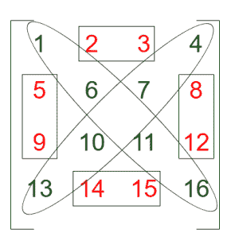
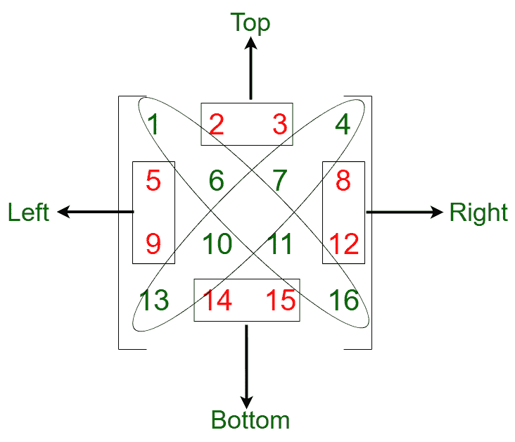

# 正方形矩阵的非对角线部分之和

> 原文:[https://www . geesforgeks . org/方阵的非对角线部分之和/](https://www.geeksforgeeks.org/sum-of-non-diagonal-parts-of-a-square-matrix/)

给定一个大小为 **N X N** 的正方形矩阵，任务是当矩阵沿其对角线分成四部分时，求每个部分所有元素的和。对角线上的元素不应计入总和。
**例:**

> **输入:** arr[][] = {{1，2，3，4}，{5，6，7，8}，{9，10，11，12}，{13，14，15，16}}
> **输出:** 68
> **解释:**
> 
> 
> 
> 从上图来看，(1，6，11，16)和(4，7，10，13)是对角线。
> 需要求的元素之和为:
> 顶:(2 + 3) = 5
> 左:(5 + 9) = 14
> 底:(14 + 15) = 29
> 右:(8 + 12) = 20
> 因此，所有部分之和= 68。
> **输入:** arr[][] = { {1，3，1，5}，{2，2，4，1}，{5，0，2，3}，{1，3，1，5}}
> **输出:** 19

**方法:**想法是使用索引来识别对角线处的元素。

1.  在[二维矩阵](https://www.geeksforgeeks.org/multidimensional-arrays-c-cpp/)、[中，两条对角线通过以下方式被识别](https://www.geeksforgeeks.org/program-to-print-the-diagonals-of-a-matrix/):
    1.  **主对角线**:第一条对角线有行的索引等于列的索引。

```
Condition for Principal Diagonal:
The row-column condition is row = column.
```

2.  **次对角线**:第二条对角线的行列索引之和等于 N(矩阵的大小)。

```
Condition for Secondary Diagonal:
The row-column condition is row = numberOfRows - column -1
```

2.  在识别两条对角线之后，可以使用穿过最后一行的第一个元素和第一行的最后一个元素的对角线进一步将矩阵分成两部分:
    1.  左边部分:
        *   如果列索引大于行索引，则该元素属于矩阵的**顶部**。
        *   如果行索引大于列索引，则该元素属于矩阵的**左侧部分**。
    2.  右边部分:
        *   如果列索引大于行索引，则该元素属于矩阵的**右边部分**。
        *   如果行索引大于列索引，则该元素属于矩阵的**底部**。



1.  为了得到矩阵非对角线部分的和:
    *   [行遍历矩阵](https://www.geeksforgeeks.org/row-wise-vs-column-wise-traversal-matrix/)
    *   如果元素是对角线的一部分，则跳过此元素
    *   如果元素是左侧、右侧、底部或顶部的一部分(即非对角线部分)，则将元素添加到结果总和中

以下是上述方法的实现:

## C++

```
// C++ implementation of the above approach

#include <bits/stdc++.h>
using namespace std;

// Function to return a vector which
// consists the sum of
// four portions of the matrix
int sumOfParts(int* arr, int N)
{
    int sum_part1 = 0, sum_part2 = 0,
        sum_part3 = 0, sum_part4 = 0;
    int totalsum = 0;

    // Iterating through the matrix
    for (int i = 0; i < N; i++) {
        for (int j = 0; j < N; j++) {

            // Condition for selecting all values
            // before the second diagonal of metrics
            if (i + j < N - 1) {

                // Top portion of the matrix
                if (i < j and i != j and i + j)
                    sum_part1 += (arr + i * N)[j];

                // Left portion of the matrix
                else if (i != j)
                    sum_part2 += (arr + i * N)[j];
            }
            else {

                // Bottom portion of the matrix
                if (i > j and i + j != N - 1)
                    sum_part3 += (arr + i * N)[j];

                // Right portion of the matrix
                else {
                    if (i + j != N - 1 and i != j)
                        sum_part4 += (arr + i * N)[j];
                }
            }
        }
    }

    // Adding all the four portions into a vector
    totalsum = sum_part1 + sum_part2
               + sum_part3 + sum_part4;
    return totalsum;
}

// Driver code
int main()
{
    int N = 4;
    int arr[N][N] = { { 1, 2, 3, 4 },
                      { 5, 6, 7, 8 },
                      { 9, 10, 11, 12 },
                      { 13, 14, 15, 16 } };

    cout << sumOfParts((int*)arr, N);
}
```

## Java 语言(一种计算机语言，尤用于创建网站)

```
// Java implementation of the above approach
class GFG
{

// Function to return a vector which
// consists the sum of
// four portions of the matrix
static int sumOfParts(int[][] arr, int N)
{
    int sum_part1 = 0, sum_part2 = 0,
        sum_part3 = 0, sum_part4 = 0;
    int totalsum = 0;

    // Iterating through the matrix
    for (int i = 0; i < N; i++) {
        for (int j = 0; j < N; j++) {

            // Condition for selecting all values
            // before the second diagonal of metrics
            if (i + j < N - 1) {

                // Top portion of the matrix
                if (i < j && i != j && i + j > 0)
                    sum_part1 += arr[i][j];

                // Left portion of the matrix
                else if (i != j)
                    sum_part2 += arr[i][j];
            }
            else {

                // Bottom portion of the matrix
                if (i > j && i + j != N - 1)
                    sum_part3 += arr[i][j];

                // Right portion of the matrix
                else {
                    if (i + j != N - 1 && i != j)
                        sum_part4 += arr[i][j];
                }
            }
        }
    }

    // Adding all the four portions into a vector
    totalsum = sum_part1 + sum_part2
               + sum_part3 + sum_part4;
    return totalsum;
}

// Driver code
public static void main(String[] args)
{
    int N = 4;
    int arr[][] = { { 1, 2, 3, 4 },
                      { 5, 6, 7, 8 },
                      { 9, 10, 11, 12 },
                      { 13, 14, 15, 16 } };

    System.out.print(sumOfParts(arr, N));
}
}

// This code is contributed by PrinciRaj1992
```

## 蟒蛇 3

```
# Python3 implementation of the above approach

# Function to return a vector which
# consists the sum of
# four portions of the matrix
def sumOfParts(arr,N):
    sum_part1, sum_part2, sum_part3, \
    sum_part4 = 0, 0, 0, 0
    totalsum = 0

    # Iterating through the matrix
    for i in range(N):
        for j in range(N):

            # Condition for selecting all values
            # before the second diagonal of metrics
            if i + j < N - 1:

                # Top portion of the matrix
                if(i < j and i != j and i + j):
                    sum_part1 += arr[i][j]

                # Left portion of the matrix
                elif i != j:
                    sum_part2 += arr[i][j]
            else:

                # Bottom portion of the matrix
                if i > j and i + j != N - 1:
                    sum_part3 += arr[i][j]
                else:

                # Right portion of the matrix
                    if i + j != N - 1 and i != j:
                        sum_part4 += arr[i][j]
        # Adding all the four portions into a vector
    return sum_part1 + sum_part2 + sum_part3 + sum_part4

# Driver code
N = 4
arr = [[ 1, 2, 3, 4 ],
       [ 5, 6, 7, 8 ],
       [ 9, 10, 11, 12 ],
       [ 13, 14, 15, 16 ]]

print(sumOfParts(arr, N))

# This code is contributed by mohit kumar 29
```

## C#

```
// C# implementation of the above approach
using System;

class GFG
{

    // Function to return a vector which
    // consists the sum of
    // four portions of the matrix
    static int sumOfParts(int[,] arr, int N)
    {
        int sum_part1 = 0, sum_part2 = 0,
            sum_part3 = 0, sum_part4 = 0;
        int totalsum = 0;

        // Iterating through the matrix
        for (int i = 0; i < N; i++) {
            for (int j = 0; j < N; j++) {

                // Condition for selecting all values
                // before the second diagonal of metrics
                if (i + j < N - 1) {

                    // Top portion of the matrix
                    if (i < j && i != j && i + j > 0)
                        sum_part1 += arr[i, j];

                    // Left portion of the matrix
                    else if (i != j)
                        sum_part2 += arr[i, j];
                }
                else {

                    // Bottom portion of the matrix
                    if (i > j && i + j != N - 1)
                        sum_part3 += arr[i, j];

                    // Right portion of the matrix
                    else {
                        if (i + j != N - 1 && i != j)
                            sum_part4 += arr[i, j];
                    }
                }
            }
        }

        // Adding all the four portions into a vector
        totalsum = sum_part1 + sum_part2
                   + sum_part3 + sum_part4;
        return totalsum;
    }

    // Driver code
    public static void Main()
    {
        int N = 4;
        int [,]arr = { { 1, 2, 3, 4 },
                          { 5, 6, 7, 8 },
                          { 9, 10, 11, 12 },
                          { 13, 14, 15, 16 } };

        Console.WriteLine(sumOfParts(arr, N));
    }
}

// This code is contributed by Yash_R
```

## java 描述语言

```
<script>

// javascript implementation of the above approach

// Function to return a vector which
// consists the sum of
// four portions of the matrix
function sumOfParts(arr , N)
{
    var sum_part1 = 0, sum_part2 = 0,
        sum_part3 = 0, sum_part4 = 0;
    var totalsum = 0;

    // Iterating through the matrix
    for (i = 0; i < N; i++) {
        for (j = 0; j < N; j++) {

            // Condition for selecting all values
            // before the second diagonal of metrics
            if (i + j < N - 1) {

                // Top portion of the matrix
                if (i < j && i != j && i + j > 0)
                    sum_part1 += arr[i][j];

                // Left portion of the matrix
                else if (i != j)
                    sum_part2 += arr[i][j];
            }
            else {

                // Bottom portion of the matrix
                if (i > j && i + j != N - 1)
                    sum_part3 += arr[i][j];

                // Right portion of the matrix
                else {
                    if (i + j != N - 1 && i != j)
                        sum_part4 += arr[i][j];
                }
            }
        }
    }

    // Adding all the four portions into a vector
    totalsum = sum_part1 + sum_part2
               + sum_part3 + sum_part4;
    return totalsum;
}

// Driver code
var N = 4;
var arr = [ [ 1, 2, 3, 4 ],
                  [ 5, 6, 7, 8 ],
                  [ 9, 10, 11, 12 ],
                  [ 13, 14, 15, 16 ] ];

document.write(sumOfParts(arr, N));

// This code is contributed by 29AjayKumar

</script>
```

**Output:** 

```
68
```

**时间复杂度:** *O(N <sup>2</sup> )* 当我们在行遍历整个矩阵时。

**辅助空间:** O(1)