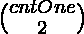

# 二进制数组所有对的乘积之和

> 原文:[https://www . geesforgeks . org/所有二进制数组对的乘积之和/](https://www.geeksforgeeks.org/sum-of-product-of-all-pairs-of-a-binary-array/)

给定一个大小为 **N** 的[二进制数组](https://www.geeksforgeeks.org/sort-binary-array-using-one-traversal/) **arr[]** ，任务是打印所有给定数组元素对的乘积之和。

**注意:**二进制数组只包含 0 和 1。

**示例:**

> **输入:** arr[] = {0，1，1，0，1}
> **输出:** : 3
> **说明:**所有可能对的乘积之和为:{ 0×1+0×1+0×0+1×1+1×0+1×1+1×0+1×0×1 }。
> 因此，要求输出为 3。
> 
> **输入:** arr[] = {1，1，1，1}
> **输出:** 6

**天真方法:**解决问题最简单的方法是使用[从数组](https://www.geeksforgeeks.org/find-all-pairs-possible-from-the-given-array/)中生成所有可能的对，并计算它们乘积的和。

***时间复杂度:**O(N<sup>2</sup>)*
***辅助空间:** O(1)*

**有效方法:**为了优化上述方法，只考虑那些两个元素都是 **1** 的对。以下是观察结果:

> 如果有一对 **(arr[i]，arr[j])** 其中 **arr[i] × arr[j] = 1** ，那么 **arr[i]** 和 **arr[j]** 一定是 **1** 。
> 
> 满足(arr[i] × arr[j] = 1)的总对数为:
> = >
> 
> 
> 
> = > cntOne×(cntOne–1)/2
> 其中， **cntOne** 是给定数组中 **1** 的计数

按照以下步骤解决问题:

*   初始化变量 **cntOne** 以存储给定数组中 **1** 的计数。
*   最后，返回**cntOne *(cntOne–1)/2**的值。

下面是上述方法的实现:

## C++

```
// C++ program to implement
// the above approach
#include <bits/stdc++.h>
using namespace std;

// Function to print the sum of product
// of all pairs of the given array
int productSum(int arr[], int N)
{

    // Stores count of one in
    // the given array
    int cntOne = 0;

    for(int i = 0; i < N; i++)
    {

        // If current element is 1
        if (arr[i] == 1)

            // Increase count
            cntOne++;
    }

    // Return the sum of product
    // of all pairs
    return cntOne * (cntOne - 1) / 2;
}

// Driver Code
int main()
{
    int arr[] = { 0, 1, 1, 0, 1 };

    // Stores the size of
    // the given array
    int n = sizeof(arr) / sizeof(arr[0]);

    cout << productSum(arr, n) << endl;
}

// This code is contributed by code_hunt
```

## Java 语言(一种计算机语言，尤用于创建网站)

```
// Java program to implement
// the above approach
import java.util.*;

class GFG {

    // Function to print the sum of product
    // of all pairs of the given array
    static int productSum(int[] arr)
    {

        // Stores count of one in
        // the given array
        int cntOne = 0;

        // Stores the size of
        // the given array
        int N = arr.length;

        for (int i = 0; i < N; i++) {

            // If current element is 1
            if (arr[i] == 1)

                // Increase count
                cntOne++;
        }

        // Return the sum of product
        // of all pairs
        return cntOne * (cntOne - 1) / 2;
    }

    // Driver Code
    public static void main(String[] args)
    {

        int[] arr = { 0, 1, 1, 0, 1 };

        System.out.println(productSum(arr));
    }
}
```

## 蟒蛇 3

```
# Python3 program to implement
# the above approach

# Function to print the sum of product
# of all pairs of the given array
def productSum(arr):

    # Stores count of one in
    # the given array
    cntOne = 0

    # Stores the size of
    # the given array
    N = len(arr)

    for i in range(N):

        # If current element is 1
        if (arr[i] == 1):

            # Increase count
            cntOne += 1

    # Return the sum of product
    # of all pairs
    return cntOne * (cntOne - 1) // 2

# Driver Code
arr = [ 0, 1, 1, 0, 1 ]

print(productSum(arr))

# This code is contributed by code_hunt
```

## C#

```
// C# program to implement
// the above approach
using System;

class GFG{

// Function to print the sum of product
// of all pairs of the given array
static int productSum(int[] arr)
{

    // Stores count of one in
    // the given array
    int cntOne = 0;

    // Stores the size of
    // the given array
    int N = arr.Length;

    for(int i = 0; i < N; i++)
    {

        // If current element is 1
        if (arr[i] == 1)

            // Increase count
            cntOne++;
    }

    // Return the sum of product
    // of all pairs
    return cntOne * (cntOne - 1) / 2;
}

// Driver Code
public static void Main()
{
    int[] arr = { 0, 1, 1, 0, 1 };

    Console.Write(productSum(arr));
}
}

// This code is contributed by code_hunt
```

## java 描述语言

```
<script>

// Javascript program to implement
// the above approach

// Function to print the sum of product
// of all pairs of the given array
function productSum(arr, N)
{

    // Stores count of one in
    // the given array
    let cntOne = 0;

    for(let i = 0; i < N; i++)
    {

        // If current element is 1
        if (arr[i] == 1)

            // Increase count
            cntOne++;
    }

    // Return the sum of product
    // of all pairs
    return cntOne * (cntOne - 1) / 2;
}

// Driver Code

    let arr = [ 0, 1, 1, 0, 1 ];

    // Stores the size of
    // the given array
    let n = arr.length;

    document.write(productSum(arr, n) + "<br>");

// This code is contributed by Mayank Tyagi

</script>
```

**Output:** 

```
3
```

***时间复杂度:**O(N)*
T5**辅助空间:** O(1)