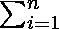

# 给定数组所有可能的 K 大小子集的乘积之和

> 原文:[https://www . geeksforgeeks . org/给定数组的所有可能 k 大小子集的乘积之和/](https://www.geeksforgeeks.org/sum-of-products-of-all-possible-k-size-subsets-of-the-given-array/)

给定一个由非负整数 **N** 和整数 **1 ≤ K ≤ N** 组成的数组 **arr[]** 。任务是找出大小为 **K** 的**arr【】**所有可能子集的乘积之和。

**示例:**

> **输入:** arr[] = {1，2，3，4}，K = 2
> **输出:**35
> (1 * 2)+(1 * 3)+(1 * 4)+(2 * 3)+(2 * 4)
> +(3 * 4)= 2+3+4+6+8+12 = 35
> 
> **输入:** arr[] = {1，2，3，4}，K = 3
> T3】输出: 50

**天真方法:**生成所有可能的大小子集 **K** 并找到每个子集的结果乘积。然后对每个子集的乘积求和。这个解决方案的时间复杂度将是指数级的。

## C++

```
// Program  find the sum of the products of all possible
// subsets of arr[] of size K.
#include <bits/stdc++.h>
#include <iostream>
using namespace std;

// using these variable , to avoid many parameters in a
// recursive function , which will reduce the speed of
// the program
int K, N;

// it returns sum of all the multiplied Subset
int getSum(vector<vector<int> > res)
{
    long long sum = 0, MOD = 1000000007;

    for (vector<int> tempList : res) {

        long long tempSum = 1;

        for (int val : tempList) {

            tempSum = (tempSum * val) % MOD;
        }

        sum = sum + tempSum;
    }
    // we are doing % operation  , so that our result
    // should not get overflow
    return sum % MOD;
}

// Generate all Subsrray with size K
void createAllPossibleSubset(int arr[],
                             vector<vector<int> >& res,
                             vector<int>& temp, int index)
{
    /*
      when we get the required size subset , we
      add into the result list and return
    */
    if (temp.size() == K) {
        res.push_back(temp);
        return;
    }

    // otherwise we add current element ,
    // and move forward to add next element in our
    // subset
    for (int i = index; i < N; i++) {
        temp.push_back(arr[i]);

        createAllPossibleSubset(arr, res, temp, i + 1);

        // removing the last element , for backtracking
        temp.pop_back();
    }
}

int sumOfProduct(int arr[], int n, int k)
{
    K = k;
    N = n;

    // result store all the subset of size K
    vector<vector<int> > res;
    vector<int> temp;

    createAllPossibleSubset(arr, res, temp, 0);

    return getSum(res);
}

// Driver code
int main()
{
    int n = 4, k = 2;
    int arr[] = { 1, 2, 3, 4 };
    cout << sumOfProduct(arr, n, k);
    return 0;
}
// This code is contributed by Pradeep Mondal P
```

## Java 语言(一种计算机语言，尤用于创建网站)

```
// Program  find the sum of the products of all possible
// subsets of arr[] of size K.

import java.io.*;
import java.util.*;

class GFG {

    // storing the k value , so that it can be easily
    // accessed
    static int K;

    public static int sumOfProduct(int arr[], int n, int k)
    {
        K = k;

        // result store all the subset of size K
        ArrayList<ArrayList<Integer> > res
            = new ArrayList<>();

        createAllPossibleSubset(arr, res, new ArrayList<>(),
                                0);

        return getSum(res);
    }

    // Generate all Subsrray with size K
    static void createAllPossibleSubset(
        int arr[], ArrayList<ArrayList<Integer> > res,
        ArrayList<Integer> temp, int index)
    {
        /*
          when we get the required size subset , we
          add into the result list and return
        */
        if (temp.size() == K) {
            res.add(new ArrayList<>(temp));
            return;
        }

        // otherwise we add current element ,
        // and move forward to add next element in our
        // subset
        for (int i = index; i < arr.length; i++) {
            temp.add(arr[i]);

            createAllPossibleSubset(arr, res, temp, i + 1);

            // removing the last element , for backtracking
            temp.remove(temp.size() - 1);
        }
    }

    // it returns sum of all the multiplied Subset
    private static int
    getSum(ArrayList<ArrayList<Integer> > res)
    {

        int sum = 0, MOD = 1000000007;
        for (ArrayList<Integer> tempList : res) {

            long tempSum = 1;
            for (int val : tempList) {

                tempSum *= val % MOD;
            }

            sum += tempSum;
        }
        // we are doing % operation  , so that our result
        // should not get overflow
        return sum % MOD;
    }

    // Driver code
    public static void main(String[] args)
    {
        int n = 4, k = 2;
        int arr[] = { 1, 2, 3, 4 };
        System.out.println(sumOfProduct(arr, n, k));
    }
}
// This code is Contributed by Pradeep Mondal P
```

## C#

```
// Program  find the sum of the products of all possible
// subsets of []arr of size K.
using System;
using System.Collections.Generic;

public class GFG {

  // storing the k value , so that it can be easily
  // accessed
  static int K;

  public static long sumOfProduct(int []arr, int n, int k)
  {
    K = k;

    // result store all the subset of size K
    List<List<int> > res = new List<List<int>>();

    createAllPossibleSubset(arr, res, new List<int>(),
                            0);

    return getSum(res);
  }

  // Generate all Subsrray with size K
  static void createAllPossibleSubset(
    int []arr, List<List<int> > res,
    List<int> temp, int index)
  {
    /*
          when we get the required size subset , we
          add into the result list and return
        */
    if (temp.Count == K) {
      res.Add(new List<int>(temp));
      return;
    }

    // otherwise we add current element ,
    // and move forward to add next element in our
    // subset
    for (int i = index; i < arr.Length; i++) {
      temp.Add(arr[i]);

      createAllPossibleSubset(arr, res, temp, i + 1);

      // removing the last element , for backtracking
      temp.RemoveAt(temp.Count - 1);
    }
  }

  // it returns sum of all the multiplied Subset
  private static long
    getSum(List<List<int> > res)
  {

    long sum = 0, MOD = 1000000007;
    foreach (List<int> tempList in res) {

      long tempSum = 1;
      foreach (int val in tempList) {

        tempSum *= val % MOD;
      }

      sum += tempSum;
    }
    // we are doing % operation  , so that our result
    // should not get overflow
    return sum % MOD;
  }

  // Driver code
  public static void Main(String[] args)
  {
    int n = 4, k = 2;
    int []arr = { 1, 2, 3, 4 };
    Console.WriteLine(sumOfProduct(arr, n, k));
  }
}

// This code is contributed by 29AjayKumar
```

**输出:**

```
35
```

**时间复杂度:**2<sup>n</sup>T4**辅助空间:** 2 <sup>n</sup> ( n 为数组大小)

**高效方法:**以数组 **a[] = {1，2，3}** 和 **K = 3** 为例。然后，

> k = 1，答案= 1 + 2 + 3 = 6
> k = 2，答案= 1 * (2 + 3) + 2 * 3 + 0 = 11
> k = 3，答案= 1 * (2 * 3 + 0) + 0 + 0 = 6

在本例中，如果在 **K = 2** 的答案中需要获得 **1** 的贡献，那么在先前计算的 **K = 1** 的值中需要元素 **1** 的索引之后的所有元素的总和。可见需要 **2** 和 **3** 元素之和。因此，对于任何 **K** ，需要得到**K–1**的答案。

所以，自下而上[动态规划](https://www.geeksforgeeks.org/dynamic-programming/)的方法可以用来解决这个问题。创建一个表 **dp[][]** 并以自下而上的方式填充，其中 **dp[i][j]** 将存储元素**arr[j–1]**对 **K = i** 答案的贡献。因此，循环关系将是，

> DP[I][j]= arr[j-1]*t1]DP[I-1][k]T2]答案[k]=T4]DP[k][I]

下面是上述方法的实现:

## C++

```
// C++ implementation of the approach
#include <bits/stdc++.h>
using namespace std;

// Function to return the sum of products of
// all the possible k size subsets
int sumOfProduct(int arr[], int n, int k)
{
    // Initialising all the values to 0
    int dp[n + 1][n + 1] = { 0 };

    // To store the answer for
    // current value of k
    int cur_sum = 0;

    // For k = 1, the answer will simply
    // be the sum of all the elements
    for (int i = 1; i <= n; i++) {
        dp[1][i] = arr[i - 1];
        cur_sum += arr[i - 1];
    }

    // Filling the table in bottom up manner
    for (int i = 2; i <= k; i++) {

        // To store the elements of the current
        // row so that we will be able to use this sum
        // for subsequent values of k
        int temp_sum = 0;

        for (int j = 1; j <= n; j++) {

            // We will subtract previously computed value
            // so as to get the sum of elements from j + 1
            // to n in the (i - 1)th row
            cur_sum -= dp[i - 1][j];

            dp[i][j] = arr[j - 1] * cur_sum;
            temp_sum += dp[i][j];
        }
        cur_sum = temp_sum;
    }
    return cur_sum;
}

// Driver code
int main()
{
    int arr[] = { 1, 2, 3, 4 };
    int n = sizeof(arr) / sizeof(int);
    int k = 2;

    cout << sumOfProduct(arr, n, k);

    return 0;
}
```

## Java 语言(一种计算机语言，尤用于创建网站)

```
// Java implementation of the approach
import java.util.*;

class GFG{

// Function to return the sum of products of
// all the possible k size subsets
static int sumOfProduct(int arr[], int n,
                        int k)
{
    int dp[][] = new int[n + 1][n + 1];

    // Initialising all the values to 0
    for(int i = 0; i <= n; i++)
        for(int j = 0; j <= n; j++)
            dp[i][j] = 0;

    // To store the answer for
    // current value of k
    int cur_sum = 0;

    // For k = 1, the answer will simply
    // be the sum of all the elements
    for(int i = 1; i <= n; i++)
    {
        dp[1][i] = arr[i - 1];
        cur_sum += arr[i - 1];
    }

    // Filling the table in bottom
    // up manner
    for(int i = 2; i <= k; i++)
    {

        // To store the elements of the
        // current row so that we will
        // be able to use this sum
        // for subsequent values of k
        int temp_sum = 0;

        for(int j = 1; j <= n; j++)
        {

            // We will subtract previously
            // computed value  so as to get
            // the sum of elements from j + 1
            // to n in the (i - 1)th row
            cur_sum -= dp[i - 1][j];

            dp[i][j] = arr[j - 1] * cur_sum;
            temp_sum += dp[i][j];
        }
        cur_sum = temp_sum;
    }
    return cur_sum;
}

// Driver code
public static void main(String[] args)
{
    int arr[] = { 1, 2, 3, 4 };
    int n = arr.length;
    int k = 2;

    System.out.print(sumOfProduct(arr, n, k)); 
}
}

// This code is contributed by Stream_Cipher
```

## 蟒蛇 3

```
# Python3 implementation of the approach

# Function to return the sum of products of
# all the possible k size subsets
def sumOfProduct(arr, n, k):

    # Initialising all the values to 0
    dp = [ [ 0 for x in range(n + 1)] for y in range(n + 1)]

    # To store the answer for
    # current value of k
    cur_sum = 0

    # For k = 1, the answer will simply
    # be the sum of all the elements
    for i in range(1, n + 1):
        dp[1][i] = arr[i - 1]
        cur_sum += arr[i - 1]

    # Filling the table in bottom up manner
    for i in range(2 , k + 1):

        # To store the elements of the current
        # row so that we will be able to use this sum
        # for subsequent values of k
        temp_sum = 0

        for j in range( 1,  n + 1):

            # We will subtract previously computed value
            # so as to get the sum of elements from j + 1
            # to n in the (i - 1)th row
            cur_sum -= dp[i - 1][j]

            dp[i][j] = arr[j - 1] * cur_sum
            temp_sum += dp[i][j]
        cur_sum = temp_sum
    return cur_sum

# Driver code
if __name__ == "__main__":

    arr = [ 1, 2, 3, 4 ]
    n = len(arr)
    k = 2
    print(sumOfProduct(arr, n, k))

# This code is contributed by chitranayal
```

## C#

```
// C# implementation of the approach
using System.Collections.Generic;
using System;

class GFG{

// Function to return the sum of products of
// all the possible k size subsets
static int sumOfProduct(int []arr, int n, int k)
{
    int [,]dp = new int[n + 1, n + 1];

    // Initialising all the values to 0
    for(int i = 0; i <= n; i++)
        for(int j = 0; j <= n; j++)
            dp[i, j] = 0;

    // To store the answer for
    // current value of k
    int cur_sum = 0;

    // For k = 1, the answer will simply
    // be the sum of all the elements
    for(int i = 1; i <= n; i++)
    {
        dp[1, i] = arr[i - 1];
        cur_sum += arr[i - 1];
    }

    // Filling the table in bottom up manner
    for(int i = 2; i <= k; i++)
    {

        // To store the elements of the
        // current row so that we will
        // be able to use this sum
        // for subsequent values of k
        int temp_sum = 0;

        for(int j = 1; j <= n; j++)
        {

            // We will subtract previously
            // computed value so as to get
            // the sum of elements from j + 1
            // to n in the (i - 1)th row
            cur_sum -= dp[i - 1, j];

            dp[i, j] = arr[j - 1] * cur_sum;
            temp_sum += dp[i, j];
        }
        cur_sum = temp_sum;
    }
    return cur_sum;
}

// Driver code
public static void Main()
{
    int []arr = { 1, 2, 3, 4 };
    int n = arr.Length;
    int k = 2;

    Console.WriteLine(sumOfProduct(arr, n, k)); 
}
}

// This code is contributed by Stream_Cipher
```

## java 描述语言

```
<script>

// Javascript implementation of the approach

// Function to return the sum of products of
// all the possible k size subsets
function sumOfProduct(arr, n, k)
{
    let dp = new Array(n + 1);

    // Initialising all the values to 0
    for(let i = 0; i < dp.length; i++)
    {
        dp[i] = new Array(n + 1);
        for(let j = 0; j < dp[i].length; j++)
        {
            dp[i][j] = 0;
        }
    }

    // To store the answer for
    // current value of k
    let cur_sum = 0;

    // For k = 1, the answer will simply
    // be the sum of all the elements
    for(let i = 1; i <= n; i++)
    {
        dp[1][i] = arr[i - 1];
        cur_sum += arr[i - 1];
    }

    // Filling the table in bottom
    // up manner
    for(let i = 2; i <= k; i++)
    {

        // To store the elements of the
        // current row so that we will
        // be able to use this sum
        // for subsequent values of k
        let temp_sum = 0;

        for(let j = 1; j <= n; j++)
        {

            // We will subtract previously
            // computed value  so as to get
            // the sum of elements from j + 1
            // to n in the (i - 1)th row
            cur_sum -= dp[i - 1][j];

            dp[i][j] = arr[j - 1] * cur_sum;
            temp_sum += dp[i][j];
        }
        cur_sum = temp_sum;
    }
    return cur_sum;
}

// Driver code
let arr = [ 1, 2, 3, 4 ];
let n = arr.length;
let k = 2;

document.write(sumOfProduct(arr, n, k));

// This code is contributed by rag2127

</script>
```

**输出:**

```
35
```

**时间复杂度:** O(N <sup>2</sup> )