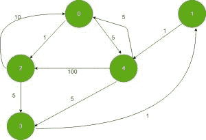

# 至少有一个公共顶点的源到目的地和返回的最短距离之和

> 原文:[https://www . geeksforgeeks . org/源到目的地的最短距离总和以及至少有一个公共顶点的背面/](https://www.geeksforgeeks.org/sum-of-shortest-distance-on-source-to-destination-and-back-having-at-least-a-common-vertex/)

给定一个**有向加权图**和**源**和**目的地**顶点。任务是找到从**源到目的地**然后从**目的地到源**的路径上的最短距离之和，使得两条路径除了源和目的地之外至少有一个**公共顶点**。
***注**:从目的地到源地，边缘的所有方向都是相反的。*
**例:**

> **输入:** src = 0，des = 1
> 
> 
> 
> **输出:** 17
> **说明:**
> 公共顶点为 4，路径为 0->4->3->1->4->0

**方法:**思路是使用[迪克斯特拉的算法](https://www.geeksforgeeks.org/dijkstras-shortest-path-algorithm-greedy-algo-7/)。在使用 Dijkstra 算法寻找从源到目的地的最短路径和从目的地到源的最短路径时，可能不会产生除了源和目的地顶点之外至少有一个公共节点的路径。

*   假设 **s** 为源顶点， **d** 为目的顶点， **v** 为从源到目的地和目的地到源的两个路径中共同的中间节点。最短的一对路径，使 v 在这两条路径的交点处是一条路径:**s->v->d->v->s**，其长度为

> dis[s][v]+dis[v][d]+dis[d][v]+dis[v][s]

*   由于 **s** 和 **d** 是固定的，所以只要找到 **v** 就行了，这样给出最短路径。
*   要找到这样的 **v** ，请遵循以下步骤:
    1.  找到从所有顶点到 **s** 和 **d** 的最短距离，这给了我们 **dis[v][s]** 和 **dis[v][d]** 的值。要找到从所有顶点到给定节点的最短路径，请参考[从所有顶点到目的地的最短路径](https://www.geeksforgeeks.org/shortest-paths-from-all-vertices-to-a-destination/)。
    2.  求所有顶点到 **s** 和 **d** 的最短距离，这就给了我们**d【s】【v】**和**d【d】【v】**。
    3.  对所有 **v** 进行迭代，找到**d[s][v]+d[v][d]+d[d][v]+d[v][s]**的最小值。

以下是上述方法的实现:

## 卡片打印处理机（Card Print Processor 的缩写）

```
// CPP implementation of the approach

#include <bits/stdc++.h>
using namespace std;
#define INF 0x3f3f3f3f

// iPair represents the Integer Pair
typedef pair<int, int> iPair;

// This class represents
// a directed graph using
// adjacency list representation
class Graph {

    // Number of vertices
    int V;

    // In a weighted graph, store vertex
    // and weight pair for every edge
    list<pair<int, int> >* adj;

public:
    // Constructor
    Graph(int V);

    // Function to add an edge to graph
    void addEdge(int u, int v, int w);

    // Find shortest path from
    // source vertex to all vertex
    void shortestPath(int src,
                      vector<int>& dist);
};

// Allocates memory for adjacency list
Graph::Graph(int V)
{
    this->V = V;
    adj = new list<iPair>[V];
}

// Function to add an edge to the graph
void Graph::addEdge(int u, int v, int w)
{
    adj[v].push_back(make_pair(u, w));
}

// Function to find the shortest paths
// from source to all other vertices
void Graph::shortestPath(int src,
                         vector<int>& dist)
{

    // Create a priority queue to
    // store vertices that
    // are being preprocessed
    priority_queue<iPair,
                   vector<iPair>,
                   greater<iPair> >
        pq;

    // Insert source itself in priority
    // queue and initialize
    // its distance as 0
    pq.push(make_pair(0, src));
    dist[src] = 0;

    // Loop till priority queue
    // becomes empty (or all
    // distances are not finalized)
    while (!pq.empty()) {

        // The first vertex in pair
        // is the minimum distance
        // vertex, extract it from
        // priority queue
        int u = pq.top().second;
        pq.pop();

        // 'i' is used to get all
        // adjacent vertices of a vertex
        list<pair<int, int> >::iterator i;
        for (i = adj[u].begin(); i != adj[u].end(); ++i) {

            // Get vertex label and
            // weight of current
            // adjacent of u
            int v = (*i).first;
            int weight = (*i).second;

            // If there is shorted
            // path to v through u
            if (dist[v] > dist[u] + weight) {

                // Updating distance of v
                dist[v] = dist[u] + weight;
                pq.push(make_pair(dist[v], v));
            }
        }
    }
}

// Function to return the
// required minimum path
int minPath(int V, int src, int des,
            Graph g, Graph r)
{
    // Create a vector for
    // distances and
    // initialize all distances
    // as infinite (INF)

    // To store distance of all
    // vertex from source
    vector<int> dist(V, INF);

    // To store distance of all
    // vertex from destination
    vector<int> dist2(V, INF);

    // To store distance of source
    // from all vertex
    vector<int> dist3(V, INF);

    // To store distance of
    // destination from all vertex
    vector<int> dist4(V, INF);

    // Computing shortest path from
    // source vertex to all vertices
    g.shortestPath(src, dist);

    // Computing shortest path from
    // destination vertex to all vertices
    g.shortestPath(des, dist2);

    // Computing shortest path from
    // all the vertices to source
    r.shortestPath(src, dist3);

    // Computing shortest path from
    // all the vertices to destination
    r.shortestPath(des, dist4);

    // Finding the intermediate node (IN)
    // such that the distance of path
    // src -> IN -> des -> IN -> src is minimum

    // To store the shortest distance
    int ans = INT_MAX;

    for (int i = 0; i < V; i++) {

        // Intermediate node should not be
        // the source and destination
        if (i != des && i != src)
            ans = min(
                ans,
                dist[i] + dist2[i]
                    + dist3[i] + dist4[i]);
    }

    // Return the minimum path required
    return ans;
}

// Driver code
int main()
{

    // Create the graph
    int V = 5;
    int src = 0, des = 1;

    // To store the original graph
    Graph g(V);

    // To store the reverse graph
    // and compute distance from all
    // vertex to a particular vertex
    Graph r(V);

    // Adding edges
    g.addEdge(0, 2, 1);
    g.addEdge(0, 4, 5);
    g.addEdge(1, 4, 1);
    g.addEdge(2, 0, 10);
    g.addEdge(2, 3, 5);
    g.addEdge(3, 1, 1);
    g.addEdge(4, 0, 5);
    g.addEdge(4, 2, 100);
    g.addEdge(4, 3, 5);

    // Adding edges in reverse direction
    r.addEdge(2, 0, 1);
    r.addEdge(4, 0, 5);
    r.addEdge(4, 1, 1);
    r.addEdge(0, 2, 10);
    r.addEdge(3, 2, 5);
    r.addEdge(1, 3, 1);
    r.addEdge(0, 4, 5);
    r.addEdge(2, 4, 100);
    r.addEdge(3, 4, 5);

    cout << minPath(V, src, des, g, r);

    return 0;
}
```

## 蟒蛇 3

```
# Python implementation of the approach
from typing import List
from queue import PriorityQueue
from sys import maxsize as INT_MAX
INF = 0x3f3f3f3f

# This class represents
# a directed graph using
# adjacency list representation
class Graph:
    def __init__(self, V: int) -> None:

        # Number of vertices
        self.V = V

        # In a weighted graph, store vertex
        # and weight pair for every edge
        self.adj = [[] for _ in range(V)]

    # Function to add an edge to the graph
    def addEdge(self, u: int, v: int, w: int) -> None:
        self.adj[v].append((u, w))

    # Function to find the shortest paths
    # from source to all other vertices
    def shortestPath(self, src: int, dist: List[int]) -> None:

        # Create a priority queue to
        # store vertices that
        # are being preprocessed
        pq = PriorityQueue()

        # Insert source itself in priority
        # queue and initialize
        # its distance as 0
        pq.put((0, src))
        dist[src] = 0

        # Loop till priority queue
        # becomes empty (or all
        # distances are not finalized)
        while not pq.empty():

            # The first vertex in pair
            # is the minimum distance
            # vertex, extract it from
            # priority queue
            u = pq.get()[1]

            # 'i' is used to get all
            # adjacent vertices of a vertex
            for i in self.adj[u]:

                # Get vertex label and
                # weight of current
                # adjacent of u
                v = i[0]
                weight = i[1]

                # If there is shorted
                # path to v through u
                if dist[v] > dist[u] + weight:

                    # Updating distance of v
                    dist[v] = dist[u] + weight
                    pq.put((dist[v], v))

# Function to return the
# required minimum path
def minPath(V: int, src: int, des: int, g: Graph, r: Graph) -> int:

    # Create a vector for
    # distances and
    # initialize all distances
    # as infinite (INF)

    # To store distance of all
    # vertex from source
    dist = [INF for _ in range(V)]

    # To store distance of all
    # vertex from destination
    dist2 = [INF for _ in range(V)]

    # To store distance of source
    # from all vertex
    dist3 = [INF for _ in range(V)]

    # To store distance of
    # destination from all vertex
    dist4 = [INF for _ in range(V)]

    # Computing shortest path from
    # source vertex to all vertices
    g.shortestPath(src, dist)

    # Computing shortest path from
    # destination vertex to all vertices
    g.shortestPath(des, dist2)

    # Computing shortest path from
    # all the vertices to source
    r.shortestPath(src, dist3)

    # Computing shortest path from
    # all the vertices to destination
    r.shortestPath(des, dist4)

    # Finding the intermediate node (IN)
    # such that the distance of path
    # src -> IN -> des -> IN -> src is minimum

    # To store the shortest distance
    ans = INT_MAX
    for i in range(V):

        # Intermediate node should not be
        # the source and destination
        if (i != des and i != src):
            ans = min(ans, dist[i] + dist2[i] + dist3[i] + dist4[i])

    # Return the minimum path required
    return ans

# Driver code
if __name__ == "__main__":

    # Create the graph
    V = 5
    src = 0
    des = 1

    # To store the original graph
    g = Graph(V)

    # To store the reverse graph
    # and compute distance from all
    # vertex to a particular vertex
    r = Graph(V)

    # Adding edges
    g.addEdge(0, 2, 1)
    g.addEdge(0, 4, 5)
    g.addEdge(1, 4, 1)
    g.addEdge(2, 0, 10)
    g.addEdge(2, 3, 5)
    g.addEdge(3, 1, 1)
    g.addEdge(4, 0, 5)
    g.addEdge(4, 2, 100)
    g.addEdge(4, 3, 5)

    # Adding edges in reverse direction
    r.addEdge(2, 0, 1)
    r.addEdge(4, 0, 5)
    r.addEdge(4, 1, 1)
    r.addEdge(0, 2, 10)
    r.addEdge(3, 2, 5)
    r.addEdge(1, 3, 1)
    r.addEdge(0, 4, 5)
    r.addEdge(2, 4, 100)
    r.addEdge(3, 4, 5)

    print(minPath(V, src, des, g, r))

# This code is contributed by sanjeev2552
```

**Output:** 

```
17
```