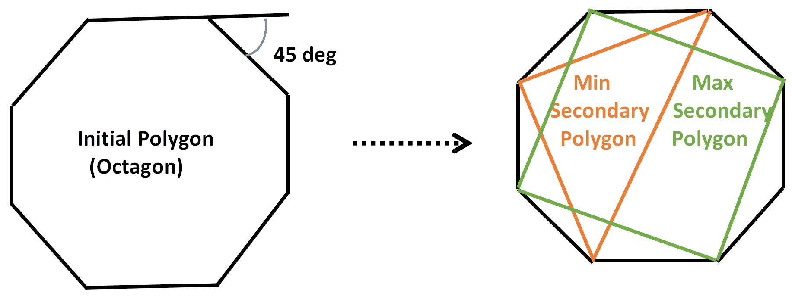

# 给定多边形中最大和最小子多边形的边的总和

> 原文:[https://www . geeksforgeeks . org/给定多边形的最大和最小子多边形的边之和/](https://www.geeksforgeeks.org/sum-of-sides-of-largest-and-smallest-child-polygons-possible-from-a-given-polygon/)

给定一个整数 **A** 代表一个规则的[凸多边形](https://en.wikipedia.org/wiki/Convex_polygon)的外角(*单位为度*，任务是找出形成的最大和最小二次多边形的边的和，使得二次多边形的每个边都是一次多边形的弦。如果无法形成这样的多边形，则打印**-1”**。

**示例:**

> **输入:** A = 45
> **输出:** 7
> **解释:**
> 主多边形是一个八边形。
> 因此，最小的次多边形由 3 条边组成，最大的次多边形由 4 条边组成。
> 
> [](https://media.geeksforgeeks.org/wp-content/uploads/20201027132815/Screenshot195.png)
> 
> 最小二次多边形的边之和+最大二次多边形的边= 3 + 4 = 7。
> 
> **输入:** A = 60
> **输出:** 6
> **说明:**主多边形是由 6 条边组成的六边形。因此，最小的次级多边形由 3 条边组成，最大的次级多边形由 3 条边组成。

**逼近:**思路是先找到主多边形的边数，然后，检查是否有可能做出次多边形。按照以下步骤解决问题:

*   正多边形外角之和为 **360** 度。因此，边数= 360 /外角。
*   最大辅助多边形的边数是主多边形的边数/ 2。
*   由于边数至少为 3 的多边形是可能的，所以如果**初始多边形的**边≥ 6** 的话，二次多边形也是可能的。**
*   最小的多边形总是有 **3** **边**。
*   打印最大和最小多边形的边数总和。

下面是上述方法的实现:

## C++

```
#include <bits/stdc++.h>
using namespace std;

// Function to find the sum of largest and
// smallest secondary polygons if possible
void secondary_polygon(int Angle)
{

    // Count edges of primary polygon
    int edges_primary = 360/Angle;

    if (edges_primary >= 6)
    {

        // Calculate edges present in
        // the largest secondary polygon
        int edges_max_secondary = edges_primary / 2;

        cout << edges_max_secondary + 3;
    }
    else
        cout << "Not Possible";
}

// Driver Code
int main()
{

  // Given Exterior Angle
  int Angle = 45;
  secondary_polygon(Angle);

  return 0;
}

// This code is contributed by mohit kumar 29.
```

## Java 语言(一种计算机语言，尤用于创建网站)

```
// Java program for the above approach
import java.io.*;
import java.util.*;
class GFG
{

// Function to find the sum of largest and
// smallest secondary polygons if possible
static void secondary_polygon(int Angle)
{

    // Count edges of primary polygon
    int edges_primary = 360/Angle;

    if (edges_primary >= 6)
    {

        // Calculate edges present in
        // the largest secondary polygon
        int edges_max_secondary = edges_primary / 2;

        System.out.println(edges_max_secondary + 3);
    }
    else
        System.out.println("Not Possible");
}

// Driver Code
public static void main(String[] args)
{

    // Given Exterior Angle
  int Angle = 45;
  secondary_polygon(Angle);
}
}

// This code is contributed by code_hunt.
```

## 蟒蛇 3

```
# Python3 program for the above approach:

# Function to find the sum of largest and
# smallest secondary polygons if possible
def secondary_polygon(Angle):

    # Count edges of primary polygon
    edges_primary = 360//Angle

    if edges_primary >= 6:

        # Calculate edges present in
        # the largest secondary polygon
        edges_max_secondary = edges_primary // 2

        return edges_max_secondary + 3

    else:
        return "Not Possible"

# Driver Code
if __name__ == '__main__':

    # Given Exterior Angle
    Angle = 45
    print(secondary_polygon(Angle))
```

## C#

```
// C# program for the above approach
using System;
class GFG {

  // Function to find the sum of largest and
  // smallest secondary polygons if possible
  static void secondary_polygon(int Angle)
  {

    // Count edges of primary polygon
    int edges_primary = 360 / Angle;

    if (edges_primary >= 6) {

      // Calculate edges present in
      // the largest secondary polygon
      int edges_max_secondary = edges_primary / 2;

      Console.WriteLine(edges_max_secondary + 3);
    }
    else
      Console.WriteLine("Not Possible");
  }

  // Driver Code
  public static void Main(string[] args)
  {

    // Given Exterior Angle
    int Angle = 45;
    secondary_polygon(Angle);
  }
}

// This code is contributed by ukasp.
```

## java 描述语言

```
<script>

// JavaScript program for the above approach

// Function to find the sum of largest and
// smallest secondary polygons if possible
function secondary_polygon(Angle)
{

    // Count edges of primary polygon
    var edges_primary = 360/Angle;

    if (edges_primary >= 6)
    {

        // Calculate edges present in
        // the largest secondary polygon
        var edges_max_secondary = edges_primary / 2;

        document.write(edges_max_secondary + 3);
    }
    else
        document.write("Not Possible");
}

// Driver Code

//Given Exterior Angle
var Angle = 45;
secondary_polygon(Angle);

// This code is contributed by 29AjayKumar

</script>
```

**Output:** 

```
7
```

***时间复杂度:**O(1)*
T5**辅助空间:** O(1)