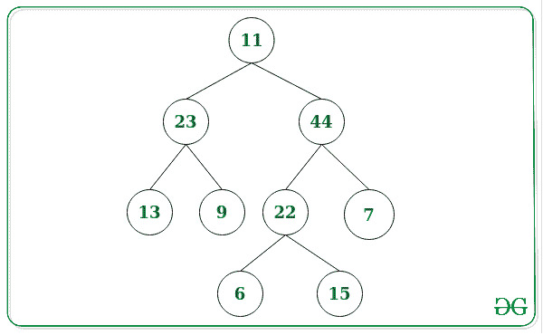
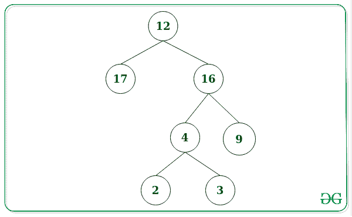

# 给定二叉树中特殊平衡节点的总和

> 原文:[https://www . geeksforgeeks . org/给定二叉树的特殊平衡节点总和/](https://www.geeksforgeeks.org/sum-of-specially-balanced-nodes-from-a-given-binary-tree/)

给定一个 [**二叉树**](https://www.geeksforgeeks.org/binary-tree-data-structure/) ，任务是找到给定二叉树中所有**特别平衡的节点**的和。

> 二叉树中的一个**特殊平衡节点**包含一个子树(左或右)的节点之和为偶数，另一个子树的节点之和为奇数。
> 只有一个孩子或者没有孩子的节点永远不可能是平衡节点。

**示例:**

> **输入:**下面是给定的树:
> 
> 
> 
> **输出:** 33
> **说明:**
> 特别平衡的节点是 11 和 22。
> **对于节点 11:**
> 左子树之和为(23 + 13 + 9) = 45，为奇数。
> 右子树之和为(44 + 22 + 7 + 6 + 15) = 94，为偶数。
> **对于节点 22:**
> 左子树之和为 6，为偶数。
> 右子树之和为 15，为奇数。
> 因此，特别平衡节点之和为 11 + 22 = 33。
> 
> **输入:**下面是给定的树:
> 
> 
> 
> **输出:** 16
> **说明:**
> 特别平衡的节点是 4 和 12。
> **对于节点 4:**
> 左子树之和为 2，为偶数。
> 右子树之和为 3，奇数。
> **对于节点 12:**
> 左子树之和为 17，为奇数。
> 右子树之和为(16 + 4 + 9 + 2 + 3) = 34，为偶数。
> 因此，特别平衡的节点之和为 4 + 12 = 16。

**方法:**思想是使用递归对给定的树执行 [DFS 遍历，并根据给定的条件更新最终的和。请遵循以下步骤:](https://www.geeksforgeeks.org/dfs-traversal-of-a-tree-using-recursion/)

1.  将一个 **totalSum** 初始化为 **0** ，存储所有特殊平衡节点的总和。
2.  对给定的树执行 DFS 遍历，并检查以下内容:
    *   如果该节点是[叶节点](https://www.geeksforgeeks.org/write-a-c-program-to-get-count-of-leaf-nodes-in-a-binary-tree/)，则返回该节点的值。
    *   现在，如果当前节点不是叶节点，[递归地](https://www.geeksforgeeks.org/recursion/)遍历左右子树。
    *   每次递归调用结束时，返回左和右子树与当前根值之和的值。
    *   检查返回的和是否满足特殊平衡节点的属性。如果发现为真，则将当前节点值加到 **totalSum** 上。
3.  完成上述步骤后，打印**合计**的值。

下面是上述方法的实现:

## C++

```
// C++ program for the above approach
#include <bits/stdc++.h>
using namespace std;

// Structure of Binary Tree
struct Node {
    int data;
    Node *left, *right;
};

// Function to create a new node
Node* newnode(int data)
{
    Node* temp = new Node;
    temp->data = data;
    temp->left = NULL;
    temp->right = NULL;

    // Return the created node
    return temp;
}

// Function to insert a node in the tree
Node* insert(string s, int i, int N,
             Node* root, Node* temp)
{
    if (i == N)
        return temp;

    // Left insertion
    if (s[i] == 'L')
        root->left = insert(s, i + 1, N,
                            root->left,
                            temp);

    // Right insertion
    else
        root->right = insert(s, i + 1, N,
                             root->right,
                             temp);

    // Return the root node
    return root;
}

// Function to find sum of specially
// balanced nodes in the Tree
int SBTUtil(Node* root, int& sum)
{
    // Base Case
    if (root == NULL)
        return 0;

    if (root->left == NULL
        && root->right == NULL)
        return root->data;

    // Find the left subtree sum
    int left = SBTUtil(root->left, sum);

    // Find the right subtree sum
    int right = SBTUtil(root->right, sum);

    // Condition of specially
    // balanced node
    if (root->left && root->right) {

        // Condition of specially
        // balanced node
        if ((left % 2 == 0
             && right % 2 != 0)
            || (left % 2 != 0
                && right % 2 == 0)) {

            sum += root->data;
        }
    }

    // Return the sum
    return left + right + root->data;
}

// Function to build the binary tree
Node* build_tree(int R, int N,
                 string str[],
                 int values[])
{
    // Form root node of the tree
    Node* root = newnode(R);
    int i;

    // Insert nodes into tree
    for (i = 0; i < N - 1; i++) {
        string s = str[i];
        int x = values[i];

        // Create a new Node
        Node* temp = newnode(x);

        // Insert the node
        root = insert(s, 0, s.size(),
                      root, temp);
    }

    // Return the root of the Tree
    return root;
}

// Function to find the sum of specially
// balanced nodes
void speciallyBalancedNodes(
    int R, int N, string str[], int values[])
{
    // Build Tree
    Node* root = build_tree(R, N,
                            str, values);

    // Stores the sum of specially
    // balanced node
    int sum = 0;

    // Function Call
    SBTUtil(root, sum);

    // Print required sum
    cout << sum << " ";
}

// Driver Code
int main()
{
    // Given nodes
    int N = 7;

    // Given root
    int R = 12;

    // Given path info of nodes
    // from root
    string str[N - 1]
        = { "L", "R", "RL",
            "RR", "RLL", "RLR" };

    // Given node values
    int values[N - 1] = { 17, 16, 4,
                          9, 2, 3 };

    // Function Call
    speciallyBalancedNodes(R, N, str,
                           values);

    return 0;
}
```

## Java 语言(一种计算机语言，尤用于创建网站)

```
// Java program for
// the above approach
import java.util.*;
class GFG{

static int sum;

//Structure of Binary Tree
static class Node
{
  int data;
  Node left, right;
};

//Function to create a new node
static Node newnode(int data)
{
  Node temp = new Node();
  temp.data = data;
  temp.left = null;
  temp.right = null;

  // Return the created node
  return temp;
}

//Function to insert a node in the tree
static Node insert(String s, int i, int N,
                   Node root, Node temp)
{
  if (i == N)
    return temp;

  // Left insertion
  if (s.charAt(i) == 'L')
    root.left = insert(s, i + 1, N,
                       root.left, temp);

  // Right insertion
  else
    root.right = insert(s, i + 1, N,
                        root.right, temp);

  // Return the root node
  return root;
}

//Function to find sum of specially
//balanced nodes in the Tree
static int SBTUtil(Node root)
{
  // Base Case
  if (root == null)
    return 0;

  if (root.left == null &&
      root.right == null)
    return root.data;

  // Find the left subtree sum
  int left = SBTUtil(root.left);

  // Find the right subtree sum
  int right = SBTUtil(root.right);

  // Condition of specially
  // balanced node
  if (root.left != null &&
      root.right != null)
  {
    // Condition of specially
    // balanced node
    if ((left % 2 == 0 && right % 2 != 0) ||
        (left % 2 != 0 && right % 2 == 0))
    {
      sum += root.data;
    }
  }

  // Return the sum
  return left + right + root.data;
}

//Function to build the binary tree
static Node build_tree(int R, int N,
                       String str[],
                       int values[])
{
  // Form root node of the tree
  Node root = newnode(R);
  int i;

  // Insert nodes into tree
  for (i = 0; i < N - 1; i++)
  {
    String s = str[i];
    int x = values[i];

    // Create a new Node
    Node temp = newnode(x);

    // Insert the node
    root = insert(s, 0, s.length(),
                  root, temp);
  }

  // Return the root of the Tree
  return root;
}

// Function to find the
// sum of specially
// balanced nodes
static void speciallyBalancedNodes(int R, int N,
                                   String str[],
                                   int values[])
{
  // Build Tree
  Node root = build_tree(R, N, str,
                         values);

  // Stores the sum of specially
  // balanced node
  sum = 0;

  // Function Call
  SBTUtil(root);

  // Print required sum
  System.out.print(sum + " ");
}

//Driver Code
public static void main(String[] args)
{
  // Given nodes
  int N = 7;

  // Given root
  int R = 12;

  // Given path info of nodes
  // from root
  String str[] = {"L", "R", "RL",
                 "RR", "RLL", "RLR"};

  // Given node values
  int values[] = {17, 16, 4,
                  9, 2, 3};

  // Function Call
  speciallyBalancedNodes(R, N, str,
                         values);
}
}

//This code is contributed by 29AjayKumar
```

## 蟒蛇 3

```
# Python3 program for the above approach

# Structure of Binary Tree
class Node:

    def __init__(self, data):

        self.data = data
        self.left = None
        self.right = None

# Function to create a new node
def newnode(data):

    temp = Node(data)

    # Return the created node
    return temp

# Function to insert a node in the tree
def insert(s, i, N, root, temp):

    if (i == N):
        return temp

    # Left insertion
    if (s[i] == 'L'):
        root.left = insert(s, i + 1, N,
                           root.left, temp)

    # Right insertion
    else:
        root.right = insert(s, i + 1, N,
                            root.right, temp)

    # Return the root node
    return root

# Function to find sum of specially
# balanced nodes in the Tree
def SBTUtil(root, sum):

    # Base Case
    if (root == None):
        return [0, sum]

    if (root.left == None and
       root.right == None):
        return [root.data, sum]

    # Find the left subtree sum
    left, sum = SBTUtil(root.left, sum)

    # Find the right subtree sum
    right, sum = SBTUtil(root.right, sum)

    # Condition of specially
    # balanced node
    if (root.left and root.right):

        # Condition of specially
        # balanced node
        if ((left % 2 == 0 and
            right % 2 != 0) or
            (left % 2 != 0 and
            right % 2 == 0)):
            sum += root.data

    # Return the sum
    return [left + right + root.data, sum]

# Function to build the binary tree
def build_tree(R, N, str, values):

    # Form root node of the tree
    root = newnode(R)

    # Insert nodes into tree
    for i in range(0, N - 1):
        s = str[i]
        x = values[i]

        # Create a new Node
        temp = newnode(x)

        # Insert the node
        root = insert(s, 0, len(s),
                      root, temp)

    # Return the root of the Tree
    return root

# Function to find the sum of specially
# balanced nodes
def speciallyBalancedNodes(R, N, str, values):

    # Build Tree
    root = build_tree(R, N, str, values)

    # Stores the sum of specially
    # balanced node
    sum = 0

    # Function Call
    tmp, sum = SBTUtil(root, sum)

    # Print required sum
    print(sum, end = ' ')

# Driver code
if __name__ == "__main__":

    # Given nodes
    N = 7

    # Given root
    R = 12

    # Given path info of nodes
    # from root
    str = [ "L", "R", "RL",
            "RR", "RLL", "RLR" ]

    # Given node values
    values = [ 17, 16, 4, 9, 2, 3 ]

    # Function Call
    speciallyBalancedNodes(R, N, str,
                           values)

# This code is contributed by rutvik_56
```

## C#

```
//C# program for
// the above approach
using System;
class GFG{

static int sum;

//Structure of Binary Tree
class Node
{
  public int data;
  public Node left, right;
};

//Function to create a new node
static Node newnode(int data)
{
  Node temp = new Node();
  temp.data = data;
  temp.left = null;
  temp.right = null;

  // Return the created node
  return temp;
}

//Function to insert a node in the tree
static Node insert(String s, int i, int N,
                   Node root, Node temp)
{
  if (i == N)
    return temp;

  // Left insertion
  if (s[i] == 'L')
    root.left = insert(s, i + 1, N,
                       root.left, temp);

  // Right insertion
  else
    root.right = insert(s, i + 1, N,
                        root.right, temp);

  // Return the root node
  return root;
}

//Function to find sum of specially
//balanced nodes in the Tree
static int SBTUtil(Node root)
{
  // Base Case
  if (root == null)
    return 0;

  if (root.left == null &&
      root.right == null)
    return root.data;

  // Find the left subtree sum
  int left = SBTUtil(root.left);

  // Find the right subtree sum
  int right = SBTUtil(root.right);

  // Condition of specially
  // balanced node
  if (root.left != null &&
      root.right != null)
  {
    // Condition of specially
    // balanced node
    if ((left % 2 == 0 && right % 2 != 0) ||
        (left % 2 != 0 && right % 2 == 0))
    {
      sum += root.data;
    }
  }

  // Return the sum
  return left + right + root.data;
}

//Function to build the binary tree
static Node build_tree(int R, int N,
                       String []str,
                       int []values)
{
  // Form root node of the tree
  Node root = newnode(R);
  int i;

  // Insert nodes into tree
  for (i = 0; i < N - 1; i++)
  {
    String s = str[i];
    int x = values[i];

    // Create a new Node
    Node temp = newnode(x);

    // Insert the node
    root = insert(s, 0, s.Length,
                  root, temp);
  }

  // Return the root of the Tree
  return root;
}

// Function to find the
// sum of specially
// balanced nodes
static void speciallyBalancedNodes(int R, int N,
                                   String []str,
                                   int []values)
{
  // Build Tree
  Node root = build_tree(R, N, str,
                         values);

  // Stores the sum of specially
  // balanced node
  sum = 0;

  // Function Call
  SBTUtil(root);

  // Print required sum
  Console.Write(sum + " ");
}

//Driver Code
public static void Main(String[] args)
{
  // Given nodes
  int N = 7;

  // Given root
  int R = 12;

  // Given path info of nodes
  // from root
  String []str = {"L", "R", "RL",
                  "RR", "RLL", "RLR"};

  // Given node values
  int []values = {17, 16, 4,
                  9, 2, 3};

  // Function Call
  speciallyBalancedNodes(R, N, str,
                         values);
}
}

// This code is contributed by 29AjayKumar
```

## java 描述语言

```
<script>

// Javascript program for the above approach
let sum;

// Structure of Binary Tree
class Node
{
    constructor(data)
    {
        this.left = null;
        this.right = null;
        this.data = data;
    }
}

// Function to create a new node
function newnode(data)
{
    let temp = new Node(data);

    // Return the created node
    return temp;
}

// Function to insert a node in the tree
function insert(s, i, N, root, temp)
{
    if (i == N)
        return temp;

    // Left insertion
    if (s[i] == 'L')
        root.left = insert(s, i + 1, N,
                           root.left, temp);

    // Right insertion
    else
        root.right = insert(s, i + 1, N,
                            root.right, temp);

    // Return the root node
    return root;
}

// Function to find sum of specially
// balanced nodes in the Tree
function SBTUtil(root)
{

    // Base Case
    if (root == null)
        return 0;

    if (root.left == null &&
        root.right == null)
        return root.data;

    // Find the left subtree sum
    let left = SBTUtil(root.left);

    // Find the right subtree sum
    let right = SBTUtil(root.right);

    // Condition of specially
    // balanced node
    if (root.left != null &&
        root.right != null)
    {

        // Condition of specially
        // balanced node
        if ((left % 2 == 0 && right % 2 != 0) ||
            (left % 2 != 0 && right % 2 == 0))
        {
            sum += root.data;
        }
    }

    // Return the sum
    return left + right + root.data;
}

// Function to build the binary tree
function build_tree(R, N, str, values)
{

    // Form root node of the tree
    let root = newnode(R);
    let i;

    // Insert nodes into tree
    for(i = 0; i < N - 1; i++)
    {
        let s = str[i];
        let x = values[i];

        // Create a new Node
        let temp = newnode(x);

        // Insert the node
        root = insert(s, 0, s.length,
                      root, temp);
    }

    // Return the root of the Tree
    return root;
}

// Function to find the
// sum of specially
// balanced nodes
function speciallyBalancedNodes(R, N, str, values)
{

    // Build Tree
    let root = build_tree(R, N, str, values);

    // Stores the sum of specially
    // balanced node
    sum = 0;

    // Function Call
    SBTUtil(root);

    // Print required sum
    document.write(sum + " ");
}

// Driver code

// Given nodes
let N = 7;

// Given root
let R = 12;

// Given path info of nodes
// from root
let str = [ "L", "R", "RL",
            "RR", "RLL", "RLR" ];

// Given node values
let values = [ 17, 16, 4, 9, 2, 3 ];

// Function Call
speciallyBalancedNodes(R, N, str, values);

// This code is contributed by suresh07

</script>
```

**Output:** 

```
16
```

***时间复杂度:**O(N)*
T5**辅助空间:** O(N)