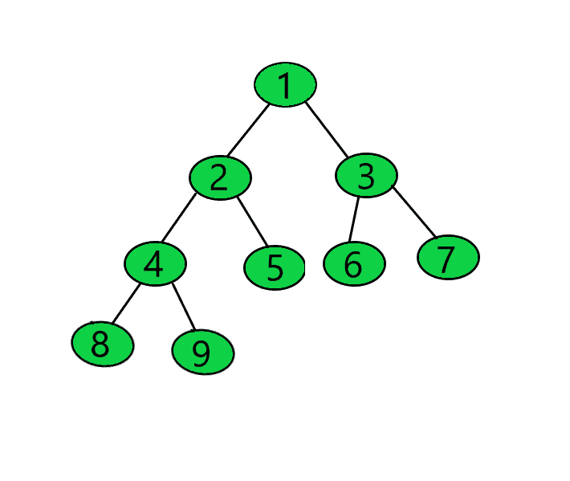
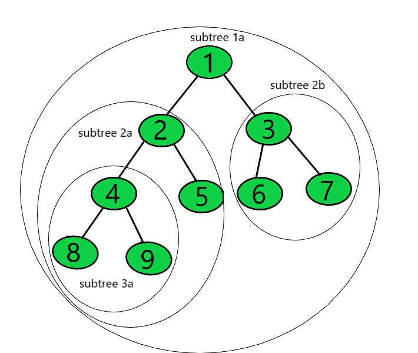
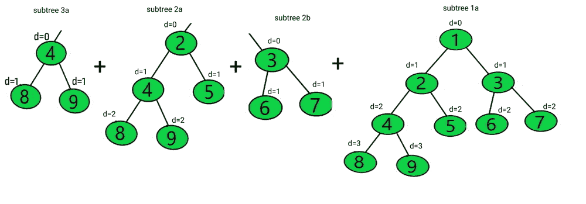
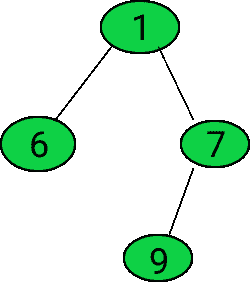

# 给定二叉树每个节点的子树深度之和

> 原文:[https://www . geeksforgeeks . org/给定二叉树每个节点的子树深度总和/](https://www.geeksforgeeks.org/sum-of-subtree-depths-for-every-node-of-a-given-binary-tree/)

给定一个由 **N** 节点组成的[二叉树](https://www.geeksforgeeks.org/binary-tree-data-structure/)，任务是找出给定二叉树中所有[子树](https://www.geeksforgeeks.org/check-binary-tree-subtree-another-binary-tree-set-2/)节点的[深度](https://www.geeksforgeeks.org/write-a-c-program-to-find-the-maximum-depth-or-height-of-a-tree/)之和。

**示例:**

> **输入:**
> 
> [](https://media.geeksforgeeks.org/wp-content/uploads/20201227005813/tree.png)
> 
> **输出:**26
> T3】说明:
> 
> [ ](https://media.geeksforgeeks.org/wp-content/uploads/20201228214648/tree.png) [ ](https://media.geeksforgeeks.org/wp-content/uploads/20210102144904/Group7.jpg)
> 
> 值为 **8、9、5、6、**和 **7** 的叶节点的子树深度之和等于 0。
> 节点 4 的子树中总共有 2 个节点，两者处于同一级别。因此，子树深度之和等于 2。
> 节点 2 的子树中总共有 4 个节点，每层 2 个。因此，子树深度之和等于 6。
> 节点 3 的子树中总共有 2 个节点，两者处于同一级别。因此，子树深度之和等于 2。
> 节点 1 的子树中总共有 8 个节点，第一级有 2 个，第二级有 4 个，最后一级有 2 个。因此，子树深度之和等于 16。
> 因此，所有子树深度的总和等于 2 + 6 + 2 + 16 = 26
> 
> **输入:**
> 
> [](https://media.geeksforgeeks.org/wp-content/uploads/20210112210809/Treeexample20.png)
> 
> **输出:** 5

**天真方法:**最简单的方法是[遍历树](https://www.geeksforgeeks.org/tree-traversals-inorder-preorder-and-postorder/)，对于每个节点，递归计算该节点所有节点的深度之和，并打印得到的最终总和。

下面是上述方法的实现:

## C++

```
// C++ program for the above approach
#include <bits/stdc++.h>
using namespace std;

// Binary tree node
class TreeNode {
public:
    int data;
    TreeNode* left;
    TreeNode* right;
};

// Function that allocates a new
// node with data and NULL to its
// left and right pointers
TreeNode* newNode(int data)
{
    TreeNode* Node = new TreeNode();
    Node->data = data;
    Node->left = NULL;
    Node->right = NULL;

    // Return the node
    return (Node);
}

// Function to find the sum of depths of
// all nodes in subtree of the current node
int sumofdepth(TreeNode* root, int d)
{
    // IF NULL node then return 0
    if (root == NULL)
        return 0;

    // Recursively find the sum of
    // depths of all nodes in the
    // left and right subtree
    return d + sumofdepth(root->left, d + 1)
           + sumofdepth(root->right, d + 1);
}

// Function to calculate the sum
// of depth of all the subtrees
int sumofallsubtrees(TreeNode* root)
{
    // if root is NULL return 0
    if (root == NULL)
        return 0;

    // Find the total depth sum of
    // current node and recursively
    return sumofdepth(root, 0)
           + sumofallsubtrees(root->left)
           + sumofallsubtrees(root->right);
}

// Driver Code
int main()
{
    // Given Tree
    TreeNode* root = newNode(1);
    root->left = newNode(2);
    root->right = newNode(3);
    root->left->left = newNode(4);
    root->left->right = newNode(5);
    root->right->left = newNode(6);
    root->right->right = newNode(7);
    root->left->left->left = newNode(8);
    root->left->left->right = newNode(9);

    // Function Call
    cout << sumofallsubtrees(root);

    return 0;
}
```

## Java 语言(一种计算机语言，尤用于创建网站)

```
// Java program for the above approach
class GFG{

// Binary tree node
static class TreeNode
{
    int data;
    TreeNode left, right;
}

// Function that allocates a new
// node with data and NULL to its
// left and right pointers
static TreeNode newNode(int data)
{
    TreeNode Node = new TreeNode();
    Node.data = data;
    Node.left = Node.right = null;
    return (Node);
}

// Function to find the sum of depths of
// all nodes in subtree of the current node
static int sumofdepth(TreeNode root, int d)
{

    // If NULL node then return 0
    if (root == null)
        return 0;

    // Recursively find the sum of
    // depths of all nodes in the
    // left and right subtree
    return d + sumofdepth(root.left, d + 1) +
              sumofdepth(root.right, d + 1);
}

// Function to calculate the sum
// of depth of all the subtrees
static int sumofallsubtrees(TreeNode root)
{

    // If root is NULL return 0
    if (root == null)
        return 0;

    // Find the total depth sum of
    // current node and recursively
    return sumofdepth(root, 0) +
           sumofallsubtrees(root.left) +
           sumofallsubtrees(root.right);
}

// Driver Code
public static void main(String[] args)
{

    // Given Tree
    TreeNode root = newNode(1);
    root.left = newNode(2);
    root.right = newNode(3);
    root.left.left = newNode(4);
    root.left.right = newNode(5);
    root.right.left = newNode(6);
    root.right.right = newNode(7);
    root.left.left.left = newNode(8);
    root.left.left.right = newNode(9);

    // Function Call
    System.out.println(sumofallsubtrees(root));
}
}

// This code is contributed by Dharanendra L V
```

## 蟒蛇 3

```
# Python3 program for the above approach

# Binary tree node
class TreeNode:

    def __init__(self, data):

        self.data = data
        self.left = None
        self.right = None

# Function to find the sum of depths of
# all nodes in subtree of the current node
def sumofdepth(root, d):

    # IF None node then return 0
    if (root == None):
        return 0

    # Recursively find the sum of
    # depths of all nodes in the
    # left and right subtree
    return (d + sumofdepth(root.left, d + 1) +
                sumofdepth(root.right, d + 1))

# Function to calculate the sum
# of depth of all the subtrees
def sumofallsubtrees(root):

    # If root is None return 0
    if (root == None):
        return 0

    # Find the total depth sum of
    # current node and recursively
    return (sumofdepth(root, 0) + sumofallsubtrees(root.left) +
                                  sumofallsubtrees(root.right))

# Driver Code
if __name__ == '__main__':

    # Given Tree
    root = TreeNode(1)
    root.left = TreeNode(2)
    root.right = TreeNode(3)
    root.left.left = TreeNode(4)
    root.left.right = TreeNode(5)
    root.right.left = TreeNode(6)
    root.right.right = TreeNode(7)
    root.left.left.left = TreeNode(8)
    root.left.left.right = TreeNode(9)

    # Function Call
    print(sumofallsubtrees(root))

# This code is contributed by ipg2016107
```

## C#

```
// C# program for the above approach
using System;
public class GFG{

// Binary tree node
class TreeNode
{
    public int data;
    public TreeNode left, right;
}

// Function that allocates a new
// node with data and NULL to its
// left and right pointers
static TreeNode newNode(int data)
{
    TreeNode Node = new TreeNode();
    Node.data = data;
    Node.left = Node.right = null;
    return (Node);
}

// Function to find the sum of depths of
// all nodes in subtree of the current node
static int sumofdepth(TreeNode root, int d)
{

    // If NULL node then return 0
    if (root == null)
        return 0;

    // Recursively find the sum of
    // depths of all nodes in the
    // left and right subtree
    return d + sumofdepth(root.left, d + 1) +
              sumofdepth(root.right, d + 1);
}

// Function to calculate the sum
// of depth of all the subtrees
static int sumofallsubtrees(TreeNode root)
{

    // If root is NULL return 0
    if (root == null)
        return 0;

    // Find the total depth sum of
    // current node and recursively
    return sumofdepth(root, 0) +
           sumofallsubtrees(root.left) +
           sumofallsubtrees(root.right);
}

// Driver Code
public static void Main(String[] args)
{

    // Given Tree
    TreeNode root = newNode(1);
    root.left = newNode(2);
    root.right = newNode(3);
    root.left.left = newNode(4);
    root.left.right = newNode(5);
    root.right.left = newNode(6);
    root.right.right = newNode(7);
    root.left.left.left = newNode(8);
    root.left.left.right = newNode(9);

    // Function Call
    Console.WriteLine(sumofallsubtrees(root));
}
}

// This code is contributed by shikhasingrajput
```

## java 描述语言

```
<script>
    // Javascript program for the above approach

    // Binary tree node
    class TreeNode
    {
        constructor(data) {
           this.left = null;
           this.right = null;
           this.data = data;
        }
    }

    // Function that allocates a new
    // node with data and NULL to its
    // left and right pointers
    function newNode(data)
    {
        let Node = new TreeNode(data);
        return (Node);
    }

    // Function to find the sum of depths of
    // all nodes in subtree of the current node
    function sumofdepth(root, d)
    {

        // If NULL node then return 0
        if (root == null)
            return 0;

        // Recursively find the sum of
        // depths of all nodes in the
        // left and right subtree
        return d + sumofdepth(root.left, d + 1) +
                  sumofdepth(root.right, d + 1);
    }

    // Function to calculate the sum
    // of depth of all the subtrees
    function sumofallsubtrees(root)
    {

        // If root is NULL return 0
        if (root == null)
            return 0;

        // Find the total depth sum of
        // current node and recursively
        return sumofdepth(root, 0) +
               sumofallsubtrees(root.left) +
               sumofallsubtrees(root.right);
    }

    // Given Tree
    let root = newNode(1);
    root.left = newNode(2);
    root.right = newNode(3);
    root.left.left = newNode(4);
    root.left.right = newNode(5);
    root.right.left = newNode(6);
    root.right.right = newNode(7);
    root.left.left.left = newNode(8);
    root.left.left.right = newNode(9);

    // Function Call
    document.write(sumofallsubtrees(root));

// This code is contributed by suresh07.
</script>
```

**Output:** 

```
26
```

***时间复杂度:**O(N<sup>2</sup>)*
***辅助空间:** O(N)*

**高效方法:**上述方法可以基于以下观察进行优化:

> 假设 **X** 和 **Y** 分别是左右子树的节点数， **S1** 和 **S2** 是左右子树的节点深度之和。
> 则当前节点深度之和可计算为 **S1 + S2 + x + y** ，其中 **x + y** 节点深度增加 **1** 。

按照以下步骤解决问题:

*   定义一个递归 [DFS 函数](https://www.geeksforgeeks.org/depth-first-search-or-dfs-for-a-graph/)说 **sumofsubtree(根)**为:
    *   初始化一对 **p** ，存储当前节点子树中的节点总数和当前子树中所有节点深度的总和
    *   检查**左子**是否不是**空**，然后递归调用函数**sumoftree(root->left)**并将 **p.first** 增加左子树中节点总数，将 **p.second** 增加左子树中所有节点深度总和。
    *   检查**右子**是否不是**空**，然后递归调用函数**sumoftree(root->right)**，将 **p.first** 增加右子树中节点总数，将 **p.second** 增加右子树中所有节点深度总和。
    *   将总数**和**增加**点秒**并返回对**点**
*   调用 DFS 函数 **sumoftree(root)** 并打印得到的结果**和**。

下面是上述方法的实现:

## C++

```
// C++ program for the above approach
#include <bits/stdc++.h>
using namespace std;

// Binary tree node
class TreeNode {
public:
    int data;
    TreeNode* left;
    TreeNode* right;
};

// Function to allocate a new
// node with the given data and
// NULL in its left and right pointers
TreeNode* newNode(int data)
{
    TreeNode* Node = new TreeNode();
    Node->data = data;
    Node->left = NULL;
    Node->right = NULL;

    return (Node);
}

// DFS function to calculate the sum
// of depths of all subtrees depth sum
pair<int, int> sumofsubtree(TreeNode* root,
                            int& ans)
{
    // Store total number of node in
    // its subtree and total sum of
    // depth in its subtree
    pair<int, int> p = make_pair(1, 0);

    // Check if left is not NULL
    if (root->left) {

        // Call recursively the DFS
        // function for left child
        pair<int, int> ptemp
            = sumofsubtree(root->left, ans);

        // Increment the sum of depths
        // by ptemp.first+p.temp.first
        p.second += ptemp.first
                    + ptemp.second;

        // Increment p.first by count
        // of noded in left subtree
        p.first += ptemp.first;
    }

    // Check if right is not NULL
    if (root->right) {

        // Call recursively the DFS
        // function for right child
        pair<int, int> ptemp
            = sumofsubtree(root->right, ans);

        // Increment the sum of depths
        // by ptemp.first+p.temp.first
        p.second += ptemp.first
                    + ptemp.second;

        // Increment p.first by count of
        // nodes in right subtree
        p.first += ptemp.first;
    }

    // Increment the result by total
    // sum of depth in current subtree
    ans += p.second;

    // Return p
    return p;
}

// Driver Code
int main()
{
    // Given Tree
    TreeNode* root = newNode(1);
    root->left = newNode(2);
    root->right = newNode(3);
    root->left->left = newNode(4);
    root->left->right = newNode(5);
    root->right->left = newNode(6);
    root->right->right = newNode(7);
    root->left->left->left = newNode(8);
    root->left->left->right = newNode(9);

    int ans = 0;

    sumofsubtree(root, ans);

    // Print the result
    cout << ans;

    return 0;
}
```

## Java 语言(一种计算机语言，尤用于创建网站)

```
// Java program for the above approach
import java.util.*;
class GFG
{
    static int ans;
    static class pair
    {
        int first, second;
        public pair(int first, int second) 
        {
            this.first = first;
            this.second = second;
        }   
    }

// Binary tree node
static class TreeNode
{
    int data;
    TreeNode left;
    TreeNode right;
};

// Function to allocate a new
// node with the given data and
// null in its left and right pointers
static TreeNode newNode(int data)
{
    TreeNode Node = new TreeNode();
    Node.data = data;
    Node.left = null;
    Node.right = null;
    return (Node);
}

// DFS function to calculate the sum
// of depths of all subtrees depth sum
static pair sumofsubtree(TreeNode root)
{

    // Store total number of node in
    // its subtree and total sum of
    // depth in its subtree
    pair p = new pair(1, 0);

    // Check if left is not null
    if (root.left != null)
    {

        // Call recursively the DFS
        // function for left child
        pair ptemp
            = sumofsubtree(root.left);

        // Increment the sum of depths
        // by ptemp.first+p.temp.first
        p.second += ptemp.first
                    + ptemp.second;

        // Increment p.first by count
        // of noded in left subtree
        p.first += ptemp.first;
    }

    // Check if right is not null
    if (root.right != null)
    {

        // Call recursively the DFS
        // function for right child
        pair ptemp
            = sumofsubtree(root.right);

        // Increment the sum of depths
        // by ptemp.first+p.temp.first
        p.second += ptemp.first
                    + ptemp.second;

        // Increment p.first by count of
        // nodes in right subtree
        p.first += ptemp.first;
    }

    // Increment the result by total
    // sum of depth in current subtree
    ans += p.second;

    // Return p
    return p;
}

// Driver Code
public static void main(String[] args)
{
    // Given Tree
    TreeNode root = newNode(1);
    root.left = newNode(2);
    root.right = newNode(3);
    root.left.left = newNode(4);
    root.left.right = newNode(5);
    root.right.left = newNode(6);
    root.right.right = newNode(7);
    root.left.left.left = newNode(8);
    root.left.left.right = newNode(9);
    ans = 0;
    sumofsubtree(root);

    // Print the result
    System.out.print(ans);
}
}

// This code is contributed by shikhasingrajput
```

## 蟒蛇 3

```
# Python3 program for the above approach

# Binary tree node
class TreeNode:

    # Constructor to set the data of
    # the newly created tree node
    def __init__(self, data):
        self.data = data
        self.left = None
        self.right = None

ans = 0

# Function to allocate a new
# node with the given data and
# null in its left and right pointers
def newNode(data):
    Node = TreeNode(data)
    return (Node)

# DFS function to calculate the sum
# of depths of all subtrees depth sum
def sumofsubtree(root):

    global ans

    # Store total number of node in
    # its subtree and total sum of
    # depth in its subtree
    p = [1, 0]

    # Check if left is not null
    if (root.left != None):
        # Call recursively the DFS
        # function for left child
        ptemp = sumofsubtree(root.left)

        # Increment the sum of depths
        # by ptemp.first+p.temp.first
        p[1] += ptemp[0] + ptemp[1]

        # Increment p.first by count
        # of noded in left subtree
        p[0] += ptemp[0]

    # Check if right is not null
    if (root.right != None):
        # Call recursively the DFS
        # function for right child
        ptemp = sumofsubtree(root.right)

        # Increment the sum of depths
        # by ptemp.first+p.temp.first
        p[1] += ptemp[0] + ptemp[1]

        # Increment p.first by count of
        # nodes in right subtree
        p[0] += ptemp[0]

    # Increment the result by total
    # sum of depth in current subtree
    ans += p[1]

    # Return p
    return p

# Given Tree
root = newNode(1)
root.left = newNode(2)
root.right = newNode(3)
root.left.left = newNode(4)
root.left.right = newNode(5)
root.right.left = newNode(6)
root.right.right = newNode(7)
root.left.left.left = newNode(8)
root.left.left.right = newNode(9)
sumofsubtree(root)

# Print the result
print(ans)

# This code is contributed by decode2207.
```

## C#

```
// C# program for the above approach
using System;

public class GFG
{
    static int ans;
    class pair
    {
        public int first, second;
        public pair(int first, int second) 
        {
            this.first = first;
            this.second = second;
        }   
    }

// Binary tree node
class TreeNode
{
    public int data;
    public TreeNode left;
    public TreeNode right;
};

// Function to allocate a new
// node with the given data and
// null in its left and right pointers
static TreeNode newNode(int data)
{
    TreeNode Node = new TreeNode();
    Node.data = data;
    Node.left = null;
    Node.right = null;
    return (Node);
}

// DFS function to calculate the sum
// of depths of all subtrees depth sum
static pair sumofsubtree(TreeNode root)
{

    // Store total number of node in
    // its subtree and total sum of
    // depth in its subtree
    pair p = new pair(1, 0);

    // Check if left is not null
    if (root.left != null)
    {

        // Call recursively the DFS
        // function for left child
        pair ptemp
            = sumofsubtree(root.left);

        // Increment the sum of depths
        // by ptemp.first+p.temp.first
        p.second += ptemp.first
                    + ptemp.second;

        // Increment p.first by count
        // of noded in left subtree
        p.first += ptemp.first;
    }

    // Check if right is not null
    if (root.right != null)
    {

        // Call recursively the DFS
        // function for right child
        pair ptemp
            = sumofsubtree(root.right);

        // Increment the sum of depths
        // by ptemp.first+p.temp.first
        p.second += ptemp.first
                    + ptemp.second;

        // Increment p.first by count of
        // nodes in right subtree
        p.first += ptemp.first;
    }

    // Increment the result by total
    // sum of depth in current subtree
    ans += p.second;

    // Return p
    return p;
}

// Driver Code
public static void Main(String[] args)
{
    // Given Tree
    TreeNode root = newNode(1);
    root.left = newNode(2);
    root.right = newNode(3);
    root.left.left = newNode(4);
    root.left.right = newNode(5);
    root.right.left = newNode(6);
    root.right.right = newNode(7);
    root.left.left.left = newNode(8);
    root.left.left.right = newNode(9);
    ans = 0;
    sumofsubtree(root);

    // Print the result
    Console.Write(ans);
}
}

// This code contributed by shikhasingrajput
```

## java 描述语言

```
<script>
      // JavaScript program for the above approach
      var ans;
      class pair {
        constructor(first, second) {
          this.first = first;
          this.second = second;
        }
      }

      // Binary tree node
      class TreeNode {
        constructor() {
          this.data = 0;
          this.left = null;
          this.right = null;
        }
      }

      // Function to allocate a new
      // node with the given data and
      // null in its left and right pointers
      function newNode(data) {
        var Node = new TreeNode();
        Node.data = data;
        Node.left = null;
        Node.right = null;
        return Node;
      }

      // DFS function to calculate the sum
      // of depths of all subtrees depth sum
      function sumofsubtree(root) {
        // Store total number of node in
        // its subtree and total sum of
        // depth in its subtree
        var p = new pair(1, 0);

        // Check if left is not null
        if (root.left != null) {
          // Call recursively the DFS
          // function for left child
          var ptemp = sumofsubtree(root.left);

          // Increment the sum of depths
          // by ptemp.first+p.temp.first
          p.second += ptemp.first + ptemp.second;

          // Increment p.first by count
          // of noded in left subtree
          p.first += ptemp.first;
        }

        // Check if right is not null
        if (root.right != null) {
          // Call recursively the DFS
          // function for right child
          var ptemp = sumofsubtree(root.right);

          // Increment the sum of depths
          // by ptemp.first+p.temp.first
          p.second += ptemp.first + ptemp.second;

          // Increment p.first by count of
          // nodes in right subtree
          p.first += ptemp.first;
        }

        // Increment the result by total
        // sum of depth in current subtree
        ans += p.second;

        // Return p
        return p;
      }

      // Driver Code
      // Given Tree
      var root = newNode(1);
      root.left = newNode(2);
      root.right = newNode(3);
      root.left.left = newNode(4);
      root.left.right = newNode(5);
      root.right.left = newNode(6);
      root.right.right = newNode(7);
      root.left.left.left = newNode(8);
      root.left.left.right = newNode(9);
      ans = 0;
      sumofsubtree(root);

      // Print the result
      document.write(ans);

      // This code is contributed by rdtank.
    </script>
```

**Output:** 

```
26
```

***时间复杂度:**O(N)*
T5**辅助空间:** O(N)