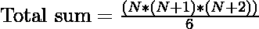
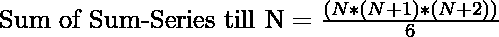

# 前 N 个自然数的和级数之和

> 原文:[https://www . geesforgeks . org/sum-sum-series-of-first-n-natural-numbers/](https://www.geeksforgeeks.org/sum-of-sum-series-of-first-n-natural-numbers/)

给定一个自然数 **n** ，求前 N 个自然数的和级数之和。

> **和级数**:为前 N 个自然数之和，即 5 的和级数为 15 ( 1 + 2 + 3 + 4 + 5)。
> T3】
> 
> | 自然数 | one | Two | three | four | five | six |
> | 自然数之和(和系列) | one | three | six | Ten | Fifteen | Twenty-one |
> | 和级数的和 | one | four | Ten | Twenty | Thirty-five | Fifty-six |

**例:**

> **输入:** N = 5
> **输出:** 35
> **解释:**
> { 1，2，3，4，5}即{1 + 3 + 6 + 10 + 15}的和系列之和为 35。
> **输入:** N = 2
> **输出:** 4
> **说明:**
> { 1，2}即{1 + 3}的和系列之和为 4。

**简单的方法:**
为从 1 到 N 的每一个值找到和级数，然后相加。

*   创建一个变量 Total_sum 来存储所需的求和序列。
*   迭代从 1 到 N 的数字
*   使用公式 **sum = (N*(N + 1)) / 2** 求每个值的和系列
*   将该值添加到总和中

最后，打印存储在合计中的值。

## C++

```
// C++ program to implement
// the above approach
#include<bits/stdc++.h>
using namespace std;

// Function to find the sum
static long sumOfSumSeries(int N)
{
    long sum = 0L;

    // Calculate sum-series
    // for every natural number
    // and add them
    for (int i = 1; i <= N; i++)
    {
        sum = sum + (i * (i + 1)) / 2;
    }

    return sum;
}

// Driver code
int main()
{
    int N = 5;
    cout << sumOfSumSeries(N);
}

// This code is contributed by Code_Mech
```

## Java 语言(一种计算机语言，尤用于创建网站)

```
// Java program to implement
// the above approach

class GFG {

    // Function to find the sum
    static long sumOfSumSeries(int N)
    {

        long sum = 0L;

        // Calculate sum-series
        // for every natural number
        // and add them
        for (int i = 1; i <= N; i++) {
            sum = sum + (i * (i + 1)) / 2;
        }

        return sum;
    }

    // Driver code
    public static void main(String[] args)
    {
        int N = 5;
        System.out.println(sumOfSumSeries(N));
    }
}
```

## 蟒蛇 3

```
# Python3 program to implement
# the above approach

# Function to find the sum
def sumOfSumSeries(N):

    _sum = 0

    # Calculate sum-series
    # for every natural number
    # and add them
    for i in range(N + 1):
        _sum = _sum + (i * (i + 1)) // 2

    return _sum

# Driver code
N = 5

print(sumOfSumSeries(N))

# This code is contributed by divyamohan123
```

## C#

```
// C# program to implement
// the above approach
using System;
class GFG{

// Function to find the sum
static long sumOfSumSeries(int N)
{
    long sum = 0L;

    // Calculate sum-series
    // for every natural number
    // and add them
    for(int i = 1; i <= N; i++)
    {
       sum = sum + (i * (i + 1)) / 2;
    }

    return sum;
}

// Driver code
public static void Main()
{
    int N = 5;

    Console.Write(sumOfSumSeries(N));
}
}

// This code is contributed by Nidhi_Biet
```

## java 描述语言

```
<script>

    // Javascript program to implement
    // the above approach

    // Function to find the sum
    function sumOfSumSeries(N)
    {
        let sum = 0;

        // Calculate sum-series
        // for every natural number
        // and add them
        for (let i = 1; i <= N; i++)
        {
            sum = sum + (i * (i + 1)) / 2;
        }

        return sum;
    }

    let N = 5;
    document.write(sumOfSumSeries(N));

    // This code is contributed by suresh07.
</script>
```

**Output:** 

```
35
```

***时间复杂度** : O(N)*
**有效途径:**
以上系列的 Total_sum 可以直接用下面的公式计算:

> 
> 其中 N 为自然数

**上述公式的证明:**
假设 N = 5

1.  那么 sum 就是表中下面所有元素的和，我们称之为“**结果**”

<figure class="table">

| one |   |   |   |   |
| one | Two |   |   |   |
| one | Two | three |   |   |
| one | Two | three | four |   |
| one | Two | three | four | five |

</figure>

让我们在其他列中用相同的值填充空单元格，我们称之为“ **totalSum**

<figure class="table">

| one | Two | three | four | five |
| one | Two | three | four | five |
| one | Two | three | four | five |
| one | Two | three | four | five |
| one | Two | three | four | five |

</figure>

> 由于 N 个数之和被重复 N 次
> totalSum = N * [(N*(N + 1))/2]
> 填充数据= (1 次* 2) + (2 次* 3) + (3 次* 4) + (4 次* 5)
> = 1 * 2+2 * 3+3 * 4 ……+(N-1)* N
> =[(N-1)*(N)*(N+1)]/3

1.  自，

> 结果= total sum–populatedData
> = N *[(N *(N+1))/2]–[(N-1)*(N)*(N+1)]/3
> =(N *(N+1)*(N+2))/6

2.  因此
    

以下是上述方法的实现:

## C++

```
// C++ program to implement
// the above approach
#include <iostream>
#include <math.h>
using namespace std;

// Function to find the sum
long sumOfSumSeries(int n)
{
    return (n * (n + 1) * (n + 2)) / 6;
}

// Driver code
int main ()
{
    int N = 5;
    cout << sumOfSumSeries(N);
    return 0;
}

// This code is contributed
// by shivanisinghss2110
```

## Java 语言(一种计算机语言，尤用于创建网站)

```
// Java program to implement
// the above approach

class GFG {

    // Function to find the sum
    static long sumOfSumSeries(int n)
    {
        return (n * (n + 1) * (n + 2)) / 6;
    }

    // Driver code
    public static void main(String[] args)
    {
        int N = 5;
        System.out.println(sumOfSumSeries(N));
    }
}
```

## 蟒蛇 3

```
# Python3 program to implement
# the above approach

# Function to find the sum
def sumOfSumSeries(n):

    return (n * (n + 1) * (n + 2)) // 6

# Driver code
N = 5

print(sumOfSumSeries(N))

# This code is contributed by divyamohan123
```

## C#

```
// C# program to implement the
// above approach
using System;
class GFG{

// Function to find the sum
static long sumOfSumSeries(int n)
{
    return (n * (n + 1) * (n + 2)) / 6;
}

// Driver code
public static void Main(String[] args)
{
    int N = 5;

    Console.Write(sumOfSumSeries(N));
}
}

// This code is contributed by Ritik Bansal
```

## java 描述语言

```
<script>
    // Javascript program to implement
    // the above approach

    // Function to find the sum
    function sumOfSumSeries(n)
    {
        return (n * (n + 1) * (n + 2)) / 6;
    }

    let N = 5;
    document.write(sumOfSumSeries(N));

</script>
```

**Output:** 

```
35
```

***时间复杂度** O(1)* 考虑乘法，加法&除法取常数时间。