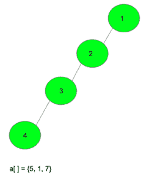
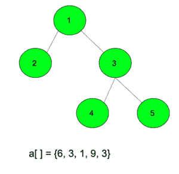

# 从每个节点到所有其他节点的距离总和最大

> 原文:[https://www . geeksforgeeks . org/每个节点到所有其他节点的距离总和是最大值/](https://www.geeksforgeeks.org/sum-of-the-distances-from-every-node-to-all-other-nodes-is-maximum/)

给定一棵树，它有 **N** 个节点和 **N-1** 条边，根在 1，给定一个 **N-1** 个整数的数组。任务是给树中的边分配权重，使得从每个节点到所有其他节点的距离之和最大**。**

****示例:****

> ****输入:****
> 
> ****
> 
>  ****输出:** 46
> 给边 1-2 赋权 5
> 给边 2-3 赋权 7
> 给边 3-4 赋权 1
> 节点 1 到节点 2、3、4 的距离为{5，5+7，5+7+1}
> 节点 2 到节点 3、4 的距离为{7，7+1}
> 节点 3 到节点 4 的距离为{1}
> 
> **输入:**
> 
> 
> 
> **输出:** 94**

****逼近**:使用[组合](https://www.geeksforgeeks.org/permutation-and-combination-gq/)、 **DFS** 、[树上 DP](https://www.geeksforgeeks.org/dynamic-programming-trees-set-1/)和[贪婪](https://www.geeksforgeeks.org/greedy-algorithms/)逻辑可以解决问题。由于我们需要给树中的边分配权重，因此给所有路径中出现最大次数的边分配最大权重将是获得最大和的方法。为了找到一条边在所有可能的路径中出现的次数，我们需要知道边两边的节点数。设 **c1** 、 **c2** 为左右两边节点数的计数，则所有路径中边出现的次数为 **c1 * c2** 。按升序对 c1 * c2 的所有可能值进行排序。将最大权重分配给最大 c1 * c2 值，并以同样的方式分配给其他值。我们可以按照以下步骤获取边左侧和右侧的节点数:**

*   **从根开始运行 **dfs** ，并初始化一个 **dp[]** 数组，该数组存储给定节点的子树中的节点数。**
*   **对每一条可能的边进行迭代，找出边两边的节点数。**
*   **要找出两边的节点数，找出**DP【node1】**或**DP【node2】**的较小值，其中 node 1 和 node 2 是边两边的节点**
*   **如果一侧有 **min(dp[node1]，dp[node2])** ，那么另一侧就会有**(N–min(DP[node 1]，DP[node 2])**。**

**下面是上述方法的实现:**

## **C++**

```
// C++ program to implement the
// above approach
#include <bits/stdc++.h>
using namespace std;

// Function to add an edge to the tree
void addEdge(vector<pair<int, int> >& edges,
             list<int>* tree, int x, int y)
{
    edges.push_back({ x, y });
    tree[x].push_back(y);
    tree[y].push_back(x);
}

// Function to run DFS and calculate the
// height of the subtree below it
void dfs(vector<pair<int, int> >& edges, list<int>* tree,
         int node, int parent, int dp[])
{
    // Initially initialize with 1
    dp[node] = 1;

    // Traverse for all nodes connected to node
    for (auto it : tree[node]) {
        // If node is not parent
        // then recall dfs
        if (it != parent) {
            dfs(edges, tree, it, node, dp);

            // Add the size of the
            // subtree beneath it
            dp[node] += dp[it];
        }
    }
}

// Function to assign weights to edges
// to maximize the final sum
int maximizeSum(int a[], vector<pair<int, int> >& edges,
                list<int>* tree, int n)
{

    // Initialize it which stores the
    // height of the subtree beneath it
    int dp[n + 1] = { 0 };

    // Call the DFS function to
    dfs(edges, tree, 1, 0, dp);

    // Sort the given array
    sort(a, a + (n - 1));

    // Stores the number of times an
    // edge is part of a path
    vector<int> ans;

    // Iterate for all edges and find the
    // number of nodes on the left and on the right
    for (auto it : edges) {

        // Node 1
        int x = it.first;

        // Node 2
        int y = it.second;

        // If the number of nodes below is less
        // then the other will be n - dp[node]
        if (dp[x] < dp[y]) {
            int fi = dp[x];
            int sec = n - dp[x];
            ans.push_back(fi * sec);
        }

        // Second condition
        else {
            int fi = dp[y];
            int sec = n - dp[y];
            ans.push_back(fi * sec);
        }
    }

    // Sort the number of times
    // an edges occurs in the path
    sort(ans.begin(), ans.end());
    int res = 0;

    // Find the summation of all those
    // paths and return
    for (int i = 0; i < n - 1; i++) {
        res += ans[i] * a[i];
    }

    return res;
}

// Driver code
int main()
{
    int n = 5;
    vector<pair<int, int> > edges;

    list<int>* tree = new list<int>[n + 1];

    // Add an edge 1-2 in the tree
    addEdge(edges, tree, 1, 2);

    // Add an edge 2-3 in the tree
    addEdge(edges, tree, 1, 3);

    // Add an edge 3-4 in the tree
    addEdge(edges, tree, 3, 4);

    // Add an edge 3-5 in the tree
    addEdge(edges, tree, 3, 5);

    // Array which gives the edges weight
    // to be assigned
    int a[] = { 6, 3, 1, 9, 3 };

    cout << maximizeSum(a, edges, tree, n);
}
```

## **蟒蛇 3**

```
# Python3 program to implement the
# above approach

edges = [[] for i in range(100)]
tree = [[] for i in range(100)]

# Function to add an edge to the tree
def addEdge(x, y):
    edges.append([x, y])
    tree[x].append(y)
    tree[y].append(x)

# Function to run DFS and calculate the
# height of the subtree below it
def dfs(node, parent, dp):

    # Initially initialize with 1
    dp[node] = 1

    # Traverse for all nodes connected to node
    for it in tree[node]:

        # If node is not parent
        # then recall dfs
        if (it != parent):
            dfs(it, node, dp)

            # Add the size of the
            # subtree beneath it
            dp[node] += dp[it]

# Function to assign weights to edges
# to maximize the final sum
def maximizeSum(a, n):

    # Initialize it which stores the
    # height of the subtree beneath it
    dp = [0 for i in range(n + 1)]

    # Call the DFS function to
    dfs(1, 0, dp)

    # Sort the given array
    a = sorted(a[:-1])

    # Stores the number of times an
    # edge is part of a path
    ans = []

    # Iterate for all edges and find the
    # number of nodes on the left and on the right
    for it in edges:

        if len(it) > 0:

            # Node 1
            x = it[0]

            # Node 2
            y = it[1]

            # If the number of nodes below is less
            # then the other will be n - dp[node]
            if (dp[x] < dp[y]):

                fi = dp[x]
                sec = n - dp[x]
                ans.append(fi * sec)

            # Second condition
            else:
                fi = dp[y]
                sec = n - dp[y]
                ans.append(fi * sec)

    # Sort the number of times
    # an edges occurs in the path
    ans = sorted(ans)
    res = 0

    # Find the summation of all those
    # paths and return
    for i in range(n - 1):
        res += ans[i] * a[i]

    return res

# Driver code
n = 5

# Add an edge 1-2 in the tree
addEdge(1, 2)

# Add an edge 2-3 in the tree
addEdge(1, 3)

# Add an edge 3-4 in the tree
addEdge(3, 4)

# Add an edge 3-5 in the tree
addEdge(3, 5)

# Array which gives the edges weight
# to be assigned
a = [6, 3, 1, 9, 3]
print(maximizeSum(a, n))

# This code is contributed by Mohit Kumar
```

****Output:** 

```
94
```**