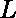

# 当 arr[i] = i * (-1)^i

)时，数组中从索引 l 到 r 的元素之和

> 原文:[https://www . geeksforgeeks . org/elements sum-from-index-l-to-r-in-arri-I-1i/](https://www.geeksforgeeks.org/sum-of-the-elements-from-index-l-to-r-in-an-array-when-arri-i-1i/)

给定两个整数和以及一个数组 **arr[]** ，其在索引处的每个元素计算为**arr[I]= I *(1)<sup>I</sup>**。任务是在索引范围![[L, R]  ](img/fe4bc69768eccf6a72284d04963c252f.png "Rendered by QuickLaTeX.com")内找到数组这些元素的和。

**示例:**

> **输入** : L = 1，R = 5
> **输出:** -3
> 总和= (-1) + 2 + (-3) + 4 + (-5) = -3
> 
> **输入** : L = 5，R = 100000000
> T3】输出:499999998

**天真法:**根据数组元素的定义，数组的每个奇元素为负，偶元素为正。所以，为了找到和，运行一个从(L 到 R)的循环，保持所有奇数(负)和偶数(正)的和。最后，返回总和。

**有效途径:**可以注意到本系列所有奇数元素的[和将始终等于 **(totalOdd) <sup>2</sup>** ，其中 **totalOdd =奇数元素的总数**，](https://www.geeksforgeeks.org/sum-first-n-odd-numbers-o1-complexity/)[偶数元素的和](https://www.geeksforgeeks.org/sum-first-n-even-numbers/)将为**total even *(total even+1)**。现在，我们要做的就是找到 L 和 r 上所有奇数元素的和，存储两者的差，得到 L 和 r 之间所有奇数元素的和，对偶数做同样的操作，最后返回偶数和奇数的差。

下面是上述方法的实现:

## C++

```
// C++ implementation of above approach
#include <bits/stdc++.h>
using namespace std;

// function to return the odd sum
long int Odd_Sum(int n)
{

    // total odd elements upto n
    long int total = (n + 1) / 2;

    // sum of odd elements upto n
    long int odd = total * total;

    return odd;
}

// function to return the even sum
long int Even_Sum(int n)
{

    // total even elements upto n
    long int total = (n) / 2;

    // sum of even elements upto n
    long int even = total * (total + 1);

    return even;
}

// Function to find sum from L to R.
int sumLtoR(int L, int R)
{

    long int odd_sum, even_sum;

    odd_sum = Odd_Sum(R) - Odd_Sum(L - 1);

    even_sum = Even_Sum(R) - Even_Sum(L - 1);

    // return final sum from L to R
    return even_sum - odd_sum;
}

// Driver Program
int main()
{

    int L = 1, R = 5;

    // function call to print answer
    cout << sumLtoR(L, R);

    return 0;
}
```

## Java 语言(一种计算机语言，尤用于创建网站)

```
// Java implementation of above approach

import java.io.*;

class GFG {

// function to return the odd sum
static long  Odd_Sum(int n)
{

    // total odd elements upto n
    long  total = (n + 1) / 2;

    // sum of odd elements upto n
    long  odd = total * total;

    return odd;
}

// function to return the even sum
static long  Even_Sum(int n)
{

    // total even elements upto n
    long  total = (n) / 2;

    // sum of even elements upto n
    long  even = total * (total + 1);

    return even;
}

// Function to find sum from L to R.
static long sumLtoR(int L, int R)
{

    long  odd_sum, even_sum;

    odd_sum = Odd_Sum(R) - Odd_Sum(L - 1);

    even_sum = Even_Sum(R) - Even_Sum(L - 1);

    // return final sum from L to R
    return even_sum - odd_sum;
}

// Driver Program

    public static void main (String[] args) {
        int L = 1, R = 5;

    // function call to print answer
    System.out.println( sumLtoR(L, R));
    }
}
// This code is contributed by shs..
```

## 蟒蛇 3

```
# Python3 implementation of above approach

# function to return the odd sum
def Odd_Sum(n):

    # total odd elements upto n
    total =(n+1)//2

    # sum of odd elements upto n
    odd = total*total
    return odd

# function to return the even sum
def Even_Sum(n):

    # total even elements upto n
    total = n//2

    # sum of even elements upto n
    even = total*(total+1)
    return even

def sumLtoR(L,R):
    odd_sum = Odd_Sum(R)-Odd_Sum(L-1)
    even_sum = Even_Sum(R)- Even_Sum(L-1)

    # return final sum from L to R
    return even_sum-odd_sum

# Driver code
L =1; R = 5
print(sumLtoR(L,R))

# This code is contributed by Shrikant13
```

## C#

```
// C# implementation of above approach
class GFG
{

// function to return the odd sum
static long Odd_Sum(int n)
{

    // total odd elements upto n
    long total = (n + 1) / 2;

    // sum of odd elements upto n
    long odd = total * total;

    return odd;
}

// function to return the even sum
static long Even_Sum(int n)
{

    // total even elements upto n
    long total = (n) / 2;

    // sum of even elements upto n
    long even = total * (total + 1);

    return even;
}

// Function to find sum from L to R.
static long sumLtoR(int L, int R)
{
    long odd_sum, even_sum;

    odd_sum = Odd_Sum(R) - Odd_Sum(L - 1);

    even_sum = Even_Sum(R) - Even_Sum(L - 1);

    // return final sum from L to R
    return even_sum - odd_sum;
}

// Driver Code
public static void Main ()
{
    int L = 1, R = 5;

    // function call to print answer
    System.Console.WriteLine(sumLtoR(L, R));
}
}

// This code is contributed by mits
```

## 服务器端编程语言（Professional Hypertext Preprocessor 的缩写）

```
<?php
// PHP implementation of above approach

// function to return the odd sum
function Odd_Sum($n)
{

    // for total odd elements upto n
    // divide by 2
    $total = ($n + 1) >> 1;

    // sum of odd elements upto n
    $odd = $total * $total;

    return $odd;
}

// function to return the even sum
function Even_Sum($n)
{

    // for total even elements upto n
    // divide by 2
    $total = $n >> 1;

    // sum of even elements upto n
    $even = $total * ($total + 1);

    return $even;
}

// Function to find sum from L to R.
function sumLtoR($L, $R)
{
    $odd_sum = Odd_Sum($R) -
               Odd_Sum($L - 1);

    $even_sum = Even_Sum($R) -
                Even_Sum($L - 1);

    // print final sum from L to R
    return $even_sum - $odd_sum ;
}

// Driver Code
$L = 1 ;
$R = 5;

// function call to print answer
echo sumLtoR($L, $R);

// This code is contributed by ANKITRAI1
?>
```

## java 描述语言

```
<script>

// Javascript implementation of above approach

// Function to return the odd sum
function Odd_Sum(n)
{

    // Total odd elements upto n
    var total = parseInt((n + 1) / 2);

    // Sum of odd elements upto n
    var odd = total * total;

    return odd;
}

// Function to return the even sum
function Even_Sum(n)
{

    // Total even elements upto n
    var total = parseInt((n) / 2);

    // Sum of even elements upto n
    var even = total * (total + 1);

    return even;
}

// Function to find sum from L to R.
function sumLtoR(L, R)
{
    var odd_sum, even_sum;

    odd_sum = Odd_Sum(R) - Odd_Sum(L - 1);
    even_sum = Even_Sum(R) - Even_Sum(L - 1);

    // Return final sum from L to R
    return even_sum - odd_sum;
}

// Driver code
var L = 1, R = 5;

// Function call to print answer
document.write(sumLtoR(L, R));

// This code is contributed by SoumikMondal

</script>
```

**Output:** 

```
-3
```