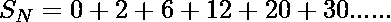
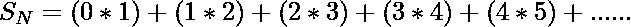
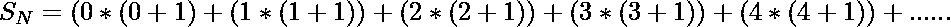
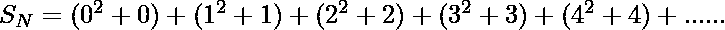
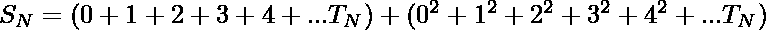

# 前 N 个复数的和

> 原文:[https://www . geesforgeks . org/first-n-pronic-numbers 之和/](https://www.geeksforgeeks.org/sum-of-the-first-n-pronic-numbers/)

给定一个数字 **N** ，任务是找出前 N 个[发音数字](https://www.geeksforgeeks.org/check-given-number-pronic/)的和。

> 可以排列成矩形的数字称为矩形数字(也称为 Pronic 数字)。前几个矩形数字是:
> 0、2、6、12、20、30、42、56、72、90、110、132、156、182、210、240、272、306、342、380、420、462。。。。

**示例:**

> **输入:** N = 4
> **输出:** 20
> **解释:**
> 0、2、6、12 是前 4 个旋数。
> 
> **输入:**N = 3
> T3】输出: 8

**进场:**

**T<sub>N</sub>**







因此:

> s<sub>N</sub>= N 个复数的和
> ![S_N = [N*\frac{(N - 1)}{2}] + [N*\frac{(N - 1)*(2*N - 1)}{6}]](img/cc4efc0ff54bf50b4ab2e43484574e5c.png "Rendered by QuickLaTeX.com")

下面是上述方法的实现:

## C++

```
// C++ implementation to find 
// sum of first N terms
#include <bits/stdc++.h>
using namespace std;

// Function to calculate the sum
int calculateSum(int N)
{

    return N * (N - 1) / 2
           + N * (N - 1)
                 * (2 * N - 1) / 6;
}

// Driver code
int main()
{
    int N = 3;

    cout << calculateSum(N);

    return 0;
}
```

## Java 语言(一种计算机语言，尤用于创建网站)

```
// Java implementation implementation to find 
// sum of first N terms 
class GFG{ 

// Function to calculate the sum 
static int calculateSum(int N) 
{ 

    return N * (N - 1) / 2 + N * (N - 1) *
           (2 * N - 1) / 6; 
} 

// Driver code 
public static void main (String[] args) 
{ 
    int N = 3; 

    System.out.println(calculateSum(N)); 
} 
} 

// This code is contributed by Pratima Pandey 
```

## 蟒蛇 3

```
# Python3 implementation to find 
# sum of first N terms

# Function to calculate the sum
def calculateSum(N):

    return (N * (N - 1) // 2 + 
            N * (N - 1) * (2 * 
                 N - 1) // 6);

# Driver code
N = 3;
print(calculateSum(N));

# This code is contributed by Code_Mech
```

## C#

```
// C# implementation implementation to find 
// sum of first N terms 
using System;
class GFG{ 

// Function to calculate the sum 
static int calculateSum(int N) 
{ 

    return N * (N - 1) / 2 + N * (N - 1) *
                        (2 * N - 1) / 6; 
} 

// Driver code 
public static void Main() 
{ 
    int N = 3; 

    Console.Write(calculateSum(N)); 
} 
} 

// This code is contributed by Code_Mech
```

**Output:**

```
8

```

**时间复杂度:** O(1)。