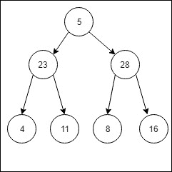

# 完整二叉树的镜像节点有序求和

> 原文:[https://www . geesforgeks . org/完整二进制有序树镜像节点总数/](https://www.geeksforgeeks.org/sum-of-the-mirror-image-nodes-of-a-complete-binary-tree-in-an-inorder-way/)

给定一个完整的二叉树，任务是以有序的方式找到镜像节点的和，即找到左子树的有序遍历，对于遍历的每个节点，将其镜像节点的值加到当前节点的值上。

**示例:**

> **输入:**
> 
> 
> 
> **输出:**
> 20
> 51
> 19
> 10
> 给定树的左子树的有序遍历是 4 23 11 5。
> 添加镜像节点，
> 4+16 = 20
> 23+28 = 51
> 11+8 = 19
> 5+5 = 10

**方法:**我们将使用 2 个指针来维护彼此镜像的 2 个节点。让我们假设 root1 和 root2 是两个镜像节点。现在，root1 的左子级和 root2 的右子级将成为彼此的镜像。我们将为下一个递归调用传递这两个节点(左根 1- >和右根 2- >)。因为我们必须以有序的方式遍历，所以一旦遍历了左边的子树，我们就打印当前的根数据，然后遍历右边的子树。同样，对于右子树，因此根 1 的右子树和根 2 的左子树将是彼此的镜像。我们将为下一次递归调用传递这两个节点(右根 1- >和左根 2- >)。

下面是上述方法的实现

## C++

```
// C++ implementation of the approach
#include <iostream>
using namespace std;
typedef struct node {

    // struct to store data and links to
    // its left and right child
    int data;
    struct node* l;
    struct node* r;
    node(int d)
    {

        // Initialize data for the current node
        // with the passed value as d
        data = d;

        // Initialize left child to NULL
        l = NULL;

        // Initialize right child to NULL
        r = NULL;
    }
} Node;

// Function to print the required inorder traversal
void printInorder(Node* rootL, Node* rootR)
{
    // We are using 2 pointers for the nodes
    // which are mirror image of each other
    // If both child are NULL return
    if (rootL->l == NULL && rootR->r == NULL)
        return;

    // Since inorder traversal is required
    // First left, then root and then right
    printInorder(rootL->l, rootR->r);
    cout << rootL->l->data + rootR->r->data << endl;
    printInorder(rootL->r, rootR->l);
}

// Driver code
int main()
{
    Node* root = new Node(5);
    root->l = new Node(23);
    root->r = new Node(28);
    root->l->l = new Node(4);
    root->l->r = new Node(11);
    root->r->l = new Node(8);
    root->r->r = new Node(16);

    printInorder(root, root);

    // Since root is mirror image of itself
    if (root)
        cout << root->data * 2 << endl;

    return 0;
}
```

## Java 语言(一种计算机语言，尤用于创建网站)

```
// Java implementation of the approach
import java.util.*;

class GFG
{
    static class Node
    {

        // struct to store data and links to
        // its left and right child
        int data;
        Node l;
        Node r;
        Node(int d)
        {

            // Initialize data for the current Node
            // with the passed value as d
            data = d;

            // Initialize left child to null
            l = null;

            // Initialize right child to null
            r = null;
        }
    }

    // Function to print the required inorder traversal
    static void printInorder(Node rootL, Node rootR)
    {
        // We are using 2 pointers for the Nodes
        // which are mirror image of each other
        // If both child are null return
        if (rootL.l == null && rootR.r == null)
            return;

        // Since inorder traversal is required
        // First left, then root and then right
        printInorder(rootL.l, rootR.r);
        System.out.println(rootL.l.data + rootR.r.data );
        printInorder(rootL.r, rootR.l);
    }

    // Driver code
    public static void main(String args[])
    {
        Node root = new Node(5);
        root.l = new Node(23);
        root.r = new Node(28);
        root.l.l = new Node(4);
        root.l.r = new Node(11);
        root.r.l = new Node(8);
        root.r.r = new Node(16);

        printInorder(root, root);

        // Since root is mirror image of itself
        if (root != null)
            System.out.println(root.data * 2 );

    }
}

// This code is contributed by Arnab Kundu
```

## 蟒蛇 3

```
# Python3 implementation of the approach

class Node:

    def __init__(self, d):
        self.data = d
        self.l = None
        self.r = None

# Function to print the required inorder traversal
def printInorder(rootL, rootR):

    # We are using 2 pointers for the nodes
    # which are mirror image of each other
    # If both child are None return
    if rootL.l == None and rootR.r == None:
        return

    # Since inorder traversal is required
    # First left, then root and then right
    printInorder(rootL.l, rootR.r)
    print(rootL.l.data + rootR.r.data)
    printInorder(rootL.r, rootR.l)

# Driver code
if __name__ == "__main__":

    root = Node(5)
    root.l = Node(23)
    root.r = Node(28)
    root.l.l = Node(4)
    root.l.r = Node(11)
    root.r.l = Node(8)
    root.r.r = Node(16)

    printInorder(root, root)

    # Since root is mirror image of itself
    if root:
        print(root.data * 2)

# This code is contributed by Rituraj Jain
```

## C#

```
// C# implementation of the approach
using System;

class GFG
{
    public class Node
    {

        // struct to store data and links to
        // its left and right child
        public int data;
        public Node l;
        public Node r;
        public Node(int d)
        {

            // Initialize data for the current Node
            // with the passed value as d
            data = d;

            // Initialize left child to null
            l = null;

            // Initialize right child to null
            r = null;
        }
    }

    // Function to print the required inorder traversal
    static void printInorder(Node rootL, Node rootR)
    {
        // We are using 2 pointers for the Nodes
        // which are mirror image of each other
        // If both child are null return
        if (rootL.l == null && rootR.r == null)
            return;

        // Since inorder traversal is required
        // First left, then root and then right
        printInorder(rootL.l, rootR.r);
        Console.WriteLine(rootL.l.data + rootR.r.data );
        printInorder(rootL.r, rootR.l);
    }

    // Driver code
    public static void Main(String []args)
    {
        Node root = new Node(5);
        root.l = new Node(23);
        root.r = new Node(28);
        root.l.l = new Node(4);
        root.l.r = new Node(11);
        root.r.l = new Node(8);
        root.r.r = new Node(16);

        printInorder(root, root);

        // Since root is mirror image of itself
        if (root != null)
            Console.WriteLine(root.data * 2 );

    }
}

// This code is contributed by Arnab Kundu
```

## java 描述语言

```
<script>

// Javascript implementation of the approach
class Node
{
    constructor(d)
    {
        this.l = null;
        this.r = null;
        this.data = d;
    }
}

// Function to print the required inorder traversal
function printInorder(rootL, rootR)
{

    // We are using 2 pointers for the Nodes
    // which are mirror image of each other
    // If both child are null return
    if (rootL.l == null && rootR.r == null)
        return;

    // Since inorder traversal is required
    // First left, then root and then right
    printInorder(rootL.l, rootR.r);
    document.write(rootL.l.data +
                   rootR.r.data + "</br>");
    printInorder(rootL.r, rootR.l);
}

// Driver code
let root = new Node(5);
root.l = new Node(23);
root.r = new Node(28);
root.l.l = new Node(4);
root.l.r = new Node(11);
root.r.l = new Node(8);
root.r.r = new Node(16);

printInorder(root, root);

// Since root is mirror image of itself
if (root != null)
    document.write(root.data * 2 );

// This code is contributed by suresh07

</script>
```

**Output:** 

```
20
51
19
10
```

**时间复杂度:**O(N)
T3】辅助空间: O(N)