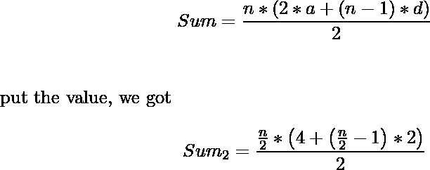
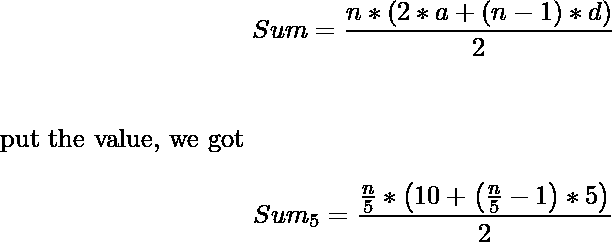

# 最多可被 2 或 5 整除的数的和

> 原文:[https://www . geeksforgeeks . org/numbers sum-up-n-可被 2 或 5 整除/](https://www.geeksforgeeks.org/sum-of-the-numbers-upto-n-that-are-divisible-by-2-or-5/)

给定一个数 n，任务是找出最多可被 2 或 5 整除的数 n 之和。
**例:**

```
Input: n = 2
Output: 2

Input: n = 5
Output: 11
```

一种天真的方法是迭代数字直到 n，并检查它是否能被 2 或 5 整除。如果它是可分的，那么就把这个数加到我们需要的和上。最后我们得到了复杂度为 O(n)的总和。
**高效进场:**

1.首先找出能被 2 整除的数字。所以，这些数字对于一个接入点来说，具有

> 第一项= 2，差= 2，项数= n/2
> 所以，和由-



2.其次，我们找到能被 5 整除的数。所以，这些数字对于一个接入点来说，具有

> 第一项= 5，差= 5，项数= n/5
> 所以，和由-



3.首先，我们找到能被 2 和 5 整除的数。所以，这些数对于一个 AP 来说，有

> 第一项=10，差= 10，项数= n / 10
> 所以，和由-


4.因为我们必须找到可被 2 或 5 整除的数的和。因此，所需的总和由-
给出

> sum = sum _ 2+sum _ 5–sum _ 10

**以下是上述方法的实施:**

## C++

```
// C++ implementation of above approach
#include <bits/stdc++.h>
#define ll long long int
using namespace std;

// Function to find the sum
ll findSum(int n)
{

    ll sum2, sum5, sum10;

    // sum2 is sum of numbers divisible by 2
    sum2 = ((n / 2) * (4 + (n / 2 - 1) * 2)) / 2;

    // sum5 is sum of number divisible by 5
    sum5 = ((n / 5) * (10 + (n / 5 - 1) * 5)) / 2;

    // sum10 of numbers divisible by 2 and 5
    sum10 = ((n / 10) * (20 + (n / 10 - 1) * 10)) / 2;

    return sum2 + sum5 - sum10;
}

// Driver code
int main()
{
    int n = 5;

    cout << findSum(n) << endl;
    return 0;
}
```

## Java 语言(一种计算机语言，尤用于创建网站)

```
// Java implementation of
// above approach
import java.lang.*;
import java.util.*;

class GFG
{

// Function to find the sum
static long findSum(int n)
{
    long sum2, sum5, sum10;

    // sum2 is sum of numbers
    // divisible by 2
    sum2 = ((n / 2) * (4 +
            (n / 2 - 1) * 2)) / 2;

    // sum5 is sum of number
    // divisible by 5
    sum5 = ((n / 5) * (10 +
            (n / 5 - 1) * 5)) / 2;

    // sum10 of numbers divisible
    // by 2 and 5
    sum10 = ((n / 10) * (20 +
             (n / 10 - 1) * 10)) / 2;

    return sum2 + sum5 - sum10;
}

// Driver code
public static void main (String[] args)
{
    int n = 5;
    System.out.println(findSum(n));
}
}

// This code is contributed by Raj
```

## 蟒蛇 3

```
# Python3 implementation of
# above approach

# Function to find the sum
def findSum(n):

    # sum2 is sum of numbers divisible by 2
    sum2 = ((n // 2) * (4 + (n // 2 - 1) * 2)) // 2

    # sum5 is sum of number divisible by 5
    sum5 = ((n // 5) * (10 + (n // 5 - 1) * 5)) // 2

    # sum10 of numbers divisible by 2 and 5
    sum10 = ((n // 10) * (20 + (n // 10 - 1) * 10)) // 2

    return sum2 + sum5 - sum10;

# Driver code
if __name__=='__main__':
    n = 5
    print (int(findSum(n)))

# this code is contributed by Shivi_Aggarwal
```

## C#

```
// C# implementation of
// above approach
using System;

class GFG
{

// Function to find the sum
static long findSum(int n)
{
    long sum2, sum5, sum10;

    // sum2 is sum of numbers
    // divisible by 2
    sum2 = ((n / 2) * (4 +
            (n / 2 - 1) * 2)) / 2;

    // sum5 is sum of number
    // divisible by 5
    sum5 = ((n / 5) * (10 +
            (n / 5 - 1) * 5)) / 2;

    // sum10 of numbers divisible
    // by 2 and 5
    sum10 = ((n / 10) * (20 +
             (n / 10 - 1) * 10)) / 2;

    return sum2 + sum5 - sum10;
}

// Driver code
public static void Main ()
{
    int n = 5;
    Console.WriteLine(findSum(n));
}
}

// This code is contributed by inder_verma
```

## 服务器端编程语言（Professional Hypertext Preprocessor 的缩写）

```
<?php
// PHP implementation of above approach

// Function to find the sum
function findSum($n)
{

    // sum2 is sum of numbers
    // divisible by 2
    $sum2 = ((int)($n / 2) * (4 +
            ((int)($n / 2) - 1) * 2)) / 2;

    // sum5 is sum of number
    // divisible by 5
    $sum5 = ((int)($n / 5) * (10 +
                  ($n / 5 - 1) * 5)) / 2;

    // sum10 of numbers divisible
    // by 2 and 5
    $sum10 = ((int)($n / 10) * (20 +
                   ($n / 10 - 1) * 10)) / 2;

    return $sum2 + $sum5 - $sum10;
}

// Driver Code
$n = 5;
echo findSum($n);

// This code is contributed by Raj
?>
```

## java 描述语言

```
<script>

// Javascript implementation of above approach

// Function to find the sum
function findSum(n)
{

    var sum2, sum5, sum10;

    // sum2 is sum of numbers divisible by 2
    sum2 = parseInt((parseInt(n / 2) *
    (4 + (parseInt(n / 2) - 1) * 2)) / 2);

    // sum5 is sum of number divisible by 5
    sum5 = parseInt((parseInt(n / 5) *
    (10 + (parseInt(n / 5) - 1) * 5)) / 2);

    // sum10 of numbers divisible by 2 and 5
    sum10 = parseInt((parseInt(n / 10) *
    (20 + (parseInt(n / 10) - 1) * 10)) / 2);

    return sum2 + sum5 - sum10;
}

// Driver code
var n = 5;
document.write( findSum(n));

</script>
```

**Output:** 

```
11
```