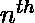

# 级数 1+(1+2)+(1+2+3)+(1+2+3+4)+……+(1+2+3+4+……+n)的和

> 原文:[https://www . geesforgeks . org/系列之和-1-12-123-1234-1234-n/](https://www.geeksforgeeks.org/sum-of-the-series-1-12-123-1234-1234-n/)

给定 *n* 的值，我们需要求出级数的和，其中第 I 项是第 I 个自然数的和。
示例:

```
Input  : n = 5   
Output : 35
Explanation :
(1) + (1+2) + (1+2+3) + (1+2+3+4) + (1+2+3+4+5) = 35

Input  : n = 10
Output : 220
Explanation :
(1) + (1+2) + (1+2+3) +  .... +(1+2+3+4+.....+10) = 220
```

**天真方法:**
下面是上面系列的实现:

## C++

```
// CPP program to find sum of given series
#include <bits/stdc++.h>
using namespace std;

// Function to find sum of given series
int sumOfSeries(int n)
{
    int sum = 0;
    for (int i = 1 ; i <= n ; i++)
        for (int j = 1 ; j <= i ; j++)
            sum += j;
    return sum;
}

// Driver Function
int main()
{
    int n = 10;
    cout << sumOfSeries(n);
    return 0;
}
```

## Java 语言(一种计算机语言，尤用于创建网站)

```
// JAVA Code For Sum of the series
import java.util.*;

class GFG {

    // Function to find sum of given series
    static int sumOfSeries(int n)
    {
        int sum = 0;
        for (int i = 1 ; i <= n ; i++)
            for (int j = 1 ; j <= i ; j++)
                sum += j;
        return sum;
    }

    /* Driver program to test above function */
    public static void main(String[] args)
    {
         int n = 10;
         System.out.println(sumOfSeries(n));

    }
}

// This code is contributed by Arnav Kr. Mandal.
```

## 计算机编程语言

```
# Python3 program to find sum of given series

# Function to find sum of series
def sumOfSeries(n):
    return sum([i*(i+1)/2 for i in range(1, n + 1)])

# Driver Code
if __name__ == "__main__":
    n = 10
    print(sumOfSeries(n))
```

## C#

```
// C# Code For Sum of the series
using System;

class GFG {

    // Function to find sum of given series
    static int sumOfSeries(int n)
    {
        int sum = 0;
        for (int i = 1; i <= n; i++)
            for (int j = 1; j <= i; j++)
                sum += j;
        return sum;
    }

    /* Driver program to test above function */
    public static void Main()
    {
        int n = 10;

        Console.Write(sumOfSeries(n));
    }
}

// This code is contributed by vt_m.
```

## 服务器端编程语言（Professional Hypertext Preprocessor 的缩写）

```
<?php
// PHP program to find
// sum of given series

// Function to find
// sum of given series
function sumOfSeries($n)
{
    $sum = 0;
    for ($i = 1 ; $i <= $n ; $i++)
        for ($j = 1 ; $j <= $i ; $j++)
            $sum += $j;
    return $sum;
}

// Driver Code
$n = 10;
echo(sumOfSeries($n));

// This code is contributed by Ajit.
?>
```

## java 描述语言

```
<script>

// JavaScript Program for Sum of the series

 // Function to find sum of given series
    function sumOfSeries(n)
    {
        let sum = 0;
        for (let i = 1 ; i <= n ; i++)
            for (let j = 1 ; j <= i ; j++)
                sum += j;
        return sum;
    }

// Driver code   

        let n = 10;
        document.write(sumOfSeries(n));

</script>
```

**输出:**

```
220
```

**有效方法:**
让系列的术语 1+(1+2)+(1+2+3)+(1+2+3+4)……(1+2+3+..n)表示为 **a <sub> n </sub>** 

```
a<sub>n</sub> = Σn1  =  = 
Sum of n-terms of series 
Σn1 an = Σn1 
=  Σ    + Σ    
=  *  +  * 
= 
```

以下是上述方法的实施:

## C++

```
// CPP program to find sum of given series
#include <bits/stdc++.h>
using namespace std;

// Function to find sum of given series
int sumOfSeries(int n)
{
    return (n * (n + 1) * (2 * n + 4)) / 12;
}

// Driver Function
int main()
{
    int n = 10;
    cout << sumOfSeries(n);
}
```

## Java 语言(一种计算机语言，尤用于创建网站)

```
// JAVA Code For Sum of the series
import java.util.*;

class GFG {

    // Function to find sum of given series
    static int sumOfSeries(int n)
    {
        return (n * (n + 1) *
                (2 * n + 4)) / 12;
    }

    /* Driver program to test above function */
    public static void main(String[] args)
    {
         int n = 10;
         System.out.println(sumOfSeries(n));

    }
}

// This code is contributed by Arnav Kr. Mandal.
```

## 计算机编程语言

```
# Python program to find sum of given series

# Function to find sum of given series
def sumOfSeries(n):
    return (n * (n + 1) * (2 * n + 4)) / 12;

# Driver function
if __name__ == '__main__':
    n = 10
    print(sumOfSeries(n))
```

## C#

```
// C# Code For Sum of the series
using System;

class GFG {

    // Function to find sum of given series
    static int sumOfSeries(int n)
    {
        return (n * (n + 1) * (2 * n + 4)) / 12;
    }

    /* Driver program to test above function */
    public static void Main()
    {
        int n = 10;

        Console.Write(sumOfSeries(n));
    }
}

// This code is contributed by vt_m.
```

## 服务器端编程语言（Professional Hypertext Preprocessor 的缩写）

```
<?php
// PHP program to find
// sum of given series

// Function to find
// sum of given series
function sumOfSeries($n)
{
    return ($n * ($n + 1) *
           (2 * $n + 4)) / 12;
}

// Driver Code
$n = 10;
echo(sumOfSeries($n));

// This code is contributed by Ajit.
?>
```

## java 描述语言

```
<script>

// JavaScript program For Sum of the series

// Function to find sum of given series
    function sumOfSeries(n)
    {
        return (n * (n + 1) *
                (2 * n + 4)) / 12;
    }

// Driver code

        let n = 10;
        document.write(sumOfSeries(n));

</script>
```

**输出:**

```
220
```

**时间复杂度:**O(1)
T3】辅助空间: O(1)