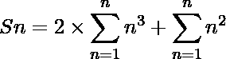

# 系列 3、20、63、144、……

之和

> 原文:[https://www . geesforgeks . org/系列之和-3-20-63-144/](https://www.geeksforgeeks.org/sum-of-the-series-3-20-63-144/)

求给定数列的前 n 项之和:

```
3, 20, 63, 144, .....
```

**例:**

```
Input : n = 2
Output : 23

Input : n =4
Output : 230
```

**逼近** :
首先，我们要找到给定数列的通项(Tn)。

```
series can we written in the following way also:
(3 * 1^2), (5 * 2^2), (7 * 3^2), (9 * 4^2), .......up t n terms
Tn = (General term of series 3, 5, 7, 9 ....) X (General term of series 1^2, 2^2, 3^2, 4^2 ....)
Tn = (3 + (n-1) * 2) X ( n^2 )
Tn = 2*n^3 + n^2
```

我们可以用以下方式写出级数的和:

```
 Sn = 3 + 20 + 63 + 144 + ........up to the n terms
        
Sn = 2 * (sum of n terms of n^3 ) + (sum of n terms of n^2)
```

以下是 n^3 和 n^2 的 n 项之和的公式:

![$ \sum_{n=1}^{n} n^{3} = \left[\frac{n \times \big(n + 1 \big) }{2} \right]^{2} $ $ \sum_{n=1}^{n} n^{2} = \frac{n \times \big(n + 1 \big) \times \big(2*n + 1 \big) }{6} $   ](img/8f9e09f16dd054623aa4ff5ef1456110.png "Rendered by QuickLaTeX.com")

![Total = 2 \times \left[\frac{n \times \big(n + 1 \big) }{2} \right]^{2} + \frac{n \times \big(n + 1 \big) \times \big(2*n + 1 \big) }{6}   ](img/9316f3d2d007c072e8d31517fa6b8e6f.png "Rendered by QuickLaTeX.com")
以下是上述方法的实施:

## C++

```
// C++ program to find the sum of n terms
#include <bits/stdc++.h>
using namespace std;
int calculateSum(int n)
{
    return (2 * pow((n * (n + 1) / 2), 2)) +
           ((n * (n + 1) * (2 * n + 1)) / 6);
}
int main()
{
    int n = 4;
    cout << "Sum = " << calculateSum(n) << endl;
    return 0;
}
```

## Java 语言(一种计算机语言，尤用于创建网站)

```
// Java program to find the sum of n terms
import java.io.*;

public class GFG
{
    static int calculateSum(int n)
    {
        return (int)((2 * Math.pow((n * (n + 1) / 2), 2))) +
               ((n * (n + 1) * (2 * n + 1)) / 6);
    }

    public static void main (String[] args) {

        int n = 4;
        System.out.println("Sum = " +  calculateSum(n));

    }
}
// This code is contributed by Raj
```

## 蟒蛇 3

```
# Python3 program to find the sum of n terms

def calculateSum(n):
    return ((2 * (n * (n + 1) / 2)**2) +
           ((n * (n + 1) * (2 * n + 1)) / 6))

#Driver code

n = 4
print("Sum =",calculateSum(n))

# this code is contributed by Shashank_Sharma
```

## C#

```
// C# program to find the sum of n terms
using System;

class GFG
{
static int calculateSum(int n)
{
    return (int)((2 * Math.Pow((n * (n + 1) / 2), 2))) +
                     ((n * (n + 1) * (2 * n + 1)) / 6);
}

// Driver Code
public static void Main ()
{
    int n = 4;
    Console.WriteLine("Sum = " + calculateSum(n));
}
}

// This code is contributed by anuj_67
```

## 服务器端编程语言（Professional Hypertext Preprocessor 的缩写）

```
<?php
// PHP program to find the
// sum of n terms

function calculateSum($n)
{
    return (2 * pow(($n * ($n + 1) / 2), 2)) +
           (($n * ($n + 1) * (2 * $n + 1)) / 6);
}

// Driver Code
$n = 4;
echo "Sum = " , calculateSum($n);

// This code is contributed by ash264
?>
```

## java 描述语言

```
<script>

// javascript program to find the sum of n terms

function calculateSum(n)
{
    return parseInt(((2 * Math.pow((n * (n + 1) / 2), 2))) +
           ((n * (n + 1) * (2 * n + 1)) / 6));
}

var n = 4;
document.write("Sum = " +  calculateSum(n));

// This code contributed by shikhasingrajput
</script>
```

**Output:** 

```
Sum = 230
```