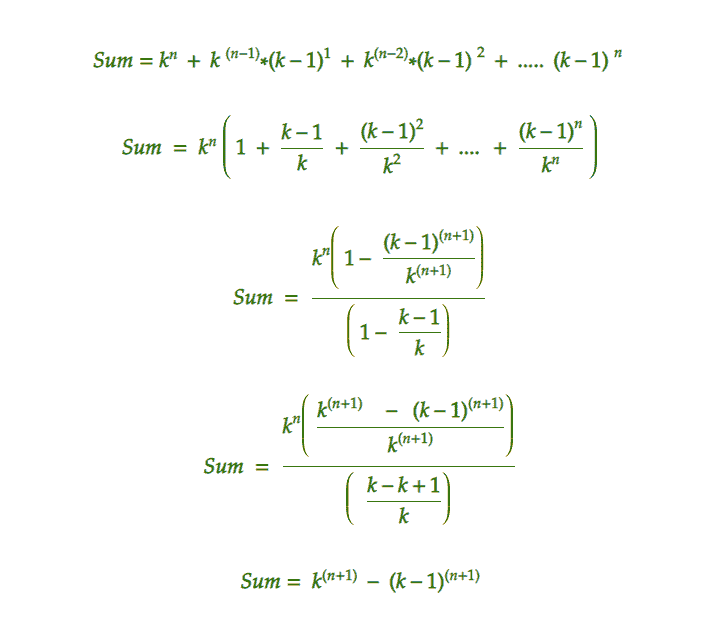

# 级数 Kn+(K(n-1)*(K-1)1)+(K(n-2)*(K-1)2)+……。(K-1)n

> 原文:[https://www . geesforgeks . org/系列之和-kn-kn-1-k-11-kn-2-k-12-k-1n/](https://www.geeksforgeeks.org/sum-of-the-series-kn-kn-1-k-11-kn-2-k-12-k-1n/)

给定一个 K 和 n 的值，任务是求以下级数的和:

> **K<sup>n</sup>+(K<sup>(n-1)</sup>*(K-1)<sup>1</sup>)+(K<sup>(n-2)</sup>*(K-1)<sup>2</sup>)+……。(K-1) <sup>n</sup>**

**示例:**

```
Input:  n = 3, K = 3
Output: 65
Explanation:
(3*3*3) + (3*3*2) + (3*2*2) + (2*2*2)
= 27 + 18 + 12 + 8
= 65 

Input: n = 4, k = 2
Output: 31
Explanation:
(2*2*2*2) + (2*2*2*1)+ (2*2*1*1) + (2*1*1*1) + (1*1*1*1)
= 16 + 8 + 4 + 2 + 1
= 31
```

1.  **简单方法:O(n <sup>2</sup> )**
    1.  串联项总数= n+1
    2.  分别计算每个术语，并将其相加:
2.  **第二种方法:O(n)**
    据观察，给定数列为 [*几何级数*](https://www.geeksforgeeks.org/geometric-progression/) ，公比=(K–1)/K
    *所以，上述表达式可以简化为:*



*   **以下是上述方法的实现:**

## C++

```
#include <bits/stdc++.h>
using namespace std;

// Function to return sum
int sum(int k, int n)
{
    int sum
        = pow(k, n + 1)
          - pow(k - 1, n + 1);

    return sum;
}

// Driver code
int main()
{
    int n = 3;
    int K = 3;
    cout << sum(K, n);
}
```

## Java 语言(一种计算机语言，尤用于创建网站)

```
// Java implementation of above approach
class GFG
{

// Function to return sum
static int sum(int k, int n)
{
    int sum = (int)(Math.pow(k, n + 1) -
                    Math.pow(k - 1, n + 1));

    return sum;
}

// Driver code
public static void main(String args[])
{
    int n = 3;
    int K = 3;
    System.out.print(sum(K, n));
}
}

// This code is contributed
// by Akanksha Rai
```

## 蟒蛇 3

```
# Function to return sum
def sum(k, n):
    sum = (pow(k, n + 1) -
           pow(k - 1, n + 1));

    return sum;

# Driver code
n = 3;
K = 3;
print(sum(K, n));

# This code is contributed by mits
```

## C#

```
// C# implementation of above approach
using System;

class GFG
{

// Function to return sum
static int sum(int k, int n)
{
    int sum = (int)(Math.Pow(k, n + 1) -
                    Math.Pow(k - 1, n + 1));

    return sum;
}

// Driver code
public static void Main()
{
    int n = 3;
    int K = 3;
    Console.Write(sum(K, n));
}
}

// This code is contributed
// by Akanksha Rai
```

## 服务器端编程语言（Professional Hypertext Preprocessor 的缩写）

```
<?php

// Function to return sum
function sum($k, $n)
{
    $sum = pow($k, $n + 1) -
           pow($k - 1, $n + 1);

    return $sum;
}

// Driver code
$n = 3;
$K = 3;
echo sum($K, $n);

// This code is contributed
// by Akanksha Rai
```

## java 描述语言

```
<script>
// Javascript implementation of the approach

    // Function to return sum
    function sum(k,n)
    {
        let sum = 0;
        for (let i = 0; i <= n; i++) {
            let p = 1;

            for (let j = 0; j < n - i; j++) {
                p = p * k;
            }

            for (let j = 0; j < i; j++) {
                p = p * (k - 1);
            }

            sum = sum + p;
        }
        return sum;
    }

    // Driver code
    let n = 3;
    let K = 3;
    document.write(sum(K, n));

// This code is contributed by unknown2108
</script>
```

**Output:** 

```
65
```

**时间复杂度:O( n )**

*   **第三种方法(高效):O(log n)**
    **注:** *通过计算 log(n)复杂度中的幂，时间复杂度可以进一步降低到 O(log(n))。*
    下面是上述方法的实现:

## C++

```
#include <bits/stdc++.h>
using namespace std;

// Recursive C program to compute modular power
int exponent(int A, int B)
{
    // Base cases
    if (A == 0)
        return 0;
    if (B == 0)
        return 1;

    // If B is even
    long y;
    if (B % 2 == 0) {
        y = exponent(A, B / 2);
        y = (y * y);
    }

    // If B is odd
    else {
        y = A;
        y = (y * exponent(A, B - 1));
    }

    return y;
}

// Function to return sum
int sum(int k, int n)
{
    int sum = exponent(k, n + 1)
              - exponent(k - 1, n + 1);

    return sum;
}

// Driver code
int main()
{
    int n = 3;
    int K = 3;
    cout << sum(K, n);
}
```

## Java 语言(一种计算机语言，尤用于创建网站)

```
import java.lang.Math;

class GFG
{

// Recursive C program to compute modular power
static int exponent(int A, int B)
{
    // Base cases
    if (A == 0)
        return 0;
    if (B == 0)
        return 1;

    // If B is even
    int y;
    if (B % 2 == 0)
    {
        y = exponent(A, B / 2);
        y = (y * y);
    }

    // If B is odd
    else
    {
        y = A;
        y = (y * exponent(A, B - 1));
    }

    return y;
}

// Function to return sum
static int sum(int k, int n)
{
    int sum = exponent(k, n + 1)
            - exponent(k - 1, n + 1);

    return sum;
}

// Driver code
public static void main(String[] args)
{
    int n = 3;
    int K = 3;
    System.out.println(sum(K, n));
}
}

// This code is contributed by Code_Mech.
```

## 蟒蛇 3

```
# Recursive python3 program to compute modular power

def exponent(A, B):
    # Base cases
    if (A == 0):
        return 0;
    if (B == 0):
        return 1;

    # If B is even
    if (B % 2 == 0):
        y = exponent(A, B / 2);
        y = (y * y);

    # If B is odd
    else:
        y = A;
        y = (y * exponent(A, B - 1));

    return y;

# Function to return sum
def sum(k, n):
    sum = exponent(k, n + 1) - exponent(k - 1, n + 1);

    return sum;

# Driver code
n = 3;
K = 3;
print(sum(K, n));

# This code has been contributed by 29AjayKumar
```

## C#

```
// C# program of above approach
using System;

class GFG
{

// Recursive C program to compute modular power
static int exponent(int A, int B)
{
    // Base cases
    if (A == 0)
        return 0;
    if (B == 0)
        return 1;

    // If B is even
    int y;
    if (B % 2 == 0)
    {
        y = exponent(A, B / 2);
        y = (y * y);
    }

    // If B is odd
    else
    {
        y = A;
        y = (y * exponent(A, B - 1));
    }

    return y;
}

// Function to return sum
static int sum(int k, int n)
{
    int sum = exponent(k, n + 1)
            - exponent(k - 1, n + 1);

    return sum;
}

// Driver code
public static void Main()
{
    int n = 3;
    int K = 3;
    Console.WriteLine(sum(K, n));
}
}

// This code is contributed by Code_Mech.
```

## 服务器端编程语言（Professional Hypertext Preprocessor 的缩写）

```
<?php
// Recursive C program to compute modular power

function exponent($A, $B)
{
    // Base cases
    if ($A == 0)
        return 0;
    if ($B == 0)
        return 1;

    // If B is even
    if ($B % 2 == 0)
    {
        $y = exponent($A, $B / 2);
        $y = ($y * $y);
    }

    // If B is odd
    else
    {
        $y = $A;
        $y = ($y * exponent($A, $B - 1));
    }

    return $y;
}

// Function to return sum
function sum($k, $n)
{
    $sum = exponent($k, $n + 1) -
           exponent($k - 1, $n + 1);

    return $sum;
}

// Driver code
$n = 3;
$K = 3;
echo sum($K, $n);

// This code is contributed by Akanksha Rai
?>
```

## java 描述语言

```
<script>

// Recursive Javascript program to
// compute modular power
function exponent(A, B)
{

    // Base cases
    if (A == 0)
        return 0;
    if (B == 0)
        return 1;

    // If B is even
    let y;
    if (B % 2 == 0)
    {
        y = exponent(A, parseInt(B / 2, 10));
        y = (y * y);
    }

    // If B is odd
    else
    {
        y = A;
        y = (y * exponent(A, B - 1));
    }
    return y;
}

// Function to return sum
function sum(k, n)
{
    let sum = exponent(k, n + 1) -
              exponent(k - 1, n + 1);

    return sum;
}

// Driver code
let n = 3;
let K = 3;

document.write(sum(K, n));

// This code is contributed by divyeshrabadiya07  

</script>
```

**Output:** 

```
65
```