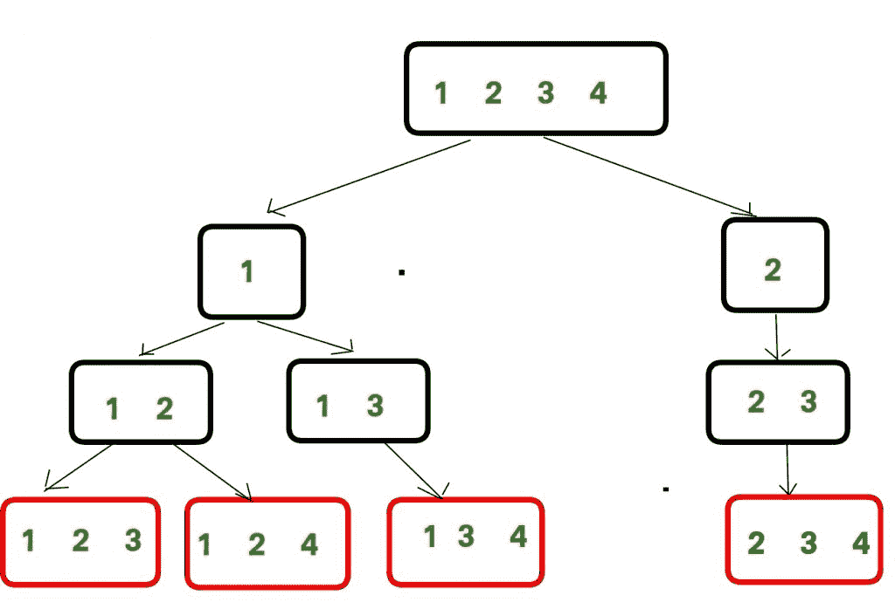
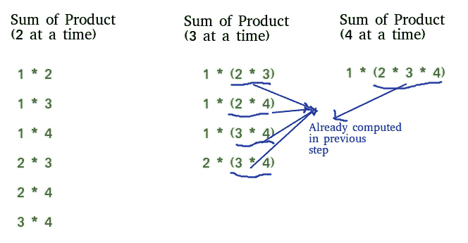

# 一次所有组合(1 至 n)的乘积之和

> 原文:[https://www . geesforgeks . org/sum-products-combination-take-1-n-time/](https://www.geeksforgeeks.org/sum-products-combination-taken-1-n-time/)

给定 N，我们要求所有[组合](https://www.geeksforgeeks.org/permutation-and-combination-gq/)一次取 1 到 N 的乘积之和。简而言之，我们必须找到所有组合的乘积之和，一次取 1，一次取 2，一次取 3，直到一次取 N。
如果你仔细考虑这个问题，一个大的 N 值可能会产生许多组合。
**示例:**

```
Input :  N = 3
Output : f(1) = 6
         f(2) = 11
         f(3) = 6

Explanation: f(x) is sum of products of all 
             combination taken x at a time
             1 + 2 + 3 = 6
             f(2) = (1*2) + (1*3) + (2*3) = 11
             f(3) = (1*2*3) 

Input :  N = 4
Output : f(1) = 10
         f(2) = 35
         f(3) = 50
         f(4) = 24

Explanation: f(1) = 1 + 2 + 3 + 4 = 10
             f(2) = (1*2) + (1*3) + (1*4) + 
                    (2*3) + (2*4) + (3*4) 
                  = 35
             f(3) = (1*2*3) + (1*2*4) +(1*3*4) + 
                    (2*3*4) 
                 = 50
             f(4) = (1*2*3*4) = 24        
```

强力的方法是产生所有的组合，然后找到它们的乘积并求和。
递归可以一次产生 x 个组合。
**例:** N = 4 一次取 3



## C++

```
// Program to find SOP of all combination taken
// (1 to N) at a time using brute force
#include <iostream>
using namespace std;

// to store sum of every combination
int sum = 0;

void Combination(int a[], int combi[], int n,
                int r, int depth, int index) {

  // if we have reached sufficient depth
  if (index == r) {

    // find the product of combination
    int product = 1;
    for (int i = 0; i < r; i++)
      product = product * combi[i];

    // add the product into sum
    sum += product;
    return;
  }

  // recursion to produce different combination
  for (int i = depth; i < n; i++) {
    combi[index] = a[i];
    Combination(a, combi, n, r, i + 1, index + 1);
  }
}

// function to print sum of products of
// all combination taken 1-N at a time
void allCombination(int a[], int n) {
  for (int i = 1; i <= n; i++) {

    // creating temporary array for storing
    // combination
    int *combi = new int[i];

    // call combination with r = i
    // for combination taken i at a time
    Combination(a, combi, n, i, 0, 0);

    // displaying sum
    cout << "f(" << i << ") --> " << sum << "\n";
    sum = 0;

    // free from heap area
    free(combi);
  }
}

// Driver's code
int main() {
  int n = 5;
  int *a = new int[n];

  // storing numbers from 1-N in array
  for (int i = 0; i < n; i++)
    a[i] = i + 1;

  // calling allCombination
  allCombination(a, n);

  return 0;
}
```

## Java 语言(一种计算机语言，尤用于创建网站)

```
// Program to find SOP of
// all combination taken
// (1 to N) at a time using
// brute force
import java.io.*;

class GFG
{
    // to store sum of
    // every combination
    static int sum = 0;

    static void Combination(int []a, int []combi,
                            int n, int r,
                            int depth, int index)
    {

    // if we have reached
    // sufficient depth
    if (index == r)
    {

        // find the product
        // of combination
        int product = 1;
        for (int i = 0; i < r; i++)
        product = product * combi[i];

        // add the product into sum
        sum += product;
        return;
    }

    // recursion to produce
    // different combination
    for (int i = depth; i < n; i++)
    {
        combi[index] = a[i];
        Combination(a, combi, n, r,
                    i + 1, index + 1);
    }
    }

    // function to print sum of
    // products of all combination
    // taken 1-N at a time
    static void allCombination(int []a,
                               int n)
    {
        for (int i = 1; i <= n; i++)
        {

            // creating temporary array
            // for storing combination
            int []combi = new int[i];

            // call combination with
            // r = i for combination
            // taken i at a time
            Combination(a, combi, n,
                        i, 0, 0);

            // displaying sum
            System.out.print("f(" + i + ") --> " +
                                      sum + "\n");
            sum = 0;
        }
    }

    // Driver code
    public static void main(String args[])
    {
        int n = 5;
        int []a = new int[n];

        // storing numbers
        // from 1-N in array
        for (int i = 0; i < n; i++)
            a[i] = i + 1;

        // calling allCombination
        allCombination(a, n);
    }
}

// This code is contributed by
// Manish Shaw(manishshaw1)
```

## 蟒蛇 3

```
# Python3 Program to find SOP of all combination
# taken (1 to N) at a time using brute force

# to store sum of every combination
def Combination(a, combi, n, r, depth, index):
    global Sum

    # if we have reached sufficient depth
    if index == r:

        # find the product of combination
        product = 1
        for i in range(r):
            product = product * combi[i]

        # add the product into sum
        Sum += product
        return

    # recursion to produce different
    # combination
    for i in range(depth, n):
        combi[index] = a[i]
        Combination(a, combi, n, r,
                    i + 1, index + 1)

# function to print sum of products of
# all combination taken 1-N at a time
def allCombination(a, n):
    global Sum
    for i in range(1, n + 1):

        # creating temporary array for
        # storing combination
        combi = [0] * i

        # call combination with r = i
        # for combination taken i at a time
        Combination(a, combi, n, i, 0, 0)

        # displaying sum
        print("f(", i, ") --> ", Sum)
        Sum = 0

# Driver Code
Sum = 0
n = 5
a = [0] * n

# storing numbers from 1-N in array
for i in range(n):
    a[i] = i + 1

# calling allCombination
allCombination(a, n)

# This code is contributed by PranchalK
```

## C#

```
// Program to find SOP of
// all combination taken
// (1 to N) at a time using
// brute force
using System;

class GFG
{
    // to store sum of
    // every combination
    static int sum = 0;

    static void Combination(int []a, int []combi,
                            int n, int r,
                            int depth, int index)
    {

    // if we have reached
    // sufficient depth
    if (index == r)
    {

        // find the product
        // of combination
        int product = 1;
        for (int i = 0; i < r; i++)
        product = product * combi[i];

        // add the product into sum
        sum += product;
        return;
    }

    // recursion to produce
    // different combination
    for (int i = depth; i < n; i++)
    {
        combi[index] = a[i];
        Combination(a, combi, n, r,
                    i + 1, index + 1);
    }
    }

    // function to print sum of
    // products of all combination
    // taken 1-N at a time
    static void allCombination(int []a,
                               int n)
    {
    for (int i = 1; i <= n; i++)
    {

        // creating temporary array
        // for storing combination
        int []combi = new int[i];

        // call combination with
        // r = i for combination
        // taken i at a time
        Combination(a, combi, n,
                    i, 0, 0);

        // displaying sum
        Console.Write("f(" + i + ") --> " +
                               sum + "\n");
        sum = 0;
    }
    }

    // Driver code
    static void Main()
    {
        int n = 5;
        int []a = new int[n];

        // storing numbers
        // from 1-N in array
        for (int i = 0; i < n; i++)
            a[i] = i + 1;

        // calling allCombination
        allCombination(a, n);
    }
}

// This code is contributed by
// Manish Shaw(manishshaw1)
```

## java 描述语言

```
<script>

// JavaScript program to find sum of all combination taken
// (1 to N) at a time using brute force

    // to store sum of
    // every combination
    let sum = 0;

    function Combination(a, combi, n,  r, depth,  index)
    {

    // if we have reached
    // sufficient depth
    if (index == r)
    {

        // find the product
        // of combination
        let product = 1;
        for (let i = 0; i < r; i++)
        product = product * combi[i];

        // add the product into sum
        sum += product;
        return;
    }

    // recursion to produce
    // different combination
    for (let i = depth; i < n; i++)
    {
        combi[index] = a[i];
        Combination(a, combi, n, r,
                    i + 1, index + 1);
    }
    }

    // function to print sum of
    // products of all combination
    // taken 1-N at a time
    function allCombination(a, n)
    {
        for (let i = 1; i <= n; i++)
        {

            // creating temporary array
            // for storing combination
            let combi = [];

            // call combination with
            // r = i for combination
            // taken i at a time
            Combination(a, combi, n,
                        i, 0, 0);

            // displaying sum
            document.write("f(" + i + ") --> " +
                                      sum + "<br/>");
            sum = 0;
        }
    }

// Driver code

        let n = 5;
        let a = [];

        // storing numbers
        // from 1-N in array
        for (let i = 0; i < n; i++)
            a[i] = i + 1;

        // calling allCombination
        allCombination(a, n);

</script>
```

**输出:**

```
f(1) --> 15
f(2) --> 85
f(3) --> 225
f(4) --> 274
f(5) --> 120
```

当 N 值较大时，上述代码的**时间复杂度**为指数。
一个**高效的方法**就是使用动态规划的概念。我们不必每次都找到产品的总和。我们可以利用以前的结果。
举个例子:N = 4



## C++

```
// CPP Program to find sum of all combination takne
// (1 to N) at a time using dynamic programming
#include <iostream>
using namespace std;

// find the postfix sum array
void postfix(int a[], int n) {
  for (int i = n - 1; i > 0; i--)
    a[i - 1] = a[i - 1] + a[i];
}

// modify the array such that we don't have to
// compute the products which are obtained before
void modify(int a[], int n) {
  for (int i = 1; i < n; i++)
    a[i - 1] = i * a[i];
}

// finding sum of all combination taken 1 to N at a time
void allCombination(int a[], int n) {

  int sum = 0;

  // sum taken 1 at time is simply sum of 1 - N
  for (int i = 1; i <= n; i++)
    sum += i;
  cout << "f(1) --> " << sum << "\n";

  // for sum of products for all combination
  for (int i = 1; i < n; i++) {

    // finding postfix array
    postfix(a, n - i + 1);

    // sum of products taken i+1 at a time
    sum = 0;
    for (int j = 1; j <= n - i; j++) {
      sum += (j * a[j]);
    }
    cout << "f(" << i + 1 << ") --> " << sum << "\n";

    // modify the array for overlapping problem
    modify(a, n);
  }
}

// Driver's Code
int main() {
  int n = 5;
  int *a = new int[n];

  // storing numbers from 1 to N
  for (int i = 0; i < n; i++)
    a[i] = i + 1;

  // calling allCombination
  allCombination(a, n);

  return 0;
}
```

## Java 语言(一种计算机语言，尤用于创建网站)

```
// Java Program to find sum of all combination takne
// (1 to N) at a time using dynamic programming
import java.util.*;

class GFG
{

    // find the postfix sum array
    static void postfix(int a[], int n)
    {
        for (int i = n - 1; i > 0; i--)
        {
            a[i - 1] = a[i - 1] + a[i];
        }
    }

    // modify the array such that we don't
    // have to compute the products which
    // are obtained before
    static void modify(int a[], int n)
    {
        for (int i = 1; i < n; i++)
        {
            a[i - 1] = i * a[i];
        }
    }

    // finding sum of all combination
    // taken 1 to N at a time
    static void allCombination(int a[], int n)
    {
        int sum = 0;

        // sum taken 1 at time is simply sum of 1 - N
        for (int i = 1; i <= n; i++)
        {
            sum += i;
        }
        System.out.println("f(1) --> " + sum);

        // for sum of products for all combination
        for (int i = 1; i < n; i++)
        {

            // finding postfix array
            postfix(a, n - i + 1);

            // sum of products taken i+1 at a time
            sum = 0;
            for (int j = 1; j <= n - i; j++)
            {
                sum += (j * a[j]);
            }
            System.out.println("f(" + (i + 1) +
                               ") --> " + sum);

            // modify the array for overlapping problem
            modify(a, n);
        }
    }

    // Driver's Code
    public static void main(String[] args)
    {
        int n = 5;
        int[] a = new int[n];

        // storing numbers from 1 to N
        for (int i = 0; i < n; i++)
        {
            a[i] = i + 1;
        }

        // calling allCombination
        allCombination(a, n);
    }
}

// This code is contributed by 29AjayKumar
```

## 蟒蛇 3

```
# Python3 Program to find
# sum of all combination takne
# (1 to N) at a time using
# dynamic programming

# Find the postfix sum array
def postfix(a, n):

    for i in range (n - 1, 1, -1):
        a[i - 1] = a[i - 1] + a[i]

# Modify the array such
# that we don't have to
# compute the products
# which are obtained before
def modify(a, n):

    for i in range (1, n):
        a[i - 1] = i * a[i];

# Finding sum of all combination
# taken 1 to N at a time
def allCombination(a, n):

    sum = 0

    # sum taken 1 at time is
    # simply sum of 1 - N
    for i in range (1, n + 1):

        sum += i
    print ("f(1) --> ", sum )

    # for sum of products for
    # all combination
    for i in range (1, n):

        # finding postfix array
        postfix(a, n - i + 1)

        # sum of products taken
        # i+1 at a time
        sum = 0

        for j in range(1, n - i + 1):
            sum += (j * a[j])

        print ("f(", i + 1, ") --> ", sum)

        # modify the array for
        # overlapping problem
        modify(a, n)

# Driver's Code
if __name__ == "__main__":

    n = 5
    a = [0] * n

    # storing numbers
    # from 1 to N
    for i in range(n):
        a[i] = i + 1

    # calling allCombination
    allCombination(a, n)

# This code is contributed by Chitranayal
```

## C#

```
// C# Program to find sum of all combination takne
// (1 to N) at a time using dynamic programming
using System;

class GFG
{

    // find the postfix sum array
    static void postfix(int []a, int n)
    {
        for (int i = n - 1; i > 0; i--)
        {
            a[i - 1] = a[i - 1] + a[i];
        }
    }

    // modify the array such that we don't
    // have to compute the products which
    // are obtained before
    static void modify(int []a, int n)
    {
        for (int i = 1; i < n; i++)
        {
            a[i - 1] = i * a[i];
        }
    }

    // finding sum of all combination
    // taken 1 to N at a time
    static void allCombination(int []a, int n)
    {
        int sum = 0;

        // sum taken 1 at time is simply sum of 1 - N
        for (int i = 1; i <= n; i++)
        {
            sum += i;
        }
        Console.WriteLine("f(1) --> " + sum);

        // for sum of products for all combination
        for (int i = 1; i < n; i++)
        {

            // finding postfix array
            postfix(a, n - i + 1);

            // sum of products taken i+1 at a time
            sum = 0;
            for (int j = 1; j <= n - i; j++)
            {
                sum += (j * a[j]);
            }
            Console.WriteLine("f(" + (i + 1) +
                            ") --> " + sum);

            // modify the array for overlapping problem
            modify(a, n);
        }
    }

    // Driver's Code
    public static void Main(String[] args)
    {
        int n = 5;
        int[] a = new int[n];

        // storing numbers from 1 to N
        for (int i = 0; i < n; i++)
        {
            a[i] = i + 1;
        }

        // calling allCombination
        allCombination(a, n);
    }
}

// This code is contributed by Rajput-Ji
```

## java 描述语言

```
<script>
// Javascript Program to find sum of all combination takne
// (1 to N) at a time using dynamic programming

    // find the postfix sum array
    function postfix(a,n)
    {
        for (let i = n - 1; i > 0; i--)
        {
            a[i - 1] = a[i - 1] + a[i];
        }
    }

    // modify the array such that we don't
    // have to compute the products which
    // are obtained before
    function modify(a,n)
    {
        for (let i = 1; i < n; i++)
        {
            a[i - 1] = i * a[i];
        }
    }

    // finding sum of all combination
    // taken 1 to N at a time
    function allCombination(a,n)
    {
        let sum = 0;

        // sum taken 1 at time is simply sum of 1 - N
        for (let i = 1; i <= n; i++)
        {
            sum += i;
        }
        document.write("f(1) --> " + sum+"<br>");

        // for sum of products for all combination
        for (let i = 1; i < n; i++)
        {

            // finding postfix array
            postfix(a, n - i + 1);

            // sum of products taken i+1 at a time
            sum = 0;
            for (let j = 1; j <= n - i; j++)
            {
                sum += (j * a[j]);
            }
            document.write("f(" + (i + 1) +
                               ") --> " + sum+"<br>");

            // modify the array for overlapping problem
            modify(a, n);
        }
    }

    // Driver's Code
    let n = 5;
    let a = new Array(n);
    // storing numbers from 1 to N
    for (let i = 0; i < n; i++)
    {
        a[i] = i + 1;
    }

    // calling allCombination
    allCombination(a, n);

    // This code is contributed by avanitrachhadiya2155
</script>
```

**输出:**

```
f(1) --> 15
f(2) --> 85
f(3) --> 225
f(4) --> 274
f(5) --> 120
```

上述方法的**时间复杂度**是 O(n^2)，远优于蛮力方法。
对于一个大的 N 值，你也可以找到这两种方法的执行时间，也可以自己看出差别。