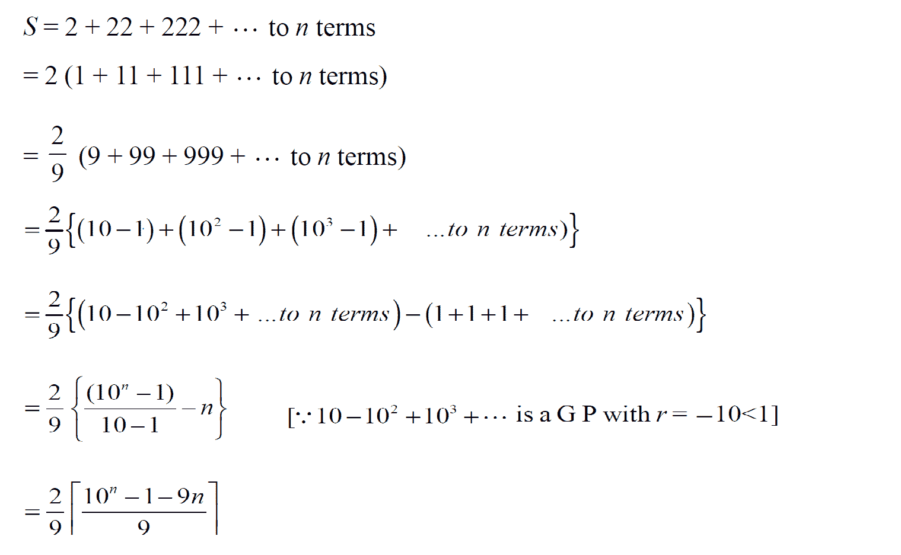

# 序列 2、22、222、…………

的和

> 原文:[https://www.geeksforgeeks.org/sum-sequence-2-22-222/](https://www.geeksforgeeks.org/sum-sequence-2-22-222/)

求下列序列的和:2，22，222，…到 n 项。
**例:**

```
Input : 2
Output: 1.9926

Input : 3
Output: 23.9112
```

一个**简单的解决方案**就是一个一个的计算术语，并添加到结果中。
上述问题可以通过以下公式**高效解决:** 

****

## **C++**

```
// CPP program to find sum of series
// 2, 22, 222, ..
#include <bits/stdc++.h>
using namespace std;

// function which return the
// the sum of series
float sumOfSeries(int n)
{
    return 0.0246 * (pow(10, n) - 1 - (9 * n));
}

// driver code
int main()
{
    int n = 3;
    cout << sumOfSeries(n);
    return 0;
}
```

## **Java 语言(一种计算机语言，尤用于创建网站)**

```
// JAVA Code for Sum of the
// sequence 2, 22, 222,...
import java.util.*;

class GFG {

    // function which return the
    // the sum of series
    static double sumOfSeries(int n)
    {
        return 0.0246 * (Math.pow(10, n)
                            - 1 - (9 * n));
    }

    /* Driver program */
    public static void main(String[] args)
    {
         int n = 3;
         System.out.println(sumOfSeries(n));
    }
}

// This code is contributed by Arnav Kr. Mandal.
```

## **蟒蛇 3**

```
# Python3 code to find
# sum of series
# 2, 22, 222, ..
import math

# function which return
# the sum of series
def sumOfSeries( n ):
    return 0.0246 * (math.pow(10, n) - 1 - (9 * n))

# driver code
n = 3
print( sumOfSeries(n))

# This code is contributed by "Sharad_Bhardwaj".
```

## **C#**

```
// C# Code for Sum of the
// sequence 2, 22, 222,...
using System;

class GFG {

    // Function which return the
    // the sum of series
    static double sumOfSeries(int n)
    {
        return 0.0246 * (Math.Pow(10, n)
                           - 1 - (9 * n));
    }

    // Driver Code
    public static void Main()
    {
        int n = 3;
        Console.Write(sumOfSeries(n));
    }
}

// This code is contributed by vt_m.
```

## **服务器端编程语言（Professional Hypertext Preprocessor 的缩写）**

```
<?php
// PHP program to find sum
// of series 2, 22, 222, ..

// function which return the
// the sum of series
function sumOfSeries($n)
{
    return 0.0246 * (pow(10, $n) -
                     1 - (9 * $n));
}

// Driver Code
$n = 3;
echo(sumOfSeries($n));

// This code is contributed by Ajit.
?>
```

## **java 描述语言**

```
<script>

// JavaScript program for Sum of the
// sequence 2, 22, 222,...

    // function which return the
    // the sum of series
    function sumOfSeries(n)
    {
        return 0.0246 * (Math.pow(10, n)
                            - 1 - (9 * n));
    }

// Driver code   

        let n = 3;
        document.write(sumOfSeries(n));

</script>
```

****输出:****

```
23.9112
```