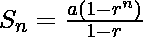
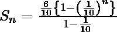
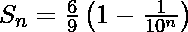
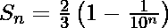

# 系列 0.6、0.06、0.006、0.0006、…至 n 项之和

> 原文:[https://www . geesforgeks . org/sum-series-0-6-0-06-0-006-0-0006-n-terms/](https://www.geeksforgeeks.org/sum-series-0-6-0-06-0-006-0-0006-n-terms/)

给定项数，即 n，求数列 0.6，0.06，0.006，0.0006，…到 n 项的和。
**例:**

```
Input : 2
Output : 0.65934

Input : 3
Output : 0.665334
```

让我们用 S 表示总和:
使用公式，我们有【自 r<1】



因此需要的总和是
下面是实现:

## C++

```
// CPP program to find sum of 0.6, 0.06,
// 0.006, 0.0006, ...to n terms
#include <bits/stdc++.h>
using namespace std;

// function which return the
// the sum of series
float sumOfSeries(int n)
{
    return (0.666) * (1 - 1 / pow(10, n));
}

// Driver code
int main()
{
    int n = 2;
    cout << sumOfSeries(n);
}
```

## Java 语言(一种计算机语言，尤用于创建网站)

```
// java program to find sum of 0.6, 0.06,
// 0.006, 0.0006, ...to n terms
import java.io.*;

class GFG
{
    // function which return the
    // the sum of series
    static double sumOfSeries(int n)
    {
        return (0.666) * (1 - 1 /Math. pow(10, n));
    }

    // Driver code
    public static void main (String[] args)
    {
        int n = 2;
        System.out.println ( sumOfSeries(n));

    }
}

// This code is contributed by vt_m
```

## 蟒蛇 3

```
# Python3 program to find
# sum of 0.6, 0.06, 0.006,
# 0.0006, ...to n terms
import math

# function which return
# the sum of series
def sumOfSeries(n):
    return ((0.666) *
            (1 - 1 / pow(10, n)));

# Driver code
n = 2;
print(sumOfSeries(n));

# This code is contributed by mits
```

## C#

```
// C# program to find sum of 0.6, 0.06,
// 0.006, 0.0006, ...to n terms
using System;

class GFG {

    // function which return the
    // the sum of series
    static double sumOfSeries(int n)
    {
        return (0.666) * (1 - 1 /Math. Pow(10, n));
    }

    // Driver code
    public static void Main ()
    {
        int n = 2;

        Console.WriteLine( sumOfSeries(n));

    }
}

// This code is contributed by vt_m
```

## 服务器端编程语言（Professional Hypertext Preprocessor 的缩写）

```
<?php
// PHP program to find sum of 0.6, 0.06,
// 0.006, 0.0006, ...to n terms

// function which return the
// the sum of series
function sumOfSeries($n)
{
    return (0.666) * (1 - 1 /
                pow(10, $n));
}

// Driver code
$n = 2;
echo(sumOfSeries($n));

// This code is contributed by Ajit.
?>
```

## java 描述语言

```
<script>
// javascript program to find sum of 0.6, 0.06,
// 0.006, 0.0006, ...to n terms

// function which return the
// the sum of series
function sumOfSeries( n)
{
    return (0.666) * (1 - 1 / Math.pow(10, n));
}

// Driver Code
let n = 2 ;
   document.write(sumOfSeries(n).toFixed(5)) ;

// This code is contributed by aashish1995

</script>
```

**输出:**

```
0.65934
```