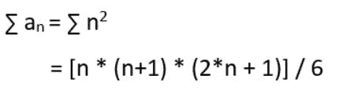

# 级数 1+(1+3)+(1+3+5)+(1+3+5+7)+……+(1+3+5+7+……+(2n-1))之和

> 原文:[https://www . geesforgeks . org/sum-series-1-13-135-1357-13572n-1/](https://www.geeksforgeeks.org/sum-series-1-13-135-1357-13572n-1/)

给定正整数 **n** 。问题是求给定数列的和**1+(1+2)+(1+2+3)+(1+2+3+4)+……+(1+2+3+4+……+n)**，其中数列中的第 I 项是第 I 个奇数自然数的和。
示例:

```
Input : n = 2
Output : 5
(1) + (1+3) = 5

Input : n = 5
Output : 55
(1) + (1+3) + (1+3+5) + (1+3+5+7) + (1+3+5+7+9) = 55
```

**天真方法:**使用两个循环得到每个第 I 项的和，然后将这些和加到最终和上。

## C++

```
// C++ implementation to find the
// sum of the given series
#include <bits/stdc++.h>

using namespace std;

// functionn to find the
// sum of the given series
int sumOfTheSeries(int n)
{
    int sum = 0;
    for (int i = 1; i <= n; i++) {

        // first term of each i-th term
        int k = 1;
        for (int j = 1; j <= i; j++) {
            sum += k;

            // next term
            k += 2;
        }
    }

    // required sum
    return sum;
}

// Driver program
int main()
{
    int n = 5;
    cout << "Sum = "
         << sumOfTheSeries(n);
    return 0;
}
```

## Java 语言(一种计算机语言，尤用于创建网站)

```
// Java implementation to find
// the sum of the given series
import java.util.*;

class GFG {

    // functionn to find the sum
    // of the given series
    static int sumOfTheSeries(int n)
    {
        int sum = 0;
        for (int i = 1; i <= n; i++)
        {

            // first term of each
            // i-th term
            int k = 1;
            for (int j = 1; j <= i; j++)
            {
                sum += k;

                // next term
                k += 2;
            }
        }

        // required sum
        return sum;
    }

    /* Driver program */
    public static void main(String[] args)
    {
         int n = 5;
         System.out.println("Sum = " +
                        sumOfTheSeries(n));
    }
}

// This code is contributed by Arnav Kr. Mandal.
```

## 蟒蛇 3

```
# Python3 implementation to find
# the sum of the given series

# functionn to find the sum
# of the given series
def sumOfTheSeries( n ):
    sum = 0
    for i in range(1, n + 1):

        # first term of each i-th term
        k = 1
        for j in range(1,i+1):
            sum += k

            # next term
            k += 2

    # required sum
    return sum

# Driver program
n = 5
print("Sum =", sumOfTheSeries(n))

# This code is contributed by "Sharad_Bhardwaj".
```

## C#

```
// C# implementation to find
// the sum of the given series
using System;

class GFG {

    // functionn to find the sum
    // of the given series
    static int sumOfTheSeries(int n)
    {
        int sum = 0;
        for (int i = 1; i <= n; i++) {

            // first term of each
            // i-th term
            int k = 1;
            for (int j = 1; j <= i; j++) {
                sum += k;

                // next term
                k += 2;
            }
        }

        // required sum
        return sum;
    }

    /* Driver program */
    public static void Main()
    {
        int n = 5;
        Console.Write("Sum = " +
                     sumOfTheSeries(n));
    }
}

// This code is contributed by vt_m.
```

## 服务器端编程语言（Professional Hypertext Preprocessor 的缩写）

```
<?php

// php implementation to find the
// sum of the given series

// functionn to find the
// sum of the given series
function sumOfTheSeries($n)
{
    $sum = 0;
    for ($i = 1; $i <= $n; $i++) {

        // first term of each i-th term
        $k = 1;
        for ($j = 1; $j <= $i; $j++) {
            $sum += $k;

            // next term
            $k += 2;
        }
    }

    // required sum
    return $sum;
}

// Driver program
    $n = 5;
    echo "Sum = "
         . sumOfTheSeries($n);

// This code is contributed by Sam007
?>
```

## java 描述语言

```
<script>

// Javascript implementation to find the
// sum of the given series

// functionn to find the
// sum of the given series
function sumOfTheSeries(n)
{
    let sum = 0;
    for (let i = 1; i <= n; i++) {

        // first term of each i-th term
        let k = 1;
        for (let j = 1; j <= i; j++) {
            sum += k;

            // next term
            k += 2;
        }
    }

    // required sum
    return sum;
}

// Driver program
    let n = 5;
    document.write("Sum = " + sumOfTheSeries(n));

// This code is contributed by gfgking

</script>
```

输出:

```
Sum = 55
```

**有效方法:**
让 **a <sub>n</sub>** 成为给定系列的第 n 个术语。

```
a<sub>n</sub> = (1 + 3 + 5 + 7 + (2n-1))
   = sum of first n odd numbers
   = n2
```

以上公式的证明参见[本](https://www.geeksforgeeks.org/sum-first-n-odd-numbers-o1-complexity/)帖。
现在，



以上公式的证明参见[本](https://www.geeksforgeeks.org/sum-squares-first-n-natural-numbers/)帖。

## C++

```
// C++ implementation to find the sum
// of the given series
#include <bits/stdc++.h>
using namespace std;

// functionn to find the sum
// of the given series
int sumOfTheSeries(int n)
{
    // required sum
    return (n * (n + 1) / 2) *
            (2 * n + 1) / 3;
}

// Driver program to test above
int main()
{
    int n = 5;
    cout << "Sum = "
         << sumOfTheSeries(n);
    return 0;
}
```

## Java 语言(一种计算机语言，尤用于创建网站)

```
// Java implementation to find
// the sum of the given series
import java.io.*;

class GfG {

// function to find the sum
// of the given series
static int sumOfTheSeries(int n)
{
    // required sum
    return (n * (n + 1) / 2) *
            (2 * n + 1) / 3;
}

// Driver program to test above
public static void main (String[] args)
{
    int n = 5;

    System.out.println("Sum = "+
                sumOfTheSeries(n));

}

}

// This code is contributed by Gitanjali.
```

## 蟒蛇 3

```
# Python3 implementation to find
# the sum of the given series

# functionn to find the sum
# of the given series
def sumOfTheSeries( n ):

    # required sum
    return int((n * (n + 1) / 2) *
            (2 * n + 1) / 3)

# Driver program to test above
n = 5
print("Sum =", sumOfTheSeries(n))

# This code is contributed by "Sharad_Bhardwaj".
```

## C#

```
// C# implementation to find
// the sum of the given series
using System;

class GfG {

    // function to find the sum
    // of the given series
    static int sumOfTheSeries(int n)
    {
        // required sum
        return (n * (n + 1) / 2) *
                      (2 * n + 1) / 3;
    }

    // Driver program to test above
    public static void Main()
    {
        int n = 5;

        Console.Write("Sum = " +
                   sumOfTheSeries(n));
    }
}

// This code is contributed by vt_m.
```

## 服务器端编程语言（Professional Hypertext Preprocessor 的缩写）

```
<?php
// PHP implementation to find the sum
// of the given series

// functionn to find the sum
// of the given series
function sumOfTheSeries($n)
{

    // required sum
    return ($n * ($n + 1) / 2) *
              (2 * $n + 1) / 3;
}

    // Driver Code
    $n = 5;
    echo "Sum = "
        . sumOfTheSeries($n);

// This code is contributed by Sam007
?>
```

## java 描述语言

```
<script>

// JavaScript program to find
// the sum of the given series

// function to find the sum
    // of the given series
    function sumOfTheSeries(n)
    {
        // required sum
        return (n * (n + 1) / 2) *
                      (2 * n + 1) / 3;
    }

// Driver Code

        let n = 5;

        document.write("Sum = " +
                   sumOfTheSeries(n));

        // This code is contributed by avijitmondal1998.
</script>
```

输出:

```
Sum = 55
```