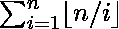
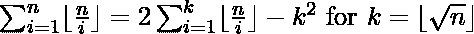

# 调和级数的下限总和

> 原文:[https://www . geeksforgeeks . org/简谐级数求和/](https://www.geeksforgeeks.org/summation-of-floor-of-harmonic-progression/)

给定一个整数 **N** ，任务是求调和级数的和。
**示例:**

> **输入:** N = 5
> **输出:** 10
> 楼层(3/1) +楼层(3/2) +楼层(3/3) = 3 + 1 + 1 = 5
> **输入:** N = 20
> **输出:** 66

**天真方法:**从 **1** 到 **N** 循环一次，求出 **N / i** 的楼层值之和。这种方法的时间复杂度将是 **O(n)** 。
**高效方法:**使用以下[公式](https://math.stackexchange.com/questions/487401/sum-of-floor-of-harmonic-progression-sum-i-1n-lfloor-frac-ni-rfloor-2-sum)计算系列的总和:

现在，循环需要从 **1** 到 **sqrt(N)** 运行，时间复杂度降低到 **O(sqrt(N))**
以下是上述方法的实现:

## C++

```
// C++ implementation of the approach
#include <bits/stdc++.h>
using namespace std;

// Function to return the summation of
// the given harmonic series
long long int getSum(int n)
{

    // To store the summation
    long long int sum = 0;

    // Floor of sqrt(n)
    int k = sqrt(n);

    // Summation of floor(n / i)
    for (int i = 1; i <= k; i++) {
        sum += floor(n / i);
    }

    // From the formula
    sum *= 2;
    sum -= pow(k, 2);

    return sum;
}

// Driver code
int main()
{
    int n = 5;

    cout << getSum(n);

    return 0;
}
```

## Java 语言(一种计算机语言，尤用于创建网站)

```
// Java implementation of the approach
class GFG
{

    // Function to return the summation of
    // the given harmonic series
    static long getSum(int n)
    {

        // To store the summation
        long sum = 0;

        // Floor of sqrt(n)
        int k = (int)Math.sqrt(n);

        // Summation of floor(n / i)
        for (int i = 1; i <= k; i++)
        {
            sum += Math.floor(n / i);
        }

        // From the formula
        sum *= 2;
        sum -= Math.pow(k, 2);

        return sum;
    }

    // Driver code
    public static void main (String[] args)
    {
        int n = 5;

        System.out.println(getSum(n));
    }
}

// This code is contributed by AnkitRai01
```

## 蟒蛇 3

```
# Python3 implementation of the approach
from math import floor, sqrt, ceil

# Function to return the summation of
# the given harmonic series
def getSum(n):

    # To store the summation
    summ = 0

    # Floor of sqrt(n)
    k =(n)**(.5)

    # Summation of floor(n / i)
    for i in range(1, floor(k) + 1):
        summ += floor(n / i)

    # From the formula
    summ *= 2
    summ -= pow(floor(k), 2)

    return summ

# Driver code
n = 5

print(getSum(n))

# This code is contributed by Mohit Kumar
```

## C#

```
// C# implementation of the approach
using System;

class GFG
{

    // Function to return the summation of
    // the given harmonic series
    static double getSum(int n)
    {

        // To store the summation
        double sum = 0;

        // Floor of sqrt(n)
        int k = (int)Math.Sqrt(n);

        // Summation of floor(n / i)
        for (int i = 1; i <= k; i++)
        {
            sum += Math.Floor((double)n / i);
        }

        // From the formula
        sum *= 2;
        sum -= Math.Pow(k, 2);

        return sum;
    }

    // Driver code
    public static void Main (String[] args)
    {
        int n = 5;

        Console.WriteLine(getSum(n));
    }
}

// This code is contributed by PrinciRaj1992
```

## java 描述语言

```
<script>

// Javascript implementation of the approach

// Function to return the summation of
// the given harmonic series
function getSum(n)
{

    // To store the summation
    let sum = 0;

    // Floor of sqrt(n)
    let k = parseInt(Math.sqrt(n));

    // Summation of floor(n / i)
    for (let i = 1; i <= k; i++) {
        sum += Math.floor(n / i);
    }

    // From the formula
    sum *= 2;
    sum -= Math.pow(k, 2);

    return sum;
}

// Driver code
    let n = 5;

    document.write(getSum(n));

</script>
```

**Output:** 

```
10
```