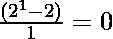
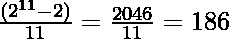

# 超级鸡号

> 哎哎哎:# t0]https://www . geeksforgeeks . org/super-chicklet-number/

**超素数**是基数为 2 的素数(伪素数)，如果每个除数 D 除。

一些超级磅数是:

> 341, 1387, 2047, 2701, 3277, 4033….

### 检查 N 是否为超级磅数

给定一个整数 **N** ，任务是检查 **N** 是否为**超级波特号。**

**例:**

> **输入:** N = 341
> **输出:**是
> **输入:** N = 10
> **输出:**否

**方法:**思路是[生成数字](https://www.geeksforgeeks.org/find-divisors-natural-number-set-1/) **N** 的所有除数，对于所有除数检查 D 除。如果所有除数都满足这个条件，那么这个数就是超级波特数。
**例如:**

> 对于 N = 341，
> 341 的除数为{1，11，31，341}和，
> 
> 
> 
> 同样，也给出整数值。
> 因此，341 是一个超磅数。

以下是上述方法的实现:

## 蟒蛇 3

```
# Python3 implementation to
# check if N is a super Poulet number
import math

# Function to find the divisors
def findDivisors(n):
    divisors = []

    # Loop to iterate over the
    # square root of the N
    for i in range(1,\
         int(math.sqrt(n) + 1)):

        if (n % i == 0) :

            # Check if divisors are equal
            if (n / i == i):
                divisors.append(i)
            else:
                divisors.append(i)
                divisors.append(int(n / i))
    return sorted(divisors)

# Function to check if N
# is a super Poulet number
def isSuperdNum(n):
    d = findDivisors(n)

    # Loop to check that every
    # divisor divides 2^D - 2
    for i in d:
        x = (2**i-2)/i
        if int(x) != x:
            return False
    return True

# Driver Code
if __name__ == "__main__":
    n = 341
    if isSuperdNum(n) == True:
        print("Yes")
    else :
        print("No")
```

## C#

```
// C# implementation to
// check if N is a super Poulet number
using System;
using System.Collections.Generic;

class GFG
{

  // Function to find the divisors
  static List<int> findDivisors(int n)
  {
    List<int> divisors = new List<int>();

    // Loop to iterate over the
    // square root of the N
    for (int i = 1; i < (Math.Sqrt(n) + 1); i++)
    {
      if (n % i == 0)
      {

        // Check if divisors are equal
        if (n / i == i)
          divisors.Add(i);
        else
        {
          divisors.Add(i);
          divisors.Add((n / i));
        }
      }
    }
    divisors.Sort();
    return divisors;
  }

  // Function to check if N
  // is a super Poulet number
  static bool isSuperdNum(int n)
  {
    List<int> d = findDivisors(n);

    // Loop to check that every
    // divisor divides 2^D - 2
    foreach(int i in d)
    {
      double x = (Math.Pow(2, i) - 2) / i;
      if (Math.Truncate(x) != x)
        return false;
    }
    return true;
  }

  // Driver Code
  public static void Main(string[] args)
  {
    int n = 341;
    if (isSuperdNum(n) == true)
      Console.Write("Yes");
    else
      Console.Write("No");
  }
}

// This code is contributed by chitranayal.
```

## java 描述语言

```
<script>
// Javascript implementation to
// check if N is a super Poulet number

// Function to find the divisors
function findDivisors(n){
    let divisors = []

    // Loop to iterate over the
    // square root of the N
    for(let i = 1; i < Math.floor(Math.sqrt(n) + 1); i++){

        if (n % i == 0) {

            // Check if divisors are equal
            if (n / i == i){
                divisors.push(i)
            }
            else{
                divisors.push(i)
                divisors.push(Math.floor(n / i))
            }
        }
    }
    return divisors.sort((a, b)=> a - b)
}

// Function to check if N
// is a super Poulet number
function isSuperdNum(n){
    let d = findDivisors(n)

    // Loop to check that every
    // divisor divides 2^D - 2
    for(let i in d){
        let x = (2**i - 2) / i

        if (Math.floor(x) != x){
            return false
        }
    }
    return true
}
// Driver Code
    let n = 341
    if(isSuperdNum(n) == true){
        document.write("Yes")
    }
    else {
        document.write("No")
    }

// This code is contributed by _saurabh_jaiswal

</script>
```

**Output:** 

```
Yes
```