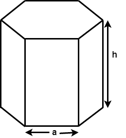
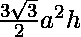

# 六角棱镜的表面积和体积

> 原文:[https://www . geeksforgeeks . org/六棱柱的表面积和体积/](https://www.geeksforgeeks.org/surface-area-and-volume-of-hexagonal-prism/)

给定六角棱镜的底边和高度，任务是找到六角棱镜的表面积和体积。在数学中，六棱柱是一种三维立体形状，有 8 个面、18 条边和 12 个顶点。两端的两个面是六边形，六边形棱镜的其余面是矩形。



其中 **a** 为基长， **h** 为六角棱镜的高度。

> 表面积= 
> 体积= 

**例:**

```
Input : a = 4, h = 3
Output : Surface Area: 155.138443
         Volume: 124.707657

Input : a = 5, h = 10
Output : Surface Area: 429.904
         Volume: 649.519
```

## C++

```
// C++ program to find the Surface Area
// and Volume of Hexagonal Prism.

#include <bits/stdc++.h>
using namespace std;

// Function to calculate Surface area
void findSurfaceArea(float a, float h)
{
    float Area;

    // Formula to calculate surface area
    Area = 6 * a * h + 3 * sqrt(3) * a * a;

    // Display surface area
    cout << "Surface Area: " << Area;
    cout << "\n";
}

// Function to calculate Volume
void findVolume(float a, float h)
{
    float Volume;

    // formula to calculate Volume
    Volume = 3 * sqrt(3) * a * a * h / 2;

    // Display Volume
    cout << "Volume: " << Volume;
}

// Driver Code
int main()
{
    float a = 5, h = 10;

    // surface area function call
    findSurfaceArea(a, h);

    // volume function call
    findVolume(a, h);

    return 0;
}
```

## Java 语言(一种计算机语言，尤用于创建网站)

```
// Java program to find the Surface Area
// and Volume of Hexagonal Prism.

import java.io.*;

class GFG {

    // Function to calculate Surface area
    static void findSurfaceArea(float a, float h)
    {
        float Area;

        // Formula to calculate surface area
        Area = 6 * a * h + 3 * (float)(Math.sqrt(3)) * a * a;

        // Display surface area
        System.out.println("Surface Area: " + Area);
    }

    // Function to calculate Volume
    static void findVolume(float a, float h)
    {
        float Volume;

        // formula to calculate Volume
        Volume = 3 * (float)(Math.sqrt(3)) * a * a * h / 2;

        // Display Volume
        System.out.println("Volume: " + Volume);
    }

    // Driver code
    public static void main (String[] args)
    {
        float a = 5, h = 10;

        // surface area function call
        findSurfaceArea(a, h);

        // volume function call
        findVolume(a, h);
    }
}
```

## 蟒蛇 3

```
# Python3 program to find the
# Surface Area and Volume
# of Hexagonal Prism.
import math

# Function to calculate
# Surface area
def findSurfaceArea(a, h):
    Area = 0;

    # Formula to calculate
    # surface area
    Area = (6 * a * h +
            3 * math.sqrt(3) * a * a);

    # Display surface area
    print("Surface Area:",
          round(Area, 3));

# Function to
# calculate Volume
def findVolume(a, h):
    Volume = 0;

    # formula to
    # calculate Volume
    Volume = (3 * math.sqrt(3) *
                a * a * h / 2);

    # Display Volume
    print("Volume:",
           round(Volume, 3));

# Driver Code
a = 5;
h = 10;

# surface area
# function call
findSurfaceArea(a, h);

# volume function call
findVolume(a, h);

# This code is contributed
# by mits
```

## C#

```
// C# program to find the
// Surface Area and Volume
// of Hexagonal Prism.
using System;

class GFG
{

    // Function to calculate
    // Surface area
    static void findSurfaceArea(float a,
                                float h)
    {
        float Area;

        // Formula to calculate
        // surface area
        Area = 6 * a * h + 3 *
               (float)(Math.Sqrt(3)) * a * a;

        // Display surface area
        Console.WriteLine("Surface Area: " +
                                      Area);
    }

    // Function to
    // calculate Volume
    static void findVolume(float a,
                           float h)
    {
        float Volume;

        // formula to calculate Volume
        Volume = 3 * (float)(Math.Sqrt(3)) *
                              a * a * h / 2;

        // Display Volume
        Console.WriteLine("Volume: " +
                              Volume);
    }

    // Driver code
    public static void Main ()
    {
        float a = 5, h = 10;

        // surface area
        // function call
        findSurfaceArea(a, h);

        // volume function call
        findVolume(a, h);
    }
}

// This code is contributed
// by anuj_67.
```

## 服务器端编程语言（Professional Hypertext Preprocessor 的缩写）

```
<?php
// PHP program to find the
// Surface Area and Volume
// of Hexagonal Prism.

// Function to calculate
// Surface area
function findSurfaceArea($a, $h)
{
    $Area;

    // Formula to calculate
    // surface area
    $Area = 6 * $a * $h + 3 *
            sqrt(3) * $a * $a;

    // Display surface area
    echo "Surface Area: " ,
                $Area,"\n";

}

// Function to
// calculate Volume
function findVolume($a, $h)
{
    $Volume;

    // formula to
    // calculate Volume
    $Volume = 3 * sqrt(3) *
              $a * $a * $h / 2;

    // Display Volume
    echo "Volume: " , $Volume;
}

// Driver Code
$a = 5; $h = 10;

// surface area
// function call
findSurfaceArea($a, $h);

// volume function call
findVolume($a, $h);

// This code is contributed
// by anuj_67.
?>
```

## java 描述语言

```
<script>
// javascript program to find the Surface Area
// and Volume of Hexagonal Prism.

// Function to calculate Surface area
function findSurfaceArea( a,  h)
{
    let Area;

    // Formula to calculate surface area
    Area = 6 * a * h + 3 * Math.sqrt(3) * a * a;

    // Display surface area
    document.write( "Surface Area: " + Area.toFixed(3) + "<br/>");
}

// Function to calculate Volume
function findVolume( a,  h)
{
    let Volume;

    // formula to calculate Volume
    Volume = 3 * Math.sqrt(3) * a * a * h / 2;

    // Display Volume
    document.write( "Volume: " + Volume.toFixed(3));
}

// Driver Code
    let a = 5, h = 10;

    // surface area function call
    findSurfaceArea(a, h);

    // volume function call
    findVolume(a, h);

// This code is contributed by todaysgaurav

</script>
```

**Output:** 

```
Surface Area: 429.904
Volume: 649.519
```