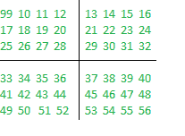
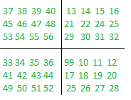

# 在矩阵的任意两个给定象限之间交换元素

> 原文:[https://www . geeksforgeeks . org/在矩阵的任意两个给定象限之间交换元素/](https://www.geeksforgeeks.org/swap-the-elements-between-any-two-given-quadrants-of-a-matrix/)

给定一个大小为 **N * M** 的[矩阵](https://www.geeksforgeeks.org/matrix/)、 **mat[][]** ，其中 **N** 和 **M** 始终为*偶数*，以及两个整数 **X** 和 **Y** ，任务是将象限 **X** 象限的所有元素与给定矩阵的象限 **Y** 的所有对应元素进行交换。

***注:**左上角、右上角、左下角、右下角象限分别编号为 1、2、3* 、*和 4。*
**例:**

> **输入:** mat[][] = {{99，10，11，12，13，14，15，16}，{17，18，19，20，21，22，23，24}，{25，26，27，28，29，30，31，32}，{33，34，35，36，37，38，39，40}，{41，42，43 } { 53、54、55、56、29、30、31、32}、{33、34、35、36、99、10、11、12}、{41、42、43、44、17、18、19、20}、{49、50、51、52、25、26、27、28}}
> **解释:**
> 给定矩阵:
> 
> 
> 
> 用矩阵的第四象限替换矩阵的第一象限:
> 
> 
> 
> **输入:** mat[][] = {{1，2}，{3，4}}，X = 1，Y = 4
> **输出:** {{4，2}，{3，1}}

**方法:**想法是迭代矩阵的 **X** 象限，并将其元素与 **Y** 象限的相应元素交换。当尺寸为 **N*M** 的矩阵**mat【】【】【】**是相同的条件时，得到任意象限的起始位置:

*   **象限 1:** 该象限的起始位置为 **(0，0)** 。
*   **象限 2:** 该象限的起始位置为 **(0，M/2)** 。
*   **象限 3:** 该象限的起始位置为 **(N/2，0)** 。
*   **象限 4:** 该象限的起始位置为 **(N/2，M/2)** 。

按照以下步骤解决问题:

1.  从矩阵的起始位置开始，同时迭代矩阵的 **X** 和 **Y** 象限。
2.  现在，用 **Y** 象限的相应索引元素交换 **X** 象限的元素。
3.  执行所有交换操作后，打印矩阵 **mat[][]** 的所有元素。

以下是上述方法的实现:

## C++

```
// C++ program for
// the above approach
#include<bits/stdc++.h>
using namespace std;
#define N 6
#define M 6

// Function to iterate over the X
// quadrant and swap its element
// with Y quadrant
void swap(int mat[N][M],
          int startx_X, int starty_X,
          int startx_Y, int starty_Y)
{
  int row = 0;
  int col = 0;

  // Iterate over X quadrant
  for (int i = startx_X;; i++)
  {
    col = 0;

    for (int j = startx_X;; j++)
    {
      // Swap operations
      int temp = mat[i][j];

      mat[i][j] = mat[startx_Y + row][starty_Y + col];
      mat[startx_Y + row][starty_Y + col] = temp;
      col++;
      if (col >= M / 2)
        break;
    }
    row++;

    if (row >= N / 2)
      break;
  }
}

// Function to print the matrix
void printMat(int mat[N][M])
{
  // Iterate over the rows
  for (int i = 0; i < N; i++)
  {
    // Iterate over the cols
    for (int j = 0; j < M; j++)
    {
      cout << mat[i][j] << " ";
    }
    cout << endl;
  }
}

// Function to swap the elements
// of the two given quadrants
static void swapQuadOfMatrix(int mat[N][M],
                             int X, int Y)
{
  // Swapping the coordinates on
  // basis of the value of X and Y

  // For Swapping 1st and 2nd Quadrant
  if (X == 1 && Y == 2)
  {
    swap(mat, 0, 0, 0, M / 2);
  }

  // For Swapping 1st and 3rd Quadrant
  else if (X == 1 && Y == 3)
  {
    swap(mat, 0, 0, N / 2, 0);
  }

  // For Swapping 1st and 4th Quadrant
  else if (X == 1 && Y == 4)
  {
    swap(mat, 0, 0, N / 2, M / 2);
  }

  // For Swapping 2nd and 3rd Quadrant
  else if (X == 2 && Y == 3)
  {
    swap(mat, 0, M / 2, N / 2, 0);
  }

  // For Swapping 2nd and 4th Quadrant
  else if (X == 2 && Y == 4)
  {
    swap(mat, 0, M / 2, N / 2, M / 2);
  }

  // For Swapping 3rd and 4th Quadrant
  else if (X == 3 && Y == 4)
  {
    swap(mat, N / 2, 0, N / 2, M / 2);
  }

  // Print the resultant matrix
  printMat(mat);
}

// Driver Code
int main()
{
  // Given matrix

  int mat[][M] = {{1, 2, 3, 4, 5, 6},
                  {7, 8, 9, 10, 11, 12},
                  {13, 14, 15, 16, 17, 18},
                  {19, 20, 21, 22, 23, 24},
                  {25, 26, 27, 28, 29, 30},
                  {31, 32, 33, 34, 35, 36}};

  // Given quadrants
  int X = 1, Y = 4;

  // Function Call
  swapQuadOfMatrix(mat, X, Y);
}

// This code is contributed by shikhasingrajput
```

## Java 语言(一种计算机语言，尤用于创建网站)

```
// Java program for the above approach

public class Main {

    // Function to iterate over the X
    // quadrant and swap its element
    // with Y quadrant
    static void swap(
        int N, int M, int mat[][],
        int startx_X, int starty_X,
        int startx_Y, int starty_Y)
    {

        int row = 0;
        int col = 0;

        // Iterate over X quadrant
        for (int i = startx_X;; i++) {

            col = 0;

            for (int j = startx_X;; j++) {

                // Swap operations
                int temp = mat[i][j];

                mat[i][j]
                    = mat[startx_Y + row][starty_Y + col];
                mat[startx_Y + row][starty_Y + col] = temp;

                col++;
                if (col >= M / 2)
                    break;
            }
            row++;

            if (row >= N / 2)
                break;
        }
    }

    // Function to swap the elements
    // of the two given quadrants
    static void swapQuadOfMatrix(
        int N, int M,
        int mat[][], int X, int Y)
    {
        // Swapping the coordinates on
        // basis of the value of X and Y

        // For Swapping 1st and 2nd Quadrant
        if (X == 1 && Y == 2) {
            swap(N, M, mat, 0, 0, 0, M / 2);
        }

        // For Swapping 1st and 3rd Quadrant
        else if (X == 1 && Y == 3) {
            swap(N, M, mat, 0, 0, N / 2, 0);
        }

        // For Swapping 1st and 4th Quadrant
        else if (X == 1 && Y == 4) {
            swap(N, M, mat, 0, 0, N / 2, M / 2);
        }

        // For Swapping 2nd and 3rd Quadrant
        else if (X == 2 && Y == 3) {
            swap(N, M, mat, 0,
                 M / 2, N / 2, 0);
        }

        // For Swapping 2nd and 4th Quadrant
        else if (X == 2 && Y == 4) {
            swap(N, M, mat, 0, M / 2,
                 N / 2, M / 2);
        }

        // For Swapping 3rd and 4th Quadrant
        else if (X == 3 && Y == 4) {
            swap(N, M, mat, N / 2, 0,
                 N / 2, M / 2);
        }

        // Print the resultant matrix
        printMat(N, M, mat);
    }

    // Function to print the matrix
    static void printMat(int N, int M,
                         int mat[][])
    {
        // Iterate over the rows
        for (int i = 0; i < N; i++) {

            // Iterate over the cols
            for (int j = 0; j < M; j++) {

                System.out.print(
                    mat[i][j] + " ");
            }
            System.out.println();
        }
    }

    // Driver Code
    public static void main(String[] args)
    {
        // Given matrix
        int N = 6, M = 6;
        int[][] mat = { { 1, 2, 3, 4, 5, 6 },
                        { 7, 8, 9, 10, 11, 12 },
                        { 13, 14, 15, 16, 17, 18 },
                        { 19, 20, 21, 22, 23, 24 },
                        { 25, 26, 27, 28, 29, 30 },
                        { 31, 32, 33, 34, 35, 36 } };

        // Given quadrants
        int X = 1, Y = 4;

        // Function Call
        swapQuadOfMatrix(N, M, mat, X, Y);
    }
}
```

## 蟒蛇 3

```
# Python3 program for
# the above approach
N, M = 6, 6

# Function to iterate over
# the X quadrant and swap
# its element with Y quadrant
def swap(mat, startx_X, starty_X,
         startx_Y, starty_Y):

    row,col = 0, 0

    # Iterate over X quadrant
    i = startx_X

    while(bool(True)):

        col = 0       
        j = startx_X

        while(bool(True)):

            # Swap operations
            temp = mat[i][j]

            mat[i][j] = mat[startx_Y + row][starty_Y + col]
            mat[startx_Y + row][starty_Y + col] = temp
            col += 1
            if col >= M // 2:
                break

            j += 1

        row += 1

        if row >= N // 2:
            break

        i += 1

# Function to print the
# matrix
def printMat(mat):

    # Iterate over the rows
    for i in range(N):

        # Iterate over the cols
        for j in range(M):       
            print(mat[i][j],
                  end = " ")

        print()

# Function to swap the
# elements of the two
# given quadrants
def swapQuadOfMatrix(mat, X, Y):

    # Swapping the coordinates
    # on basis of the value of
    # X and Y

    # For Swapping 1st and
    # 2nd Quadrant
    if (X == 1 and Y == 2):

        swap(mat, 0, 0,
             0, M // 2)

    # For Swapping 1st and
    # 3rd Quadrant
    elif (X == 1 and Y == 3):

        swap(mat, 0, 0,
             N // 2, 0)

    # For Swapping 1st and
    # 4th Quadrant
    elif (X == 1 and Y == 4):

        swap(mat, 0, 0,
             N // 2, M // 2)

    # For Swapping 2nd and
    # 3rd Quadrant
    elif (X == 2 and Y == 3):

        swap(mat, 0, M // 2,
             N // 2, 0)

    # For Swapping 2nd and
    # 4th Quadrant
    elif (X == 2 and Y == 4):

        swap(mat, 0, M // 2,
             N // 2, M // 2)

    # For Swapping 3rd and
    # 4th Quadrant
    elif (X == 3 and Y == 4):

        swap(mat, N // 2, 0,
             N // 2, M // 2)

    # Print the resultant
    # matrix
    printMat(mat)   

# Driver code
# Given matrix
mat = [[1, 2, 3, 4, 5, 6],
       [7, 8, 9, 10, 11, 12],
       [13, 14, 15, 16, 17, 18],
       [19, 20, 21, 22, 23, 24],
       [25, 26, 27, 28, 29, 30],
       [31, 32, 33, 34, 35, 36]]

# Given quadrants
X, Y = 1, 4

# Function Call
swapQuadOfMatrix(mat, X, Y)

# This code is contributed by divyeshrabadiya07
```

## C#

```
// C# program for
// the above approach
using System;
class GFG{

// Function to iterate over the X
// quadrant and swap its element
// with Y quadrant
static void swap(int N, int M, int [,]mat,
                 int startx_X, int starty_X,
                 int startx_Y, int starty_Y)
{
  int row = 0;
  int col = 0;

  // Iterate over X quadrant
  for (int i = startx_X;; i++)
  {
    col = 0;

    for (int j = startx_X;; j++)
    {
      // Swap operations
      int temp = mat[i, j];

      mat[i, j] = mat[startx_Y + row,
                      starty_Y + col];
      mat[startx_Y + row, starty_Y + col] = temp;

      col++;
      if (col >= M / 2)
        break;
    }
    row++;

    if (row >= N / 2)
      break;
  }
}

// Function to swap the elements
// of the two given quadrants
static void swapQuadOfMatrix(int N, int M,
                             int [,]mat,
                             int X, int Y)
{
  // Swapping the coordinates on
  // basis of the value of X and Y

  // For Swapping 1st and 2nd Quadrant
  if (X == 1 && Y == 2)
  {
    swap(N, M, mat, 0, 0, 0, M / 2);
  }

  // For Swapping 1st and 3rd Quadrant
  else if (X == 1 && Y == 3)
  {
    swap(N, M, mat, 0, 0, N / 2, 0);
  }

  // For Swapping 1st and 4th Quadrant
  else if (X == 1 && Y == 4)
  {
    swap(N, M, mat, 0, 0, N / 2, M / 2);
  }

  // For Swapping 2nd and 3rd Quadrant
  else if (X == 2 && Y == 3)
  {
    swap(N, M, mat, 0, M / 2, N / 2, 0);
  }

  // For Swapping 2nd and 4th Quadrant
  else if (X == 2 && Y == 4)
  {
    swap(N, M, mat, 0, M / 2, N / 2, M / 2);
  }

  // For Swapping 3rd and 4th Quadrant
  else if (X == 3 && Y == 4)
  {
    swap(N, M, mat, N / 2, 0, N / 2, M / 2);
  }

  // Print the resultant matrix
  printMat(N, M, mat);
}

// Function to print the matrix
static void printMat(int N, int M,
                     int [,]mat)
{
  // Iterate over the rows
  for (int i = 0; i < N; i++)
  {
    // Iterate over the cols
    for (int j = 0; j < M; j++)
    {
      Console.Write(mat[i, j] + " ");
    }
    Console.WriteLine();
  }
}

// Driver Code
public static void Main(String[] args)
{
  // Given matrix
  int N = 6, M = 6;
  int[,] mat = {{1, 2, 3, 4, 5, 6},
                {7, 8, 9, 10, 11, 12},
                {13, 14, 15, 16, 17, 18},
                {19, 20, 21, 22, 23, 24},
                {25, 26, 27, 28, 29, 30},
                {31, 32, 33, 34, 35, 36}};

  // Given quadrants
  int X = 1, Y = 4;

  // Function Call
  swapQuadOfMatrix(N, M, mat, X, Y);
}
}

// This code is contributed by gauravrajput1
```

## java 描述语言

```
<script>
// javascript program for the
// above approach

   // Function to iterate over the X
    // quadrant and swap its element
    // with Y quadrant
    function swap(
        N, M, mat,
        startx_X, starty_X,
        startx_Y, starty_Y)
    {

        let row = 0;
        let col = 0;

        // Iterate over X quadrant
        for (let i = startx_X;; i++)
        {
            col = 0;
            for (let j = startx_X;; j++) {

                // Swap operations
                let temp = mat[i][j];

                mat[i][j]
                    = mat[startx_Y + row][starty_Y + col];
                mat[startx_Y + row][starty_Y + col] = temp;

                col++;
                if (col >= M / 2)
                    break;
            }
            row++;

            if (row >= N / 2)
                break;
        }
    }

    // Function to swap the elements
    // of the two given quadrants
    function swapQuadOfMatrix(
        N, M, mat, X, Y)
    {
        // Swapping the coordinates on
        // basis of the value of X and Y

        // For Swapping 1st and 2nd Quadrant
        if (X == 1 && Y == 2) {
            swap(N, M, mat, 0, 0, 0, M / 2);
        }

        // For Swapping 1st and 3rd Quadrant
        else if (X == 1 && Y == 3) {
            swap(N, M, mat, 0, 0, N / 2, 0);
        }

        // For Swapping 1st and 4th Quadrant
        else if (X == 1 && Y == 4) {
            swap(N, M, mat, 0, 0, N / 2, M / 2);
        }

        // For Swapping 2nd and 3rd Quadrant
        else if (X == 2 && Y == 3) {
            swap(N, M, mat, 0,
                 M / 2, N / 2, 0);
        }

        // For Swapping 2nd and 4th Quadrant
        else if (X == 2 && Y == 4) {
            swap(N, M, mat, 0, M / 2,
                 N / 2, M / 2);
        }

        // For Swapping 3rd and 4th Quadrant
        else if (X == 3 && Y == 4) {
            swap(N, M, mat, N / 2, 0,
                 N / 2, M / 2);
        }

        // Print the resultant matrix
        prletMat(N, M, mat);
    }

    // Function to print the matrix
    function prletMat(N, M, mat)
    {
        // Iterate over the rows
        for (let i = 0; i < N; i++) {

            // Iterate over the cols
            for (let j = 0; j < M; j++) {

                document.write(
                    mat[i][j] + " ");
            }
            document.write("<br/>");
        }
    }

// Driver Code

     // Given matrix
        let N = 6, M = 6;
        let mat = [[ 1, 2, 3, 4, 5, 6 ],
                        [ 7, 8, 9, 10, 11, 12 ],
                        [ 13, 14, 15, 16, 17, 18 ],
                        [ 19, 20, 21, 22, 23, 24 ],
                        [ 25, 26, 27, 28, 29, 30 ],
                        [ 31, 32, 33, 34, 35, 36 ]];

        // Given quadrants
        let X = 1, Y = 4;

        // Function Call
        swapQuadOfMatrix(N, M, mat, X, Y);

// This code is contributed by avijitmondal1998.
</script>
```

**Output:** 

```
22 23 24 4 5 6 
28 29 30 10 11 12 
34 35 36 16 17 18 
19 20 21 1 2 3 
25 26 27 7 8 9 
31 32 33 13 14 15
```

***时间复杂度:**O(N<sup>2</sup>)*
***辅助空间:** O(1)*