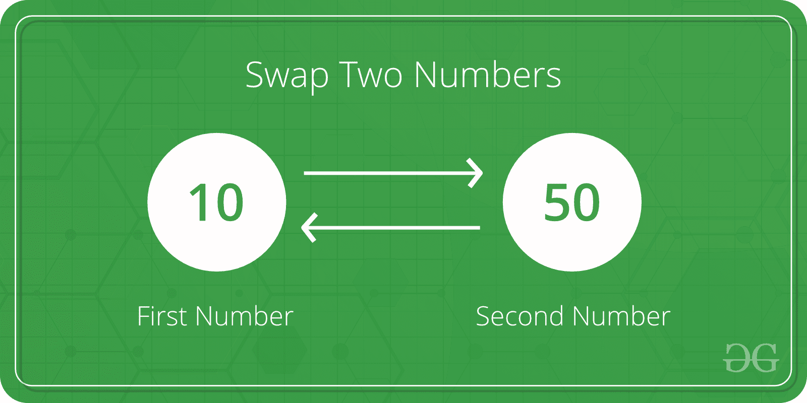

# 如何在不使用临时变量的情况下互换两个数？

> 原文:[https://www . geesforgeks . org/swap-两个数字-不使用临时变量/](https://www.geeksforgeeks.org/swap-two-numbers-without-using-temporary-variable/)

给定两个变量 x 和 y，交换两个变量而不使用第三个变量。



**方法 1(使用算术运算符)**

这个想法是得到两个给定数字中的一个的和。然后，可以使用总和和总和的减法来交换数字。

## C++

```
// C++ Program to swap two numbers  without
// using temporary variable
#include <bits/stdc++.h>
using namespace std;

int main()
{
    int x = 10, y = 5;

    // Code to swap 'x' and 'y'
    x = x + y; // x now becomes 15
    y = x - y; // y becomes 10
    x = x - y; // x becomes 5
    cout << "After Swapping: x =" << x << ", y=" << y;
}

// This code is contributed by mohit kumar.
```

## C

```
#include <stdio.h>
int main()
{
    int x = 10, y = 5;

    // Code to swap 'x' and 'y'
    x = x + y; // x now becomes 15
    y = x - y; // y becomes 10
    x = x - y; // x becomes 5

    printf("After Swapping: x = %d, y = %d", x, y);

    return 0;
}
```

## Java 语言(一种计算机语言，尤用于创建网站)

```
// Java Program to swap two numbers  without
// using temporary variable
import java.io.*;

class Geeks {

    public static void main(String a[])
    {
        int x = 10;
        int y = 5;
        x = x + y;
        y = x - y;
        x = x - y;
        System.out.println("After swaping:"
                           + " x = " + x + ", y = " + y);
    }
}

// This code is contributed by Mayank Tyagi
```

## 蟒蛇 3

```
x = 10
y = 5

# Code to swap 'x' and 'y'

# x now becomes 15
x = x + y

# y becomes 10
y = x - y

# x becomes 5
x = x - y
print("After Swapping: x =", x, " y =", y)

# This code is contributed
# by Sumit Sudhakar
```

## C#

```
// Program to swap two numbers  without
// using temporary variable
using System;

class GFG {
    public static void Main()
    {
        int x = 10;
        int y = 5;

        x = x + y;
        y = x - y;
        x = x - y;
        Console.WriteLine("After swapping: x = " + x
                          + ", y = " + y);
    }
}

// This code is contributed by Sam007
```

## 服务器端编程语言（Professional Hypertext Preprocessor 的缩写）

```
<?php
// PHP Program to swap two
// numbers without using
// temporary variable
$x = 10; $y = 5;

// Code to swap 'x' and 'y'
$x = $x + $y; // x now becomes 15
$y = $x - $y; // y becomes 10
$x = $x - $y; // x becomes 5

echo "After Swapping: x = ",
       $x, ", ", "y = ", $y;

// This code is contributed by m_kit
?>
```

## java 描述语言

```
<script>

// Javascript program to swap two
// numbers without using temporary
// variable

let x = 10, y = 5;

// Code to swap 'x' and 'y'

// x now becomes 15
x = x + y;

// y becomes 10
y = x - y;

// x becomes 5
x = x - y;

document.write("After Swapping: x =" + x + ", y=" + y);

// This code is contributed by mukesh07

</script>
```

**Output**

```
After Swapping: x =5, y=10
```

乘法和除法也可以用于交换。

## C++

```
// C++ Program to swap two numbers
// without using temporary variable
#include <bits/stdc++.h>
using namespace std;

int main()
{//NOTE - for this code to work in a generalised sense, y !- 0 to prevent zero division
    int x = 10, y = 5;

    // Code to swap 'x' and 'y'
    x = x * y; // x now becomes 50
    y = x / y; // y becomes 10
    x = x / y; // x becomes 5
    cout << "After Swapping: x =" << x << ", y=" << y;
}

// This code is contributed by mohit kumar.
```

## C

```
// C Program to swap two numbers
// without using temporary variable
#include <stdio.h>
int main()
{
    int x = 10, y = 5;

    // Code to swap 'x' and 'y'
    x = x * y; // x now becomes 50
    y = x / y; // y becomes 10
    x = x / y; // x becomes 5

    printf("After Swapping: x = %d, y = %d", x, y);

    return 0;
}
```

## Java 语言(一种计算机语言，尤用于创建网站)

```
// Java Program to swap two numbers
// without using temporary variable
import java.io.*;

class GFG {
    public static void main(String[] args)
    {
        int x = 10;
        int y = 5;

        // Code to swap 'x' and 'y'
        x = x * y; // x now becomes 50
        y = x / y; // y becomes 10
        x = x / y; // x becomes 5

        System.out.println("After swaping:"
                           + " x = " + x + ", y = " + y);
    }
}

// This code is contributed by ajit
```

## 蟒蛇 3

```
# Python3 program to
# swap two numbers
# without using
# temporary variable
x = 10
y = 5

# code to swap
# 'x' and 'y'

# x now becomes 50
x = x * y

# y becomes 10
y = x // y;

# x becomes 5
x = x // y;

print("After Swapping: x =",
              x, " y =", y);

# This code is contributed
# by @ajit
```

## C#

```
// C# Program to swap two
// numbers without using
// temporary variable
using System;

class GFG {
    static public void Main()
    {
        int x = 10;
        int y = 5;

        // Code to swap 'x' and 'y'
        x = x * y; // x now becomes 50
        y = x / y; // y becomes 10
        x = x / y; // x becomes 5

        Console.WriteLine("After swaping:"
                          + " x = " + x + ", y = " + y);
    }
}

// This code is contributed by ajit.
```

## 服务器端编程语言（Professional Hypertext Preprocessor 的缩写）

```
<?php
// Driver code
    $x = 10;
    $y = 5;

// Code to swap 'x' and 'y'
    $x = $x * $y; // x now becomes 50
    $y = $x / $y; // y becomes 10
    $x = $x / $y; // x becomes 5

echo "After Swapping: x = ", $x,
                " ", "y = ", $y;

// This code is contributed by m_kit
?>
```

## java 描述语言

```
<script>

// Javascript program to swap two numbers
// without using temporary variable
var x = 10;
var y = 5;

// Code to swap 'x' and 'y'
x = x * y; // x now becomes 50
y = x / y; // y becomes 10
x = x / y; // x becomes 5

document.write("After swaping:" + " x = " +
               x + ", y = " + y);

// This code is contributed by shikhasingrajput

</script>
```

**Output**

```
After Swapping: x =5, y=10
```

**方法 2(使用按位异或)**
按位异或运算符可用于交换两个变量。两个数字 x 和 y 的异或运算返回一个数字，无论 x 和 y 的位有什么不同，该数字的所有位都是 1。例如，10(二进制 1010)和 5(二进制 0101)的异或是 1111，7 (0111)和 5 (0101)的异或是(0010)。

## C++

```
// C++ code to swap using XOR
#include <bits/stdc++.h>

using namespace std;

int main()
{
    int x = 10, y = 5;
    // Code to swap 'x' (1010) and 'y' (0101)
    x = x ^ y; // x now becomes 15 (1111)
    y = x ^ y; // y becomes 10 (1010)
    x = x ^ y; // x becomes 5 (0101)
    cout << "After Swapping: x =" << x << ", y=" << y;
    return 0;
}

// This code is contributed by mohit kumar.
```

## C

```
// C code to swap using XOR
#include <stdio.h>
int main()
{
    int x = 10, y = 5;

    // Code to swap 'x' (1010) and 'y' (0101)
    x = x ^ y; // x now becomes 15 (1111)
    y = x ^ y; // y becomes 10 (1010)
    x = x ^ y; // x becomes 5 (0101)

    printf("After Swapping: x = %d, y = %d", x, y);

    return 0;
}
```

## Java 语言(一种计算机语言，尤用于创建网站)

```
// Java code to swap using XOR
import java.io.*;

public class GFG {

    public static void main(String a[])
    {
        int x = 10;
        int y = 5;

        // Code to swap 'x' (1010) and 'y' (0101)
        x = x ^ y; // x now becomes 15 (1111)
        y = x ^ y; // y becomes 10 (1010)
        x = x ^ y; // x becomes 5 (0101)

        System.out.println("After swap: x = "
                           + x + ", y = " + y);
    }
}

// This code is contributed by Mayank Tyagi
```

## 蟒蛇 3

```
# Python3 code to swap using XOR

x = 10
y = 5

# Code to swap 'x' and 'y'
x = x ^ y; # x now becomes 15 (1111)
y = x ^ y; # y becomes 10 (1010)
x = x ^ y; # x becomes 5 (0101)

print ("After Swapping: x = ", x, " y =", y)

# This code is contributed by
# Sumit Sudhakar
```

## C#

```
// C# program to swap using XOR
using System;

class GFG {
    public static void Main()
    {
        int x = 10;
        int y = 5;

        // Code to swap 'x' (1010)
        // and 'y' (0101)

        // x now becomes 15 (1111)
        x = x ^ y;

        // y becomes 10 (1010)
        y = x ^ y;

        // x becomes 5 (0101)
        x = x ^ y;

        Console.WriteLine("After swap: x = " + x + ", y = " + y);
    }
}

// This code is contributed by ajit
```

## 服务器端编程语言（Professional Hypertext Preprocessor 的缩写）

```
<?php

// Driver Code
$x = 10;
$y = 5;

// Code to swap 'x' (1010)
// and 'y' (0101)

// x now becomes 15 (1111)
$x = $x ^ $y;

// y becomes 10 (1010)
$y = $x ^ $y;

// x becomes 5 (0101)
$x = $x ^ $y;

echo "After Swapping: x = ", $x,
                ", ", "y = ", $y;

// This code is contributed by aj_36
?>
```

## java 描述语言

```
<script>

// Javascript code to swap using XOR

let x = 10, y = 5;

// Code to swap 'x' (1010) and 'y' (0101)
x = x ^ y; // x now becomes 15 (1111)
y = x ^ y; // y becomes 10 (1010)
x = x ^ y; // x becomes 5 (0101)

document.write("After Swapping: x =" +
               x + ", y=" + y);

// This code is contributed by Mayank Tyagi

</script>
```

**Output**

```
After Swapping: x =5, y=10
```

**上述方法的问题**
**1)** 如果一个数为 0，则基于乘法和除法的方法不起作用，因为乘积变为 0，而与另一个数无关。
**2)** 两种算术解都可能导致算术溢出。如果 x 和 y 太大，加法和乘法可能会超出整数范围。
**3)** 当我们使用指针指向变量并进行函数交换时，当两个指针都指向同一个变量时，上述所有方法都会失败。让我们看看如果两者都指向同一个变量，在这种情况下会发生什么。

//基于逐位异或的方法
x = x ^ x；// x 变成 0
x = x ^ x；// x 保持 0
x = x ^ x；// x 保持 0
//基于算术的方法
x = x+x；// x 变成 2x
x = x–x；// x 变为 0
x = x–x；// x 保持 0

让我们看看下面的程序。

## C++

```
#include <bits/stdc++.h>
using namespace std;
void swap(int* xp, int* yp)
{
    *xp = *xp ^ *yp;
    *yp = *xp ^ *yp;
    *xp = *xp ^ *yp;
}

// Driver code
int main()
{
    int x = 10;
    swap(&x, &x);
    cout << "After swap(&x, &x): x = " << x;
    return 0;
}

// This code is contributed by rathbhupendra
```

## C

```
#include <stdio.h>
void swap(int* xp, int* yp)
{
    *xp = *xp ^ *yp;
    *yp = *xp ^ *yp;
    *xp = *xp ^ *yp;
}

int main()
{
    int x = 10;
    swap(&x, &x);
    printf("After swap(&x, &x): x = %d", x);
    return 0;
}
```

## Java 语言(一种计算机语言，尤用于创建网站)

```
class GFG {
    static void swap(int[] xp, int[] yp)
    {
        xp[0] = xp[0] ^ yp[0];
        yp[0] = xp[0] ^ yp[0];
        xp[0] = xp[0] ^ yp[0];
    }

    // Driver code
    public static void main(String[] args)
    {
        int[] x = { 10 };
        swap(x, x);
        System.out.println("After swap(&x, &x): x = "
                           + x[0]);
    }
}

// This code is contributed by Rajput-Ji
```

## 蟒蛇 3

```
def swap(xp, yp):

    xp[0] = xp[0] ^ yp[0]
    yp[0] = xp[0] ^ yp[0]
    xp[0] = xp[0] ^ yp[0]

# Driver code
x = [10]
swap(x, x)
print("After swap(&x, &x): x = ", x[0])

# This code is contributed by SHUBHAMSINGH10
```

## C#

```
// C# program to implement
// the above approach
using System;
class GFG {

    static void swap(int[] xp, int[] yp)
    {
        xp[0] = xp[0] ^ yp[0];
        yp[0] = xp[0] ^ yp[0];
        xp[0] = xp[0] ^ yp[0];
    }

    // Driver code
    static void Main()
    {
        int[] x = { 10 };
        swap(x, x);
        Console.WriteLine("After swap(&x,"
                          + "&x): x = " + x[0]);
    }
}

// This code is contributed by divyeshrabadiya07
```

## 服务器端编程语言（Professional Hypertext Preprocessor 的缩写）

```
<?php
function swap(&$xp, &$yp)
{
    $xp = $xp ^ $yp;
    $yp = $xp ^ $yp;
    $xp = $xp ^ $yp;
}

// Driver Code
$x = 10;
swap($x, $x);
print("After swap(&x, &x): x = " . $x);

// This code is contributed
// by chandan_jnu
?>
```

## java 描述语言

```
<script>

    function swap(xp,yp)
    {
        xp[0] = xp[0] ^ yp[0];
        yp[0] = xp[0] ^ yp[0];
        xp[0] = xp[0] ^ yp[0];
    }

    // Driver code

    let x=[10];
    swap(x, x);
    document.write("After swap(&x, &x): x = "
                           + x[0]);

    // This code is contributed by unknown2108

</script>
```

**Output**

```
After swap(&x, &x): x = 0
```

在许多标准算法中，可能需要将变量与其自身进行交换。例如，参见[快速排序](http://geeksquiz.com/quick-sort/)的[这个](http://geeksquiz.com/quick-sort/)实现，我们可以用它自己交换一个变量。上述问题可以通过在交换之前设置一个条件来避免。

## C++

```
#include <bits/stdc++.h>
using namespace std;
void swap(int* xp, int* yp)
{

    // Check if the two addresses are same
    if (xp == yp)
        return;
    *xp = *xp + *yp;
    *yp = *xp - *yp;
    *xp = *xp - *yp;
}

// Driver Code
int main()
{
    int x = 10;
    swap(&x, &x);
    cout << "After swap(&x, &x): x = " << x;
    return 0;
}

// This code is contributed by rathbhupendra
```

## C

```
#include <stdio.h>
void swap(int* xp, int* yp)
{
    if (xp == yp) // Check if the two addresses are same
        return;
    *xp = *xp + *yp;
    *yp = *xp - *yp;
    *xp = *xp - *yp;
}
int main()
{
    int x = 10;
    swap(&x, &x);
    printf("After swap(&x, &x): x = %d", x);
    return 0;
}
```

## Java 语言(一种计算机语言，尤用于创建网站)

```
// Java program of above approach
class GFG {

    static void swap(int xp, int yp)
    {
        if (xp == yp) // Check if the two addresses are same
            return;
        xp = xp + yp;
        yp = xp - yp;
        xp = xp - yp;
    }

    // Driver code
    public static void main(String[] args)
    {
        int x = 10;
        swap(x, x);
        System.out.println("After swap(&x, &x): x = " + x);
    }
}

// This code is Contributed by Code_Mech.
```

## 蟒蛇 3

```
# Python3 program of above approach
def swap(xp, yp):

    # Check if the two addresses are same
    if (xp[0] == yp[0]):
        return
    xp[0] = xp[0] + yp[0]
    yp[0] = xp[0] - yp[0]
    xp[0] = xp[0] - yp[0]

# Driver Code
x = [10]
swap(x, x)
print("After swap(&x, &x): x = ", x[0])

# This code is contributed by SHUBHAMSINGH10
```

## C#

```
// C# program of above approach
using System;
class GFG {

    static void swap(int xp, int yp)
    {
        if (xp == yp) // Check if the two addresses are same
            return;
        xp = xp + yp;
        yp = xp - yp;
        xp = xp - yp;
    }

    // Driver code
    public static void Main()
    {
        int x = 10;
        swap(x, x);
        Console.WriteLine("After swap(&x, &x): x = " + x);
    }
}

// This code is Contributed by Code_Mech.
```

## 服务器端编程语言（Professional Hypertext Preprocessor 的缩写）

```
<?php
function swap($xp, $yp)
{
    // Check if the two addresses
    // are same
    if ($xp == $yp)
        return;
    $xp = $xp + $yp;
    $yp = $xp - $yp;
    $xp = $xp - $yp;
}

// Driver Code
$x = 10;
swap($x, $x);
echo("After swap(&x, &x): x = " . $x);
return 0;

// This code is contributed
// by Code_Mech.
```

## java 描述语言

```
<script>
   function swap(xp, yp)
{

    // Check if the two addresses are same
    if (xp == yp)
        return;
    xp[0] = xp[0] + yp[0];
    yp[0] = xp[0] - yp[0];
    xp[0]= xp[0] - yp[0];
}

// Driver Code
     x = 10;
    swap(x, x);
    document.write("After swap(&x , &x) : x = " + x);
//This code is contributed by simranarora5sos
</script>
```

**Output**

```
After swap(&x, &x): x = 10
```

**方法 3(按位运算符和算术运算符的混合)**
想法与**方法 1** 中讨论的相同，但使用按位加减进行交换。

下面是上述方法的实现。

## C++

```
// C++ program to swap two numbers.
// Including header file.
#include <bits/stdc++.h>
using namespace std;

// Function to swap the numbers.
void swap(int& a, int& b)
{
    // same as a = a + b
    a = (a & b) + (a | b);

    // same as b = a - b
    b = a + (~b) + 1;

    // same as a = a - b
    a = a + (~b) + 1;
}

// Driver Code
int main()
{
    int a = 5, b = 10;

    // Function Call
    swap(a, b);

    cout << "After swapping: a = " << a << ", b = " << b;

    return 0;
}

// This code is contributed by yashbeersingh42
```

## Java 语言(一种计算机语言，尤用于创建网站)

```
// Java program to swap two numbers
import java.io.*;

class GFG {
    public static void swap(int a, int b)
    {
        // same as a = a + b
        a = (a & b) + (a | b);

        // same as b = a - b
        b = a + (~b) + 1;

        // same as a = a - b
        a = a + (~b) + 1;

        System.out.print("After swapping: a = " + a
                         + ", b = " + b);
    }
    public static void main(String[] args)
    {
        int a = 5, b = 10;

        // Function Call
        swap(a, b);
    }
}

// This code is contributed by yashbeersingh42
```

## 蟒蛇 3

```
# Python3 program to swap two numbers

# Function to swap the numbers

def swap(a, b):

    # Same as a = a + b
    a = (a & b) + (a | b)

    # Same as b = a - b
    b = a + (~b) + 1

    # Same as a = a - b
    a = a + (~b) + 1

    print("After Swapping: a = ", a, ", b = ", b)

# Driver code
a = 5
b = 10

# Function call
swap(a, b)

# This code is contributed by bunnyram19
```

## C#

```
// C# program to swap two numbers
using System;
class GFG {

    static void swap(int a, int b)
    {
        // same as a = a + b
        a = (a & b) + (a | b);

        // same as b = a - b
        b = a + (~b) + 1;

        // same as a = a - b
        a = a + (~b) + 1;

        Console.Write("After swapping: a = " + a
                      + ", b = " + b);
    }

    static void Main()
    {
        int a = 5, b = 10;

        // Function Call
        swap(a, b);
    }
}

// This code is contributed by divyesh072019
```

## java 描述语言

```
<script>
    // Javascript program to swap two numbers

    function swap(a, b)
    {
        // same as a = a + b
        a = (a & b) + (a | b);

        // same as b = a - b
        b = a + (~b) + 1;

        // same as a = a - b
        a = a + (~b) + 1;

        document.write("After swapping: a = " + a + ", b = " + b);
    }

    let a = 5, b = 10;

    // Function Call
    swap(a, b);

    // This code is contributed by suresh07.
</script>
```

## 服务器端编程语言（Professional Hypertext Preprocessor 的缩写）

```
<?php

// Driver Code
$a = 5;
$b = 10;

echo("Before swap(a and b) " . $a . "and". $b."<br>");
// same as a = a + b
    $a = ($a & $b) + ($a | $b);

    // same as b = a - b
    $b = $a + (~$b) + 1;

    // same as a = a - b
    $a = $a + (~$b) + 1;

echo("After swap(a and b) " . $a. "and". $b);
return 0;

?>
```

**Output**

```
After swapping: a = 10, b = 5
```

要了解更多关于在一行中交换两个变量的信息，请点击这里的。

如果发现有不正确的地方，请写评论，或者想分享更多关于以上讨论话题的信息