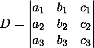
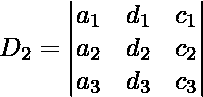
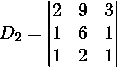

# 使用克莱姆法则的三变量线性方程组

> 原文:[https://www . geesforgeks . org/system-linear-方程组-三变量-使用-crames-rule/](https://www.geeksforgeeks.org/system-linear-equations-three-variables-using-cramers-rule/)

**克莱姆法则**:在线性代数中，克莱姆法则是求解一个方程个数和未知变量个数一样多的线性方程组的显式公式。它用系数矩阵的行列式表示解，并通过用方程右侧的列向量代替一列来表示从系数矩阵得到的矩阵。对于多于两个或三个方程的系统，克莱姆法则在计算上是低效的。
假设我们要解这些方程:
a<sub>1</sub>x+b<sub>1</sub>y+c<sub>1</sub>z = d<sub>1</sub>T12】a<sub>2</sub>x+b<sub>2</sub>y+c<sub>2</sub>z = d<sub>2</sub>T21】a<sub>3</sub>x+b<sub>3</sub>

[Tex]D _ 1 = \ begin { vmatrix } D _ 1&b _ 1&c _ 1 \ \ D _ 2&b _ 2&c _ 2 \ \ D _ 3&b _ 3&c _ 3 \ \ \ end { vmatrix }[/Tex][Tex]D _ 3 = \ begin { vmatrix } a _ 1&b _ 1&D _ 1 \ \ a _ 2&b _ 2&D

> 有 **2** 种情况:
> T3】种情况一:当 D ≠ 0 的时候在这种情况下我们有，
> x = D1/D
> y = D2/D
> z = D3/D
> 这样就会得到 x，y，z 的唯一值。
> **情况二**:当 D = 0 时
> (a)当 **D1、D2 和 D3 中至少有一个非零时**:则不可能有解，因此方程组不一致。
> (b)当 D = 0， **D1 = D2 = D3 = 0** :那么方程组将是一致的，它将有无穷多个解。

**例**

> 考虑下面的线性方程组。
> [2x–y+3z = 9]，[x + y + z = 6]，[x–y+z = 2]
> 
> [Tex]D _ 1 = \ begin { vmatrix } 9&-1&3 \ \ 6&1&1 \ \ 2&-1&1 \ \ \ end { vmatrix }[/Tex][Tex]D _ 3 = \ begin { vmatrix } 2&-1&9 \ \ 1&1&6 \ \ 1&-1&2 \ \ \ end { vmatrix }[/Tex]
> 
> [x = D <sub>1</sub> /D = 1]，[y = D <sub>2</sub> /D = 2]，[z = D <sub>3</sub> /D = 3]

下面是实现。

## C++

```
// CPP program to calculate solutions of linear
// equations using cramer's rule
#include <bits/stdc++.h>
using namespace std;

// This functions finds the determinant of Matrix
double determinantOfMatrix(double mat[3][3])
{
    double ans;
    ans = mat[0][0] * (mat[1][1] * mat[2][2] - mat[2][1] * mat[1][2])
          - mat[0][1] * (mat[1][0] * mat[2][2] - mat[1][2] * mat[2][0])
          + mat[0][2] * (mat[1][0] * mat[2][1] - mat[1][1] * mat[2][0]);
    return ans;
}

// This function finds the solution of system of
// linear equations using cramer's rule
void findSolution(double coeff[3][4])
{
    // Matrix d using coeff as given in cramer's rule
    double d[3][3] = {
        { coeff[0][0], coeff[0][1], coeff[0][2] },
        { coeff[1][0], coeff[1][1], coeff[1][2] },
        { coeff[2][0], coeff[2][1], coeff[2][2] },
    };
    // Matrix d1 using coeff as given in cramer's rule
    double d1[3][3] = {
        { coeff[0][3], coeff[0][1], coeff[0][2] },
        { coeff[1][3], coeff[1][1], coeff[1][2] },
        { coeff[2][3], coeff[2][1], coeff[2][2] },
    };
    // Matrix d2 using coeff as given in cramer's rule
    double d2[3][3] = {
        { coeff[0][0], coeff[0][3], coeff[0][2] },
        { coeff[1][0], coeff[1][3], coeff[1][2] },
        { coeff[2][0], coeff[2][3], coeff[2][2] },
    };
    // Matrix d3 using coeff as given in cramer's rule
    double d3[3][3] = {
        { coeff[0][0], coeff[0][1], coeff[0][3] },
        { coeff[1][0], coeff[1][1], coeff[1][3] },
        { coeff[2][0], coeff[2][1], coeff[2][3] },
    };

    // Calculating Determinant of Matrices d, d1, d2, d3
    double D = determinantOfMatrix(d);
    double D1 = determinantOfMatrix(d1);
    double D2 = determinantOfMatrix(d2);
    double D3 = determinantOfMatrix(d3);
    printf("D is : %lf \n", D);
    printf("D1 is : %lf \n", D1);
    printf("D2 is : %lf \n", D2);
    printf("D3 is : %lf \n", D3);

    // Case 1
    if (D != 0) {
        // Coeff have a unique solution. Apply Cramer's Rule
        double x = D1 / D;
        double y = D2 / D;
        double z = D3 / D; // calculating z using cramer's rule
        printf("Value of x is : %lf\n", x);
        printf("Value of y is : %lf\n", y);
        printf("Value of z is : %lf\n", z);
    }
    // Case 2
    else {
        if (D1 == 0 && D2 == 0 && D3 == 0)
            printf("Infinite solutions\n");
        else if (D1 != 0 || D2 != 0 || D3 != 0)
            printf("No solutions\n");
    }
}

// Driver Code
int main()
{

    // storing coefficients of linear equations in coeff matrix
    double coeff[3][4] = {
        { 2, -1, 3, 9 },
        { 1, 1, 1, 6 },
        { 1, -1, 1, 2 },
    };

    findSolution(coeff);
    return 0;
}
```

## Java 语言(一种计算机语言，尤用于创建网站)

```
// Java program to calculate solutions of linear
// equations using cramer's rule
class GFG
{

// This functions finds the determinant of Matrix
static double determinantOfMatrix(double mat[][])
{
    double ans;
    ans = mat[0][0] * (mat[1][1] * mat[2][2] - mat[2][1] * mat[1][2])
        - mat[0][1] * (mat[1][0] * mat[2][2] - mat[1][2] * mat[2][0])
        + mat[0][2] * (mat[1][0] * mat[2][1] - mat[1][1] * mat[2][0]);
    return ans;
}

// This function finds the solution of system of
// linear equations using cramer's rule
static void findSolution(double coeff[][])
{
    // Matrix d using coeff as given in cramer's rule
    double d[][] = {
        { coeff[0][0], coeff[0][1], coeff[0][2] },
        { coeff[1][0], coeff[1][1], coeff[1][2] },
        { coeff[2][0], coeff[2][1], coeff[2][2] },
    };

    // Matrix d1 using coeff as given in cramer's rule
    double d1[][] = {
        { coeff[0][3], coeff[0][1], coeff[0][2] },
        { coeff[1][3], coeff[1][1], coeff[1][2] },
        { coeff[2][3], coeff[2][1], coeff[2][2] },
    };

    // Matrix d2 using coeff as given in cramer's rule
    double d2[][] = {
        { coeff[0][0], coeff[0][3], coeff[0][2] },
        { coeff[1][0], coeff[1][3], coeff[1][2] },
        { coeff[2][0], coeff[2][3], coeff[2][2] },
    };

    // Matrix d3 using coeff as given in cramer's rule
    double d3[][] = {
        { coeff[0][0], coeff[0][1], coeff[0][3] },
        { coeff[1][0], coeff[1][1], coeff[1][3] },
        { coeff[2][0], coeff[2][1], coeff[2][3] },
    };

    // Calculating Determinant of Matrices d, d1, d2, d3
    double D = determinantOfMatrix(d);
    double D1 = determinantOfMatrix(d1);
    double D2 = determinantOfMatrix(d2);
    double D3 = determinantOfMatrix(d3);
    System.out.printf("D is : %.6f \n", D);
    System.out.printf("D1 is : %.6f \n", D1);
    System.out.printf("D2 is : %.6f \n", D2);
    System.out.printf("D3 is : %.6f \n", D3);

    // Case 1
    if (D != 0)
    {
        // Coeff have a unique solution. Apply Cramer's Rule
        double x = D1 / D;
        double y = D2 / D;
        double z = D3 / D; // calculating z using cramer's rule
        System.out.printf("Value of x is : %.6f\n", x);
        System.out.printf("Value of y is : %.6f\n", y);
        System.out.printf("Value of z is : %.6f\n", z);
    }

    // Case 2
    else
    {
        if (D1 == 0 && D2 == 0 && D3 == 0)
            System.out.printf("Infinite solutions\n");
        else if (D1 != 0 || D2 != 0 || D3 != 0)
            System.out.printf("No solutions\n");
    }
}

// Driver Code
public static void main(String[] args)
{
    // storing coefficients of linear
    // equations in coeff matrix
    double coeff[][] = {{ 2, -1, 3, 9 },
                        { 1, 1, 1, 6 },
                        { 1, -1, 1, 2 }};
    findSolution(coeff);
    }
}

// This code is contributed by PrinciRaj1992
```

## 蟒蛇 3

```
# Python3 program to calculate
# solutions of linear equations
# using cramer's rule

# This functions finds the
# determinant of Matrix
def determinantOfMatrix(mat):

    ans = (mat[0][0] * (mat[1][1] * mat[2][2] -
                        mat[2][1] * mat[1][2]) -
           mat[0][1] * (mat[1][0] * mat[2][2] -
                        mat[1][2] * mat[2][0]) +
           mat[0][2] * (mat[1][0] * mat[2][1] -
                        mat[1][1] * mat[2][0]))
    return ans

# This function finds the solution of system of
# linear equations using cramer's rule
def findSolution(coeff):

    # Matrix d using coeff as given in
    # cramer's rule
    d = [[coeff[0][0], coeff[0][1], coeff[0][2]],
         [coeff[1][0], coeff[1][1], coeff[1][2]],
         [coeff[2][0], coeff[2][1], coeff[2][2]]]

    # Matrix d1 using coeff as given in
    # cramer's rule
    d1 = [[coeff[0][3], coeff[0][1], coeff[0][2]],
          [coeff[1][3], coeff[1][1], coeff[1][2]],
          [coeff[2][3], coeff[2][1], coeff[2][2]]]

    # Matrix d2 using coeff as given in
    # cramer's rule
    d2 = [[coeff[0][0], coeff[0][3], coeff[0][2]],
          [coeff[1][0], coeff[1][3], coeff[1][2]],
          [coeff[2][0], coeff[2][3], coeff[2][2]]]

    # Matrix d3 using coeff as given in
    # cramer's rule
    d3 = [[coeff[0][0], coeff[0][1], coeff[0][3]],
          [coeff[1][0], coeff[1][1], coeff[1][3]],
          [coeff[2][0], coeff[2][1], coeff[2][3]]]

    # Calculating Determinant of Matrices
    # d, d1, d2, d3
    D = determinantOfMatrix(d)
    D1 = determinantOfMatrix(d1)
    D2 = determinantOfMatrix(d2)
    D3 = determinantOfMatrix(d3)

    print("D is : ", D)
    print("D1 is : ", D1)
    print("D2 is : ", D2)
    print("D3 is : ", D3)

    # Case 1
    if (D != 0):

        # Coeff have a unique solution.
        # Apply Cramer's Rule
        x = D1 / D
        y = D2 / D

        # calculating z using cramer's rule
        z = D3 / D 

        print("Value of x is : ", x)
        print("Value of y is : ", y)
        print("Value of z is : ", z)

    # Case 2
    else:
        if (D1 == 0 and D2 == 0 and
            D3 == 0):
            print("Infinite solutions")
        elif (D1 != 0 or D2 != 0 or
              D3 != 0):
            print("No solutions")

# Driver Code
if __name__ == "__main__":

    # storing coefficients of linear
    # equations in coeff matrix
    coeff = [[2, -1, 3, 9],
             [1, 1, 1, 6],
             [1, -1, 1, 2]]

    findSolution(coeff)

# This code is contributed by Chitranayal
```

## C#

```
// C# program to calculate solutions of linear
// equations using cramer's rule
using System;

class GFG
{

// This functions finds the determinant of Matrix
static double determinantOfMatrix(double [,]mat)
{
    double ans;
    ans = mat[0,0] * (mat[1,1] * mat[2,2] - mat[2,1] * mat[1,2])
        - mat[0,1] * (mat[1,0] * mat[2,2] - mat[1,2] * mat[2,0])
        + mat[0,2] * (mat[1,0] * mat[2,1] - mat[1,1] * mat[2,0]);
    return ans;
}

// This function finds the solution of system of
// linear equations using cramer's rule
static void findSolution(double [,]coeff)
{
    // Matrix d using coeff as given in cramer's rule
    double [,]d = {
        { coeff[0,0], coeff[0,1], coeff[0,2] },
        { coeff[1,0], coeff[1,1], coeff[1,2] },
        { coeff[2,0], coeff[2,1], coeff[2,2] },
    };

    // Matrix d1 using coeff as given in cramer's rule
    double [,]d1 = {
        { coeff[0,3], coeff[0,1], coeff[0,2] },
        { coeff[1,3], coeff[1,1], coeff[1,2] },
        { coeff[2,3], coeff[2,1], coeff[2,2] },
    };

    // Matrix d2 using coeff as given in cramer's rule
    double [,]d2 = {
        { coeff[0,0], coeff[0,3], coeff[0,2] },
        { coeff[1,0], coeff[1,3], coeff[1,2] },
        { coeff[2,0], coeff[2,3], coeff[2,2] },
    };

    // Matrix d3 using coeff as given in cramer's rule
    double [,]d3 = {
        { coeff[0,0], coeff[0,1], coeff[0,3] },
        { coeff[1,0], coeff[1,1], coeff[1,3] },
        { coeff[2,0], coeff[2,1], coeff[2,3] },
    };

    // Calculating Determinant of Matrices d, d1, d2, d3
    double D = determinantOfMatrix(d);
    double D1 = determinantOfMatrix(d1);
    double D2 = determinantOfMatrix(d2);
    double D3 = determinantOfMatrix(d3);
    Console.Write("D is : {0:F6} \n", D);
    Console.Write("D1 is : {0:F6} \n", D1);
    Console.Write("D2 is : {0:F6} \n", D2);
    Console.Write("D3 is : {0:F6} \n", D3);

    // Case 1
    if (D != 0)
    {
        // Coeff have a unique solution. Apply Cramer's Rule
        double x = D1 / D;
        double y = D2 / D;
        double z = D3 / D; // calculating z using cramer's rule
        Console.Write("Value of x is : {0:F6}\n", x);
        Console.Write("Value of y is : {0:F6}\n", y);
        Console.Write("Value of z is : {0:F6}\n", z);
    }

    // Case 2
    else
    {
        if (D1 == 0 && D2 == 0 && D3 == 0)
            Console.Write("Infinite solutions\n");
        else if (D1 != 0 || D2 != 0 || D3 != 0)
            Console.Write("No solutions\n");
    }
}

// Driver Code
public static void Main()
{
    // storing coefficients of linear
    // equations in coeff matrix
    double [,]coeff = {{ 2, -1, 3, 9 },
                        { 1, 1, 1, 6 },
                        { 1, -1, 1, 2 }};
    findSolution(coeff);
    }
}

// This code is contributed by 29AjayKumar
```

## java 描述语言

```
<script>
// Javascript program to calculate solutions of linear
// equations using cramer's rule

// This functions finds the determinant of Matrix
function determinantOfMatrix(mat)
{
    let ans;
    ans = mat[0][0] * (mat[1][1] * mat[2][2] - mat[2][1] * mat[1][2])
        - mat[0][1] * (mat[1][0] * mat[2][2] - mat[1][2] * mat[2][0])
        + mat[0][2] * (mat[1][0] * mat[2][1] - mat[1][1] * mat[2][0]);
    return ans;

}

// This function finds the solution of system of
// linear equations using cramer's rule
function findSolution(coeff)
{
// Matrix d using coeff as given in cramer's rule
    let d = [[coeff[0][0], coeff[0][1], coeff[0][2]],
         [coeff[1][0], coeff[1][1], coeff[1][2]],
         [coeff[2][0], coeff[2][1], coeff[2][2]]];

    // Matrix d1 using coeff as given in cramer's rule
    let d1 = [[coeff[0][3], coeff[0][1], coeff[0][2]],
          [coeff[1][3], coeff[1][1], coeff[1][2]],
          [coeff[2][3], coeff[2][1], coeff[2][2]]];

    // Matrix d2 using coeff as given in cramer's rule     
    let d2 = [[coeff[0][0], coeff[0][3], coeff[0][2]],
          [coeff[1][0], coeff[1][3], coeff[1][2]],
          [coeff[2][0], coeff[2][3], coeff[2][2]]];

    // Matrix d3 using coeff as given in cramer's rule
    let d3 = [[coeff[0][0], coeff[0][1], coeff[0][3]],
          [coeff[1][0], coeff[1][1], coeff[1][3]],
          [coeff[2][0], coeff[2][1], coeff[2][3]]];

    // Calculating Determinant of Matrices d, d1, d2, d3
    let D = determinantOfMatrix(d);
    let D1 = determinantOfMatrix(d1);
    let D2 = determinantOfMatrix(d2);
    let D3 = determinantOfMatrix(d3);

    document.write("D is :  ", D.toFixed(6)+"<br>");
    document.write("D1 is : ", D1.toFixed(6)+"<br>");
    document.write("D2 is : ", D2.toFixed(6)+"<br>");
    document.write("D3 is : ", D3.toFixed(6)+"<br>");

    // Case 1
    if (D != 0)
    {
        // Coeff have a unique solution. Apply Cramer's Rule
        let x = D1 / D;
        let y = D2 / D;
        let z = D3 / D; // calculating z using cramer's rule
        document.write("Value of x is : ", x.toFixed(6)+"<br>");
        document.write("Value of y is : ", y.toFixed(6)+"<br>");
        document.write("Value of z is : ", z.toFixed(6)+"<br>");
    }

    // Case 2
    else
    {
        if (D1 == 0 && D2 == 0 && D3 == 0)
            document.write("Infinite solutions\n");
        else if (D1 != 0 || D2 != 0 || D3 != 0)
            document.write("No solutions\n");
    }
}

// Driver Code
let coeff = [[2, -1, 3, 9],
             [1, 1, 1, 6],
             [1, -1, 1, 2]]

findSolution(coeff);

    // This code is contributed by avanitrachhadiya2155
</script>
```

```
Output:
D is : -2.000000 
D1 is : -2.000000 
D2 is : -4.000000 
D3 is : -6.000000 
Value of x is : 1.000000
Value of y is : 2.000000
Value of z is : 3.000000
```