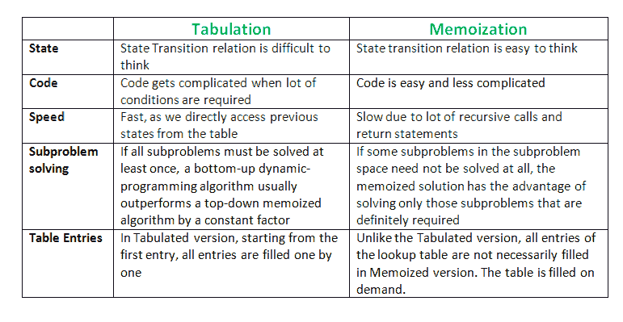

# 制表与记忆

> 原文:[https://www.geeksforgeeks.org/tabulation-vs-memoization/](https://www.geeksforgeeks.org/tabulation-vs-memoization/)

先决条件–[动态规划](https://www.geeksforgeeks.org/dynamic-programming-set-1/)、[如何解决动态规划问题？](https://www.geeksforgeeks.org/solve-dynamic-programming-problem/)
有两种不同的方法来存储值，以便子问题的值可以被重用。在这里，将讨论解决动态规划(DP)问题的两种模式:

1.  **制表:**自下而上
2.  **记忆化:**自上而下

在获得上述两个术语的定义之前，请考虑以下陈述:

*   **版本 1** :我会从 GeeksforGeeks 学习 DP 理论，然后在经典 DP 上练习一些问题，从而掌握 DP。
*   **第二版**:要掌握 DP，我就要练习动态题和练习题——首先，我要学习 GeeksforGeeks 的一些 DP 理论

两个版本说的是同一件事，区别仅仅在于传达信息的方式，这正是自下而上和自上而下的 DP 所做的。版本 1 可以与自下而上的 DP 相关，版本 2 可以与自上而下的 DP 相关。

**制表方法–自下而上动态编程**

顾名思义，从底部开始，积累到顶部的答案。让我们从状态转换的角度来讨论。

让我们描述一个状态，我们的 DP 问题是 dp[x]，dp[0]作为基础状态，dp[n]作为我们的目的地状态。因此，我们需要找到目的地状态的值，即 dp[n]。
如果我们从我们的基础状态即 dp[0]开始我们的转换，并遵循我们的状态转换关系到达我们的目的状态 dp[n]，我们称之为自下而上的方法，因为很明显，我们从底部基础状态开始我们的转换，并到达最上面的期望状态。

**现在，为什么我们称之为** **制表法？**

为了了解这一点，让我们首先编写一些代码，使用自下而上的方法计算一个数的阶乘。同样，作为我们解决 DP 的一般程序，我们首先定义一个状态。在这种情况下，我们将状态定义为 dp[x]，其中 dp[x]是求 x 的阶乘。

现在，很明显 dp[x+1] = dp[x] * (x+1)

```
// Tabulated version to find factorial x.
int dp[MAXN];

// base case
int dp[0] = 1;
for (int i = 1; i< =n; i++)
{
    dp[i] = dp[i-1] * i;
}
```

上面的代码显然遵循自下而上的方法，因为它从最底层的基本情况 dp[0]开始转换，并到达其目标状态 dp[n]。这里，我们可能会注意到 DP 表是按顺序填充的，我们直接从表本身访问计算的状态，因此，我们称之为制表方法。

**记忆方法–自顶向下动态编程**

我们再一次用状态转移来描述它。如果我们需要找到某个状态(比如 dp[n])的值，而不是从基本状态(即 dp[0])开始，我们会根据状态转换关系从可以到达目标状态 dp[n]的状态中询问答案，那么这就是 dp 的自上而下方式。

在这里，我们从最上面的目的地状态开始我们的旅程，并通过计算可以到达目的地状态的状态值来计算它的答案，直到我们到达最下面的基本状态。

再次，让我们以自上而下的方式
编写阶乘问题的代码

```
// Memoized version to find factorial x.
// To speed up we store the values
// of calculated states

// initialized to -1
int dp[MAXN]

// return fact x!
int solve(int x)
{
    if (x==0)
        return 1;
    if (dp[x]!=-1)
        return dp[x];
    return (dp[x] = x * solve(x-1));
}
```

正如我们所看到的，我们将最新的缓存存储到了一个极限，这样，如果下次我们收到来自相同状态的调用，我们只需从内存中返回它。这就是为什么我们称之为记忆，因为我们存储的是最近的状态值。

在这种情况下，内存布局是线性的，这就是为什么看起来内存是以类似制表方法的顺序方式填充的，但是您可以考虑任何其他具有 2D 内存布局的自顶向下的 DP，如[最小成本路径](https://www.geeksforgeeks.org/dynamic-programming-set-6-min-cost-path/)，这里内存不是以顺序方式填充的。



本文由 [**尼提什·库马尔**](https://www.linkedin.com/in/nk17kumar/) 供稿。如果你喜欢 GeeksforGeeks 并想投稿，你也可以用它写一篇文章或者把你的文章邮寄到 review-team@geeksforgeeks.org。看到你的文章出现在极客博客主页上，帮助其他极客。

如果你发现任何不正确的地方，或者你想分享更多关于上面讨论的话题的信息，请写评论。