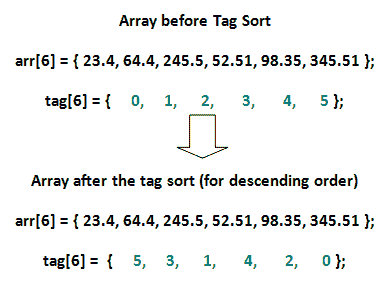

# 标签排序(既要排序又要原始)

> 原文:[https://www.geeksforgeeks.org/tag-sort/](https://www.geeksforgeeks.org/tag-sort/)

这不是一个新的排序算法，而是当我们需要避免大对象的交换或者需要以原始和排序顺序访问大数组的元素时的一个想法。
常见的排序任务是使用类似[快速排序](https://www.geeksforgeeks.org/quick-sort/)、[冒泡排序](https://www.geeksforgeeks.org/bubble-sort/)的排序算法对数组元素进行排序..等等，但有时我们需要保持实际数组的完整性，并在排序时使用“标记”数组来存储数组的正确位置。当我们想要以排序的方式访问元素时，我们可以使用这个“标记”数组。

**为什么要使用标签排序？**

当我们在大对象数组上操作时，交换这些大对象可能成本太高。毕竟这是关于磁盘交换的，我们想尽量减少它！

*   标记排序允许在用原始对象标记整数数组后对其进行排序。
*   反过来，我们只交换标记数组整数，而不是对象的大数组。
*   在排序过程中，实际的元素没有改变。标签数组中的位置正在改变，因此它们在排序时将保持元素的正确顺序。

在本例中，arr[]中的原始元素没有改变，但是标记[]中的原始元素被操作。标记[]数组现在将保存 arr[]中元素的正确下标顺序，因此当调用标记[]数组时，该数组可以按降序排序。
[](https://media.geeksforgeeks.org/wp-content/uploads/Tag-Sort1.png)

另一个例子，假设我们有下面的 Person 对象，它固有地占用大量内存(以 GB 或数百 MB 为单位)。

```
class Person 
{
    private int id;
    private float salary;
    private Object someBigObject = new Object(); 
    public Person(int id, float salary) 
    { }
    public float getSalary() 
    { }
    public String toString() 
    { }
}

```

因此，在这些对象周围移动可能不切实际，因为磁盘寻找交换会占用大量时间。为了避免这种情况，我们首先创建一个标签数组。

*   每个 person 对象都被标记为标记数组中的一个元素，我们交换标记[]整数，而不是交换 Person 对象进行基于工资的排序。
*   在打印排序的数组时，我们从标记数组中得到提示，打印排序的人员数组。
*   最终，我们将避免交换大型人物对象。

以下是上述想法的实现。

```
// Java Program to illustrate Tag Sort. This code
// uses Bubble Sort to modify tag array according
// to salaries. We can use other optimized sorting
// techniques also.
class Person
{
    private int id;
    private float salary;
    private Object someBigObject = new Object();

    public Person(int id, float salary)
    {
        this.id = id;
        this.salary = salary;
    }

    public float getSalary()
    {
        return salary;
    }

    @Override
    public String toString()
    {
        return "Person{" +
               "id=" + id +
               ", salary=" + salary +
               ", someBigObject=" + someBigObject +
               '}';
    }
}

public class Main
{
    public static void main(String[] args)
    {
        // Creating objects and their original
        // order (in tag array)
        int n = 5;
        Person persons[] = new Person[n];
        persons[0] = new Person(0, 233.5f);
        persons[1] = new Person(1, 23f);
        persons[2] = new Person(2, 13.98f);
        persons[3] = new Person(3, 143.2f);
        persons[4] = new Person(4, 3f);
        int tag[] = new int[n];
        for (int i = 0; i < n; i++)
            tag[i] = i;

        // Every Person object is tagged to
        // an element in the tag array.
        System.out.println("Given Person and Tag ");
        for (int i = 0; i < n; i++)
            System.out.println(persons[i] +
                               " : Tag: " + tag[i]);

        // Modifying tag array so that we can access
        // persons in sorted order.
        tagSort(persons, tag);

        System.out.println("New Tag Array after "+
                           "getting sorted as per Person[] ");
        for (int i=0; i<n; i++)
            System.out.println(tag[i]);

        // Accessing persons in sorted (by salary)
        // way using modified tag array.
        for (int i = 0; i < n; i++)
            System.out.println(persons[tag[i]]);
    }

    // Modifying tag array so that we can access
    // persons in sorted order of salary.
    public static void tagSort(Person persons[],
                               int tag[])
    {
        int n = persons.length;
        for (int i=0; i<n; i++)
        {
            for (int j=i+1; j<n; j++)
            {
                if (persons[tag[i]].getSalary() >
                        persons[tag[j]].getSalary())
                {
                    // Note we are not sorting the
                    // actual Persons array, but only
                    // the tag array
                    int temp = tag[i];
                    tag[i] = tag[j];
                    tag[j] = temp;
                }
            }
        }
    }
}
```

输出:

```
Given Person and Tag 
Person{id=0, salary=233.5, someBigObject=java.lang.Object@15db9742} : Tag: 0
Person{id=1, salary=23.0, someBigObject=java.lang.Object@6d06d69c} : Tag: 1
Person{id=2, salary=13.98, someBigObject=java.lang.Object@7852e922} : Tag: 2
Person{id=3, salary=143.2, someBigObject=java.lang.Object@4e25154f} : Tag: 3
Person{id=4, salary=3.0, someBigObject=java.lang.Object@70dea4e} : Tag: 4
New Tag Array after getting sorted as per Person[] 
4
2
1
3
0
Person{id=4, salary=3.0, someBigObject=java.lang.Object@70dea4e}
Person{id=2, salary=13.98, someBigObject=java.lang.Object@7852e922}
Person{id=1, salary=23.0, someBigObject=java.lang.Object@6d06d69c}
Person{id=3, salary=143.2, someBigObject=java.lang.Object@4e25154f}
Person{id=0, salary=233.5, someBigObject=java.lang.Object@15db9742}

```

本文由 **[日视维尔马](https://www.linkedin.com/in/rishitios/)** 供稿。如果你喜欢 GeeksforGeeks 并想投稿，你也可以使用[write.geeksforgeeks.org](https://write.geeksforgeeks.org)写一篇文章或者把你的文章邮寄到 review-team@geeksforgeeks.org。看到你的文章出现在极客博客主页上，帮助其他极客。

如果你发现任何不正确的地方，或者你想分享更多关于上面讨论的话题的信息，请写评论。