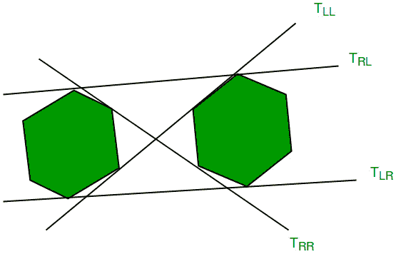
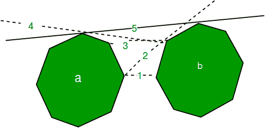

# 两个凸多边形之间的切线

> 原文:[https://www.geeksforgeeks.org/tangents-two-convex-polygons/](https://www.geeksforgeeks.org/tangents-two-convex-polygons/)

给定两个凸多边形，我们需要找到这些多边形的上下切线。
如下图所示，和分别显示上下切线。



示例:

```
Input : First Polygon  : {(2, 2), (3, 3), (5, 2), (4, 0), (3, 1)} 
        Second Polygon : {(-1, 0), (0, 1), (1, 0), (0, -2)}.
Output : Upper Tangent - line joining (0,1) and (3,3)
         Lower Tangent - line joining (0,-2) and (4,0)
```

**概述:**
让我们有两个如图所示的凸多边形，



为了找到上切线，我们从两点开始。a 的最右边的点和 b 的最左边的点。连接它们的线被标记为 1。因为这条线穿过多边形 b(不在多边形 b 的上方)，所以我们在 b 上逆时针取下一个点，这条线被标记为 2。现在线在多边形 b 上面，好！但是这条线与多边形 a 相交，所以我们顺时针移动到下一个点，在图中标记为 3。这再次穿过多边形 a，所以我们移动到第 4 行。这条线穿过 b，所以我们移到 5 号线。现在这条线没有穿过这两个点。这是给定多边形的上切线。
为了找到下切线，我们需要在多边形中反向移动，即如果直线与多边形 b 相交，我们将顺时针移动到下一个，如果直线与多边形 a 相交，我们将逆时针移动到下一个。
**上切线的算法:**

```
L <- line joining the rightmost point of a
     and leftmost point of b. 
while (L crosses any of the polygons)
{
    while(L crosses b)
        L <- L' : the point on b moves up.
    while(L crosses a)
        L <- L' : the point on a moves up.
}
```

**下切线的算法:**

```
L <- line joining the rightmost point of a 
      and leftmost point of b. 
while (L crosses any of the polygons)
{
    while (L crosses b)
       L <- L' : the point on b moves down.
    while (L crosses a)
       L <- L' : the point on a moves down.
}
```

**示例:**

## 卡片打印处理机（Card Print Processor 的缩写）

```
// C++ program to find upper tangent of two polygons.
#include<bits/stdc++.h>
using namespace std;

// stores the center of polygon (It is made
// global because it is used in compare function)
pair<int,int> mid;

// determines the quadrant of a point
// (used in compare())
int quad(pair<int,int> p)
{
    if (p.first >= 0 && p.second >= 0)
        return 1;
    if (p.first <= 0 && p.second >= 0)
        return 2;
    if (p.first <= 0 && p.second <= 0)
        return 3;
    return 4;
}

// Checks whether the line is crossing the polygon
int orientation(pair<int,int> a, pair<int,int> b,
                                 pair<int,int> c)
{
    int res = (b.second-a.second)*(c.first-b.first) -
              (c.second-b.second)*(b.first-a.first);

    if (res == 0)
        return 0;
    if (res > 0)
        return 1;
    return -1;
}

// compare function for sorting
bool compare(pair<int,int> p1, pair<int,int> q1)
{
    pair<int,int> p = make_pair(p1.first - mid.first,
                                p1.second - mid.second);
    pair<int,int> q = make_pair(q1.first - mid.first,
                                q1.second - mid.second);

    int one = quad(p);
    int two = quad(q);

    if (one != two)
        return (one < two);
    return (p.second*q.first < q.second*p.first);
}

// Finds upper tangent of two polygons 'a' and 'b'
// represented as two vectors.
void findUpperTangent(vector<pair<int,int> > a,
                      vector<pair<int,int> > b)
{
    // n1 -> number of points in polygon a
    // n2 -> number of points in polygon b
    int n1 = a.size(), n2 = b.size();

    // To find a point inside the convex polygon(centroid),
    // we sum up all the coordinates and then divide  by
    // n(number of points). But this would be a floating-point
    // value. So to get rid of this we multiply points
    // initially with n1 and then find the centre and
    // then divided it by n1 again.
    // Similarly we do divide and multiply for n2 (i.e.,
    // elements of b)

    // maxa and minb are used to check if polygon a
    // is left of b.
    int maxa = INT_MIN;
    for (int i=0; i<n1; i++)
    {
        maxa = max(maxa, a[i].first);
        mid.first  += a[i].first;
        mid.second += a[i].second;
        a[i].first *= n1;
        a[i].second *= n1;
    }

    // sorting the points in counter clockwise order
    // for polygon a
    sort(a.begin(), a.end(), compare);

    for (int i=0; i<n1; i++)
    {
        a[i].first /= n1;
        a[i].second /= n1;
    }

    mid = {0, 0};

    int minb = INT_MAX;
    for (int i=0; i<n2; i++)
    {
        mid.first += b[i].first;
        mid.second += b[i].second;
        minb = min(minb, b[i].first);
        b[i].first *= n2;
        b[i].second *= n2;
    }

    // sorting the points in counter clockwise
    // order for polygon b
    sort(b.begin(), b.end(), compare);

    for (int i=0; i<n2; i++)
    {
        b[i].first/=n2;
        b[i].second/=n2;
    }

    // If a is to the right of b, swap a and b
    // This makes sure a is left of b.
    if (minb < maxa)
    {
        a.swap(b);
        n1 = a.size();
        n2 = b.size();
    }

    // ia -> rightmost point of a
    int ia = 0, ib = 0;
    for (int i=1; i<n1; i++)
        if (a[i].first > a[ia].first)
            ia = i;

    // ib -> leftmost point of b
    for (int i=1; i<n2; i++)
        if (b[i].first < b[ib].first)
            ib=i;

    // finding the upper tangent
    int inda = ia, indb = ib;
    bool done = 0;
    while (!done)
    {
        done = 1;
        while (orientation(b[indb], a[inda], a[(inda+1)%n1]) > 0)
            inda = (inda + 1) % n1;

        while (orientation(a[inda], b[indb], b[(n2+indb-1)%n2]) < 0)
        {
            indb = (n2+indb-1)%n2;
            done = 0;
        }
    }

    cout << "upper tangent (" << a[inda].first << ","
        << a[inda].second << ") (" << b[indb].first
        << "," << b[indb].second << ")\n";
}

// Driver code
int main()
{
    vector<pair<int,int> > a;
    a.push_back({2, 2});
    a.push_back({3, 1});
    a.push_back({3, 3});
    a.push_back({5, 2});
    a.push_back({4, 0});

    vector<pair<int,int> > b;
    b.push_back({0, 1});
    b.push_back({1, 0});
    b.push_back({0, -2});
    b.push_back({-1, 0});

    findUpperTangent(a, b);

    return 0;
}
```

输出:

```
Upper tangent (0,1) (3,3)
```

注意，上面的代码只找到上切线。我们同样可以找到下切线。
本文由[阿姆利则瓦格米](https://www.facebook.com/amritya.vagmi)投稿，想要投稿，也可以使用[write.geeksforgeeks.org](https://write.geeksforgeeks.org)写一篇，或者将文章邮寄到 review-team@geeksforgeeks.org。看到你的文章出现在极客博客主页上，帮助其他极客。
如果发现有不正确的地方，或者想分享更多关于上述话题的信息，请写评论。