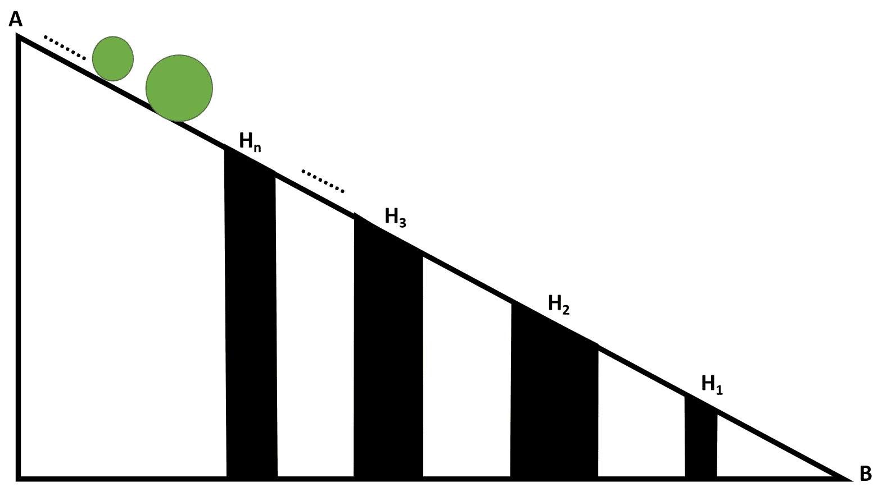

# TCS Codevita |孔和球

> 原文:[https://www.geeksforgeeks.org/tcs-codevita-holes-and-balls/](https://www.geeksforgeeks.org/tcs-codevita-holes-and-balls/)

给定两个分别由 **N** 和 **M** 整数组成的 **H[]** 和 **B[]** 数组，分别表示孔和球的直径。 **M** 数量的球在带有 **N** 孔的斜面上从 **A** 滚动到 **B** ，各孔深度不同，如下图所示:

[](https://media.geeksforgeeks.org/wp-content/uploads/20200918200154/HolesandBalls.jpg)

任务是根据球被释放的顺序找到每个球的最终位置，考虑以下因素:

*   如果球的直径小于或等于洞的直径，它就会掉进洞里。
*   一个洞**H<sub>I</sub>T3】会变满，如果 **i** 号球落入其中。**
*   如果一个洞满了，就不会再有球掉进去了。
*   一个球将从 **A** 到达 **B** ，如果并且仅当它没有落入任何一个孔中。
*   如果一个球在洞**P<sub>I</sub>T3】，那么它的位置就是 **i** 。如果一个球到达了底点 B，那么把它的位置作为 **0** 。**

**示例:**

> **输入:** H[] = {21，3，6}，B[] = {20，15，5，7，10，4，2，1，3，6，8}
> **输出:**1 0 3 0 3 3 2 0 0
> T6】解释:T8】直径 20 的球将落入孔 H <sub>1</sub> 中，孔 H <sub>1</sub> 将变满。
> 直径为 15、7、10 的球将到达底部，因为孔 H <sub>1</sub> 已满，孔 H <sub>2</sub> 和 H <sub>3</sub> 的直径小于球的直径。
> 直径为 5、4、2 的球会掉入 H 孔 <sub>3</sub> 。
> 直径为 1 的球会掉入孔 H <sub>2</sub> 中，因为孔 H <sub>3</sub> 已经满了。
> 直径为 3 的球会落入 H 孔 <sub>2</sub> 中。
> 直径为 6、8 的球将到达最低点 b。
> 球 20 的位置为 1，因为它在孔 H <sub>1</sub> 中。
> 球 15、7、10、3、6、8 的位置为 0，因为它们到达了底点 B.
> 因此，直径为 5、4、2 的球在第 3 孔 H <sub>3</sub> 中，直径为 1、3 的球在第 2 孔 H <sub>2</sub> 中。
> 
> **输入:** H[] = {20，15，10，5，25}，B[] = {5，10，15，20，25，30，4，9，14，19 }
> T3】输出:5 5 5 5 0 4 3 2 1

**方法:**按照以下步骤解决问题:

*   初始化一个大小为 **N** 的数组**位置[]** 存储每个球的最终位置，初始化一个大小为 **N** 的数组**深度[]** 存储每个洞的容量。
*   使用变量 **i** 迭代范围**【1，N】**，并将**孔【I】**的初始**深度【I】**设置为 **i+1** 。
*   [使用变量 **i** 遍历阵列](https://www.geeksforgeeks.org/c-program-to-traverse-an-array/) **球[]** ，并执行以下操作:
    *   使用变量 **j** 以相反的顺序迭代数组**孔【】**。
        *   检查孔的直径是否大于或等于球的直径，即**孔[j] ≥球[i]** ，如果该孔未满，即深度 **[j] > 0** ，则通过将 **j + 1** 附加在**位置【】**阵列中，并将孔的深度递减 **1** 和[以断开回路](https://www.geeksforgeeks.org/break-statement-cc/)[的方式将球放入该孔中](https://www.geeksforgeeks.org/break-statement-cc/)
    *   如果球不适合任何洞(已经到达斜坡的末端)，则在**位置[]** 数组中追加 0。
*   完成上述步骤后，打印存储在数组**位置[]** 的值作为结果。

下面是上述方法的实现:

## 蟒蛇 3

```
# Python program for the above approach

# Function to find and print the final
# position of balls
def ballPositionFinder(diameter_of_holes,
                       diameter_of_balls):

    max_hole_limit_counter = []
    position_value = []

    # Stores the positions of balls
    ball_positions = []

    # Determine the maximum balls a hole
    # can store and note the position
    # of holes in position_value
    for i in range(1, len(diameter_of_holes)+1):
        max_hole_limit_counter.append(i)
        position_value.append(i)

    # Iterate over all possible holes
    # for every ball released
    for i in range(0, len(diameter_of_balls)):
        for j in range(1, len(diameter_of_holes)+1):

            # Place ball in hole if it fits
            # in and if hole is not full
            if (diameter_of_holes[-j] >= diameter_of_balls[i]) and (
                    max_hole_limit_counter[-j] != 0):

                ball_positions.append(position_value[-j])
                max_hole_limit_counter[-j] -= 1
                break

            # If ball has reached at end B
            if j == len(diameter_of_holes):
                ball_positions.append(0)
                break

    return ball_positions

# Driver Code
if __name__ == "__main__":

    diameter_of_holes = [21, 3, 6]

    diameter_of_balls = [20, 15, 5, 7, 10, 4,
                         2, 1, 3, 6, 8]

    # Function Call
    output = ballPositionFinder(diameter_of_holes,
                                diameter_of_balls)
    print(*output, sep =' ')
```

**Output:**

```
1 0 3 0 0 3 3 2 2 0 0

```

***时间复杂度:** O(N*M)*
***辅助空间:** O(N)*