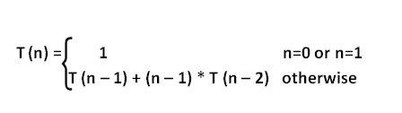

# 电话号码

> 原文:[https://www.geeksforgeeks.org/telephone-number/](https://www.geeksforgeeks.org/telephone-number/)

在数学中，**电话号码对合号码**是一个整数序列，它计算具有 **n** 用户的电话系统中连接模式的数量，其中连接是在用户对之间进行的。这些数还描述了 n 个顶点的完全图的匹配数、n 个对合元素上的置换数、埃尔米特多项式的系数绝对值之和、具有 n 个单元的标准 Young tableaux 数以及对称群的不可约表示的次数之和。
电话号码还用于计算将 **n** 车放置在 **n x n** 棋盘上的方式，即没有两个车相互攻击，并且车的配置在棋盘的对角反射下是对称的。
电话号码可以通过以下递归关系来评估:



给定正整数 **n** 。任务是找到第 n 个电话号码。
**例:**

```
Input : n = 4
Output : 10

Input : n = 6
Output : 76
```

下面是基于上述递归公式寻找第 n 个电话号码的天真实现。

## C++

```
// CPP Program to find the nth telephone number.
#include <bits/stdc++.h>
using namespace std;

// return the nth telephone number
int telephonenumber(int n)
{
    // base step
    if (n == 0 || n == 1)
        return 1;

    // recursive step
    return telephonenumber(n - 1) +
          (n - 1) * telephonenumber(n - 2);
}

// Driven Program
int main()
{
    int n = 6;
    cout << telephonenumber(n) << endl;
    return 0;
}
```

## Java 语言(一种计算机语言，尤用于创建网站)

```
// JAVA Code to find the nth
// telephone number.
import java.util.*;

class GFG {

    // return the nth telephone number
    static int telephonenumber(int n)
    {
        // base step
        if (n == 0 || n == 1)
            return 1;

        // recursive step
        return telephonenumber(n - 1) +
              (n - 1) * telephonenumber(n - 2);
    }

    /* Driver program to test above function */
    public static void main(String[] args)
    {
        int n = 6;
        System.out.println(telephonenumber(n));
    }
}

// This code is contributed by Arnav Kr. Mandal.   
```

## 蟒蛇 3

```
# Python3 code to find the
# nth telephone number.

# return the nth telephone number
def telephonenumber (n):

    # base step
    if n == 0 or n == 1:
        return 1

    # recursive step
    return (telephonenumber(n - 1) + (n - 1)
            * telephonenumber(n - 2))

# Driven Program
n = 6
print(telephonenumber(n))

# This code is contributed by "Sharad_Bhardwaj".
```

## C#

```
// C# Code to find the nth
// telephone number.
using System;

class GFG {

    // return the nth telephone number
    static int telephonenumber(int n)
    {
        // base step
        if (n == 0 || n == 1)
            return 1;

        // recursive step
        return telephonenumber(n - 1) +
            (n - 1) * telephonenumber(n - 2);
    }

    /* Driver program to test above function */
    public static void Main()
    {
        int n = 6;

        Console.Write(telephonenumber(n));
    }
}

// This code is contributed by vt_m.
```

## 服务器端编程语言（Professional Hypertext Preprocessor 的缩写）

```
<?php
// PHP Program to find
// the nth telephone number

// return the nth
// telephone number
function telephonenumber( $n)
{
    // base step
    if ($n == 0 or $n == 1)
        return 1;

    // recursive step
    return telephonenumber($n - 1) +
        ($n - 1) * telephonenumber($n - 2);
}

// Driven Code
$n = 6;
echo telephonenumber($n) ;

// This code is contributed by anuj_67.
?>
```

## java 描述语言

```
<script>

// Javascript Program to find
// the nth telephone number.

// return the nth telephone number
function telephonenumber(n)
{
    // base step
    if (n == 0 || n == 1)
        return 1;

    // recursive step
    return telephonenumber(n - 1) +
          (n - 1) * telephonenumber(n - 2);
}

// Driven Program
var n = 6;
document.write( telephonenumber(n));

</script>
```

**输出:**

```
76
```

下面是使用动态编程找到第 n 个电话号码的有效实现:

## C++

```
// CPP Program to find the nth telephone number.
#include <bits/stdc++.h>
using namespace std;

// return the nth telephone number
int telephonenumber(int n)
{
    int dp[n + 1];
    memset(dp, 0, sizeof(dp));

    // Base case
    dp[0] = dp[1] = 1;

    // finding ith telephone number, where 2 <= i <= n.
    for (int i = 2; i <= n; i++)
        dp[i] = dp[i - 1] + (i - 1) * dp[i - 2];

    return dp[n];
}

// Driver Program
int main()
{
    int n = 6;
    cout << telephonenumber(n) << endl;
    return 0;
}
```

## Java 语言(一种计算机语言，尤用于创建网站)

```
// JAVA Code to find nth Telephone Number
import java.util.*;

class GFG {

    // return the nth telephone number
    static int telephonenumber(int n)
    {
        int dp[] = new int[n + 1];

        // Base case
        dp[0] = dp[1] = 1;

        // finding ith telephone number,
        // where 2 <= i <= n.
        for (int i = 2; i <= n; i++)
            dp[i] = dp[i - 1] + (i - 1) * dp[i - 2];

        return dp[n];
    }

    /* Driver program to test above function */
    public static void main(String[] args)
    {
         int n = 6;
         System.out.println(telephonenumber(n));
    }
}

// This code is contributed by Arnav Kr. Mandal.
```

## 蟒蛇 3

```
# Python3 code to find the
# nth telephone number.

# return the nth telephone number
def telephonenumber (n):
    dp = [0] * (n + 1)

    # Base case
    dp[0] = dp[1] = 1

    # finding ith telephone number,
    # where 2 <= i <= n.
    for i in range(2, n + 1):
        dp[i] = dp[i - 1] + (i - 1) * dp[i - 2]

    return dp[n]

# Driver Code
n = 6
print(telephonenumber(n))

# This code is contributed by "Sharad_Bhardwaj".
```

## C#

```
// C# Code to find nth Telephone Number
using System;

class GFG {

    // return the nth telephone number
    static int telephonenumber(int n)
    {
        int[] dp = new int[n + 1];

        // Base case
        dp[0] = dp[1] = 1;

        // finding ith telephone number,
        // where 2 <= i <= n.
        for (int i = 2; i <= n; i++)
            dp[i] = dp[i - 1] + (i - 1) * dp[i - 2];

        return dp[n];
    }

    /* Driver program to test above function */
    public static void Main()
    {
        int n = 6;

        Console.Write(telephonenumber(n));
    }
}

// This code is contributed by vt_m.
```

## 服务器端编程语言（Professional Hypertext Preprocessor 的缩写）

```
<?php
// PHP Program to find
// the nth telephone number.

// return the nth telephone number
function telephonenumber($n)
{
    $dp = array();

    // Base case
    $dp[0] = $dp[1] = 1;

    // finding ith telephone number,
    // where 2 <= i <= n.
    for ( $i = 2; $i <= $n; $i++)
        $dp[$i] = $dp[$i - 1] +
                     ($i - 1) *
                   $dp[$i - 2];

    return $dp[$n];
}

// Driver Code
$n = 6;
echo telephonenumber($n);

// This code is contributed by anuj_67.
?>
```

## java 描述语言

```
<script>

// JavaScript Program to find nth Telephone Number

    // return the nth telephone number
    function telephonenumber(n)
    {
        let dp = [];

        // Base case
        dp[0] = dp[1] = 1;

        // finding ith telephone number,
        // where 2 <= i <= n.
        for (let i = 2; i <= n; i++)
            dp[i] = dp[i - 1] + (i - 1) * dp[i - 2];

        return dp[n];
    }

// Driver code
        let n = 6;
        document.write(telephonenumber(n));

        // This code is contributed by sanjoy_62.
</script>
```

**输出:**

```
76
```