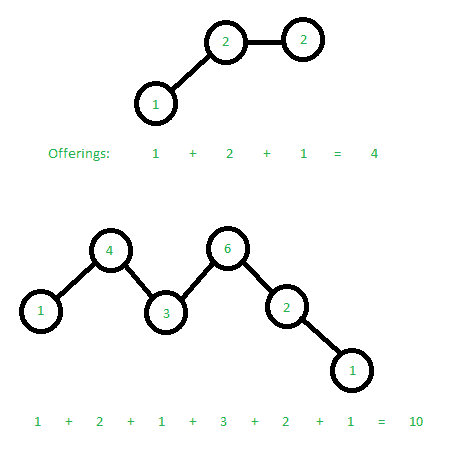

# 寺庙祭品

> 原文:[https://www.geeksforgeeks.org/temple-offerings/](https://www.geeksforgeeks.org/temple-offerings/)

考虑一个奉献者希望给寺庙和山脉供品。寺庙在不同的高度排成一排。每座寺庙至少应该收到一份祭品。如果两个相邻的寺庙在不同的高度，那么较高的寺庙应该比较低的寺庙得到更多的祭品。如果两个相邻的寺庙在同一高度，那么他们的祭品相对于彼此并不重要。给定寺庙的数量和寺庙的高度，找到最小数量的祭品。

**示例:**

```
Input  : 3
         1 2 2
Output : 4
All temples must receive at-least one offering.
Now, the second temple is at a higher altitude
compared to the first one. Thus it receives one
extra offering. 
The second temple and third temple are at the 
same height, so we do not need to modify the 
offerings. Offerings given are therefore: 1, 2,
1 giving a total of 4.

Input  : 6
         1 4 3 6 2 1
Output : 10
We can distribute the offerings in the following
way, 1, 2, 1, 3, 2, 1\. The second temple has to 
receive more offerings than the first due to its 
height being higher. The fourth must receive more
than the fifth, which in turn must receive more 
than the sixth. Thus the total becomes 10.
```

我们注意到，每座寺庙可以在它旁边的寺庙的上方、下方或同一水平。如图所示，每座寺庙所需的供品等于寺庙链条在较低高度的最大长度。



**天真的方法**
为了遵循给定的规则，寺庙必须提供至少 x+1，其中 x 是以下两个中的最大值。

1.  左边寺庙的数量在增加。
2.  右边寺庙的数量在增加。

解决这个问题的一个天真的方法是，对于每个寺庙，向左移动直到海拔升高，然后对右边也这样做。

## C++

```
// Program to find minimum total offerings required
#include <iostream>
using namespace std;

// Returns minimum offerings required
int offeringNumber(int n, int templeHeight[])
{
    int sum = 0;  // Initialize result

    // Go through all templs one by one
    for (int i = 0; i < n; ++i)
    {
        // Go to left while height keeps increasing
        int left = 0, right = 0;
        for (int j = i - 1; j >= 0; --j)
        {
            if (templeHeight[j] < templeHeight[j + 1])
                ++left;
            else
                break;
        }

        // Go to right while height keeps increasing
        for (int j = i + 1; j < n; ++j)
        {
            if (templeHeight[j] < templeHeight[j - 1])
                ++right;
            else
                break;
        }

        // This temple should offer maximum of two
        // values to follow the rule.
        sum += max(right, left) + 1;
    }

    return sum;
}

// Driver code
int main()
{
    int arr1[3] = {1, 2, 2};
    cout << offeringNumber(3, arr1) << "\n";
    int arr2[6] = {1, 4, 3, 6, 2, 1};
    cout << offeringNumber(6, arr2) << "\n";
    return 0;
}
```

## Java 语言(一种计算机语言，尤用于创建网站)

```
// Program to find minimum
// total offerings required
import java.io.*;

class GFG
{

// Returns minimum
// offerings required
static int offeringNumber(int n,
                          int templeHeight[])
{
    int sum = 0; // Initialize result

    // Go through all
    // temples one by one
    for (int i = 0; i < n; ++i)
    {
        // Go to left while
        // height keeps increasing
        int left = 0, right = 0;
        for (int j = i - 1; j >= 0; --j)
        {
            if (templeHeight[j] <
                templeHeight[j + 1])
                ++left;
            else
                break;
        }

        // Go to right while
        // height keeps increasing
        for (int j = i + 1; j < n; ++j)
        {
            if (templeHeight[j] <
                templeHeight[j - 1])
                ++right;
            else
                break;
        }

        // This temple should offer
        // maximum of two values
        // to follow the rule.
        sum += Math.max(right, left) + 1;
    }

    return sum;
}

// Driver code
public static void main (String[] args)
{
int arr1[] = {1, 2, 2};
System.out.println(offeringNumber(3, arr1));
int arr2[] = {1, 4, 3,
              6, 2, 1};
System.out.println(offeringNumber(6, arr2));
}
}

// This code is contributed by akt_mit
```

## 蟒蛇 3

```
# Program to find minimum total
# offerings required.

# Returns minimum offerings required
def offeringNumber(n, templeHeight):
    sum = 0 # Initialize result

    # Go through all templs one by one
    for i in range(n):

        # Go to left while height
        # keeps increasing
        left = 0
        right = 0
        for j in range(i - 1, -1, -1):
            if (templeHeight[j] < templeHeight[j + 1]):
                left += 1
            else:
                break

        # Go to right while height
        # keeps increasing
        for j in range(i + 1, n):
            if (templeHeight[j] < templeHeight[j - 1]):
                right += 1
            else:
                break

        # This temple should offer maximum
        # of two values to follow the rule.
        sum += max(right, left) + 1
    return sum

# Driver Code
arr1 = [1, 2, 2]
print(offeringNumber(3, arr1))
arr2 = [1, 4, 3, 6, 2, 1]
print(offeringNumber(6, arr2))

# This code is contributed
# by sahilshelangia
```

## C#

```
// Program to find minimum
// total offerings required
using System;

class GFG
{

// Returns minimum
// offerings required
static int offeringNumber(int n,
                          int []templeHeight)
{
    int sum = 0; // Initialize result

    // Go through all
    // temples one by one
    for (int i = 0; i < n; ++i)
    {
        // Go to left while
        // height keeps increasing
        int left = 0, right = 0;
        for (int j = i - 1; j >= 0; --j)
        {
            if (templeHeight[j] <
                templeHeight[j + 1])
                ++left;
            else
                break;
        }

        // Go to right while
        // height keeps increasing
        for (int j = i + 1; j < n; ++j)
        {
            if (templeHeight[j] <
                templeHeight[j - 1])
                ++right;
            else
                break;
        }

        // This temple should offer
        // maximum of two values
        // to follow the rule.
        sum += Math.Max(right, left) + 1;
    }

    return sum;
}

// Driver code
static public void Main ()
{
    int []arr1 = {1, 2, 2};
    Console.WriteLine(offeringNumber(3, arr1));

    int []arr2 = {1, 4, 3,
                  6, 2, 1};
    Console.WriteLine(offeringNumber(6, arr2));
}
}

// This code is contributed by aj_36
```

## 服务器端编程语言（Professional Hypertext Preprocessor 的缩写）

```
<?php
// Program to find minimum total offerings required

// Returns minimum offerings required
function offeringNumber($n, $templeHeight)
{
    $sum = 0; // Initialize result

    // Go through all templs one by one
    for ($i = 0; $i < $n; ++$i)
    {
        // Go to left while height keeps increasing
        $left = 0; $right = 0;
        for ($j = $i - 1; $j >= 0; --$j)
        {
            if ($templeHeight[$j] < $templeHeight[$j + 1])
                ++$left;
            else
                break;
        }

        // Go to right while height keeps increasing
        for ($j = $i + 1; $j < $n; ++$j)
        {
            if ($templeHeight[$j] < $templeHeight[$j - 1])
                ++$right;
            else
                break;
        }

        // This temple should offer maximum of two
        // values to follow the rule.
        $sum += max($right, $left) + 1;
    }

    return $sum;
}

// Driver code
    $arr1 = array (1, 2, 2);
    echo offeringNumber(3, $arr1) , "\n";
    $arr2 = array (1, 4, 3, 6, 2, 1);
    echo offeringNumber(6, $arr2) ,"\n";

// This code is contributed by ajit
?>
```

## java 描述语言

```
<script>
    // Program to find minimum
    // total offerings required

    // Returns minimum
    // offerings required
    function offeringNumber(n, templeHeight)
    {
        let sum = 0; // Initialize result

        // Go through all
        // temples one by one
        for (let i = 0; i < n; ++i)
        {
            // Go to left while
            // height keeps increasing
            let left = 0, right = 0;
            for (let j = i - 1; j >= 0; --j)
            {
                if (templeHeight[j] < templeHeight[j + 1])
                    ++left;
                else
                    break;
            }

            // Go to right while
            // height keeps increasing
            for (let j = i + 1; j < n; ++j)
            {
                if (templeHeight[j] < templeHeight[j - 1])
                    ++right;
                else
                    break;
            }

            // This temple should offer
            // maximum of two values
            // to follow the rule.
            sum += Math.max(right, left) + 1;
        }

        return sum;
    }

      let arr1 = [1, 2, 2];
    document.write(offeringNumber(3, arr1) + "</br>");

    let arr2 = [1, 4, 3, 6, 2, 1];
    document.write(offeringNumber(6, arr2));
</script>
```

**Output**

```
4
10
```

**时间复杂度:**O(n<sup>2</sup>)
T5】空间复杂度: O(1)

**动态规划方法**
通过使用动态规划，我们可以提高时间复杂度。在这种方法中，我们创建了一个长度为 n 的结构，它保持每个边撑左边的最大递减链和每个边撑右边的最大递减链。我们从 0 到 N 进行一次，为每个寺庙设置左值。然后我们从 N 到 0 为每个寺庙设置正确的值。然后我们比较两者，为每个寺庙选择最大值。

## C++

```
// C++ Program to find total offerings required
#include <iostream>
using namespace std;

// To store count of increasing order temples
// on left and right (including current temple)
struct Temple {
    int L;
    int R;
};

// Returns count of minimum offerings for
// n temples of given heights.
int offeringNumber(int n, int templeHeight[])
{
    // Initialize counts for all temples
    Temple chainSize[n];
    for (int i = 0; i < n; ++i) {
        chainSize[i].L = -1;
        chainSize[i].R = -1;
    }

    // Values corner temples
    chainSize[0].L = 1;
    chainSize[n - 1].R = 1;

    // Filling left and right values using same
    // values of previous(or next)
    for (int i = 1; i < n; ++i) {
        if (templeHeight[i - 1] < templeHeight[i])
            chainSize[i].L = chainSize[i - 1].L + 1;
        else
            chainSize[i].L = 1;
    }
    for (int i = n - 2; i >= 0; --i) {
        if (templeHeight[i + 1] < templeHeight[i])
            chainSize[i].R = chainSize[i + 1].R + 1;
        else
            chainSize[i].R = 1;
    }

    // Computing max of left and right for all
    // temples and returning sum.
    int sum = 0;
    for (int i = 0; i < n; ++i)
        sum += max(chainSize[i].L, chainSize[i].R);
    return sum;
}

// Driver function
int main()
{
    int arr1[3] = { 1, 2, 2 };
    cout << offeringNumber(3, arr1) << "\n";
    int arr2[6] = { 1, 4, 3, 6, 2, 1 };
    cout << offeringNumber(6, arr2) << "\n";
    return 0;
}
```

## Java 语言(一种计算机语言，尤用于创建网站)

```
// Java program to find total offerings required
import java.util.*;

class GFG {

    // To store count of increasing order temples
    // on left and right (including current temple)
    public static class Temple {
        public int L;
        public int R;
    };

    // Returns count of minimum offerings for
    // n temples of given heights.
    static int offeringNumber(int n, int[] templeHeight)
    {

        // Initialize counts for all temples
        Temple[] chainSize = new Temple[n];

        for (int i = 0; i < n; ++i) {
            chainSize[i] = new Temple();
            chainSize[i].L = -1;
            chainSize[i].R = -1;
        }

        // Values corner temples
        chainSize[0].L = 1;
        chainSize[n - 1].R = 1;

        // Filling left and right values
        // using same values of
        // previous(or next)
        for (int i = 1; i < n; ++i) {
            if (templeHeight[i - 1] < templeHeight[i])
                chainSize[i].L = chainSize[i - 1].L + 1;
            else
                chainSize[i].L = 1;
        }

        for (int i = n - 2; i >= 0; --i) {
            if (templeHeight[i + 1] < templeHeight[i])
                chainSize[i].R = chainSize[i + 1].R + 1;
            else
                chainSize[i].R = 1;
        }

        // Computing max of left and right for all
        // temples and returning sum.
        int sum = 0;
        for (int i = 0; i < n; ++i)
            sum += Math.max(chainSize[i].L, chainSize[i].R);

        return sum;
    }

    // Driver code
    public static void main(String[] s)
    {
        int[] arr1 = { 1, 2, 2 };
        System.out.println(offeringNumber(3, arr1));

        int[] arr2 = { 1, 4, 3, 6, 2, 1 };
        System.out.println(offeringNumber(6, arr2));
    }
}

// This code is contributed by pratham76
```

## 蟒蛇 3

```
# Python3 program to find temple
# offerings required
from typing import List

# To store count of increasing order temples
# on left and right (including current temple)

class Temple:
    def __init__(self, l: int, r: int):

        self.L = l
        self.R = r

# Returns count of minimum offerings for
# n temples of given heights.

def offeringNumber(n: int,
                   templeHeight: List[int]) -> int:

    # Initialize counts for all temples
    chainSize = [0] * n

    for i in range(n):
        chainSize[i] = Temple(-1, -1)

    # Values corner temples
    chainSize[0].L = 1
    chainSize[-1].R = 1

    # Filling left and right values
    # using same values of previous(or next
    for i in range(1, n):
        if templeHeight[i - 1] < templeHeight[i]:
            chainSize[i].L = chainSize[i - 1].L + 1
        else:
            chainSize[i].L = 1

    for i in range(n - 2, -1, -1):
        if templeHeight[i + 1] < templeHeight[i]:
            chainSize[i].R = chainSize[i + 1].R + 1
        else:
            chainSize[i].R = 1

    # Computing max of left and right for all
    # temples and returning sum
    sm = 0
    for i in range(n):
        sm += max(chainSize[i].L,
                  chainSize[i].R)

    return sm

# Driver code
if __name__ == '__main__':

    arr1 = [1, 2, 2]
    print(offeringNumber(3, arr1))

    arr2 = [1, 4, 3, 6, 2, 1]
    print(offeringNumber(6, arr2))

# This code is contributed by Rajat Srivastava
```

## C#

```
// C# program to find total offerings required
using System;

class GFG {

    // To store count of increasing order temples
    // on left and right (including current temple)
    public class Temple {
        public int L;
        public int R;
    };

    // Returns count of minimum offerings for
    // n temples of given heights.
    static int offeringNumber(int n, int[] templeHeight)
    {

        // Initialize counts for all temples
        Temple[] chainSize = new Temple[n];

        for (int i = 0; i < n; ++i) {
            chainSize[i] = new Temple();
            chainSize[i].L = -1;
            chainSize[i].R = -1;
        }

        // Values corner temples
        chainSize[0].L = 1;
        chainSize[n - 1].R = 1;

        // Filling left and right values
        // using same values of
        // previous(or next)
        for (int i = 1; i < n; ++i) {
            if (templeHeight[i - 1] < templeHeight[i])
                chainSize[i].L = chainSize[i - 1].L + 1;
            else
                chainSize[i].L = 1;
        }
        for (int i = n - 2; i >= 0; --i) {
            if (templeHeight[i + 1] < templeHeight[i])
                chainSize[i].R = chainSize[i + 1].R + 1;
            else
                chainSize[i].R = 1;
        }

        // Computing max of left and right for all
        // temples and returning sum.
        int sum = 0;
        for (int i = 0; i < n; ++i)
            sum += Math.Max(chainSize[i].L, chainSize[i].R);

        return sum;
    }

    // Driver code
    static void Main()
    {
        int[] arr1 = { 1, 2, 2 };
        Console.Write(offeringNumber(3, arr1) + "\n");

        int[] arr2 = { 1, 4, 3, 6, 2, 1 };
        Console.Write(offeringNumber(6, arr2) + "\n");
    }
}

// This code is contributed by rutvik_56
```

**Output**

```
4
10
```

**时间复杂度:**O(n)
T3】空间复杂度: O(n)

**贪婪方法:**

如果我们设法确保在更高的山上的寺庙得到比我们的问题解决更多的供品。为此，我们可以利用贪婪(因为我们必须只比较当前索引的邻居)。方法是做两次遍历(在两个方向上)，第一次是确保寺庙得到比左寺庙更多的供品(在更高的位置)，第二次是确保从右边更高位置的寺庙得到更多的供品。

## Java 语言(一种计算机语言，尤用于创建网站)

```
/*package whatever //do not write package name here */

import java.io.*;

class GFG {
    public static void main(String[] args)
    {
        int[] arr = { 1, 4, 3, 6, 2, 1 };
        int n = arr.length;
        System.out.println(templeOfferings(arr, n));
    }

    private static int templeOfferings(int[] nums, int n)
    {
        // to find the total offerings in both directions
        int[] offerings = new int[n];

        // start off by giving one offering to the first
        // temple
        offerings[0] = 1;

        // to make sure that the temple at ith position gets
        // more offerings if it is at a greater height than
        // the left one
        for (int i = 1; i < n; i++) {
            if (nums[i] > nums[i - 1])
                offerings[i] = offerings[i - 1] + 1;
            else
                offerings[i] = 1;
        }

        // to make sure that the temple at ith position gets
        // more offerings if it is at a greater height than
        // the right one
        for (int i = n - 2; i >= 0; i--) {
            if (nums[i] > nums[i + 1]
                && offerings[i] <= offerings[i + 1])
                offerings[i] = offerings[i + 1] + 1;
        }

        // total offerings
        int sum = 0;
        for (int val : offerings)
            sum += val;
        return sum;
    }
}
```

**Output**

```
10
```

**时间复杂度:O(n)**

**空间复杂度:O(n)**

本文由**阿迪蒂亚·卡马特**供稿，**维沙尔·贾**改进。如果你喜欢 GeeksforGeeks 并想投稿，你也可以使用[write.geeksforgeeks.org](https://write.geeksforgeeks.org)写一篇文章或者把你的文章邮寄到 review-team@geeksforgeeks.org。看到你的文章出现在极客博客主页上，帮助其他极客。
如果发现有不正确的地方，或者想分享更多关于上述话题的信息，请写评论。