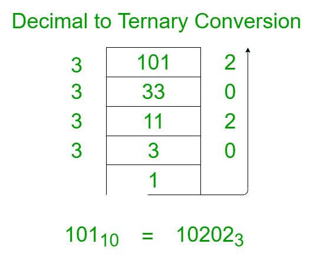
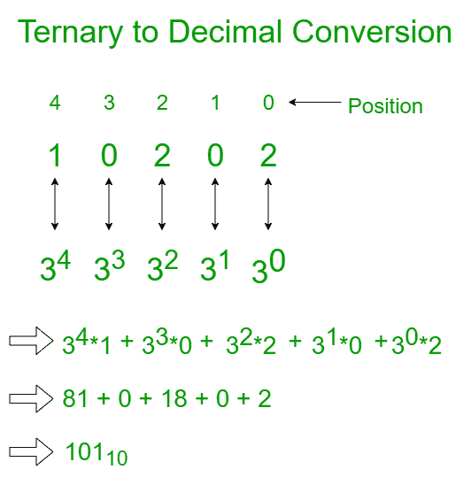

# 三进制数字系统或基数为 3 的数字

> 原文:[https://www . geesforgeks . org/三进制数-系统-或-基数-3-numbers/](https://www.geeksforgeeks.org/ternary-number-system-or-base-3-numbers/)

一个[数字系统](https://www.geeksforgeeks.org/classification-of-number-system/)可以被认为是使用一组数字或符号的数字的数学符号。简单来说，数字系统是一种表示数字的方法。每个数字系统都是借助于它的基数来识别的。

例如**二进制**、**八进制**、**十进制**和**十六进制数**系统用于[微处理器编程](https://www.geeksforgeeks.org/microprocessor-tutorials/)。本文讨论了这样一个数系。

**三进制数字系统:**
如果一个数字系统的基值是 3，那么这个表示被称为**三进制表示**。本系统中的数字为 **0、1、2** 。
还有一个称为**平衡三元**的数字系统，由**数字 1、0 和+1** 组成。一个数的三进制表示比二进制表示更为紧凑。

**将十进制转换为三进制的步骤:**

1.  把这个数除以 3。
2.  获取下一次迭代的整数商。
3.  得到三进制数的余数。
4.  重复这些步骤，直到商等于 0。

**例如:**设 N = 101。下图说明了 101 <sup>10</sup> 到 base-3 的逐步转换。



以下是十进制到二进制的实现，反之亦然:

## C++

```
// C++ program to convert decimal
// number to ternary number

#include <cstdio>
#include <iostream>
#include <math.h>
using namespace std;

// Function to convert a decimal
// number to a ternary number
void convertToTernary(int N)
{
    // Base case
    if (N == 0)
        return;

    // Finding the remainder
    // when N is divided by 3
    int x = N % 3;
    N /= 3;
    if (x < 0)
        N += 1;

    // Recursive function to
    // call the function for
    // the integer division
    // of the value N/3
    convertToTernary(N);

    // Handling the negative cases
    if (x < 0)
        cout << x + (3 * -1);
    else
        cout << x;
}

// Function to convert the decimal to ternary
void convert(int Decimal)
{
    cout << "Ternary number of "
         << Decimal << " is: ";

    // If the number is greater
    // than 0, compute the
    // ternary representation
    // of the number
    if (Decimal != 0) {
        convertToTernary(Decimal);
    }
    else
        cout << "0" << endl;
}

// Driver code
int main()
{
    int Decimal = 2747;

    convert(Decimal);

    return 0;
}
```

## Java 语言(一种计算机语言，尤用于创建网站)

```
// Java program to convert decimal
// number to ternary number
import java.io.*;

class GFG
{

// Function to convert a decimal
// number to a ternary number
static void convertToTernary(int N)
{
    // Base case
    if (N == 0)
        return;

    // Finding the remainder
    // when N is divided by 3
    int x = N % 3;
    N /= 3;
    if (x < 0)
        N += 1;

    // Recursive function to
    // call the function for
    // the integer division
    // of the value N/3
    convertToTernary(N);

    // Handling the negative cases
    if (x < 0)
        System.out.print( x + (3 * -1));
    else
        System.out.print( x);
}

// Function to convert the decimal to ternary
static void convert(int Decimal)
{
    System.out.print("Ternary number of "  +Decimal +" is: ");

    // If the number is greater
    // than 0, compute the
    // ternary representation
    // of the number
    if (Decimal != 0) {
        convertToTernary(Decimal);
    }
    else
        System.out.println("0" );
}

// Driver Code
public static void main (String[] args)
{
    int Decimal = 2747;

    convert(Decimal);

}
}

// This code is contributed by shivanisinghss2110
```

## 蟒蛇 3

```
# Python3 program to convert decimal
# number to ternary number

# Function to convert a decimal
# number to a ternary number
def convertToTernary(N):

    # Base case
    if (N == 0):
        return;

    # Finding the remainder
    # when N is divided by 3
    x = N % 3;
    N //= 3;
    if (x < 0):
        N += 1;

    # Recursive function to
    # call the function for
    # the integer division
    # of the value N/3
    convertToTernary(N);

    # Handling the negative cases
    if (x < 0):
        print(x + (3 * -1), end = "");
    else:
        print(x, end = "");

# Function to convert the
# decimal to ternary
def convert(Decimal):

    print("Ternary number of ", Decimal,
          " is: ", end = "");

    # If the number is greater
    # than 0, compute the
    # ternary representation
    # of the number
    if (Decimal != 0):
        convertToTernary(Decimal);
    else:
        print("0", end = "");

# Driver Code
if __name__ == '__main__':

    Decimal = 2747;

    convert(Decimal);

# This code is contributed by Rajput-Ji
```

## C#

```
// C# program to convert decimal
// number to ternary number
using System;

class GFG
{

    // Function to convert a decimal
    // number to a ternary number
    static void convertToTernary(int N)
    {
        // Base case
        if (N == 0)
            return;

        // Finding the remainder
        // when N is divided by 3
        int x = N % 3;
        N /= 3;
        if (x < 0)
            N += 1;

        // Recursive function to
        // call the function for
        // the integer division
        // of the value N/3
        convertToTernary(N);

        // Handling the negative cases
        if (x < 0)
            Console.Write( x + (3 * -1));
        else
            Console.Write( x);
    }

    // Function to convert the decimal to ternary
    static void convert(int Decimal)
    {
        Console.Write("Ternary number of " +Decimal +" is: ");

        // If the number is greater
        // than 0, compute the
        // ternary representation
        // of the number
        if (Decimal != 0) {
            convertToTernary(Decimal);
        }
        else
            Console.WriteLine("0" );
    }

    // Driver Code
    public static void Main (string[] args)
    {
        int Decimal = 2747;

        convert(Decimal);

    }
}

// This code is contributed by AnkitRai01
```

## java 描述语言

```
<script>
    // Javascript program to convert decimal
    // number to ternary number

    // Function to convert a decimal
    // number to a ternary number
    function convertToTernary(N)
    {
        // Base case
        if (N == 0)
            return;

        // Finding the remainder
        // when N is divided by 3
        let x = N % 3;
        N = parseInt(N / 3, 10);
        if (x < 0)
            N += 1;

        // Recursive function to
        // call the function for
        // the integer division
        // of the value N/3
        convertToTernary(N);

        // Handling the negative cases
        if (x < 0)
            document.write(x + (3 * -1));
        else
            document.write(x);
    }

    // Function to convert the decimal to ternary
    function convert(Decimal)
    {
        document.write("Ternary number of " + Decimal + " is: ");

        // If the number is greater
        // than 0, compute the
        // ternary representation
        // of the number
        if (Decimal != 0) {
            convertToTernary(Decimal);
        }
        else
            document.write("0" + "</br>");
    }

    let Decimal = 2747;

    convert(Decimal);

// This code is contributed by divyeshrabadiya07.
</script>
```

**Output:** 

```
Ternary number of 2747 is: 10202202
```

时间复杂度:0(对数 <sub>3</sub> N)

辅助空间:0(对数 <sub>3</sub> N)

**将三进制转换为十进制的步骤:**

1.  将三进制数的每个数字与其对应的三次幂连接起来。
2.  将每个数字乘以相应的三次方，然后将得到的所有数字相加。

**例如:**设 N = 10202。下图说明了 10202 <sub>3</sub> 到 base-10 的逐步转换。



以下是十进制到二进制的实现，反之亦然:

## C++

```
// C++ program to convert a
// ternary number to decimal number

#include <cstdio>
#include <iostream>
#include <math.h>
using namespace std;

// Function to convert a ternary
// number to a decimal number
void convertToDecimal(int N)
{
    cout << "Decimal number of "
         << N << " is: ";

    // If the number is greater than 0,
    // compute the decimal
    // representation of the number
    if (N != 0) {

        int decimalNumber = 0,
            i = 0, remainder;

        // Loop to iterate through
        // the number
        while (N != 0) {
            remainder = N % 10;
            N /= 10;

            // Computing the decimal digit
            decimalNumber += remainder
                             * pow(3, i);
            ++i;
        }
        cout << decimalNumber << endl;
    }
    else
        cout << "0" << endl;
}

// Driver code
int main()
{
    int Ternary = 10202202;

    convertToDecimal(Ternary);

    return 0;
}
```

## Java 语言(一种计算机语言，尤用于创建网站)

```
// Java program to convert a
// ternary number to decimal number
class GFG{

// Function to convert a ternary
// number to a decimal number
static void convertToDecimal(int N)
{
    System.out.print("Decimal number of " +
                      N + " is: ");

    // If the number is greater than 0,
    // compute the decimal
    // representation of the number
    if (N != 0)
    {
        int decimalNumber = 0,
            i = 0, remainder;

        // Loop to iterate through
        // the number
        while (N != 0)
        {
            remainder = N % 10;
            N /= 10;

            // Computing the decimal digit
            decimalNumber += remainder *
                             Math.pow(3, i);
            ++i;
        }
        System.out.print(decimalNumber + "\n");
    }
    else
        System.out.print("0" + "\n");
}

// Driver code
public static void main(String[] args)
{
    int Ternary = 10202202;
    convertToDecimal(Ternary);
}
}

// This code is contributed by Rajput-Ji
```

## 蟒蛇 3

```
# Python3 program to convert a
# ternary number to decimal number
import math;

# Function to convert a ternary
# number to a decimal number
def convertToDecimal(N):

    print("Decimal number of", N, "is:", end = " ");

    # If the number is greater than 0,
    # compute the decimal
    # representation of the number
    if (N != 0):

        decimalNumber = 0;
        i = 0;
        remainder = 0;

        # Loop to iterate through
        # the number
        while (N != 0):
            remainder = N % 10;
            N = N // 10;

            # Computing the decimal digit
            decimalNumber += remainder * math.pow(3, i);
            i += 1;

        print(decimalNumber);

    else:
        print("0");

# Driver code
Ternary = 10202202;
convertToDecimal(Ternary);

# This code is contributed by Code_Mech
```

## C#

```
// C# program to convert a ternary
// number to decimal number
using System;

class GFG{

// Function to convert a ternary
// number to a decimal number
static void convertToDecimal(int N)
{
    Console.Write("Decimal number of " +
                           N + " is: ");

    // If the number is greater than 
    // 0, compute the decimal
    // representation of the number
    if (N != 0)
    {
        int decimalNumber = 0;
        int i = 0, remainder;

        // Loop to iterate through
        // the number
        while (N != 0)
        {
            remainder = N % 10;
            N /= 10;

            // Computing the decimal digit
            decimalNumber += remainder *
                             (int)Math.Pow(3, i);
            ++i;
        }
        Console.Write(decimalNumber + "\n");
    }
    else
        Console.Write("0" + "\n");
}

// Driver code
public static void Main()
{
    int Ternary = 10202202;

    convertToDecimal(Ternary);
}
}

// This code is contributed by shivanisinghss2110
```

## java 描述语言

```
<script>

// Javascript program to convert a ternary
// number to decimal number

// Function to convert a ternary
// number to a decimal number
function convertToDecimal(N)
{
    document.write("Decimal number of " +
                   N + " is: ");

    // If the number is greater than
    // 0, compute the decimal
    // representation of the number
    if (N != 0)
    {
        let decimalNumber = 0;
        let i = 0, remainder;

        // Loop to iterate through
        // the number
        while (N != 0)
        {
            remainder = N % 10;
            N = parseInt(N / 10, 10);

            // Computing the decimal digit
            decimalNumber += remainder * Math.pow(3, i);
            ++i;
        }
        document.write(decimalNumber + "</br>");
    }
    else
        document.write("0" + "</br>");
}

// Driver code
let Ternary = 10202202;

convertToDecimal(Ternary);

// This code is contributed by divyesh072019

</script>
```

**输出:**

```
Decimal number of 10202202 is: 2747
```

时间复杂度:0(对数 <sub>10</sub> N)

辅助空间:0(1)