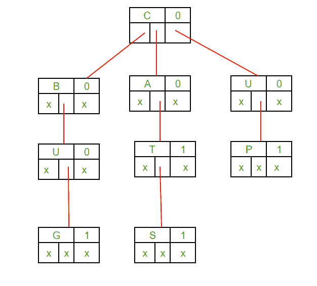

# 三元搜索树(删除)

> 原文:[https://www.geeksforgeeks.org/ternary-search-tree-deletion/](https://www.geeksforgeeks.org/ternary-search-tree-deletion/)

在 TST 的 [SET 1](https://www.geeksforgeeks.org/ternary-search-tree/) 帖子中，我们描述了如何在 TST 插入和搜索节点。在本文中，我们将讨论如何从 TST 删除节点的算法。

在删除操作期间，我们使用递归以自底向上的方式删除键。以下是从 trie 中删除密钥时可能出现的情况。

1.  钥匙可能不在 TST。
    **解决方案:**删除操作不应修改 TST。
2.  作为唯一密钥出现的密钥(密钥的任何部分都不包含另一个密钥(前缀)，密钥本身也不是 TST 另一个密钥的前缀)。
    **解决方案:**删除所有节点。
3.  密钥是 TST 另一个长密钥的前缀密钥。
    **解决方案:**解组叶节点。
4.  存在于 TST 的密钥，至少有一个其他密钥作为前缀密钥。
    **解决方案:**删除从关键字末尾直到最长前缀关键字的第一个叶节点的节点。



**delete _ node 功能说明**

1.  假设我们要删除字符串“BIG”，因为它在 TST 不存在，所以在与第一个字符“B”匹配后，delete_node 函数将返回零。因此不会删除任何内容。
2.  现在我们要删除字符串“BUG”，它在 TST 是唯一存在的，即它既没有作为其他字符串前缀的部分，也没有作为任何其他字符串的前缀，因此它将被完全删除。
3.  现在我们要删除字符串“CAT”，因为它是字符串“CATS”的前缀，所以我们不能从字符串“CAT”中删除任何内容，我们只能取消标记叶节点，这将确保“CAT”不再是 TST 的成员字符串。
4.  现在我们要删除字符串“CATS”，因为它有一个前缀字符串“CAT”，也是 TST 的成员字符串，所以我们只能删除字符串“CATS”的最后一个字符，这将确保字符串“CAT”仍然是 TST 的一部分。

## C

```
// C program to demonstrate deletion in
// Ternary Search Tree (TST). For insert
// and other functions, refer
// https://www.geeksforgeeks.org/ternary-search-tree/
#include<stdio.h>
#include<stdlib.h>

// structure of a node in TST
struct Node
{
    char key;
    int isleaf;
    struct Node *left;
    struct Node *eq;
    struct Node *right;
};

// function to create a Node in TST
struct Node *createNode(char key)
{
    struct Node *temp =
        (struct Node*)malloc(sizeof(struct Node));
    temp->key = key;
    temp->isleaf = 0;
    temp->left = NULL;
    temp->eq = NULL;
    temp->right = NULL;
    return temp;
};

// function to insert a Node in TST
void insert_node(struct Node **root ,char *s)
{
    if (!(*root))
        (*root) = createNode(*s);

    if ((*s)<(*root)->key)
        insert_node( &(*root)->left ,s);

    else if ((*s)>(*root)->key)
        insert_node( &(*root)->right ,s);

    else if ((*s) == (*root)->key)
    {
        if (*(s+1) == '\0')
        {
            (*root)->isleaf = 1;
            return;
        }
        insert_node( &(*root)->eq ,s+1);
    }
}

// function to display the TST
void display(struct Node *root, char str[], int level)
{
    if (!root)
        return;

    display(root->left ,str ,level);
    str[level] = root->key;

    if (root->isleaf == 1)
    {
        str[level+1] = '\0';
        printf("%s\n",str);
    }

    display(root->eq ,str ,level+1);
    display(root->right ,str ,level);
}

// to check if current Node is leaf node or not
int isLeaf(struct Node *root)
{
    return root->isleaf == 1;
}

// to check if current node has any child node or not
int isFreeNode(struct Node *root)
{
    if (root->left ||root->eq ||root->right)
        return 0;
    return 1;
}

// function to delete a string in TST
int delete_node(struct Node *root, char str[],
                int level ,int n)
{
    if (root == NULL)
        return 0;

    // CASE 4 Key present in TST, having
    // atleast one other key as prefix key.
    if (str[level+1] == '\0')
    {
        // Unmark leaf node if present
        if (isLeaf(root))
        {
            root->isleaf=0;
            return isFreeNode(root);
        }

        // else string is not present in TST and
        // return 0
        else
            return 0;
    }
    else
    {
        // CASE 3 Key is prefix key of another
        // long key in TST.
        if (str[level] < root->key)
            delete_node(root->left ,str ,level ,n);
        else if (str[level] > root->key)
            delete_node(root->right ,str ,level ,n);

        // CASE 1 Key may not be there in TST.
        else if (str[level] == root->key)
        {
            // CASE 2 Key present as unique key
            if( delete_node(root->eq ,str ,level+1 ,n) )
            {
                // delete the last node, neither it
                // has any child
                // nor it is part of any other string
                free(root->eq);
                return !isLeaf(root) && isFreeNode(root);
            }
        }
    }

    return 0;
}

// Driver function
int main()
{
    struct Node *temp = NULL;

    insert_node(&temp ,"CAT");
    insert_node(&temp ,"BUGS");
    insert_node(&temp ,"CATS");
    insert_node(&temp ,"UP");

    int level = 0;
    char str[20];
    int p = 0;

    printf( "1.Content of the TST before "
            "deletion:\n" );
    display(temp ,str ,level);

    level = 0;
    delete_node(temp ,"CAT" ,level ,5);

    level = 0;
    printf("\n2.Content of the TST after "
           "deletion:\n");
    display(temp, str, level);
    return 0;
}
```

## C++

```
// C++ program to demonstrate deletion in
// Ternary Search Tree (TST)
// For insert and other functions, refer
// https://www.geeksforgeeks.org/ternary-search-tree

#include<bits/stdc++.h>
using namespace std;

// structure of a node in TST
struct Node
{
    char key;
    int isleaf;
    struct Node *left;
    struct Node *eq;
    struct Node *right;
};

// function to create a node in TST
struct Node *createNode(char key)
{
    struct Node *temp = new Node;
    temp->key = key;
    temp->isleaf = 0;
    temp->left = NULL;
    temp->eq = NULL;
    temp->right = NULL;
    return temp;
};

// function to insert a Node in TST
void insert_node(struct Node **root, string s)
{
    if((int)s.length()==0)
        return;
    if (!(*root))
    {
        (*root) = createNode(s[0]);
        // return;
    }

    if ((s[0])<(*root)->key)
        insert_node( &(*root)->left, s);

    else if ((s[0])>(*root)->key)
        insert_node( &(*root)->right, s);

    else if ((s[0]) == (*root)->key)
    {
        if ((int)s.length() == 1)
        {
            (*root)->isleaf = 1;
            return;
        }
        insert_node( &(*root)->eq, s.substr(1));
    }
}

// function to display the TST
void display(struct Node *root, char str[], int level)
{
    if (!root)
        return;

    display(root->left, str, level);
    str[level] = root->key;

    if (root->isleaf == 1)
    {
        str[level+1] = '\0';
        cout<< str <<endl;
    }

    display(root->eq, str, level+1);
    display(root->right, str, level);
}

//to check if current node is leaf node or not
int isLeaf(struct Node *root)
{
    return root->isleaf == 1;
}

// to check if current node has any child
// node or not
int isFreeNode(struct Node *root)
{
    if (root->left ||root->eq ||root->right)
        return 0;
    return 1;
}

// function to delete a string in TST
int delete_node(struct Node *root, string str,
                int level, int n)
{
    if (root == NULL)
        return 0;

    // CASE 4 Key present in TST, having atleast
    // one other key as prefix key.
    if (str[level+1] == '\0')
    {
        // Unmark leaf node if present
        if (isLeaf(root))
        {
            root->isleaf = 0;
            return isFreeNode(root);
        }

        // else string is not present in TST and
        // return 0
        else
            return 0;
    }

    // CASE 3 Key is prefix key of another long
    // key in TST.
    if (str[level] < root->key)
        return delete_node(root->left, str, level, n);
    if (str[level] > root->key)
        return delete_node(root->right, str, level, n);

    // CASE 1 Key may not be there in TST.
    if (str[level] == root->key)
    {
        // CASE 2 Key present as unique key
        if (delete_node(root->eq, str, level+1, n))
        {
            // delete the last node, neither it has
            // any child nor it is part of any other
            // string
            delete(root->eq);
            return !isLeaf(root) && isFreeNode(root);
        }
    }

    return 0;
}

// Driver function
int main()
{
    struct Node *temp = NULL;

    insert_node(&temp, "CAT");
    insert_node(&temp, "BUGS");
    insert_node(&temp, "CATS");
    insert_node(&temp, "UP");

    int level = 0;
    char str[20];
    int p = 0;

    cout << "1.Content of the TST before deletion:\n";
    display(temp, str, 0);

    level = 0;
    delete_node(temp,"CAT", level, 5);

    level = 0;
    cout << "\n2.Content of the TST after deletion:\n";
    display(temp, str, level);
    return 0;
}
```

## 蟒蛇 3

```
# Python 3 program to demonstrate deletion in
# Ternary Search Tree (TST)
# For insert and other functions, refer
# https://www.geeksforgeeks.org/ternary-search-tree

# class of a node in TST
class Node:
    def __init__(self,key):
        self.key=key
        self.isleaf=False
        self.left=None
        self.eq=None
        self.right=None

# function to insert a Node in TST
def insert_node(root, s):

    if s=='':
        return root
    if not root:
        root = Node(s[0])

    if ((s[0])<root.key):
        root.left=insert_node(root.left, s)

    elif (s[0]>root.key):
        root.right=insert_node(root.right, s)
    else:
        if (len(s) == 1):
            root.isleaf = True
            return root
        root.eq=insert_node(root.eq, s[1:])

    return root

# function to display the TST
def display(root, s, level):
    if not root:
        return

    display(root.left, s, level)
    s[level] = root.key

    if (root.isleaf):
        s[level+1] = ''
        print(''.join(s[:level+1]))

    display(root.eq, s, level+1)
    display(root.right, s, level)

# to check if current node has any child
# node or not
def isFreeNode(root):
    return not (root.left or root.eq or root.right)

# function to delete a string in TST
def delete_node(root, s, level):
    if not root:
        return False

    # CASE 4 Key present in TST, having atleast
    # one other key as prefix key.
    if level+1 == len(s):
        # Unmark leaf node if present
        if root.isleaf:
            root.isleaf = False
            return isFreeNode(root)

        # else string is not present in TST and
        # return 0
        return False

    # CASE 3 Key is prefix key of another long
    # key in TST.
    if s[level] < root.key:
        return delete_node(root.left, s, level)
    if s[level] > root.key:
        return delete_node(root.right, s, level)

    # CASE 1 Key may not be there in TST.
    if s[level] == root.key and delete_node(root.eq, s, level+1):
        # delete the last node, neither it has
        # any child nor it is part of any other
        # string
        root.eq = None
        return not root.isleaf and isFreeNode(root)

    return False

# Driver function
if __name__ == '__main__':
    temp = None

    temp=insert_node(temp, "CAT")
    temp=insert_node(temp, "BUGS")
    temp=insert_node(temp, "CATS")
    temp=insert_node(temp, "UP")

    level = 0;s=['']*20

    print("1.Content of the TST before deletion:")
    display(temp, s, 0)

    print("2.Content of the TST after deletion:")
    delete_node(temp,"CAT", level)
    display(temp, s, level)
```

**Output**

```
1.Content of the TST before deletion:
BUGS
CAT
CATS
UP

2.Content of the TST after deletion:
BUGS
CATS
UP
```

本文由**雅什辛拉**供稿。如果你喜欢 GeeksforGeeks 并想投稿，你也可以使用[write.geeksforgeeks.org](https://write.geeksforgeeks.org)写一篇文章或者把你的文章邮寄到 review-team@geeksforgeeks.org。看到你的文章出现在极客博客主页上，帮助其他极客。
如果你发现任何不正确的地方，或者你想分享更多关于上面讨论的话题的信息，请写评论。