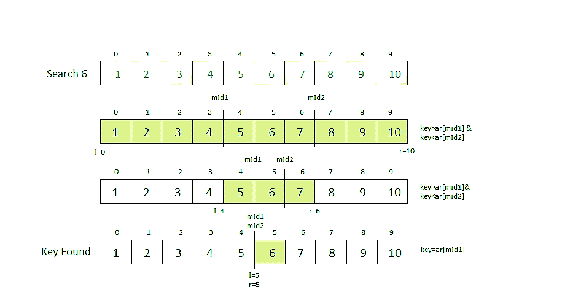

# 三元搜索

> 原文:[https://www.geeksforgeeks.org/ternary-search/](https://www.geeksforgeeks.org/ternary-search/)

**三元搜索**是一种[递减(按常数)和征服算法](http://www.geeksforgeeks.org/divide-and-conquer-introduction/)，可用于在[数组](https://www.geeksforgeeks.org/array-data-structure/)中查找元素。它类似于[二分搜索法](http://www.geeksforgeeks.org/binary-search/)，我们把数组分成两部分，但是在这个算法中，我们把给定的数组分成三部分，并确定哪个有关键字(搜索元素)。我们可以通过取 mid1 和 mid2 将数组分成三部分，可以计算如下。最初，l 和 r 将分别等于 0 和 n-1，其中 n 是数组的长度。

> mid 1 = l+(r-l)/3
> mid 2 = r–(r-l)/3

**注意:**数组需要排序才能对其进行三元搜索。

**执行三元搜索的步骤:**

1.  首先，我们将密钥与 mid1 中的元素进行比较。如果发现相等，我们返回 mid1。
2.  如果不是，那么我们将密钥与 mid2 处的元素进行比较。如果发现相等，我们返回 mid2。
3.  如果不是，那么我们检查键是否小于 mid1 处的元素。如果是，那就回到第一部分。
4.  如果不是，那么我们检查键是否大于 mid2 处的元素。如果是，那就回到第三部分。
5.  如果没有，那么我们回到第二(中间)部分。

**示例:**



**三元搜索的递归实现**

## C++

```
// C++ program to illustrate
// recursive approach to ternary search
#include <bits/stdc++.h>
using namespace std;

// Function to perform Ternary Search
int ternarySearch(int l, int r, int key, int ar[])
{
    if (r >= l) {

        // Find the mid1 and mid2
        int mid1 = l + (r - l) / 3;
        int mid2 = r - (r - l) / 3;

        // Check if key is present at any mid
        if (ar[mid1] == key) {
            return mid1;
        }
        if (ar[mid2] == key) {
            return mid2;
        }

        // Since key is not present at mid,
        // check in which region it is present
        // then repeat the Search operation
        // in that region
        if (key < ar[mid1]) {

            // The key lies in between l and mid1
            return ternarySearch(l, mid1 - 1, key, ar);
        }
        else if (key > ar[mid2]) {

            // The key lies in between mid2 and r
            return ternarySearch(mid2 + 1, r, key, ar);
        }
        else {

            // The key lies in between mid1 and mid2
            return ternarySearch(mid1 + 1, mid2 - 1, key, ar);
        }
    }

    // Key not found
    return -1;
}

// Driver code
int main()
{
    int l, r, p, key;

    // Get the array
    // Sort the array if not sorted
    int ar[] = { 1, 2, 3, 4, 5, 6, 7, 8, 9, 10 };

    // Starting index
    l = 0;

    // length of array
    r = 9;

    // Checking for 5

    // Key to be searched in the array
    key = 5;

    // Search the key using ternarySearch
    p = ternarySearch(l, r, key, ar);

    // Print the result
    cout << "Index of " << key
         << " is " << p << endl;

    // Checking for 50

    // Key to be searched in the array
    key = 50;

    // Search the key using ternarySearch
    p = ternarySearch(l, r, key, ar);

    // Print the result
    cout << "Index of " << key
         << " is " << p << endl;
}

// This code is contributed
// by Akanksha_Rai
```

## C

```
// C program to illustrate
// recursive approach to ternary search

#include <stdio.h>

// Function to perform Ternary Search
int ternarySearch(int l, int r, int key, int ar[])
{
    if (r >= l) {

        // Find the mid1 and mid2
        int mid1 = l + (r - l) / 3;
        int mid2 = r - (r - l) / 3;

        // Check if key is present at any mid
        if (ar[mid1] == key) {
            return mid1;
        }
        if (ar[mid2] == key) {
            return mid2;
        }

        // Since key is not present at mid,
        // check in which region it is present
        // then repeat the Search operation
        // in that region

        if (key < ar[mid1]) {

            // The key lies in between l and mid1
            return ternarySearch(l, mid1 - 1, key, ar);
        }
        else if (key > ar[mid2]) {

            // The key lies in between mid2 and r
            return ternarySearch(mid2 + 1, r, key, ar);
        }
        else {

            // The key lies in between mid1 and mid2
            return ternarySearch(mid1 + 1, mid2 - 1, key, ar);
        }
    }

    // Key not found
    return -1;
}

// Driver code
int main()
{
    int l, r, p, key;

    // Get the array
    // Sort the array if not sorted
    int ar[] = { 1, 2, 3, 4, 5, 6, 7, 8, 9, 10 };

    // Starting index
    l = 0;

    // length of array
    r = 9;

    // Checking for 5

    // Key to be searched in the array
    key = 5;

    // Search the key using ternarySearch
    p = ternarySearch(l, r, key, ar);

    // Print the result
    printf("Index of %d is %d\n", key, p);

    // Checking for 50

    // Key to be searched in the array
    key = 50;

    // Search the key using ternarySearch
    p = ternarySearch(l, r, key, ar);

    // Print the result
    printf("Index of %d is %d", key, p);
}
```

## Java 语言(一种计算机语言，尤用于创建网站)

```
// Java program to illustrate
// recursive approach to ternary search

class GFG {

    // Function to perform Ternary Search
    static int ternarySearch(int l, int r, int key, int ar[])
    {
        if (r >= l) {

            // Find the mid1 and mid2
            int mid1 = l + (r - l) / 3;
            int mid2 = r - (r - l) / 3;

            // Check if key is present at any mid
            if (ar[mid1] == key) {
                return mid1;
            }
            if (ar[mid2] == key) {
                return mid2;
            }

            // Since key is not present at mid,
            // check in which region it is present
            // then repeat the Search operation
            // in that region

            if (key < ar[mid1]) {

                // The key lies in between l and mid1
                return ternarySearch(l, mid1 - 1, key, ar);
            }
            else if (key > ar[mid2]) {

                // The key lies in between mid2 and r
                return ternarySearch(mid2 + 1, r, key, ar);
            }
            else {

                // The key lies in between mid1 and mid2
                return ternarySearch(mid1 + 1, mid2 - 1, key, ar);
            }
        }

        // Key not found
        return -1;
    }

    // Driver code
    public static void main(String args[])
    {
        int l, r, p, key;

        // Get the array
        // Sort the array if not sorted
        int ar[] = { 1, 2, 3, 4, 5, 6, 7, 8, 9, 10 };

        // Starting index
        l = 0;

        // length of array
        r = 9;

        // Checking for 5

        // Key to be searched in the array
        key = 5;

        // Search the key using ternarySearch
        p = ternarySearch(l, r, key, ar);

        // Print the result
        System.out.println("Index of " + key + " is " + p);

        // Checking for 50

        // Key to be searched in the array
        key = 50;

        // Search the key using ternarySearch
        p = ternarySearch(l, r, key, ar);

        // Print the result
        System.out.println("Index of " + key + " is " + p);
    }
}
```

## 蟒蛇 3

```
# Python3 program to illustrate
# recursive approach to ternary search
import math as mt

# Function to perform Ternary Search
def ternarySearch(l, r, key, ar):

    if (r >= l):

        # Find the mid1 and mid2
        mid1 = l + (r - l) //3
        mid2 = r - (r - l) //3

        # Check if key is present at any mid
        if (ar[mid1] == key):
            return mid1

        if (ar[mid2] == key):
            return mid2

        # Since key is not present at mid,
        # check in which region it is present
        # then repeat the Search operation
        # in that region
        if (key < ar[mid1]):

            # The key lies in between l and mid1
            return ternarySearch(l, mid1 - 1, key, ar)

        elif (key > ar[mid2]):

            # The key lies in between mid2 and r
            return ternarySearch(mid2 + 1, r, key, ar)

        else:

            # The key lies in between mid1 and mid2
            return ternarySearch(mid1 + 1,
                                 mid2 - 1, key, ar)

    # Key not found
    return -1

# Driver code
l, r, p = 0, 9, 5

# Get the array
# Sort the array if not sorted
ar = [ 1, 2, 3, 4, 5, 6, 7, 8, 9, 10 ]

# Starting index
l = 0

# length of array
r = 9

# Checking for 5

# Key to be searched in the array
key = 5

# Search the key using ternarySearch
p = ternarySearch(l, r, key, ar)

# Print the result
print("Index of", key, "is", p)

# Checking for 50

# Key to be searched in the array
key = 50

# Search the key using ternarySearch
p = ternarySearch(l, r, key, ar)

# Print the result
print("Index of", key, "is", p)

# This code is contributed by
# Mohit kumar 29
```

## C#

```
// CSharp program to illustrate
// recursive approach to ternary search
using System;

class GFG {

    // Function to perform Ternary Search
    static int ternarySearch(int l, int r, int key, int[] ar)
    {
        if (r >= l) {

            // Find the mid1 and mid2
            int mid1 = l + (r - l) / 3;
            int mid2 = r - (r - l) / 3;

            // Check if key is present at any mid
            if (ar[mid1] == key) {
                return mid1;
            }
            if (ar[mid2] == key) {
                return mid2;
            }

            // Since key is not present at mid,
            // check in which region it is present
            // then repeat the Search operation
            // in that region

            if (key < ar[mid1]) {

                // The key lies in between l and mid1
                return ternarySearch(l, mid1 - 1, key, ar);
            }
            else if (key > ar[mid2]) {

                // The key lies in between mid2 and r
                return ternarySearch(mid2 + 1, r, key, ar);
            }
            else {

                // The key lies in between mid1 and mid2
                return ternarySearch(mid1 + 1, mid2 - 1, key, ar);
            }
        }

        // Key not found
        return -1;
    }

    // Driver code
    public static void Main()
    {
        int l, r, p, key;

        // Get the array
        // Sort the array if not sorted
        int[] ar = { 1, 2, 3, 4, 5, 6, 7, 8, 9, 10 };

        // Starting index
        l = 0;

        // length of array
        r = 9;

        // Checking for 5

        // Key to be searched in the array
        key = 5;

        // Search the key using ternarySearch
        p = ternarySearch(l, r, key, ar);

        // Print the result
        Console.WriteLine("Index of " + key + " is " + p);

        // Checking for 50

        // Key to be searched in the array
        key = 50;

        // Search the key using ternarySearch
        p = ternarySearch(l, r, key, ar);

        // Print the result
        Console.WriteLine("Index of " + key + " is " + p);
    }
}

// This code is contributed by Ryuga
```

## 服务器端编程语言（Professional Hypertext Preprocessor 的缩写）

```
<?php
// PHP program to illustrate
// recursive approach to ternary search

// Function to perform Ternary Search
function ternarySearch($l, $r, $key, $ar)
{
    if ($r >= $l)
    {

        // Find the mid1 and mid2
        $mid1 = (int)($l + ($r - $l) / 3);
        $mid2 = (int)($r - ($r - $l) / 3);

        // Check if key is present at any mid
        if ($ar[$mid1] == $key)
        {
            return $mid1;
        }
        if ($ar[$mid2] == $key)
        {
            return $mid2;
        }

        // Since key is not present at mid,
        // check in which region it is present
        // then repeat the Search operation
        // in that region
        if ($key < $ar[$mid1])
        {

            // The key lies in between l and mid1
            return ternarySearch($l, $mid1 - 1,
                                     $key, $ar);
        }
        else if ($key > $ar[$mid2])
        {

            // The key lies in between mid2 and r
            return ternarySearch($mid2 + 1, $r,    
                                 $key, $ar);
        }
        else
        {

            // The key lies in between mid1 and mid2
            return ternarySearch($mid1 + 1, $mid2 - 1,
                                            $key, $ar);
        }
    }

    // Key not found
    return -1;
}

// Driver code

// Get the array
// Sort the array if not sorted
$ar = array( 1, 2, 3, 4, 5,
             6, 7, 8, 9, 10 );

// Starting index
$l = 0;

// length of array
$r = 9;

// Checking for 5

// Key to be searched in the array
$key = 5;

// Search the key using ternarySearch
$p = ternarySearch($l, $r, $key, $ar);

// Print the result
echo "Index of ", $key,
     " is ", (int)$p, "\n";

// Checking for 50

// Key to be searched in the array
$key = 50;

// Search the key using ternarySearch
$p = ternarySearch($l, $r, $key, $ar);

// Print the result
echo "Index of ", $key,
     " is ", (int)$p, "\n";

// This code is contributed by Arnab Kundu
?>
```

## java 描述语言

```
<script>

    // JavaScript program to illustrate
    // recursive approach to ternary search

    // Function to perform Ternary Search
    function ternarySearch(l, r, key, ar)
    {
        if (r >= l) {

            // Find the mid1 and mid2
            let mid1 = l + parseInt((r - l) / 3, 10);
            let mid2 = r - parseInt((r - l) / 3, 10);

            // Check if key is present at any mid
            if (ar[mid1] == key) {
                return mid1;
            }
            if (ar[mid2] == key) {
                return mid2;
            }

            // Since key is not present at mid,
            // check in which region it is present
            // then repeat the Search operation
            // in that region

            if (key < ar[mid1]) {

                // The key lies in between l and mid1
                return ternarySearch(l, mid1 - 1, key, ar);
            }
            else if (key > ar[mid2]) {

                // The key lies in between mid2 and r
                return ternarySearch(mid2 + 1, r, key, ar);
            }
            else {

                // The key lies in between mid1 and mid2
                return ternarySearch(mid1 + 1, mid2 - 1, key, ar);
            }
        }

        // Key not found
        return -1;
    }

    let l, r, p, key;

    // Get the array
    // Sort the array if not sorted
    let ar = [ 1, 2, 3, 4, 5, 6, 7, 8, 9, 10 ];

    // Starting index
    l = 0;

    // length of array
    r = 9;

    // Checking for 5

    // Key to be searched in the array
    key = 5;

    // Search the key using ternarySearch
    p = ternarySearch(l, r, key, ar);

    // Print the result
    document.write("Index of " + key + " is " + p + "</br>");

    // Checking for 50

    // Key to be searched in the array
    key = 50;

    // Search the key using ternarySearch
    p = ternarySearch(l, r, key, ar);

    // Print the result
    document.write("Index of " + key + " is " + p);

</script>
```

**Output:** 

```
Index of 5 is 4
Index of 50 is -1
```

**三元搜索的迭代方法**

## C++

```
// C++ program to illustrate
// iterative approach to ternary search

#include <iostream>
using namespace std;

// Function to perform Ternary Search
int ternarySearch(int l, int r, int key, int ar[])

{
    while (r >= l) {

        // Find the mid1 and mid2
        int mid1 = l + (r - l) / 3;
        int mid2 = r - (r - l) / 3;

        // Check if key is present at any mid
        if (ar[mid1] == key) {
            return mid1;
        }
        if (ar[mid2] == key) {
            return mid2;
        }

        // Since key is not present at mid,
        // check in which region it is present
        // then repeat the Search operation
        // in that region

        if (key < ar[mid1]) {

            // The key lies in between l and mid1
            r = mid1 - 1;
        }
        else if (key > ar[mid2]) {

            // The key lies in between mid2 and r
            l = mid2 + 1;
        }
        else {

            // The key lies in between mid1 and mid2
            l = mid1 + 1;
            r = mid2 - 1;
        }
    }

    // Key not found
    return -1;
}

// Driver code
int main()
{
    int l, r, p, key;

    // Get the array
    // Sort the array if not sorted
    int ar[] = { 1, 2, 3, 4, 5, 6, 7, 8, 9, 10 };

    // Starting index
    l = 0;

    // length of array
    r = 9;

    // Checking for 5

    // Key to be searched in the array
    key = 5;

    // Search the key using ternarySearch
    p = ternarySearch(l, r, key, ar);

    // Print the result
    cout << "Index of "<<key<<" is " << p << endl;

    // Checking for 50

    // Key to be searched in the array
    key = 50;

    // Search the key using ternarySearch
    p = ternarySearch(l, r, key, ar);

    // Print the result
    cout << "Index of "<<key<<" is " << p;
}
```

## C

```
// C program to illustrate
// iterative approach to ternary search

#include <stdio.h>

// Function to perform Ternary Search
int ternarySearch(int l, int r, int key, int ar[])

{
    while (r >= l) {

        // Find the mid1 and mid2
        int mid1 = l + (r - l) / 3;
        int mid2 = r - (r - l) / 3;

        // Check if key is present at any mid
        if (ar[mid1] == key) {
            return mid1;
        }
        if (ar[mid2] == key) {
            return mid2;
        }

        // Since key is not present at mid,
        // check in which region it is present
        // then repeat the Search operation
        // in that region

        if (key < ar[mid1]) {

            // The key lies in between l and mid1
            r = mid1 - 1;
        }
        else if (key > ar[mid2]) {

            // The key lies in between mid2 and r
            l = mid2 + 1;
        }
        else {

            // The key lies in between mid1 and mid2
            l = mid1 + 1;
            r = mid2 - 1;
        }
    }

    // Key not found
    return -1;
}

// Driver code
int main()
{
    int l, r, p, key;

    // Get the array
    // Sort the array if not sorted
    int ar[] = { 1, 2, 3, 4, 5, 6, 7, 8, 9, 10 };

    // Starting index
    l = 0;

    // length of array
    r = 9;

    // Checking for 5

    // Key to be searched in the array
    key = 5;

    // Search the key using ternarySearch
    p = ternarySearch(l, r, key, ar);

    // Print the result
    printf("Index of %d is %d\n", key, p);

    // Checking for 50

    // Key to be searched in the array
    key = 50;

    // Search the key using ternarySearch
    p = ternarySearch(l, r, key, ar);

    // Print the result
    printf("Index of %d is %d", key, p);
}
```

## Java 语言(一种计算机语言，尤用于创建网站)

```
// Java program to illustrate
// the iterative approach to ternary search

class GFG {

    // Function to perform Ternary Search
    static int ternarySearch(int l, int r, int key, int ar[])

    {
        while (r >= l) {

            // Find the mid1  mid2
            int mid1 = l + (r - l) / 3;
            int mid2 = r - (r - l) / 3;

            // Check if key is present at any mid
            if (ar[mid1] == key) {
                return mid1;
            }
            if (ar[mid2] == key) {
                return mid2;
            }

            // Since key is not present at mid,
            // check in which region it is present
            // then repeat the Search operation
            // in that region

            if (key < ar[mid1]) {

                // The key lies in between l and mid1
                r = mid1 - 1;
            }
            else if (key > ar[mid2]) {

                // The key lies in between mid2 and r
                l = mid2 + 1;
            }
            else {

                // The key lies in between mid1 and mid2
                l = mid1 + 1;
                r = mid2 - 1;
            }
        }

        // Key not found
        return -1;
    }

    // Driver code
    public static void main(String args[])
    {
        int l, r, p, key;

        // Get the array
        // Sort the array if not sorted
        int ar[] = { 1, 2, 3, 4, 5, 6, 7, 8, 9, 10 };

        // Starting index
        l = 0;

        // length of array
        r = 9;

        // Checking for 5

        // Key to be searched in the array
        key = 5;

        // Search the key using ternarySearch
        p = ternarySearch(l, r, key, ar);

        // Print the result
        System.out.println("Index of " + key + " is " + p);

        // Checking for 50

        // Key to be searched in the array
        key = 50;

        // Search the key using ternarySearch
        p = ternarySearch(l, r, key, ar);

        // Print the result
        System.out.println("Index of " + key + " is " + p);
    }
}
```

## 蟒蛇 3

```
# Python 3 program to illustrate iterative
# approach to ternary search

# Function to perform Ternary Search
def ternarySearch(l, r, key, ar):
    while r >= l:

        # Find mid1 and mid2
        mid1 = l + (r-l) // 3
        mid2 = r - (r-l) // 3

        # Check if key is at any mid
        if key == ar[mid1]:
            return mid1
        if key == mid2:
            return mid2

        # Since key is not present at mid,
        # Check in which region it is present
        # Then repeat the search operation in that region
        if key < ar[mid1]:
            # key lies between l and mid1
            r = mid1 - 1
        elif key > ar[mid2]:
            # key lies between mid2 and r
            l = mid2 + 1
        else:
            # key lies between mid1 and mid2
            l = mid1 + 1
            r = mid2 - 1

    # key not found
    return -1

# Driver code

# Get the list
# Sort the list if not sorted
ar = [1, 2, 3, 4, 5, 6, 7, 8, 9, 10]

# Starting index
l = 0

# Length of list
r = 9

# Checking for 5
# Key to be searched in the list
key = 5

# Search the key using ternary search
p = ternarySearch(l, r, key, ar)

# Print the result
print("Index of", key, "is", p)

# Checking for 50
# Key to be searched in the list
key = 50

# Search the key using ternary search
p = ternarySearch(l, r, key, ar)

# Print the result
print("Index of", key, "is", p)

# This code has been contributed by Sujal Motagi
```

## C#

```
// C# program to illustrate the iterative
// approach to ternary search
using System;

public class GFG {

    // Function to perform Ternary Search
    static int ternarySearch(int l, int r,
                             int key, int[] ar)

    {
        while (r >= l) {

            // Find the mid1 and mid2
            int mid1 = l + (r - l) / 3;
            int mid2 = r - (r - l) / 3;

            // Check if key is present at any mid
            if (ar[mid1] == key) {
                return mid1;
            }
            if (ar[mid2] == key) {
                return mid2;
            }

            // Since key is not present at mid,
            // check in which region it is present
            // then repeat the Search operation
            // in that region

            if (key < ar[mid1]) {

                // The key lies in between l and mid1
                r = mid1 - 1;
            }
            else if (key > ar[mid2]) {

                // The key lies in between mid2 and r
                l = mid2 + 1;
            }
            else {

                // The key lies in between mid1 and mid2
                l = mid1 + 1;
                r = mid2 - 1;
            }
        }

        // Key not found
        return -1;
    }

    // Driver code
    public static void Main(String[] args)
    {
        int l, r, p, key;

        // Get the array
        // Sort the array if not sorted
        int[] ar = { 1, 2, 3, 4, 5, 6, 7, 8, 9, 10 };

        // Starting index
        l = 0;

        // length of array
        r = 9;

        // Checking for 5

        // Key to be searched in the array
        key = 5;

        // Search the key using ternarySearch
        p = ternarySearch(l, r, key, ar);

        // Print the result
        Console.WriteLine("Index of " + key + " is " + p);

        // Checking for 50

        // Key to be searched in the array
        key = 50;

        // Search the key using ternarySearch
        p = ternarySearch(l, r, key, ar);

        // Print the result
        Console.WriteLine("Index of " + key + " is " + p);
    }
}

// This code has been contributed by 29AjayKumar
```

## java 描述语言

```
<script>

    // JavaScript program to illustrate the iterative
    // approach to ternary search

    // Function to perform Ternary Search
    function ternarySearch(l, r, key, ar)

    {
        while (r >= l) {

            // Find the mid1 and mid2
            let mid1 = l + parseInt((r - l) / 3, 10);
            let mid2 = r - parseInt((r - l) / 3, 10);

            // Check if key is present at any mid
            if (ar[mid1] == key) {
                return mid1;
            }
            if (ar[mid2] == key) {
                return mid2;
            }

            // Since key is not present at mid,
            // check in which region it is present
            // then repeat the Search operation
            // in that region

            if (key < ar[mid1]) {

                // The key lies in between l and mid1
                r = mid1 - 1;
            }
            else if (key > ar[mid2]) {

                // The key lies in between mid2 and r
                l = mid2 + 1;
            }
            else {

                // The key lies in between mid1 and mid2
                l = mid1 + 1;
                r = mid2 - 1;
            }
        }

        // Key not found
        return -1;
    }

    let l, r, p, key;

    // Get the array
    // Sort the array if not sorted
    let ar = [ 1, 2, 3, 4, 5, 6, 7, 8, 9, 10 ];

    // Starting index
    l = 0;

    // length of array
    r = 9;

    // Checking for 5

    // Key to be searched in the array
    key = 5;

    // Search the key using ternarySearch
    p = ternarySearch(l, r, key, ar);

    // Print the result
    document.write("Index of " + key + " is " + p + "</br>");

    // Checking for 50

    // Key to be searched in the array
    key = 50;

    // Search the key using ternarySearch
    p = ternarySearch(l, r, key, ar);

    // Print the result
    document.write("Index of " + key + " is " + p);

</script>
```

**Output:** 

```
Index of 5 is 4
Index of 50 is -1
```

**时间复杂度:**


，其中 n 是数组的大小。

**辅助空间:** O(1)

**用途:**求[单峰函数](https://en.wikipedia.org/wiki/Unimodality)的最大值或最小值。
[在三元搜索上破解地球问题](https://www.hackerearth.com/practice/algorithms/searching/ternary-search/practice-problems/)