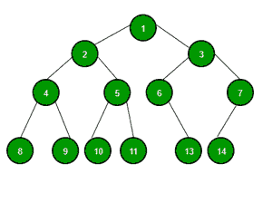

# 测试用例生成|集合 6(随机未加权二叉树)

> 原文:[https://www . geesforgeks . org/test-case-generation-set-6-random-unweighted-二叉树/](https://www.geeksforgeeks.org/test-case-generation-set-6-random-unweighted-binary-tree/)

生成随机**未加权** [**二叉树**](https://www.geeksforgeeks.org/binary-tree-data-structure/) **:**

*   因为这是一棵树，所以测试数据生成计划不会形成循环。
*   边的数量比顶点的数量少一个。
*   对于每个 **RUN** ，首先打印节点数，比如说， **N** 和下一个**N–1**行的形式为 **(a，b)** ，其中 **a** 是 **b.** 的父级
*   每个节点最多包含 2 个子节点。

[](https://media.geeksforgeeks.org/wp-content/uploads/20201123115230/binarytree-300x224.png)

**方法:**使用[队列](https://www.geeksforgeeks.org/queue-cpp-stl/)可以解决问题。这个想法是使用 [BFS](https://www.geeksforgeeks.org/level-order-tree-traversal/) 遍历树。按照以下步骤解决问题:

*   初始化一个[图](https://www.geeksforgeeks.org/map-associative-containers-the-c-standard-template-library-stl/)，比如说 **mp** 来检查一个节点是否已经包含在树中。
*   初始化一个[队列](https://www.geeksforgeeks.org/queue-cpp-stl/)来存储树中每一层的节点。
*   将 **1** 视为根节点，将其插入队列。
*   当树中的节点总数不等于 **N** 时，遍历队列。在每次迭代中[使用](https://www.geeksforgeeks.org/queuepush-and-queuepop-in-cpp-stl/)[兰德()](https://www.geeksforgeeks.org/rand-and-srand-in-ccpp/)函数和[映射](https://www.geeksforgeeks.org/map-associative-containers-the-c-standard-template-library-stl/)将树的每一级的不同节点插入队列，也将节点和节点的父节点插入数组
*   最后打印 **N** 的值和数组。

## 卡片打印处理机（Card Print Processor 的缩写）

```
// C++ Program to generate test cases for
// an unweighted tree

#include <bits/stdc++.h>
using namespace std;

// Function to generate the binary tree using BFS
vector<pair<int, int> > generateBinaryTree(int n)
{

    // Stores number of children
    // a node can have
    vector<int> options = { 0, 1, 2 };

    // Check if a node is already
    // included in the tree or not
    map<int, int> mp;

    // Stores node of tree at 
    // each level of the tree
    queue<int> q;

    // Insert root node
    q.push(1);

    // Stores the generated tree
    vector<pair<int, int> > v;

    // Store count of nodes
    // already included
    int count = 1;

    // Marking the inclusion
    // of node 1
    mp[1] = 1;

    // Traverse tree using BFS
    while (!q.empty() or count < n) {

        // Stores from element
        // of queue
        int front;

        if(!q.empty()) {

            // Update front
            front = q.front();

            // Pop front element 
            // of queue
            q.pop();
        }

        // Find count of child nodes
        // of current node
        int numberOfChilds
          = options[rand() % (options.size())];

        // If all the nodes are 
        // already included
        if (count >= n)
            continue;

        // Connect child node to
        // the parent node
        while (numberOfChilds--) {

            // Stores value in node which
            // is not already included
            int child = rand() % n + 1;

            // Find the child until found a node
            // that is not yet included
            while (mp[child]) {
                child++;
                if (child > n) {
                    child = 1;
                }
            }

            // Update count
            count++;

            // Mark the included node
            mp[child] = 1;

            // Insert it to the generated tree
            // as {parent, child}
            v.push_back({ front, child });

            // Push the child into the queue
            q.push(child);

            // If all the nodes are included
            // break
            if (count == n)
                break;
        }
    }

    // Shuffle the v vector randomly
    random_shuffle(v.begin(), v.end());

    return v;
}

// Function to print the generated tree
void printTree(int n, vector<pair<int, int> > v)
{
    int s = v.size();

    // Number of nodes
    cout << n << "\n";

    // Print n-1 edges as {parent, child}
    for (int i = 0; i < v.size(); i++) {
        cout << v[i].first << " " << v[i].second << "\n";
    }
}

// Driver Code
int main()
{

    // Random seeding
    srand(time(NULL));

    // Number of node between 3 to 8
    // this range can be easily changed
    int n = rand() % 6 + 3;

    // Function Call
    vector<pair<int, int> > v 
              = generateBinaryTree(n);

    // Print the generated tree
    printTree(n, v);
}
```

**Output:**

```
5
5 4
1 2
1 3
3 5

```