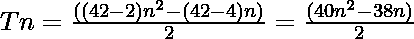

# 四角数

> 原文:[https://www.geeksforgeeks.org/tetracontadigonal-number/](https://www.geeksforgeeks.org/tetracontadigonal-number/)

给定一个数字 **N** ，任务是找到 **N <sup>第</sup>T5【四孔体】号。** 

> 四角数是一类图形数。它有一个 42 边的多边形，叫做四角多边形。第 N 个四角数字计数是 42 个点的数目，所有其他点都被一个公共的共享角包围并形成一个图案。前几个四元数字是 **1，42，123，244，405，606……**

**例:**

> **输入:** N = 2
> **输出:** 42
> **说明:**
> 第二个四元数字是 42。
> **输入:** N = 3
> **输出:** 123

**方法:**第 N 个四邻体数由公式给出:

*   s 边多边形的第 n 项= 

*   因此 42 边多边形的第 n 项是

> 

以下是上述方法的实现:

## C++

```
// C++ implementation for the
// above approach
#include <bits/stdc++.h>
using namespace std;

// Function to find the
// nth Tetracontadigonal Number
int TetracontadigonalNum(int n)
{
    return (40 * n * n - 38 * n) / 2;
}

// Driver Code
int main()
{
    int n = 3;
    cout << TetracontadigonalNum(n);

    return 0;
}
```

## Java 语言(一种计算机语言，尤用于创建网站)

```
// Java implementation for the
// above approach
import java.util.*;
class GFG{

// Function to find the
// nth Tetracontadigonal Number
static int TetracontadigonalNum(int n)
{
    return (40 * n * n - 38 * n) / 2;
}

// Driver Code
public static void main(String[] args)
{
    int n = 3;
    System.out.print(TetracontadigonalNum(n));
}
}

// This code is contributed by Rajput-Ji
```

## 蟒蛇 3

```
# Python3 implementation for the
# above approach

# Function to find the
# nth tetracontadigonal number
def TetracontadigonalNum(n):

    return int((40 * n * n - 38 * n) / 2)

# Driver Code
n = 3
print (TetracontadigonalNum(n))

# This code is contributed by PratikBasu
```

## C#

```
// C# implementation for the
// above approach
using System;
class GFG{

// Function to find the
// nth Tetracontadigonal Number
static int TetracontadigonalNum(int n)
{
    return (40 * n * n - 38 * n) / 2;
}

// Driver Code
public static void Main()
{
    int n = 3;
    Console.Write(TetracontadigonalNum(n));
}
}

// This code is contributed by Code_Mech
```

## java 描述语言

```
<script>
// Javascript implementation for the
// above approach

    // Function to find the
    // nth Tetracontadigonal Number
    function TetracontadigonalNum( n) {
        return (40 * n * n - 38 * n) / 2;
    }

    // Driver Code

        let n = 3;
        document.write(TetracontadigonalNum(n));

// This code is contributed by todaysgaurav

</script>
```

**Output:** 

```
123
```

**参考资料:**[https://en . Wikipedia . org/wiki/tetra contingent](https://en.wikipedia.org/wiki/Tetracontadigon)