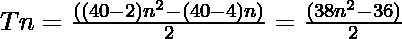

# 四角编号

> 原文:[https://www.geeksforgeeks.org/tetracontagon-number/](https://www.geeksforgeeks.org/tetracontagon-number/)

给定一个编号 **N** ，任务是找到**N<sup>th</sup>T5[四角编号](https://en.wikipedia.org/wiki/Tetracontagon)。** 

> 一个[四角数字](https://en.wikipedia.org/wiki/Tetracontagon)是一类数字。它有一个 40 边的多边形，叫做四角多边形。第 N 个四角点数是 40 个点，所有其他点都被一个公共共享角包围并形成一个图案。前几个四声道数字是 **1，40，117，232……**

**例:**

> **输入:** N = 2
> **输出:** 40
> **说明:**
> 第二个四角数字是 40。
> **输入:** N = 3
> **输出:** 117

**方法:**第 N 个四元数由公式给出:

*   s 边多边形的第 n 项= 

*   因此 40 边多边形的第 n 项是

> 

以下是上述方法的实现:

## C++

```
// C++ program for above approach
#include <bits/stdc++.h>
using namespace std;

// Finding the nth tetracontagon Number
int tetracontagonNum(int n)
{
    return (38 * n * n - 36 * n) / 2;
}

// Driver Code
int main()
{
    int n = 3;
    cout << "3rd tetracontagon Number is = "
         << tetracontagonNum(n);

    return 0;
}

// This code is contributed by Akanksha_Rai
```

## C

```
// C program for above approach

#include <stdio.h>
#include <stdlib.h>

// Finding the nth tetracontagon Number
int tetracontagonNum(int n)
{
    return (38 * n * n - 36 * n) / 2;
}

// Driver program to test above function
int main()
{
    int n = 3;
    printf("3rd tetracontagon Number is = %d",
           tetracontagonNum(n));

    return 0;
}
```

## Java 语言(一种计算机语言，尤用于创建网站)

```
// Java program for above approach
import java.util.*;

class GFG {

// Finding the nth tetracontagon number
static int tetracontagonNum(int n)
{
    return (38 * n * n - 36 * n) / 2;
}

// Driver code
public static void main(String[] args)
{
    int n = 3;

    System.out.println("3rd tetracontagon Number is = " +
                                    tetracontagonNum(n));
}
}

// This code is contributed by offbeat
```

## 蟒蛇 3

```
# Python3 program for above approach

# Finding the nth tetracontagon Number
def tetracontagonNum(n):

    return (38 * n * n - 36 * n) // 2

# Driver Code
n = 3
print("3rd tetracontagon Number is = ",
                   tetracontagonNum(n))

# This code is contributed by divyamohan123
```

## C#

```
// C# program for above approach
using System;

class GFG {

// Finding the nth tetracontagon number
static int tetracontagonNum(int n)
{
    return (38 * n * n - 36 * n) / 2;
}

// Driver code
public static void Main(string[] args)
{
    int n = 3;

    Console.Write("3rd tetracontagon Number is = " +
                               tetracontagonNum(n));
}
}

// This code is contributed by rutvik_56   
```

## java 描述语言

```
<script>

// javascript program for above approach

// Finding the nth tetracontagon Number
function tetracontagonNum( n)
{
    return (38 * n * n - 36 * n) / 2;
}

// Driver code
let n = 3;
document.write("3rd tetracontagon Number is " + tetracontagonNum(n));

// This code contributed by gauravrajput1

</script>
```

**Output:** 

```
3rd tetracontagon Number is = 117
```

***时间复杂度:** O(1)*

***辅助空间:** O(1)*

**参考资料:**[https://en . Wikipedia . org/wiki/tetra contong](https://en.wikipedia.org/wiki/Tetracontagon)