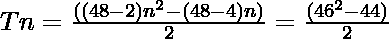

# 四触点八边形编号

> 哎哎哎:# t0]https://www . geeksforgeeks . org/tetra contangolantal-number/

给定一个数字 **N** ，任务是找到 **N <sup>第</sup>T5】个四角八边形数字。** 

> 四角八边形数是一类图形数。它有一个 48 边的多边形，叫做四角多边形。第 N 个四角八边形数字计数是 48 个点的数目，所有其他点被一个公共共享角包围并形成一个图案。前几个四元八分位数是 **1，48，141，280，465，696，…**

**例:**

> **输入:** N = 2
> **输出:** 48
> **解释:**
> 第二个四元八分位数是 48。
> **输入:** N = 3
> **输出:** 141

**方法:**第 N 个四角八分位数由公式给出:

*   s 边多边形的第 n 项= 

*   因此 48 边多边形的第 n 项是

> 

以下是上述方法的实现:

## C++

```
// C++ implementation for
// above approach
#include <bits/stdc++.h>
using namespace std;

// Function to find the
// nth Tetracontaoctagonal Number
int TetracontaoctagonalNum(int n)
{
    return (46 * n * n - 44 * n) / 2;
}

// Driver Code
int main()
{
    int n = 3;
    cout << TetracontaoctagonalNum(n);

    return 0;
}
```

## Java 语言(一种计算机语言，尤用于创建网站)

```
// Java program for above approach
class GFG{

// Function to find the
// nth TetracontaoctagonalNum Number
static int TetracontaoctagonalNum(int n)
{
    return (46 * n * n - 44 * n) / 2;
}

// Driver code
public static void main(String[] args)
{
    int n = 3;
    System.out.print(TetracontaoctagonalNum(n));
}
}

// This code is contributed by shubham
```

## 蟒蛇 3

```
# Python3 Cimplementation for
# above approach

# Function to find the
# nth Tetracontaoctagonal Number
def TetracontaoctagonalNum(n):

    return (46 * n * n - 44 * n) / 2;

# Driver Code
n = 3;
print(TetracontaoctagonalNum(n));

# This code is contributed by Code_Mech
```

## C#

```
// C# program for above approach
using System;
class GFG{

// Function to find the
// nth TetracontaoctagonalNum Number
static int TetracontaoctagonalNum(int n)
{
    return (46 * n * n - 44 * n) / 2;
}

// Driver code
public static void Main()
{
    int n = 3;
    Console.Write(TetracontaoctagonalNum(n));
}
}

// This code is contributed by Code_Mech
```

## java 描述语言

```
<script>

// Javascript implementation for
// above approach

// Function to find the
// nth Tetracontaoctagonal Number
function TetracontaoctagonalNum(n)
{
    return (46 * n * n - 44 * n) / 2;
}

// Driver Code
var n = 3;
document.write(TetracontaoctagonalNum(n));

</script>
```

**Output:** 

```
141
```

**参考资料:**[https://en . Wikipedia . org/wiki/tetra contacton](https://en.wikipedia.org/wiki/Tetracontaoctagon)