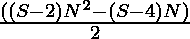
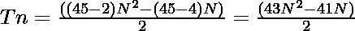

# 四角号码

> 原文:[https://www.geeksforgeeks.org/tetracontapentagon-number/](https://www.geeksforgeeks.org/tetracontapentagon-number/)

四角数字是一类图形数字。它有一个 45 边的多边形，叫做四角多边形。第 N 个四角点计数是 45 个点的数量，所有其他点都被一个公共的共享角包围并形成一个图案。
前几个四氯化碳五肽醇的数字是:

> 1，45，132，262，…

### 寻找第 n 个四角数字的程序

给定一个编号 **N** ，任务是找到**N<sup>th</sup>T5**四角编号**。
**举例:**** 

> **输入:** N = 2
> **输出:** 45
> **说明:**
> 第二个四角五角星素号为 45。
> **输入:** N = 3
> **输出:** 132

**方法:**第 N 个四角 T2 数由公式给出:

*   S 边多边形的第 n 项= 

*   因此 45 边多边形的第 N 项由
    给出

> 

以下是上述方法的实现:

## C++

```
// C++ program for the above approach
#include <bits/stdc++.h>
using namespace std;

// Function to find the N-th
// Tetracontapentagon Number
int TetracontapentagonNum(int N)
{
    return (43 * N * N - 41 * N)
        / 2;
}

// Driver Code
int main()
{
    // Given Number
    int N = 3;

    // Function Call
    cout << TetracontapentagonNum(N);

    return 0;
}
```

## Java 语言(一种计算机语言，尤用于创建网站)

```
// Java program for the above approach 
class GFG{

// Function to find the nth
// TetracontapentagonNum number
static int TetracontapentagonNum(int N)
{
    return (43 * N * N - 41 * N) / 2;
}

// Driver code
public static void main(String[] args)
{
    int n = 3;
    System.out.print(TetracontapentagonNum(n));
}
}

// This code is contributed by Pratima Pandey
```

## 蟒蛇 3

```
# Python3 program for the above approach

# Function to find the N-th
# Tetracontapentagon Number
def TetracontapentagonNum(N):

    return (43 * N * N - 41 * N) // 2;

# Driver Code

# Given Number
N = 3;

# Function Call
print(TetracontapentagonNum(N));

# This code is contributed by Code_Mech
```

## C#

```
// C# program for the above approach
using System;
class GFG{

// Function to find the nth
// TetracontapentagonNum number
static int TetracontapentagonNum(int N)
{
    return (43 * N * N - 41 * N) / 2;
}

// Driver code
public static void Main()
{
    int n = 3;
    Console.Write(TetracontapentagonNum(n));
}
}

// This code is contributed by Code_Mech
```

## java 描述语言

```
<script>

// Javascript program for the above approach 

    // Function to find the nth
    // TetracontapentagonNum number
    function TetracontapentagonNum( N) {
        return (43 * N * N - 41 * N) / 2;
    }

    // Driver code

        let n = 3;
        document.write(TetracontapentagonNum(n));

// This code contributed by gauravrajput1

</script>
```

**Output:** 

```
132
```