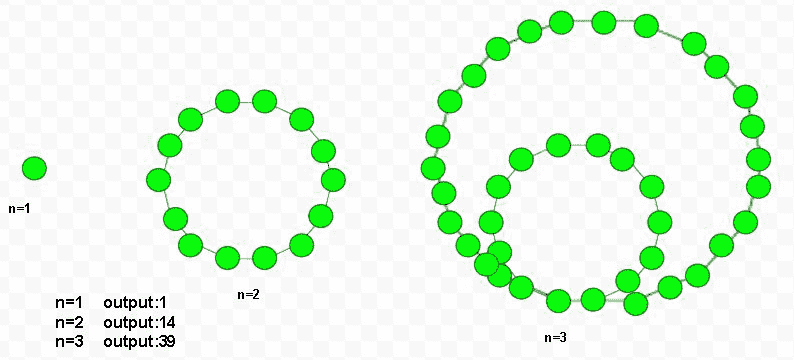

# 十边形数

> 原文:[https://www.geeksforgeeks.org/tetradecagonal-number/](https://www.geeksforgeeks.org/tetradecagonal-number/)

给定一个数 n，任务是找到第 n 个四边形数。四边形数是 14 边的多边形，称为四边形或四边形，属于具象数。第 n 个四边形数字用一些圆点点缀，形成一系列图案。他们有一个共同的分享角点，彼此都很喜欢自己的空间。点以第 n 个嵌套循环继续。
**例:**

> 输入:5
> 输出:125
> 输入:7
> 输出:259



第 n 个十边形数的公式:-

## C++

```
// Program to find nth
// Tetradecagonal number
#include <bits/stdc++.h>
using namespace std;

// Function to find
// Tetradecagonal number
int tetradecagonal_num(int n)
{
    // Formula to calculate nth
    // tetradecagonal number=
    return (12 * n * n - 10 * n) / 2;
}

// Driver Code
int main()
{
    int n = 2;
    cout << n << " th Tetradecagonal number: ";
    cout << tetradecagonal_num(n);
    cout << endl;
    n = 6;
    cout << n << " th Tetradecagonal number: ";
    cout << tetradecagonal_num(n);

    return 0;
}
```

## Java 语言(一种计算机语言，尤用于创建网站)

```
// Java Program to find nth
// Tetradecagonal number
import java.io.*;

class GFG
{

// Function to find
// Tetradecagonal number
static int tetradecagonal_num(int n)
{
    // Formula to calculate nth
    // tetradecagonal number=
    return (12 * n * n - 10 * n) / 2;
}

// Driver Code
public static void main (String[] args)
{
int n = 2;
System.out.print(n + " th Tetradecagonal" +
                              " number: ");
System.out.println(tetradecagonal_num(n));

n = 6;
System.out.print(n + " th Tetradecagonal" +
                              " number: ");
System.out.print(tetradecagonal_num(n));

}
}
// This code is code is
// contributed by m_kit
```

## 蟒蛇 3

```
# Program to find nth
# Tetradecagonal number

# Tetradecagonal number
# number function
def tetradecagonal_num(n) :

    # Formula to calculate
    # nth Tetradecagonal
    # number return it
    # into main function.
    return (12 * n * n -
            10 * n) // 2

# Driver Code
if __name__ == '__main__' :

    n = 2
    print(n,"th Tetradecagonal " +
                     "number : " ,
            tetradecagonal_num(n))

    n = 6
    print(n,"th Tetradecagonal " +
                     "number : " ,
            tetradecagonal_num(n))

# This code is contributed ajit
```

## C#

```
// C# Program to find nth
// Tetradecagonal number
using System;

class GFG
{

    // Function to find
    // Tetradecagonal number
    static int tetradecagonal_num(int n)
    {

    // Formula to calculate nth
    // tetradecagonal number
    return (12 * n * n -
            10 * n) / 2;
    }

// Driver Code
static public void Main ()
{
    int n = 2;
    Console.Write(n + "th Tetradecagonal" +
                              " number: ");
    Console.WriteLine(tetradecagonal_num(n));

    n = 6;
    Console.Write(n + "th Tetradecagonal" +
                              " number: ");
    Console.WriteLine(tetradecagonal_num(n));
}
}

// This code is contributed by ajit
```

## 服务器端编程语言（Professional Hypertext Preprocessor 的缩写）

```
<?php
// Program to find nth
// Tetradecagonal number

// Function to find
// Tetradecagonal number
function tetradecagonal_num($n)
{
    // Formula to calculate nth
    // tetradecagonal number=
    return (12 * $n * $n - 10 * $n) / 2;
}

// Driver Code
$n = 2;
echo $n , " th Tetradecagonal number: ";
echo tetradecagonal_num($n), "\n";

$n = 6;
echo $n ," th Tetradecagonal number: ";
echo tetradecagonal_num($n);

// This code is contributed by aj_36
?>
```

## java 描述语言

```
<script>
    // Javascript Program to find nth Tetradecagonal number

    // Function to find
    // Tetradecagonal number
    function tetradecagonal_num(n)
    {

      // Formula to calculate nth
      // tetradecagonal number
      return (12 * n * n - 10 * n) / 2;
    }

    let n = 2;
    document.write(n + "th Tetradecagonal number: ");
    document.write(tetradecagonal_num(n) + "</br>");

    n = 6;
    document.write(n + "th Tetradecagonal number: ");
    document.write(tetradecagonal_num(n));

// This code is contributed by suresh07.
</script>
```

**输出:**

```
2 th Tetradecagonal number: 14
6 th Tetradecagonal number: 186
```

**时间复杂度:**O(1)
T3】辅助空间: O(1)

参考:
T1】https://en.wikipedia.org/wiki/Polygonal_numberT3】