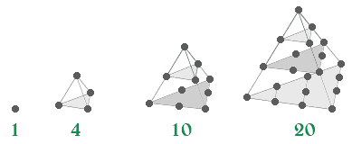

# 四面体数

> 原文:[https://www.geeksforgeeks.org/tetrahedral-numbers/](https://www.geeksforgeeks.org/tetrahedral-numbers/)

如果一个数可以表示为一个有三角形底和三条边的金字塔，称为四面体，那么这个数就称为四面体数。第 n 个<sup>四面体数是前 n 个[三角形数](https://www.geeksforgeeks.org/triangular-numbers/)的和。
前十个四面体编号为:
1、4、10、20、35、56、84、120、165、220、…</sup> 



第 n <sup>个</sup>四面体数的公式:

```
Tn = (n * (n + 1) * (n + 2)) / 6
```

**证明:**

```
The proof uses the fact that the nth tetrahedral 
number is given by,

Trin = (n * (n + 1)) / 2

It proceeds by induction.

Base Case
T1 = 1 = 1 * 2 * 3 / 6

Inductive Step
Tn+1 = Tn + Trin+1

Tn+1 = [((n * (n + 1) * (n + 2)) / 6] + [((n + 1) * (n + 2)) / 2]

Tn+1 = (n * (n + 1) * (n + 2)) / 6
```

以下是上述思路的实现:

## C++

```
// CPP Program to find the
// nth tetrahedral number
#include <iostream>
using namespace std;

int tetrahedralNumber(int n)
{
    return (n * (n + 1) * (n + 2)) / 6;
}

// Driver Code
int main()
{
    int n = 5;

    cout << tetrahedralNumber(n) << endl;

    return 0;
}
```

## Java 语言(一种计算机语言，尤用于创建网站)

```
// Java Program to find the
// nth tetrahedral number
class GFG {

// Function to find Tetrahedral Number
static int tetrahedralNumber(int n)
{
    return (n * (n + 1) * (n + 2)) / 6;
}

// Driver Code
public static void main(String[] args)
{
    int n = 5;

    System.out.println(tetrahedralNumber(n));
}
}

// This code is contributed by Manish Kumar Rai.
```

## 计算机编程语言

```
# Python3 Program to find the
# nth tetrahedral number

def tetrahedralNumber(n):

    return (n * (n + 1) * (n + 2)) / 6

# Driver Code
n = 5
print (tetrahedralNumber(n))
```

## C#

```
// C# Program to find the
// nth tetrahedral number
using System;

public class GFG{

    // Function to find Tetrahedral Number
    static int tetrahedralNumber(int n)
    {
        return (n * (n + 1) * (n + 2)) / 6;
    }

    // Driver code
    static public void Main ()
    {
        int n = 5;

        Console.WriteLine(tetrahedralNumber(n));
    }
}

// This code is contributed by Ajit.
```

## 服务器端编程语言（Professional Hypertext Preprocessor 的缩写）

```
<?php
// PHP Program to find the
// nth tetrahedral number

function tetrahedralNumber($n)
{
    return ($n * ($n + 1) * ($n + 2)) / 6;
}

// Driver Code
    $n = 5;

    echo tetrahedralNumber($n);

// This code is contributed by mits
?>
```

## java 描述语言

```
<script>

// JavaScript Program to find the
// nth tetrahedral number

// Function to find Tetrahedral Number
function tetrahedralNumber(n)
{
    return (n * (n + 1) * (n + 2)) / 6;
}

// Driver code
     let n = 5;
    document.write(tetrahedralNumber(n));

    // This code is contributed by code_hunt.
</script>
```

输出:

```
35
```

**时间复杂度** : O(1)。