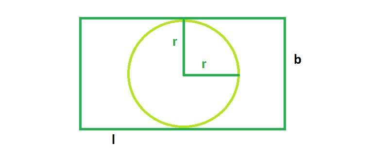

# 矩形内接的最大可能圆

> 原文:[https://www . geeksforgeeks . org/最大可能矩形内接圆/](https://www.geeksforgeeks.org/the-biggest-possible-circle-that-can-be-inscribed-in-rectangle/)

给定一个长度为 **l** &宽度为 **b** 的矩形，我们必须找到可以在该矩形内接的最大圆。
**例:**

```
Input  : l = 4, b = 8
Output : 12.56

Input  : l = 16 b = 6
Output : 28.26
```



从图中，我们可以看到，矩形内接的最大圆的半径总是等于矩形短边的一半。所以从图中来看，

> 半径， **r = b/2** &
> 面积， **A = π * (r^2)**

## C++

```
// C++ Program to find the biggest circle
// which can be inscribed  within the rectangle
#include <bits/stdc++.h>
using namespace std;

// Function to find the area
// of the biggest circle
float circlearea(float l, float b)
{

    // the length and breadth cannot be negative
    if (l < 0 || b < 0)
        return -1;

    // area of the circle
    if (l < b)
        return 3.14 * pow(l / 2, 2);
    else
        return 3.14 * pow(b / 2, 2);
}

// Driver code
int main()
{
    float l = 4, b = 8;
    cout << circlearea(l, b) << endl;
    return 0;
}
```

## Java 语言(一种计算机语言，尤用于创建网站)

```
// Java Program to find the
// biggest circle which can be
// inscribed within the rectangle

class GFG
{

// Function to find the area
// of the biggest circle
static float circlearea(float l,
                        float b)
{

// the length and breadth
// cannot be negative
if (l < 0 || b < 0)
    return -1;

// area of the circle
if (l < b)
    return (float)(3.14 * Math.pow(l / 2, 2));
else
    return (float)(3.14 * Math.pow(b / 2, 2));
}

// Driver code
public static void main(String[] args)
{
    float l = 4, b = 8;
    System.out.println(circlearea(l, b));
}
}

// This code is contributed
// by ChitraNayal
```

## 蟒蛇 3

```
# Python 3 Program to find the
# biggest circle which can be
# inscribed within the rectangle

# Function to find the area
# of the biggest circle
def circlearea(l, b):

    # the length and breadth
    # cannot be negative
    if (l < 0 or b < 0):
        return -1

    # area of the circle
    if (l < b):
        return 3.14 * pow(l // 2, 2)
    else:
        return 3.14 * pow(b // 2, 2)

# Driver code
if __name__ == "__main__":
    l = 4
    b = 8
    print(circlearea(l, b))

# This code is contributed
# by ChitraNayal
```

## C#

```
// C# Program to find the
// biggest circle which can be
// inscribed within the rectangle
using System;

class GFG
{

// Function to find the area
// of the biggest circle
static float circlearea(float l,
                        float b)
{

// the length and breadth
// cannot be negative
if (l < 0 || b < 0)
    return -1;

// area of the circle
if (l < b)
    return (float)(3.14 * Math.Pow(l / 2, 2));
else
    return (float)(3.14 * Math.Pow(b / 2, 2));
}

// Driver code
public static void Main()
{
    float l = 4, b = 8;
    Console.Write(circlearea(l, b));
}
}

// This code is contributed
// by ChitraNayal
```

## 服务器端编程语言（Professional Hypertext Preprocessor 的缩写）

```
<?php
// PHP Program to find the
// biggest circle which can be
// inscribed within the rectangle

// Function to find the area
// of the biggest circle
function circlearea($l, $b)
{

    // the length and breadth
    // cannot be negative
    if ($l < 0 || $b < 0)
        return -1;

    // area of the circle
    if ($l < $b)
        return 3.14 * pow($l / 2, 2);
    else
        return 3.14 * pow($b / 2, 2);
}

// Driver code
$l = 4;
$b = 8;
echo circlearea($l, $b)."\n";

// This code is contributed
// by ChitraNayal
?>
```

## java 描述语言

```
<script>

// javascript Program to find the
// biggest circle which can be
// inscribed within the rectangle

// Function to find the area
// of the biggest circle
function circlearea(l, b)
{

    // the length and breadth
    // cannot be negative
    if (l < 0 || b < 0)
        return -1;

    // area of the circle
    if (l < b)
        return (3.14 * Math.pow(l / 2, 2));
    else
        return (3.14 * Math.pow(b / 2, 2));
}

// Driver code

var l = 4, b = 8;
document.write(circlearea(l, b));

// This code is contributed by Amit Katiyar

</script>
```

**Output:** 

```
12.56
```