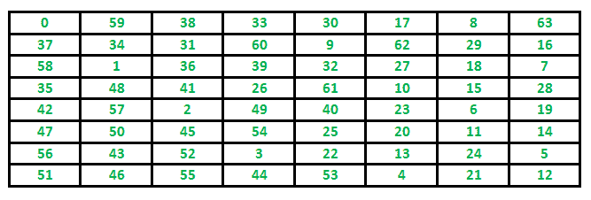

# 骑士之旅问题|回溯-1

> 原文:[https://www . geesforgeks . org/the-knights-tour-problem-backtrack-1/](https://www.geeksforgeeks.org/the-knights-tour-problem-backtracking-1/)

回溯是一种算法范式，它尝试不同的解决方案，直到找到“有效”的解决方案。通常使用回溯技术解决的问题具有以下共同属性。这些问题只能通过尝试每种可能的配置来解决，并且每种配置只尝试一次。这些问题的一个简单的解决方案是尝试所有配置，并输出一个遵循给定问题约束的配置。回溯以增量方式工作，是对朴素解决方案的优化，在朴素解决方案中，生成并尝试了所有可能的配置。
比如考虑以下[骑士之旅](http://en.wikipedia.org/wiki/Knight%27s_tour)的问题。

**问题陈述:**
给一个 N*N 的棋盘，骑士放在空棋盘的第一块。按照象棋规则移动的骑士必须准确地访问每个广场一次。打印每个单元格被访问的顺序。

**示例:**

```
Input : 
N = 8
Output:
0  59  38  33  30  17   8  63
37  34  31  60   9  62  29  16
58   1  36  39  32  27  18   7
35  48  41  26  61  10  15  28
42  57   2  49  40  23   6  19
47  50  45  54  25  20  11  14
56  43  52   3  22  13  24   5
51  46  55  44  53   4  21  12
```

**骑士跟随覆盖所有细胞的路径**
跟随的是一个 8×8 细胞的棋盘。单元格中的数字表示骑士的移动次数。



让我们先讨论这个问题的朴素算法，然后讨论回溯算法。

**骑士之旅的天真算法**
天真算法是逐个生成所有的旅程，检查生成的旅程是否满足约束。

```
while there are untried tours
{ 
   generate the next tour 
   if this tour covers all squares 
   { 
      print this path;
   }
}
```

**回溯**以一种增量的方式攻击问题。通常，我们从一个空的解向量开始，一个接一个地添加项目(项目的含义因问题而异。在骑士之旅问题的背景下，一个物品就是一个骑士的招式)。当我们添加一个项目时，我们会检查添加当前项目是否违反了问题约束，如果违反了，我们会移除该项目并尝试其他替代方法。如果没有一个备选方案可行，那么我们进入前一阶段，删除前一阶段添加的项目。如果我们回到初始阶段，那么我们说不存在解决方案。如果添加一个项目不违反约束，那么我们递归地一个接一个地添加项目。如果解向量变得完整，那么我们打印解。

**骑士之旅回溯算法**

下面是奈特旅行问题的回溯算法。

```
If all squares are visited 
    print the solution
Else
   a) Add one of the next moves to solution vector and recursively 
   check if this move leads to a solution. (A Knight can make maximum 
   eight moves. We choose one of the 8 moves in this step).
   b) If the move chosen in the above step doesn't lead to a solution
   then remove this move from the solution vector and try other 
   alternative moves.
   c) If none of the alternatives work then return false (Returning false 
   will remove the previously added item in recursion and if false is 
   returned by the initial call of recursion then "no solution exists" )
```

以下是骑士之旅问题的实现。它以 2D 矩阵的形式打印一个可能的解决方案。基本上，输出是一个 2D 8*8 矩阵，数字从 0 到 63，这些数字显示了骑士的步骤。

## C++

```
// C++ program for Knight Tour problem
#include <bits/stdc++.h>
using namespace std;

#define N 8

int solveKTUtil(int x, int y, int movei, int sol[N][N],
                int xMove[], int yMove[]);

/* A utility function to check if i,j are
valid indexes for N*N chessboard */
int isSafe(int x, int y, int sol[N][N])
{
    return (x >= 0 && x < N && y >= 0 && y < N
            && sol[x][y] == -1);
}

/* A utility function to print
solution matrix sol[N][N] */
void printSolution(int sol[N][N])
{
    for (int x = 0; x < N; x++) {
        for (int y = 0; y < N; y++)
            cout << " " << setw(2) << sol[x][y] << " ";
        cout << endl;
    }
}

/* This function solves the Knight Tour problem using
Backtracking. This function mainly uses solveKTUtil()
to solve the problem. It returns false if no complete
tour is possible, otherwise return true and prints the
tour.
Please note that there may be more than one solutions,
this function prints one of the feasible solutions. */
int solveKT()
{
    int sol[N][N];

    /* Initialization of solution matrix */
    for (int x = 0; x < N; x++)
        for (int y = 0; y < N; y++)
            sol[x][y] = -1;

    /* xMove[] and yMove[] define next move of Knight.
    xMove[] is for next value of x coordinate
    yMove[] is for next value of y coordinate */
    int xMove[8] = { 2, 1, -1, -2, -2, -1, 1, 2 };
    int yMove[8] = { 1, 2, 2, 1, -1, -2, -2, -1 };

    // Since the Knight is initially at the first block
    sol[0][0] = 0;

    /* Start from 0,0 and explore all tours using
    solveKTUtil() */
    if (solveKTUtil(0, 0, 1, sol, xMove, yMove) == 0) {
        cout << "Solution does not exist";
        return 0;
    }
    else
        printSolution(sol);

    return 1;
}

/* A recursive utility function to solve Knight Tour
problem */
int solveKTUtil(int x, int y, int movei, int sol[N][N],
                int xMove[8], int yMove[8])
{
    int k, next_x, next_y;
    if (movei == N * N)
        return 1;

    /* Try all next moves from
    the current coordinate x, y */
    for (k = 0; k < 8; k++) {
        next_x = x + xMove[k];
        next_y = y + yMove[k];
        if (isSafe(next_x, next_y, sol)) {
            sol[next_x][next_y] = movei;
            if (solveKTUtil(next_x, next_y, movei + 1, sol,
                            xMove, yMove)
                == 1)
                return 1;
            else

               // backtracking
                sol[next_x][next_y] = -1;
        }
    }
    return 0;
}

// Driver Code
int main()
{
      // Function Call
    solveKT();
    return 0;
}

// This code is contributed by ShubhamCoder
```

## C

```
// C program for Knight Tour problem
#include <stdio.h>
#define N 8

int solveKTUtil(int x, int y, int movei, int sol[N][N],
                int xMove[], int yMove[]);

/* A utility function to check if i,j are valid indexes
   for N*N chessboard */
int isSafe(int x, int y, int sol[N][N])
{
    return (x >= 0 && x < N && y >= 0 && y < N
            && sol[x][y] == -1);
}

/* A utility function to print solution matrix sol[N][N] */
void printSolution(int sol[N][N])
{
    for (int x = 0; x < N; x++) {
        for (int y = 0; y < N; y++)
            printf(" %2d ", sol[x][y]);
        printf("\n");
    }
}

/* This function solves the Knight Tour problem using
   Backtracking.  This function mainly uses solveKTUtil()
   to solve the problem. It returns false if no complete
   tour is possible, otherwise return true and prints the
   tour.
   Please note that there may be more than one solutions,
   this function prints one of the feasible solutions.  */
int solveKT()
{
    int sol[N][N];

    /* Initialization of solution matrix */
    for (int x = 0; x < N; x++)
        for (int y = 0; y < N; y++)
            sol[x][y] = -1;

    /* xMove[] and yMove[] define next move of Knight.
       xMove[] is for next value of x coordinate
       yMove[] is for next value of y coordinate */
    int xMove[8] = { 2, 1, -1, -2, -2, -1, 1, 2 };
    int yMove[8] = { 1, 2, 2, 1, -1, -2, -2, -1 };

    // Since the Knight is initially at the first block
    sol[0][0] = 0;

    /* Start from 0,0 and explore all tours using
       solveKTUtil() */
    if (solveKTUtil(0, 0, 1, sol, xMove, yMove) == 0) {
        printf("Solution does not exist");
        return 0;
    }
    else
        printSolution(sol);

    return 1;
}

/* A recursive utility function to solve Knight Tour
   problem */
int solveKTUtil(int x, int y, int movei, int sol[N][N],
                int xMove[N], int yMove[N])
{
    int k, next_x, next_y;
    if (movei == N * N)
        return 1;

    /* Try all next moves from the current coordinate x, y
     */
    for (k = 0; k < 8; k++) {
        next_x = x + xMove[k];
        next_y = y + yMove[k];
        if (isSafe(next_x, next_y, sol)) {
            sol[next_x][next_y] = movei;
            if (solveKTUtil(next_x, next_y, movei + 1, sol,
                            xMove, yMove)
                == 1)
                return 1;
            else
                sol[next_x][next_y] = -1; // backtracking
        }
    }

    return 0;
}

/* Driver Code */
int main()
{

      // Function Call
    solveKT();
    return 0;
}
```

## Java 语言(一种计算机语言，尤用于创建网站)

```
// Java program for Knight Tour problem
class KnightTour {
    static int N = 8;

    /* A utility function to check if i,j are
       valid indexes for N*N chessboard */
    static boolean isSafe(int x, int y, int sol[][])
    {
        return (x >= 0 && x < N && y >= 0 && y < N
                && sol[x][y] == -1);
    }

    /* A utility function to print solution
       matrix sol[N][N] */
    static void printSolution(int sol[][])
    {
        for (int x = 0; x < N; x++) {
            for (int y = 0; y < N; y++)
                System.out.print(sol[x][y] + " ");
            System.out.println();
        }
    }

    /* This function solves the Knight Tour problem
       using Backtracking.  This  function mainly
       uses solveKTUtil() to solve the problem. It
       returns false if no complete tour is possible,
       otherwise return true and prints the tour.
       Please note that there may be more than one
       solutions, this function prints one of the
       feasible solutions.  */
    static boolean solveKT()
    {
        int sol[][] = new int[8][8];

        /* Initialization of solution matrix */
        for (int x = 0; x < N; x++)
            for (int y = 0; y < N; y++)
                sol[x][y] = -1;

        /* xMove[] and yMove[] define next move of Knight.
           xMove[] is for next value of x coordinate
           yMove[] is for next value of y coordinate */
        int xMove[] = { 2, 1, -1, -2, -2, -1, 1, 2 };
        int yMove[] = { 1, 2, 2, 1, -1, -2, -2, -1 };

        // Since the Knight is initially at the first block
        sol[0][0] = 0;

        /* Start from 0,0 and explore all tours using
           solveKTUtil() */
        if (!solveKTUtil(0, 0, 1, sol, xMove, yMove)) {
            System.out.println("Solution does not exist");
            return false;
        }
        else
            printSolution(sol);

        return true;
    }

    /* A recursive utility function to solve Knight
       Tour problem */
    static boolean solveKTUtil(int x, int y, int movei,
                               int sol[][], int xMove[],
                               int yMove[])
    {
        int k, next_x, next_y;
        if (movei == N * N)
            return true;

        /* Try all next moves from the current coordinate
            x, y */
        for (k = 0; k < 8; k++) {
            next_x = x + xMove[k];
            next_y = y + yMove[k];
            if (isSafe(next_x, next_y, sol)) {
                sol[next_x][next_y] = movei;
                if (solveKTUtil(next_x, next_y, movei + 1,
                                sol, xMove, yMove))
                    return true;
                else
                    sol[next_x][next_y]
                        = -1; // backtracking
            }
        }

        return false;
    }

    /* Driver Code */
    public static void main(String args[])
    {
        // Function Call
        solveKT();
    }
}
// This code is contributed by Abhishek Shankhadhar
```

## 蟒蛇 3

```
# Python3 program to solve Knight Tour problem using Backtracking

# Chessboard Size
n = 8

def isSafe(x, y, board):
    '''
        A utility function to check if i,j are valid indexes
        for N*N chessboard
    '''
    if(x >= 0 and y >= 0 and x < n and y < n and board[x][y] == -1):
        return True
    return False

def printSolution(n, board):
    '''
        A utility function to print Chessboard matrix
    '''
    for i in range(n):
        for j in range(n):
            print(board[i][j], end=' ')
        print()

def solveKT(n):
    '''
        This function solves the Knight Tour problem using
        Backtracking. This function mainly uses solveKTUtil()
        to solve the problem. It returns false if no complete
        tour is possible, otherwise return true and prints the
        tour.
        Please note that there may be more than one solutions,
        this function prints one of the feasible solutions.
    '''

    # Initialization of Board matrix
    board = [[-1 for i in range(n)]for i in range(n)]

    # move_x and move_y define next move of Knight.
    # move_x is for next value of x coordinate
    # move_y is for next value of y coordinate
    move_x = [2, 1, -1, -2, -2, -1, 1, 2]
    move_y = [1, 2, 2, 1, -1, -2, -2, -1]

    # Since the Knight is initially at the first block
    board[0][0] = 0

    # Step counter for knight's position
    pos = 1

    # Checking if solution exists or not
    if(not solveKTUtil(n, board, 0, 0, move_x, move_y, pos)):
        print("Solution does not exist")
    else:
        printSolution(n, board)

def solveKTUtil(n, board, curr_x, curr_y, move_x, move_y, pos):
    '''
        A recursive utility function to solve Knight Tour
        problem
    '''

    if(pos == n**2):
        return True

    # Try all next moves from the current coordinate x, y
    for i in range(8):
        new_x = curr_x + move_x[i]
        new_y = curr_y + move_y[i]
        if(isSafe(new_x, new_y, board)):
            board[new_x][new_y] = pos
            if(solveKTUtil(n, board, new_x, new_y, move_x, move_y, pos+1)):
                return True

            # Backtracking
            board[new_x][new_y] = -1
    return False

# Driver Code
if __name__ == "__main__":

    # Function Call
    solveKT(n)

# This code is contributed by AAKASH PAL
```

## C#

```
// C# program for
// Knight Tour problem
using System;

class GFG {
    static int N = 8;

    /* A utility function to
    check if i,j are valid
    indexes for N*N chessboard */
    static bool isSafe(int x, int y, int[, ] sol)
    {
        return (x >= 0 && x < N && y >= 0 && y < N
                && sol[x, y] == -1);
    }

    /* A utility function to
    print solution matrix sol[N][N] */
    static void printSolution(int[, ] sol)
    {
        for (int x = 0; x < N; x++) {
            for (int y = 0; y < N; y++)
                Console.Write(sol[x, y] + " ");
            Console.WriteLine();
        }
    }

    /* This function solves the
    Knight Tour problem using
    Backtracking. This function
    mainly uses solveKTUtil() to
    solve the problem. It returns
    false if no complete tour is
    possible, otherwise return true
    and prints the tour. Please note
    that there may be more than one
    solutions, this function prints
    one of the feasible solutions. */
    static bool solveKT()
    {
        int[, ] sol = new int[8, 8];

        /* Initialization of
        solution matrix */
        for (int x = 0; x < N; x++)
            for (int y = 0; y < N; y++)
                sol[x, y] = -1;

        /* xMove[] and yMove[] define
           next move of Knight.
           xMove[] is for next
           value of x coordinate
           yMove[] is for next
           value of y coordinate */
        int[] xMove = { 2, 1, -1, -2, -2, -1, 1, 2 };
        int[] yMove = { 1, 2, 2, 1, -1, -2, -2, -1 };

        // Since the Knight is
        // initially at the first block
        sol[0, 0] = 0;

        /* Start from 0,0 and explore
        all tours using solveKTUtil() */
        if (!solveKTUtil(0, 0, 1, sol, xMove, yMove)) {
            Console.WriteLine("Solution does "
                              + "not exist");
            return false;
        }
        else
            printSolution(sol);

        return true;
    }

    /* A recursive utility function
    to solve Knight Tour problem */
    static bool solveKTUtil(int x, int y, int movei,
                            int[, ] sol, int[] xMove,
                            int[] yMove)
    {
        int k, next_x, next_y;
        if (movei == N * N)
            return true;

        /* Try all next moves from
        the current coordinate x, y */
        for (k = 0; k < 8; k++) {
            next_x = x + xMove[k];
            next_y = y + yMove[k];
            if (isSafe(next_x, next_y, sol)) {
                sol[next_x, next_y] = movei;
                if (solveKTUtil(next_x, next_y, movei + 1,
                                sol, xMove, yMove))
                    return true;
                else
                    // backtracking
                    sol[next_x, next_y] = -1;
            }
        }

        return false;
    }

    // Driver Code
    public static void Main()
    {
        // Function Call
        solveKT();
    }
}

// This code is contributed by mits.
```

## java 描述语言

```
<script>

// Javascript program for Knight Tour problem
let N = 8;

// A utility function to check if i,j are
// valid indexes for N*N chessboard
function isSafe(x, y, sol)
{
    return(x >= 0 && x < N && y >= 0 &&
            y < N && sol[x][y] == -1);
}

// A utility function to print solution
// matrix sol[N][N]
function printSolution(sol)
{
    for(let x = 0; x < N; x++)
    {
        for(let y = 0; y < N; y++)
            document.write(sol[x][y] + " ");

        document.write("<br/>");
    }
}

// This function solves the Knight Tour problem
// using Backtracking.  This  function mainly
// uses solveKTUtil() to solve the problem. It
// returns false if no complete tour is possible,
// otherwise return true and prints the tour.
// Please note that there may be more than one
// solutions, this function prints one of the
// feasible solutions. 
function solveKT()
{
    let sol = new Array(8);
    for(var i = 0; i < sol.length; i++)
    {
        sol[i] = new Array(2);
    }

    // Initialization of solution matrix
    for(let x = 0; x < N; x++)
        for(let y = 0; y < N; y++)
            sol[x][y] = -1;

    // xMove[] and yMove[] define next move of Knight.
    // xMove[] is for next value of x coordinate
    // yMove[] is for next value of y coordinate
    let xMove = [ 2, 1, -1, -2, -2, -1, 1, 2 ];
    let yMove = [ 1, 2, 2, 1, -1, -2, -2, -1 ];

    // Since the Knight is initially at the first block
    sol[0][0] = 0;

    // Start from 0,0 and explore all tours using
    // solveKTUtil()
    if (!solveKTUtil(0, 0, 1, sol, xMove, yMove))
    {
        document.write("Solution does not exist");
        return false;
    }
    else
        printSolution(sol);

    return true;
}

// A recursive utility function to solve Knight
// Tour problem
function solveKTUtil(x, y, movei, sol, xMove, yMove)
{
    let k, next_x, next_y;
    if (movei == N * N)
        return true;

    // Try all next moves from the
    // current coordinate x, y
    for(k = 0; k < 8; k++)
    {
        next_x = x + xMove[k];
        next_y = y + yMove[k];

        if (isSafe(next_x, next_y, sol))
        {
            sol[next_x][next_y] = movei;
            if (solveKTUtil(next_x, next_y, movei + 1,
                            sol, xMove, yMove))
                return true;
            else
                sol[next_x][next_y] = -1; // backtracking
        }
    }
    return false;
}

// Driver code

// Function Call
solveKT();

// This code is contributed by target_2

</script>
```

**Output**

```
  0  59  38  33  30  17   8  63 
 37  34  31  60   9  62  29  16 
 58   1  36  39  32  27  18   7 
 35  48  41  26  61  10  15  28 
 42  57   2  49  40  23   6  19 
 47  50  45  54  25  20  11  14 
 56  43  52   3  22  13  24   5 
 51  46  55  44  53   4  21  12 
```

**时间复杂度:**
有 n 个 <sup>2</sup> 细胞，对于每个细胞，我们最多有 8 个可能的招式可供选择，所以最差的运行时间是 O(8 个 <sup>N^2</sup> )。

**辅助空间:** O(N <sup>2</sup> )

**重要提示:**
xMove、yMove 的顺序没有错，但是它们会对算法的运行时间造成很大的影响。例如，假设移动的第 8 个选择是正确的，在此之前，我们的代码运行了 7 个不同的错误路径。使用启发式方法总是比随机回溯更好。就像，在这种情况下，我们知道下一步可能是在南方或东方，那么检查第一条路径是一个更好的策略。

请注意，回溯并不是骑士之旅问题的最佳解决方案。其他更好的解决方案参见下面的文章。这篇文章的目的是用一个例子来解释回溯。
[沃恩斯多夫的骑士之旅问题算法](https://www.geeksforgeeks.org/warnsdorffs-algorithm-knights-tour-problem/)

参考文献:
[http://see . Stanford . edu/materials/icspaccs 106 b/H19-recback examples . pdf](http://see.stanford.edu/materials/icspacs106b/H19-RecBacktrackExamples.pdf)
[http://www . cis . uppenn . edu/~ matuszek/cit 594-2009/讲课/35-backback . PPT](http://www.cis.upenn.edu/~matuszek/cit594-2009/Lectures/35-backtracking.ppt)
[http://mathworld.wolfram.com/KnightsTour.html](http://mathworld.wolfram.com/KnightsTour.html)
[http://en.wikipedia.org/wiki/Knight%27s_tour](http://en.wikipedia.org/wiki/Knight%27s_tour)
如发现有不正确之处，或想分享更多话题信息，请写评论