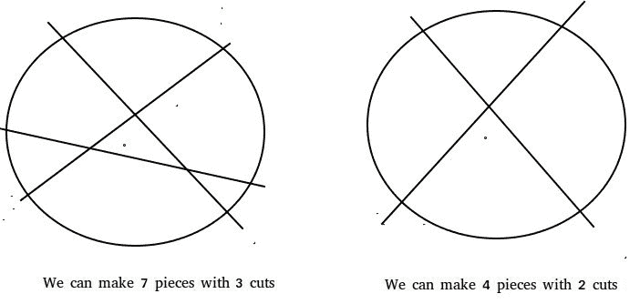

# 懒人餐饮人的问题

> 原文:[https://www.geeksforgeeks.org/the-lazy-caterers-problem/](https://www.geeksforgeeks.org/the-lazy-caterers-problem/)

给定一个整数 n，表示一个薄饼可以切的片数，求 n 个片可以形成的最大片数。
**例:**

```
Input :  n = 1
Output : 2
With 1 cut we can divide the pancake in 2 pieces

Input :  2
Output : 4
With 2 cuts we can divide the pancake in 4 pieces

Input : 3
Output : 7
We can divide the pancake in 7 parts with 3 cuts

Input : 50
Output : 1276

```



```
Let f(n) denote the maximum number of pieces
that can be obtained by making n cuts.
Trivially,
f(0) = 1                                 
As there'd be only 1 piece without any cut.

Similarly,
f(1) = 2

Proceeding in similar fashion we can deduce 
the recursive nature of the function.
The function can be represented recursively as :
f(n) = n + f(n-1)

Hence a simple solution based on the above 
formula can run in O(n). 
```

我们可以优化以上公式。

```
We now know ,
f(n) = n + f(n-1) 

Expanding f(n-1) and so on we have ,
f(n) = n + n-1 + n-2 + ...... + 1 + f(0)

which gives,
f(n) = (n*(n+1))/2 + 1
```

因此，通过这种优化，我们可以回答 O(1)中的所有查询。
以下是上述思路的实现:

## C++

```
// A C++ program to find the solution to
// The Lazy Caterer's Problem
#include <iostream>
using namespace std;

// This function receives an integer n
// and returns the maximum number of
// pieces that can be made form pancake
// using n cuts
int findPieces(int n)
{
    // Use the formula
    return (n * ( n + 1)) / 2 + 1;
}

// Driver Code
int main()
{
    cout << findPieces(1) << endl;
    cout << findPieces(2) << endl;
    cout << findPieces(3) << endl;
    cout << findPieces(50) << endl;
    return 0;
}
```

## Java 语言(一种计算机语言，尤用于创建网站)

```
// Java program to find the solution to
// The Lazy Caterer's Problem
import java.io.*;

class GFG
{
    // This function returns the maximum
    // number of pieces that can be made
    //  form pancake using n cuts
    static int findPieces(int n)
    {
        // Use the formula
        return (n * (n + 1)) / 2 + 1;
    }

    // Driver program to test above function
    public static void main (String[] args)
    {
        System.out.println(findPieces(1));
        System.out.println(findPieces(2));
        System.out.println(findPieces(3));
        System.out.println(findPieces(50));
    }
}

// This code is contributed by Pramod Kumar
```

## 蟒蛇 3

```
# A Python 3 program to
# find the solution to
# The Lazy Caterer's Problem

# This function receives an
# integer n and returns the
# maximum number of pieces
# that can be made form
# pancake using n cuts
def findPieces( n ):

    # Use the formula
    return (n * ( n + 1)) // 2 + 1

# Driver Code
print(findPieces(1))
print(findPieces(2))
print(findPieces(3))
print(findPieces(50))

# This code is contributed
# by ihritik
```

## C#

```
// C# program to find the solution
// to The Lazy Caterer's Problem
using System;

class GFG
{
    // This function returns the maximum
    // number of pieces that can be made
    // form pancake using n cuts
    static int findPieces(int n)
    {
        // Use the formula
        return (n * (n + 1)) / 2 + 1;
    }

    // Driver code
    public static void Main ()
    {
        Console.WriteLine(findPieces(1));
        Console.WriteLine(findPieces(2));
        Console.WriteLine(findPieces(3));
        Console.Write(findPieces(50));
    }
}

// This code is contributed by Nitin Mittal.
```

## 服务器端编程语言（Professional Hypertext Preprocessor 的缩写）

```
<?php
// A php program to find
// the solution to The
// Lazy Caterer's Problem

// This function receives
// an integer n and returns
// the maximum number of
// pieces that can be made
// form pancake using n cuts
function findPieces($n)
{
    // Use the formula
    return ($n * ( $n + 1)) / 2 + 1;
}

// Driver Code
echo findPieces(1) , "\n" ;
echo findPieces(2) , "\n" ;
echo findPieces(3) , "\n" ;
echo findPieces(50) ,"\n";

// This code is contributed
// by nitin mittal.
?>
```

## java 描述语言

```
<script>

// Javascript program to find the solution to
// The Lazy Caterer's Problem

    // This function returns the maximum
    // number of pieces that can be made
    //  form pancake using n cuts
    function findPieces(n)
    {
        // Use the formula
        return (n * (n + 1)) / 2 + 1;
    }

// Driver Code

        document.write(findPieces(1) + "<br/>");
        document.write(findPieces(2) + "<br/>");
        document.write(findPieces(3) + "<br/>");
        document.write(findPieces(50));

</script>
```

**输出:**

```
2
4
7
1276
```

参考文献:[oeis.org](http://oeis.org)
本文由 [**阿舒托什·库马尔**](https://www.linkedin.com/in/ashutosh-kumar-9527a7105?trk=nav_responsive_tab_profile) 供稿。如果你喜欢 GeeksforGeeks 并想投稿，你也可以使用[contribute.geeksforgeeks.org](http://www.contribute.geeksforgeeks.org)写一篇文章或者把你的文章邮寄到 contribute@geeksforgeeks.org。看到你的文章出现在极客博客主页上，帮助其他极客。
如果发现有不正确的地方，或者想分享更多关于上述话题的信息，请写评论。