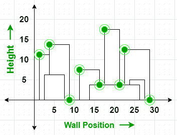

# 天际线问题|第二集

> 原文:[https://www.geeksforgeeks.org/the-skyline-problem-set-2/](https://www.geeksforgeeks.org/the-skyline-problem-set-2/)

给定二维城市中的 n 个矩形建筑，计算这些建筑的天际线，消除隐藏线。主要任务是从旁边查看建筑物，并移除所有不可见的部分。

所有建筑共用一个底部，每个建筑用一个三元组(左、中、右)表示

*   **左侧:**是左侧(或墙)的 x 坐标。
*   **右侧:**为右侧 x 坐标。
*   **ht:** 是建筑物的高度。

天际线是矩形条的集合。矩形条带表示为一对(左，ht)，其中左是条带左侧的 x 坐标，ht 是条带的高度。

**示例:**

> **输入:**建筑[][] = { {1，11，5}，{2，6，7}，{3，13，9}，{12，7，16}，{14，3，25}，{19，18，22}，{23，13，29}，{24，4，28} }
> **输出:** { {1，11}，{3，13}，{9，0}，{12
> 
> [](https://media.geeksforgeeks.org/wp-content/uploads/20200625205347/sl1.png)
> 
> **输入:**建筑[ ][ ] = { {1，11，5} }
> **输出:** { {1，11}，{5，0} }

**进场:**

1.  从每个建筑的给定三元组中，检索左侧墙位置、高度和右侧墙位置值。
2.  将高度为负值的左墙和实际高度为[的右墙存储为矢量](https://www.geeksforgeeks.org/store-data-triplet-vector-c/) **墙**中的一对。这样做是为了区分同一建筑的左右墙。
3.  按升序排列墙壁。
4.  遍历[向量](https://www.geeksforgeeks.org/vector-in-cpp-stl/) **墙**，如果找到左墙，将左墙的高度存储在[多集 M](https://www.geeksforgeeks.org/multiset-in-cpp-stl/) 中。否则，如果遇到右墙，从**多组**中移除其相应高度。
5.  检查最大值是否已更改。如果已经改变，则更新顶值，并将当前墙的横坐标(x 坐标)值和更新后的顶值存储在一个向量中，作为**天际线**。
6.  打印存储在天际线向量中的值对。

下面是的实现

上述方法:

## C++

```
// C++ progrqam for the above approach
#include <bits/stdc++.h>
using namespace std;

// Function to create skyline
vector<pair<int, int> >
createSkyline(vector<vector<int> >& buildings)
{

    // Get the number of buildings
    int N = buildings.size();

    // To store the left and right
    // wall position of the buildings
    vector<pair<int, int> > wall;

    // Triplet of building structure
    // parameters
    int left, height, right;
    for (int i = 0; i < N; i++) {

        // Get left point of building
        left = buildings[i][0];

        // Get height of building
        height = buildings[i][1];

        // Get right point of building
        right = buildings[i][2];

        // Store left point and height
        // of the left wall

        // Negative value means left wall
        // will be inserted to multiset first
        // for the same abscissa(x) as right wall
        wall.push_back({ left, -height });

        // Store right point and height
        // of the right wall
        wall.push_back(
            make_pair(right, height));
    }

    // Sort the walls in ascending order
    sort(wall.begin(), wall.end());

    // To store skyline: output
    vector<pair<int, int> > skyline;

    // Initialize a multiset to
    // keep left wall heights sorted
    multiset<int> leftWallHeight = { 0 };

    // Current max height among
    // leftWallHeights
    int top = 0;

    // Traverse through the sorted walls
    for (auto w : wall) {

        // If left wall is found
        if (w.second < 0) {

            // Insert the height
            leftWallHeight.insert(-w.second);
        }

        // If right wall is found
        else {

            // Remove the height
            leftWallHeight.erase(
                leftWallHeight.find(w.second));
        }

        // Mark a skyline point if top changes
        // .rbegin(): reverse iterator
        if (*leftWallHeight.rbegin() != top) {

            top = *leftWallHeight.rbegin();
            skyline.push_back(
                make_pair(w.first, top));
        }
    }

    // Return skyline to printSkyline
    return skyline;
}

// Function to print the output skyline
void printSkyline(
    vector<vector<int> >& buildings)
{

    // Function call for creating skyline
    vector<pair<int, int> > skyline
        = createSkyline(buildings);

    cout << "Skyline for given"
         << " buildings:\n{";

    for (auto it : skyline) {

        cout << "{" << it.first << ", "
             << it.second << "} ";
    }
    cout << "}";
}

// Driver Code
int main()
{
    vector<vector<int> > buildings;

    // Given left and right location
    // and height of the wall
    buildings = { { 1, 11, 5 }, { 2, 6, 7 },
                  { 3, 13, 9 }, { 12, 7, 16 },
                  { 14, 3, 25 }, { 19, 18, 22 },
                  { 23, 13, 29 }, { 24, 4, 28 } };

    // Function Call
    printSkyline(buildings);
    return 0;
}
```

**另一种方法:**

## 蟒蛇 3

```
import heapq
def getSkyline(buildings):
      # Stores the building information in the following manner:[left,right,height]
    buildings=list(map(lambda x: [x[0],x[2],x[1]],buildings))

    buildings_start=[0] # priority queue
    buildings_end=dict() #map

    # Stores the position and height of the present building and whether it is the endpoint of a building
    new_buildings=[]
    for s,e,h in buildings:
        new_buildings.append((s,h,False))
        new_buildings.append((e,h,True))

    # Sorting the buildings according to their position
    new_buildings.sort(key= lambda x:(x[0],x[2]))

    # Stores the answer
    skyline=[]
    for x,y,end in new_buildings:           
        if not end:
        # if it is the starting point of a building push it in the heap
            if (not skyline) or y>skyline[-1][1]:
                if skyline and x==skyline[-1][0]:
                    skyline[-1][1]=y
                else:
                    skyline.append([x,y])
                heapq.heappush(buildings_start,-y)
            else:
                heapq.heappush(buildings_start,-y)
        else:
        # if it is the ending point of a building
            if y==skyline[-1][1]:
                heapq.heappop(buildings_start)
                if x==skyline[-1][0]:
                    skyline.pop()
                y=heapq.heappop(buildings_start)
                while -y in buildings_end:
                    buildings_end[-y]-=1
                    if buildings_end[-y]==0:
                        del(buildings_end[-y])
                    y=heapq.heappop(buildings_start)
                if -y!=skyline[-1][1]:
                    skyline.append([x,-y])
                heapq.heappush(buildings_start,y)
            else:
                buildings_end[y]=buildings_end.get(y,0)+1
    return skyline

if __name__ == '__main__':
    buildings = [ [ 1, 11, 5 ], [ 2, 6, 7 ],
                  [ 3, 13, 9 ], [ 12, 7, 16 ],
                  [ 14, 3, 25 ], [ 19, 18, 22 ],
                  [ 23, 13, 29 ], [ 24, 4, 28 ] ]
    print(getSkyline(buildings))
```

**Output:** Skyline for given buildings: {{1, 11} {3, 13} {9, 0} {12, 7} {16, 3} {19, 18} {22, 3} {23, 13} {29, 0} }  

**时间复杂度:***O(N * log(N))*
T5】辅助空间: *O(N)*