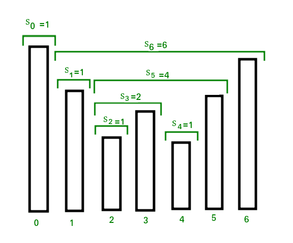

# 库存跨度问题

> 原文:[https://www.geeksforgeeks.org/the-stock-span-problem/](https://www.geeksforgeeks.org/the-stock-span-problem/)

[股票跨度问题](http://en.wikipedia.org/wiki/Stack_(abstract_data_type)#The_Stock_Span_Problem)是一个金融问题，我们有一只股票的一系列 n 个每日报价，我们需要计算所有 n 天的股票价格跨度。
股票价格在给定日期 I 的跨度 Si 被定义为恰好在给定日期之前的最大连续天数，对于该天数，股票在当天的价格小于其在给定日期的价格。
例如，如果一组 7 天的价格为{100，80，60，70，60，75，85}，那么相应 7 天的跨度值为{1，1，1，2，1，4，6}



**一种简单但低效的方法**
遍历输入价格数组。对于每个被访问的元素，遍历其左侧的元素，并增加其跨度值，而左侧的元素较小。

下面是该方法的实现:

## C++

```
// C++ program for brute force method
// to calculate stock span values
#include <bits/stdc++.h>
using namespace std;

// Fills array S[] with span values
void calculateSpan(int price[], int n, int S[])
{
    // Span value of first day is always 1
    S[0] = 1;

    // Calculate span value of remaining days 
    // by linearly checking previous days
    for (int i = 1; i < n; i++)
    {
        S[i] = 1; // Initialize span value

        // Traverse left while the next element 
        // on left is smaller than price[i]
        for (int j = i - 1; (j >= 0) &&
                (price[i] >= price[j]); j--)
            S[i]++;
    }
}

// A utility function to print elements of array
void printArray(int arr[], int n)
{
    for (int i = 0; i < n; i++)
        cout << arr[i] << " ";
}

// Driver code
int main()
{
    int price[] = { 10, 4, 5, 90, 120, 80 };
    int n = sizeof(price) / sizeof(price[0]);
    int S[n];

    // Fill the span values in array S[]
    calculateSpan(price, n, S);

    // print the calculated span values
    printArray(S, n);

    return 0;
}

// This is code is contributed by rathbhupendra
```

## C

```
// C program for brute force method to calculate stock span values
#include <stdio.h>

// Fills array S[] with span values
void calculateSpan(int price[], int n, int S[])
{
    // Span value of first day is always 1
    S[0] = 1;

    // Calculate span value of remaining days by linearly checking
    // previous days
    for (int i = 1; i < n; i++) {
        S[i] = 1; // Initialize span value

        // Traverse left while the next element on left is smaller
        // than price[i]
        for (int j = i - 1; (j >= 0) && (price[i] >= price[j]); j--)
            S[i]++;
    }
}

// A utility function to print elements of array
void printArray(int arr[], int n)
{
    for (int i = 0; i < n; i++)
        printf("%d ", arr[i]);
}

// Driver program to test above function
int main()
{
    int price[] = { 10, 4, 5, 90, 120, 80 };
    int n = sizeof(price) / sizeof(price[0]);
    int S[n];

    // Fill the span values in array S[]
    calculateSpan(price, n, S);

    // print the calculated span values
    printArray(S, n);

    return 0;
}
```

## Java 语言(一种计算机语言，尤用于创建网站)

```
// Java implementation for brute force method to calculate stock span values

import java.util.Arrays;

class GFG {
    // method to calculate stock span values
    static void calculateSpan(int price[], int n, int S[])
    {
        // Span value of first day is always 1
        S[0] = 1;

        // Calculate span value of remaining days by linearly checking
        // previous days
        for (int i = 1; i < n; i++) {
            S[i] = 1; // Initialize span value

            // Traverse left while the next element on left is smaller
            // than price[i]
            for (int j = i - 1; (j >= 0) && (price[i] >= price[j]); j--)
                S[i]++;
        }
    }

    // A utility function to print elements of array
    static void printArray(int arr[])
    {
        System.out.print(Arrays.toString(arr));
    }

    // Driver program to test above functions
    public static void main(String[] args)
    {
        int price[] = { 10, 4, 5, 90, 120, 80 };
        int n = price.length;
        int S[] = new int[n];

        // Fill the span values in array S[]
        calculateSpan(price, n, S);

        // print the calculated span values
        printArray(S);
    }
}
// This code is contributed by Sumit Ghosh
```

## 蟒蛇 3

```
# Python program for brute force method to calculate stock span values

# Fills list S[] with span values
def calculateSpan(price, n, S):

    # Span value of first day is always 1
    S[0] = 1

    # Calculate span value of remaining days by linearly
    # checking previous days
    for i in range(1, n, 1):
        S[i] = 1   # Initialize span value

        # Traverse left while the next element on left is
        # smaller than price[i]
        j = i - 1
        while (j>= 0) and (price[i] >= price[j]) :
                       S[i] += 1
                       j -= 1

# A utility function to print elements of array
def printArray(arr, n):

    for i in range(n):
        print(arr[i], end = " ")

# Driver program to test above function   
price = [10, 4, 5, 90, 120, 80]
n = len(price)
S = [None] * n

# Fill the span values in list S[]
calculateSpan(price, n, S)

# print the calculated span values
printArray(S, n)

# This code is contributed by Sunny Karira
```

## C#

```
// C# implementation for brute force method
// to calculate stock span values
using System;

class GFG {

    // method to calculate stock span values
    static void calculateSpan(int[] price,
                              int n, int[] S)
    {

        // Span value of first day is always 1
        S[0] = 1;

        // Calculate span value of remaining
        // days by linearly checking previous
        // days
        for (int i = 1; i < n; i++) {
            S[i] = 1; // Initialize span value

            // Traverse left while the next
            // element on left is smaller
            // than price[i]
            for (int j = i - 1; (j >= 0) && (price[i] >= price[j]); j--)
                S[i]++;
        }
    }

    // A utility function to print elements
    // of array
    static void printArray(int[] arr)
    {
        string result = string.Join(" ", arr);
        Console.WriteLine(result);
    }

    // Driver function
    public static void Main()
    {
        int[] price = { 10, 4, 5, 90, 120, 80 };
        int n = price.Length;
        int[] S = new int[n];

        // Fill the span values in array S[]
        calculateSpan(price, n, S);

        // print the calculated span values
        printArray(S);
    }
}

// This code is contributed by Sam007.
```

## 服务器端编程语言（Professional Hypertext Preprocessor 的缩写）

```
<?php
// PHP program for brute force method
// to calculate stock span values

// Fills array S[] with span values
function calculateSpan($price, $n, $S)
{

    // Span value of first
    // day is always 1
    $S[0] = 1;

    // Calculate span value of
    // remaining days by linearly
    // checking previous days
    for ($i = 1; $i < $n; $i++)
    {

        // Initialize span value
        $S[$i] = 1;

        // Traverse left while the next
        // element on left is smaller
        // than price[i]
        for ($j = $i - 1; ($j >= 0) &&
            ($price[$i] >= $price[$j]); $j--)
            $S[$i]++;
    }

        // print the calculated
        // span values
        for ($i = 0; $i < $n; $i++)
        echo $S[$i] . " ";;

}

    // Driver Code
    $price = array(10, 4, 5, 90, 120, 80);
    $n = count($price);
    $S = array($n);

    // Fill the span values in array S[]
    calculateSpan($price, $n, $S);

// This code is contributed by Sam007
?>
```

## java 描述语言

```
<script>
    // Javascript implementation for brute force method
    // to calculate stock span values

    // method to calculate stock span values
    function calculateSpan(price, n, S)
    {

        // Span value of first day is always 1
        S[0] = 1;

        // Calculate span value of remaining
        // days by linearly checking previous
        // days
        for (let i = 1; i < n; i++) {
            S[i] = 1; // Initialize span value

            // Traverse left while the next
            // element on left is smaller
            // than price[i]
            for (let j = i - 1; (j >= 0) && (price[i] >= price[j]); j--)
                S[i]++;
        }
    }

    // A utility function to print elements
    // of array
    function printArray(arr)
    {
        let result = arr.join(" ");
        document.write(result);
    }

    let price = [ 10, 4, 5, 90, 120, 80 ];
    let n = price.length;
    let S = new Array(n);
    S.fill(0);

    // Fill the span values in array S[]
    calculateSpan(price, n, S);

    // print the calculated span values
    printArray(S);

</script>
```

**Output**

```
1 1 2 4 5 1 
```

上述方法的时间复杂度是 O(n^2).我们可以计算 O(n)时间内的股票跨度值。

**一种线性时间复杂度方法**
我们看到，如果我们知道 I 之前最近的一天，那么 I 当天的 S[i]可以很容易地计算出来，这样价格就比 I 当天的价格大，如果存在这样的一天，我们称之为 h(i)，否则，我们定义 h(i) = -1。
跨度现在计算为 S[I]= I–h(I)。见下图。


为了实现这个逻辑，我们使用堆栈作为抽象数据类型来存储天数 I、h(i)、h(h(i))等等。当我们从第 i-1 天到第 I 天，我们弹出股票价格小于或等于价格[i]的日子，然后将第 I 天的价值推回到堆栈中。
以下是该方法的实现。

我们还必须检查所有股票价格应该相同的情况，因此我们必须检查当前的股票价格是否比前一个大。当当前和以前的股票价格相同时，我们不会从堆栈中弹出。

## C++

```
// C++ linear time solution for stock span problem
#include <iostream>
#include <stack>
using namespace std;

// A stack based efficient method to calculate
// stock span values
void calculateSpan(int price[], int n, int S[])
{
    // Create a stack and push index of first
    // element to it
    stack<int> st;
    st.push(0);

    // Span value of first element is always 1
    S[0] = 1;

    // Calculate span values for rest of the elements
    for (int i = 1; i < n; i++) {
        // Pop elements from stack while stack is not
        // empty and top of stack is smaller than
        // price[i]
        while (!st.empty() && price[st.top()] < price[i])
            st.pop();

        // If stack becomes empty, then price[i] is
        // greater than all elements on left of it,
        // i.e., price[0], price[1], ..price[i-1].  Else
        // price[i] is greater than elements after
        // top of stack
        S[i] = (st.empty()) ? (i + 1) : (i - st.top());

        // Push this element to stack
        st.push(i);
    }
}

// A utility function to print elements of array
void printArray(int arr[], int n)
{
    for (int i = 0; i < n; i++)
        cout << arr[i] << " ";
}

// Driver program to test above function
int main()
{
    int price[] = { 10, 4, 5, 90, 120, 80 };
    int n = sizeof(price) / sizeof(price[0]);
    int S[n];

    // Fill the span values in array S[]
    calculateSpan(price, n, S);

    // print the calculated span values
    printArray(S, n);

    return 0;
}
```

## Java 语言(一种计算机语言，尤用于创建网站)

```
// Java linear time solution for stock span problem

import java.util.Stack;
import java.util.Arrays;

public class GFG {
    // A stack based efficient method to calculate
    // stock span values
    static void calculateSpan(int price[], int n, int S[])
    {
        // Create a stack and push index of first element
        // to it
        Stack<Integer> st = new Stack<>();
        st.push(0);

        // Span value of first element is always 1
        S[0] = 1;

        // Calculate span values for rest of the elements
        for (int i = 1; i < n; i++) {

            // Pop elements from stack while stack is not
            // empty and top of stack is smaller than
            // price[i]
            while (!st.empty() && price[st.peek()] <= price[i])
                st.pop();

            // If stack becomes empty, then price[i] is
            // greater than all elements on left of it, i.e.,
            // price[0], price[1], ..price[i-1]. Else price[i]
            // is greater than elements after top of stack
            S[i] = (st.empty()) ? (i + 1) : (i - st.peek());

            // Push this element to stack
            st.push(i);
        }
    }

    // A utility function to print elements of array
    static void printArray(int arr[])
    {
        System.out.print(Arrays.toString(arr));
    }

    // Driver method
    public static void main(String[] args)
    {
        int price[] = { 10, 4, 5, 90, 120, 80 };
        int n = price.length;
        int S[] = new int[n];

        // Fill the span values in array S[]
        calculateSpan(price, n, S);

        // print the calculated span values
        printArray(S);
    }
}
// This code is contributed by Sumit Ghosh
```

## 蟒蛇 3

```
# Python linear time solution for stock span problem

# A stack based efficient method to calculate s
def calculateSpan(price, S):

    n = len(price)
    # Create a stack and push index of first element to it
    st = []
    st.append(0)

    # Span value of first element is always 1
    S[0] = 1

    # Calculate span values for rest of the elements
    for i in range(1, n):

        # Pop elements from stack while stack is not
        # empty and top of stack is smaller than price[i]
        while( len(st) > 0 and price[st[-1]] <= price[i]):
            st.pop()

        # If stack becomes empty, then price[i] is greater
        # than all elements on left of it, i.e. price[0],
        # price[1], ..price[i-1]. Else the price[i] is
        # greater than elements after top of stack
        S[i] = i + 1 if len(st) <= 0 else (i - st[-1])

        # Push this element to stack
        st.append(i)

# A utility function to print elements of array
def printArray(arr, n):
    for i in range(0, n):
        print (arr[i], end =" ")

# Driver program to test above function
price = [10, 4, 5, 90, 120, 80]
S = [0 for i in range(len(price)+1)]

# Fill the span values in array S[]
calculateSpan(price, S)

# Print the calculated span values
printArray(S, len(price))

# This code is contributed by Nikhil Kumar Singh (nickzuck_007)
```

## C#

```
// C# linear time solution for
// stock span problem
using System;
using System.Collections;

class GFG {
    // a linear time solution for
    // stock span problem A stack
    // based efficient method to calculate
    // stock span values
    static void calculateSpan(int[] price, int n, int[] S)
    {
        // Create a stack and Push
        // index of first element to it
        Stack st = new Stack();
        st.Push(0);

        // Span value of first
        // element is always 1
        S[0] = 1;

        // Calculate span values
        // for rest of the elements
        for (int i = 1; i < n; i++) {

            // Pop elements from stack
            // while stack is not empty
            // and top of stack is smaller
            // than price[i]
            while (st.Count > 0 && price[(int)st.Peek()] <= price[i])
                st.Pop();

            // If stack becomes empty, then price[i] is
            // greater than all elements on left of it, i.e.,
            // price[0], price[1], ..price[i-1]. Else price[i]
            // is greater than elements after top of stack
            S[i] = (st.Count == 0) ? (i + 1) : (i - (int)st.Peek());

            // Push this element to stack
            st.Push(i);
        }
    }

    // A utility function to print elements of array
    static void printArray(int[] arr)
    {
        for (int i = 0; i < arr.Length; i++)
            Console.Write(arr[i] + " ");
    }

    // Driver method
    public static void Main(String[] args)
    {
        int[] price = { 10, 4, 5, 90, 120, 80 };
        int n = price.Length;
        int[] S = new int[n];

        // Fill the span values in array S[]
        calculateSpan(price, n, S);

        // print the calculated span values
        printArray(S);
    }
}

// This code is contributed by Arnab Kundu
```

**Output**

```
1 1 2 4 5 1 
```

**时间复杂度** : O(n)。乍看之下似乎不止如此。如果我们仔细观察，我们可以观察到数组的每个元素最多被添加一次，或者从堆栈中移除一次。所以总共最多 2n 次运算。假设一个栈操作需要 O(1)个时间，我们可以说时间复杂度为 O(n)。
**辅助空间**:最差情况下 O(n)当所有元素按降序排序。

**另一种方法:**(不使用堆栈)

## C++

```
// C++ program for a linear time solution for stock
// span problem without using stack
#include <iostream>
#include <stack>
using namespace std;

// An efficient method to calculate stock span values
// implementing the same idea without using stack
void calculateSpan(int A[], int n, int ans[])
{
    // Span value of first element is always 1
    ans[0] = 1;

    // Calculate span values for rest of the elements
    for (int i = 1; i < n; i++) {
        int counter = 1;
        while ((i - counter) >= 0 && A[i] >= A[i - counter]) {
            counter += ans[i - counter];
        }
        ans[i] = counter;
    }
}

// A utility function to print elements of array
void printArray(int arr[], int n)
{
    for (int i = 0; i < n; i++)
        cout << arr[i] << " ";
}

// Driver program to test above function
int main()
{
    int price[] = { 10, 4, 5, 90, 120, 80 };
    int n = sizeof(price) / sizeof(price[0]);
    int S[n];

    // Fill the span values in array S[]
    calculateSpan(price, n, S);

    // print the calculated span values
    printArray(S, n);

    return 0;
}
```

## Java 语言(一种计算机语言，尤用于创建网站)

```
// Java program for a linear time
// solution for stock span problem
// without using stack
class GFG {

    // An efficient method to calculate
    // stock span values implementing the
    // same idea without using stack
    static void calculateSpan(int A[],
                              int n, int ans[])
    {
        // Span value of first element is always 1
        ans[0] = 1;

        // Calculate span values for rest of the elements
        for (int i = 1; i < n; i++) {
            int counter = 1;
            while ((i - counter) >= 0 && A[i] >= A[i - counter]) {
                counter += ans[i - counter];
            }
            ans[i] = counter;
        }
    }

    // A utility function to print elements of array
    static void printArray(int arr[], int n)
    {
        for (int i = 0; i < n; i++)
            System.out.print(arr[i] + " ");
    }

    // Driver code
    public static void main(String[] args)
    {
        int price[] = { 10, 4, 5, 90, 120, 80 };
        int n = price.length;
        int S[] = new int[n];

        // Fill the span values in array S[]
        calculateSpan(price, n, S);

        // print the calculated span values
        printArray(S, n);
    }
}

/* This code contributed by PrinciRaj1992 */
```

## 蟒蛇 3

```
# Python3 program for a linear time
# solution for stock span problem
# without using stack

# An efficient method to calculate
# stock span values implementing
# the same idea without using stack
def calculateSpan(A, n, ans):

    # Span value of first element
    # is always 1
    ans[0] = 1

    # Calculate span values for rest
    # of the elements
    for i in range(1, n):
        counter = 1

        while ((i - counter) >= 0 and
              A[i] >= A[i - counter]):
            counter += ans[i - counter]
        ans[i] = counter

# A utility function to print elements
# of array
def printArray(arr, n):

    for i in range(n):
        print(arr[i], end = ' ')
    print()

# Driver code
price = [ 10, 4, 5, 90, 120, 80 ]
n = len(price)
S = [0] * (n)

# Fill the span values in array S[]
calculateSpan(price, n, S)

# Print the calculated span values
printArray(S, n)

# This code is contributed by Prateek Gupta
```

## C#

```
// C# program for a linear time
// solution for stock span problem
// without using stack
using System;
public class GFG {

    // An efficient method to calculate
    // stock span values implementing the
    // same idea without using stack
    static void calculateSpan(int[] A,
                              int n, int[] ans)
    {
        // Span value of first element is always 1
        ans[0] = 1;

        // Calculate span values for rest of the elements
        for (int i = 1; i < n; i++) {
            int counter = 1;
            while ((i - counter) >= 0 && A[i] >= A[i - counter]) {
                counter += ans[i - counter];
            }
            ans[i] = counter;
        }
    }

    // A utility function to print elements of array
    static void printArray(int[] arr, int n)
    {
        for (int i = 0; i < n; i++)
            Console.Write(arr[i] + " ");
    }

    // Driver code
    public static void Main(String[] args)
    {
        int[] price = { 10, 4, 5, 90, 120, 80 };
        int n = price.Length;
        int[] S = new int[n];

        // Fill the span values in array S[]
        calculateSpan(price, n, S);

        // print the calculated span values
        printArray(S, n);
    }
}
// This code has been contributed by 29AjayKumar
```

## java 描述语言

```
<script>

       // JavaScript program for the above approach;

       // An efficient method to calculate stock span values
       // implementing the same idea without using stack
       function calculateSpan(A, n, ans)
       {

           // Span value of first element is always 1
           ans[0] = 1;

           // Calculate span values for rest of the elements
           for (let i = 1; i < n; i++) {
               let counter = 1;
               while ((i - counter) >= 0 && A[i] >= A[i - counter]) {
                   counter += ans[i - counter];
               }
               ans[i] = counter;
           }
       }

       // A utility function to print elements of array
       function printArray(arr, n) {
           for (let i = 0; i < n; i++)
               document.write(arr[i] + " ");
       }

       // Driver program to test above function
       let price = [10, 4, 5, 90, 120, 80];
       let n = price.length;
       let S = new Array(n);

       // Fill the span values in array S[]
       calculateSpan(price, n, S);

       // print the calculated span values
       printArray(S, n);

  // This code is contributed by Potta Lokesh
   </script>
```

**Output**

```
1 1 2 4 5 1 
```

**基于堆栈的方法:**

1.  在这种方法中，我使用了数据结构堆栈来实现这个任务。
2.  这里，使用了两个堆栈。一个堆栈存储实际股价，而另一个堆栈是临时堆栈。
3.  库存跨度问题仅使用堆栈的推送和弹出功能来解决。
4.  为了获取输入值，我采用了数组“price”，为了存储输出，我使用了数组“span”。

下面是上述方法的实现:

## C

```
// C program for the above approach
#include <limits.h>
#include <stdio.h>
#include <stdlib.h>
#define SIZE 7

// change size of  stack from here
// change this char to int if
// you want to create stack of
// int. rest all program will work fine
typedef int stackentry;

typedef struct stack {
    stackentry entry[SIZE];
    int top;
} STACK;

// stack is initialized by setting top pointer = -1.
void initialiseStack(STACK* s) { s->top = -1; }

// to check if stack is full.
int IsStackfull(STACK s)
{
    if (s.top == SIZE - 1) {
        return (1);
    }
    return (0);
}

// to check if stack is empty.
int IsStackempty(STACK s)
{
    if (s.top == -1) {
        return (1);
    }
    else {
        return (0);
    }
}

// to push elements into the stack.
void push(stackentry d, STACK* s)
{
    if (!IsStackfull(*s)) {

        s->entry[(s->top) + 1] = d;
        s->top = s->top + 1;
    }
}

// to pop element from stack.
stackentry pop(STACK* s)
{
    stackentry ans;
    if (!IsStackempty(*s)) {
        ans = s->entry[s->top];
        s->top = s->top - 1;
    }
    else {

        // '\0'  will be returned if
        // stack is empty and of
        // char type.
        if (sizeof(stackentry) == 1)
            ans = '\0';
        else
            // INT_MIN  will be returned
            // if stack is empty
            // and of int type.
            ans = INT_MIN;
    }
    return (ans);
}

// The code for implementing stock
// span problem is written
// here in main function.
int main()
{
    // Just to store prices on 7 adjacent days
    int price[7] = { 100, 80, 60, 70, 60, 75, 85 };

    // in span array , span of each day will be stored.
    int span[7] = { 0 };
    int i;

    // stack 's' will store stock values of each
    // day. stack 'temp' is temporary stack
    STACK s, temp;

    // setting top pointer to -1.
    initialiseStack(&s);
    initialiseStack(&temp);

    // count basically signifies span of
    // particular day.
    int count = 1;

    // since first day span is 1 only.
    span[0] = 1;
    push(price[0], &s);

    // calculate span of remaining days.
    for (i = 1; i < 7; i++) {

        // count will be span of that particular day.
        count = 1;

        // if current day stock is larger than previous day
        // span, then it will be popped out into temp stack.
        // popping will be carried out till span gets over
        // and count will be incremented .

        while (!IsStackempty(s)
               && s.entry[s.top] <= price[i]) {
            push(pop(&s), &temp);
            count++;
        }

        // now, one by one all stocks from temp will be
        // popped and pushed back to s.
        while (!IsStackempty(temp)) {
            push(pop(&temp), &s);
        }

        // pushing current stock
        push(price[i], &s);

        // appending span of that particular
        // day into output array.
        span[i] = count;
    }

    // printing the output.
    for (i = 0; i < 7; i++)
        printf("%d ", span[i]);
}
```

**Output**

```
1 1 1 2 1 4 6 
```

这是同样的预期产出。